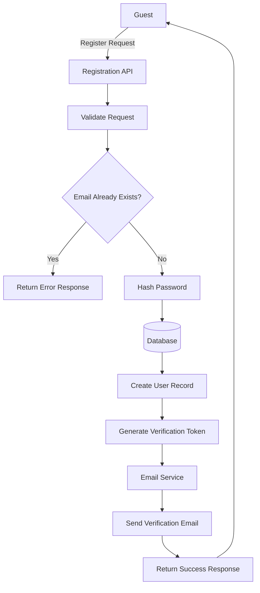
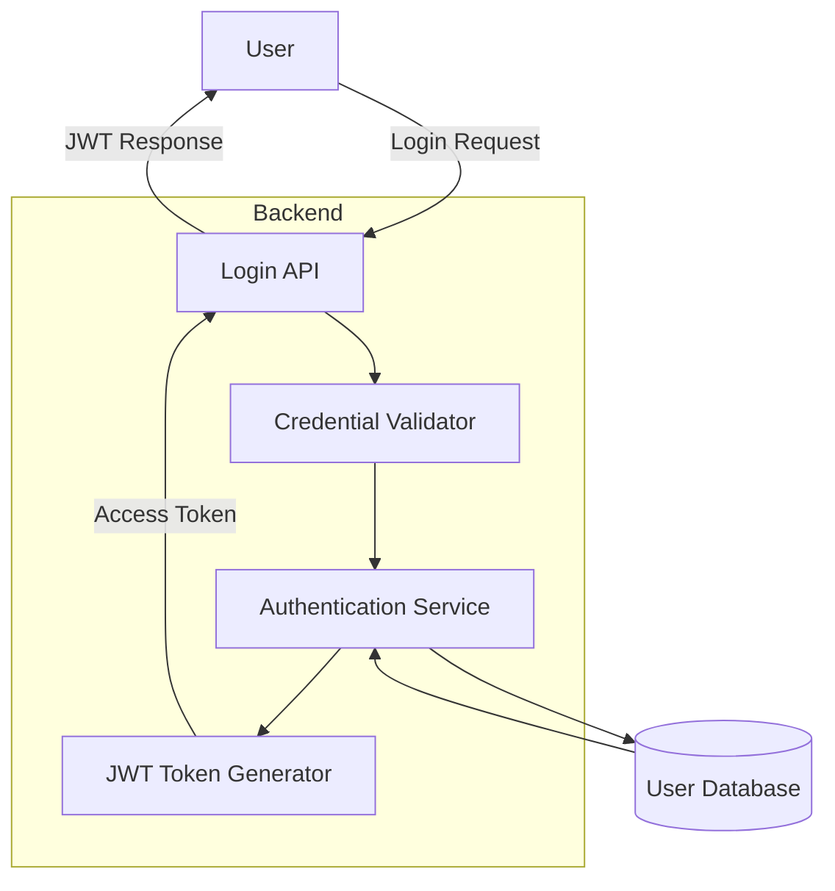
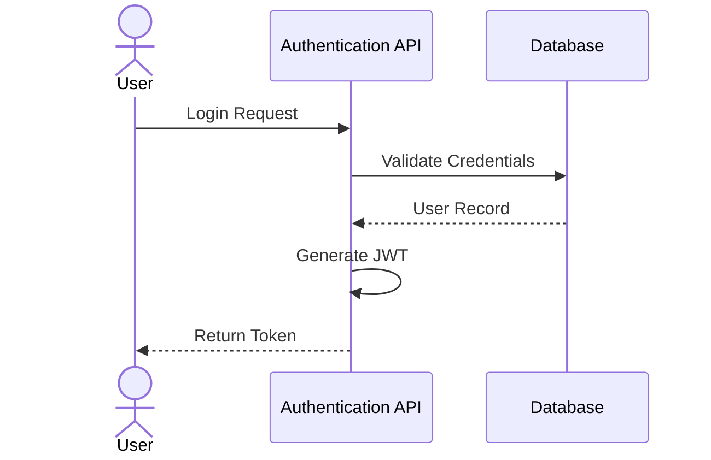

# Introduction

> **Module Type:** Core Module  
> **Version:** 1.0  
> **Status:** Draft  
> **Priority:** Critical  
> **Owner:** Backend Team

---

# 1. Module Overview

## Purpose

The Authentication module is responsible for managing user identity and access to the system. It handles user registration, login, logout, password recovery, email verification, and JWT-based authentication.

## Scope

### Included

- User Registration
- User Login
- Logout
- Password Reset
- Email Verification
- JWT Authentication
- Refresh Token

### Excluded

- User Profile
- Billing
- Notification
- User Preferences

---

# 2. Actors

| Actor                  | Description                    |
| ---------------------- | ------------------------------ |
| Guest                  | Unauthenticated visitor        |
| User                   | Authenticated user             |
| Admin                  | System administrator           |
| Authentication Service | Backend authentication service |

---

# 3. Business Goals

- Allow users to securely create accounts.
- Authenticate users using email and password.
- Secure protected APIs with JWT.
- Enable password recovery.
- Protect user accounts from unauthorized access.

---

# 4. Functional Requirements

## FR-001 User Registration

### Description

Allows a guest to register a new account.

### Inputs

| Field            | Required | Descriptions                       |
| ---------------- | -------- | ---------------------------------- |
| Name             | Yes      |                                    |
| Email            | Yes      |                                    |
| Password         | Yes      | Must be strong and minimum 8 chars |
| Confirm Password | Yes      |                                    |

### Process

1. Validate request data.
2. Verify email uniqueness.
3. Hash password.
4. Create user record.
5. Generate email verification token.
6. Send verification email.

### Success Response

- User account created.
- Verification email sent.

### Failure Cases

- Email already exists.
- Invalid email.
- Weak password.
- Missing required fields.

---

## FR-002 User Login

### Description

Authenticates a user and returns JWT tokens.

### Inputs

| Field | Required |
|--------|----------|
| Email | Yes |
| Password | Yes |

### Process

1. Validate request.
2. Find user.
3. Compare password hash.
4. Generate JWT Access Token.
5. Generate Refresh Token.
6. Return authentication response.

### Success Response

- Access Token
- Refresh Token

### Failure Cases

- Invalid email
- Incorrect password
- Account disabled
- Email not verified

---

## FR-003 Logout

### Description

Terminates the current authenticated session.

### Process

1. Validate JWT.
2. Invalidate Refresh Token.

### Success Response

User logged out successfully.

---

## FR-004 Forgot Password

### Description

Generates a password reset request.

### Inputs

- Email Address

### Process

1. Verify user exists.
2. Generate reset token.
3. Store expiration.
4. Send reset email.

---

## FR-005 Reset Password

### Description

Allows users to create a new password.

### Inputs

- Reset Token
- New Password
- Confirm Password

### Process

1. Validate reset token.
2. Validate password.
3. Hash new password.
4. Update database.
5. Invalidate token.

---

# 5. Business Rules

| ID     | Rule                                                            |
| ------ | --------------------------------------------------------------- |
| BR-001 | Email must be unique.                                           |
| BR-002 | Password must contain at least 8 characters.                    |
| BR-003 | Password must include uppercase, lowercase, number, and symbol. |
| BR-004 | Email verification required before login.                       |
| BR-005 | JWT expires after 1 hours.                                      |
| BR-006 | Refresh token expires after 7 days.                             |
| BR-007 | Password reset token expires after 15 minutes.                  |
| BR-008 | JWT token must be regenerate with refresh token                 |

---

# 6. Validation Rules

| Field | Validation |
|--------|------------|
| Name | Required |
| Email | Valid email format |
| Password | 8-64 characters |
| Confirm Password | Must match Password |
| JWT Token | Must be valid and not expired |

---

# 7. Authorization Matrix

| Action         | Guest | User | Admin |
| -------------- | :---: | :--: | :---: |
| Register       |   ✅   |  ❌   |   ✅   |
| Login          |   ✅   |  ✅   |   ✅   |
| Logout         |   ❌   |  ✅   |   ✅   |
| Reset Password |   ✅   |  ✅   |   ✅   |

---

# 8. Workflow
## User Registration



---

## User Login



---

# 9. Sequence Diagram



---

# 10. Database Design

## users

| Field          | Type        |
| -------------- | ----------- |
| id             | UUID        |
| name           | VARCHAR     |
| email          | VARCHAR     |
| password_hash  | TEXT        |
| email_verified | BOOLEAN     |
| created_at     | TIMESTAMP   |
| updated_at     | TIMESTAMP   |
| status         | Status Enum |

### Status Enum 
- Active 
- Unverified 
- Disabled 
- Suspended 
- Inactive

---

## refresh_tokens

| Field      | Type      |
| ---------- | --------- |
| id         | UUID      |
| user_id    | UUID      |
| token      | TEXT      |
| expires_at | TIMESTAMP |

---

## password_resets

| Field | Type |
|--------|------|
| id | UUID |
| user_id | UUID |
| token | TEXT |
| expires_at | TIMESTAMP |

---

# 11. API Endpoints

| Method | Endpoint              | Description           |
| ------ | --------------------- | --------------------- |
| POST   | /auth/register        | Register user         |
| POST   | /auth/login           | Login                 |
| POST   | /auth/logout          | Logout                |
| POST   | /auth/forgot-password | Forgot password       |
| POST   | /auth/reset-password  | Reset password        |
| POST   | /auth/refresh         | Refresh JWT           |
| GET    | /auth/me              | Get current auth user |

---

# 12. API Examples

## Login Request

```json
{
  "email": "john@example.com",
  "password": "password123"
}
```

### Success Response

```json
{
  "accessToken": "<JWT>",
  "refreshToken": "<JWT>",
}
```

### Error Response

```json
{
  "message": "Invalid email or password"
}
```


### JWT Claims Schema
- iat
- exp
- user_id
- roles
- permissions 
- email

---

# 13. Error Codes

| Code     | Description           |
| -------- | --------------------- |
| AUTH_001 | Invalid Email         |
| AUTH_002 | Incorrect Password    |
| AUTH_003 | Email Already Exists  |
| AUTH_004 | JWT Expired           |
| AUTH_005 | Invalid Refresh Token |
| AUTH_006 | Reset Token Expired   |
| AUTH_007 | Email Not Verified    |
| AUTH_008 | Account Suspended     |
| AUTH_008 | Account Disabled      |

---

# 14. Security Requirements

- Passwords must be hashed using BCrypt or Argon2.
- HTTPS is mandatory.
- JWT must be signed securely.
- Refresh tokens must be stored securely.
- Password reset tokens must expire automatically.
- Implement login rate limiting.
- Lock accounts after repeated failed login attempts.
- Protect against brute-force attacks.
- Sanitize all user inputs.

---

# 15. Non-Functional Requirements

| Requirement | Target |
|-------------|--------|
| Login Response Time | <500 ms |
| Registration Response Time | <1 second |
| Availability | 99.9% |
| Scalability | 100,000 Users |
| Authentication Success Rate | >99.99% |

---

# 16. Acceptance Criteria

- Users can register successfully.
- Duplicate emails are rejected.
- Valid users receive JWT tokens.
- Invalid credentials return appropriate errors.
- Password reset links expire correctly.
- Expired JWT tokens are rejected.
- Refresh tokens generate new access tokens.
- Protected APIs reject unauthorized requests.

---

# 17. Dependencies

- Database
- Email Service
- JWT Library
- Password Hashing Library
- User Module

---

# 18. Assumptions

- Email service is operational.
- Database is available.
- HTTPS is enabled.
- JWT secret is securely managed.

---

# 19. Future Enhancements

- Multi-Factor Authentication (MFA)
- Google Login
- GitHub Login
- Microsoft Login
- Apple Login
- Biometric Authentication
- Single Sign-On (SSO)
- Passkeys (WebAuthn)

---

# 20. Appendix

## Related Documents

- System Architecture
- API Documentation
- Database Design
- Deployment Guide
- Security Policy

---

**Document Version:** 1.0  
**Last Updated:** YYYY-MM-DD  
**Author:** <Your Name>