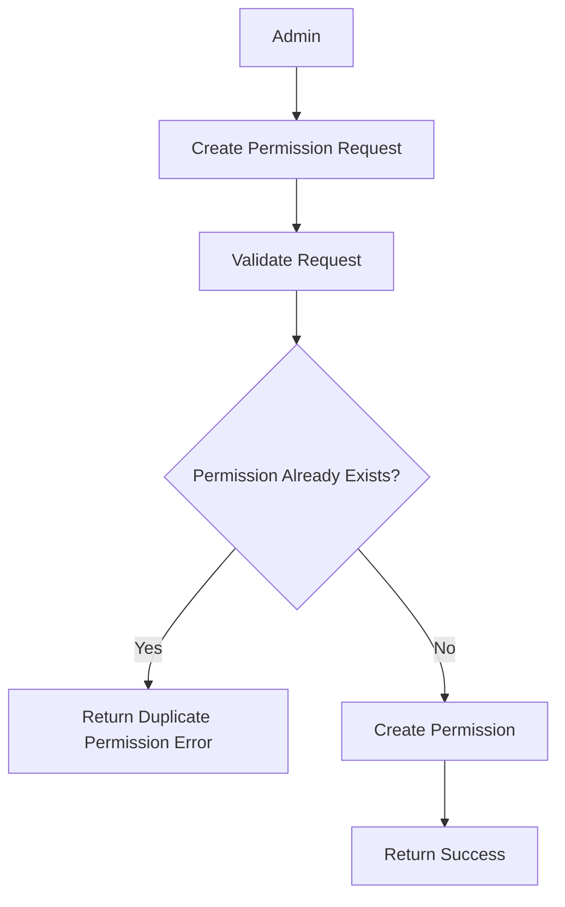
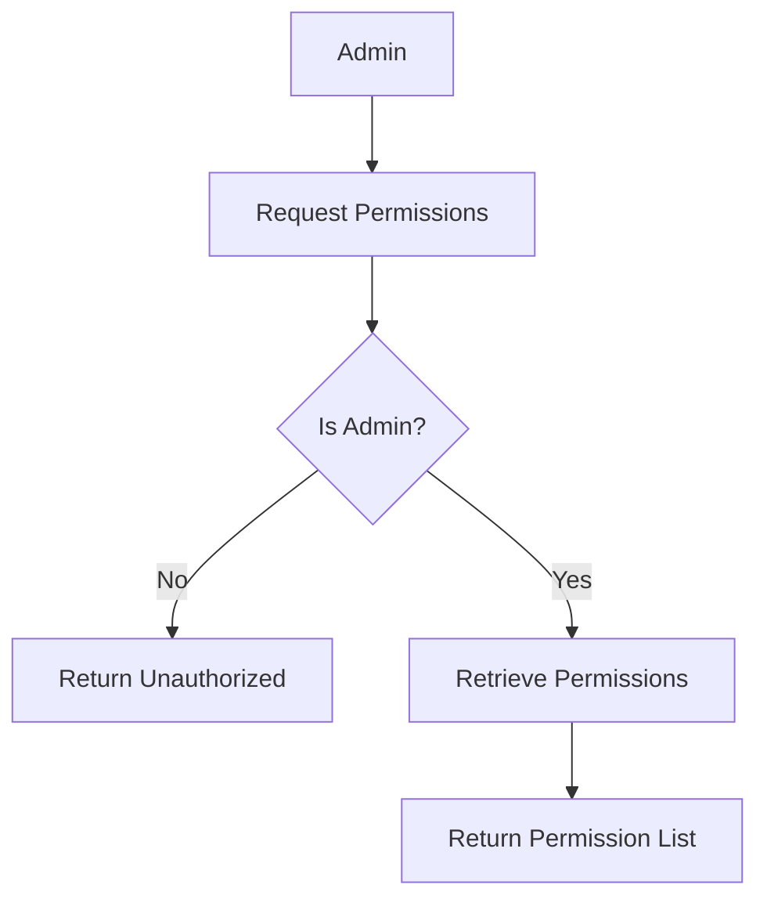
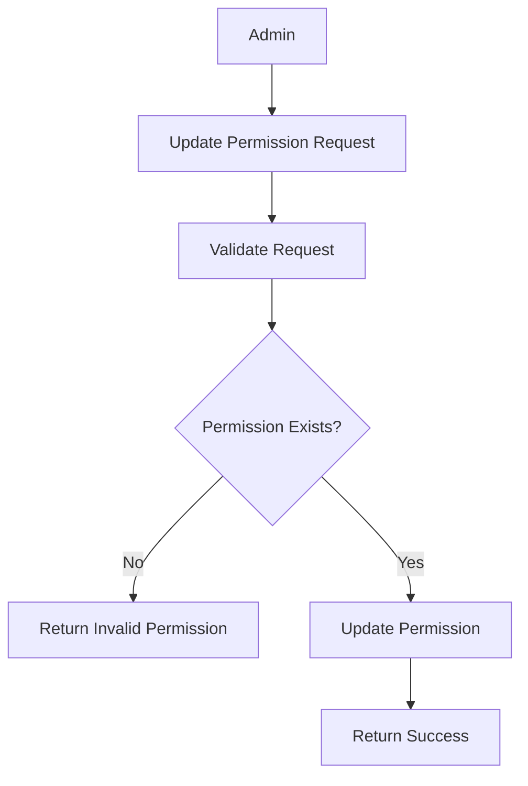
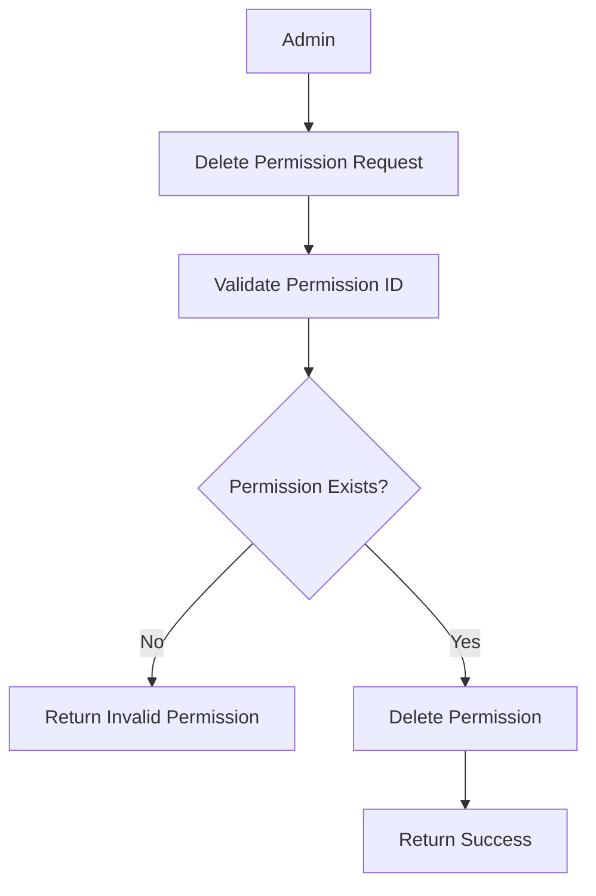

# Introduction

> **Module Type:** Sub Module
> Parent Module: Access Control Sub module  
> **Version:** 1.0  
> **Status:** Draft  
> **Priority:** Critical  
> **Owner:** Backend Team

---

# 1. Module Overview

## Purpose

The Permissions module is responsible for managing system permissions.

## Scope

### Included

- Permissions

### Excluded

- User Authentication
- User Roles

---

# 2. Actors

| Admin Users | Maintain Permissions |
| ----------- | -------------------- |

---

# 3. Business Goals

- Allow admin to maintain permissions
- Allow admin to create, update, delete, and view permissions

---

# 4. Functional Requirements

## FR-101 Create Permission

### Description

Allows a admin to create permission

### Inputs

| Field       | Required | Descriptions                    |
| ----------- | -------- | ------------------------------- |
| Key         | Yes      | this label                      |
| value       | Yes      | the actual value which will use |
| description | No       |                                 |

### Process

1. Validate request data.
2. Verify value uniqueness
3. Create permission record.

### Success Response

- Permission created.

### Failure Cases

- Permissions value already exists
- Missing required fields.

---

## FR-102 Get Permissions

### Description

Only admin user can get all the permissions with details.

### Query

| Field   | Descriptions           | Default |
| ------- | ---------------------- | ------- |
| page    | current page           | 1       |
| limit   | item to fetch request  | 10      |
| search  | permissions search key |         |
| sort_by |                        | asc     |

### Process

1. Find Permissions with query filters
2. Return permission data

### Success Response

- Permissions data

### Failure Cases

- Unauthorized for non admin user

---

## FR-103 Update Permission

### Description

Allows a admin to update permission

### Inputs

| Field       | Required |
| ----------- | -------- |
| Key         | No       |
| value       | No       |
| description | No       |

### Process

1. Validate request data.
2. Verify value uniqueness
3. Update permission record.

### Success Response

- Permission updated.

### Failure Cases

- Permission already exists

---

## FR-104 Delete Permission

### Description

Allows a admin to delete permission

### Inputs

| Field | Required |
| ----- | -------- |
| id    | Yes      |

### Process

1. Validate request data.
2. Remove this permission from everywhere.
3. Remove the record

### Success Response

- Permission removed.

### Failure Cases

- Invalid permission id

---

# 5. Business Rules

| ID     | Rule                      |
| ------ | ------------------------- |
| BR-002 | Permission must be unique |

---

# 6. Validation Rules

## Permissions

| Field       | Validation     |
| ----------- | -------------- |
| Key         | Required       |
| value       | Must be unique |
| Decriptions | Not required   |

---

# 7. Authorization Matrix

Only admin user can access these routes.

---

# 8. Workflow

## Create Permission



## Get Permissions



## Update Permission



## Delete Permission



---

# 9. Sequence Diagram

---

# 10. Database Design

## Permissions

| Field        | Type      | Constraints |
| ------------ | --------- | ----------- |
| id           | UUID      | Primary     |
| key          | VARCHAR   |
| value        | VARCHAR   | unique      |
| descriptions | VARCHAR   |
| created_at   | TIMESTAMP |
| updated_at   | TIMESTAMP |

---

# 11. API Endpoints

| Method | Endpoint                       | Description         |
| ------ | ------------------------------ | ------------------- |
| GET    | /access-control/permission     | Get all permissions |
| POST   | /access-control/permission     | Create permission   |
| PUT    | /access-control/permission/:id | Update permission   |
| DELETE | /access-control/permission/:id | Delete permission   |

---

# 12. API Examples

## Create Permission

## Get Permissions

```json
GET /access-control/permission
```

### Success Response

```json
{
  "message": "Permissions retrieved.",
  "data": [
    {
      "id": "18d1071f-9f9d-55d2-a53d-4115g6b7d6c7",
      "key": "Create User",
      "value": "create-user",
      "description": "Can create a new user",
      "created_at": "2026-08-05T00:00:00Z",
      "updated_at": "2026-08-05T00:00:00Z"
    }
  ]
}
```

### Error Response

```json
{
  "is_error": true,
  "message": "Permissions not found.",
  "errors": {}
}
```

---

## Update Permission

```json
PATCH /access-control/permission/18d1071f-9f9d-55d2-a53d-4115g6b7d6c7
{
  "key": "Update User",
  "value": "update-user",
  "description": "Can update an existing user"
}
```

### Success Response

```json
{
  "message": "Permission updated.",
  "data": {
    "id": "18d1071f-9f9d-55d2-a53d-4115g6b7d6c7",
    "key": "Update User",
    "value": "update-user",
    "description": "Can update an existing user",
    "created_at": "2026-08-05T00:00:00Z",
    "updated_at": "2026-08-05T00:00:00Z"
  }
}
```

### Error Response

```json
{
  "is_error": true,
  "message": "Bad request",
  "errors": {
    "key": ["Permission already exists."]
  }
}
```

---

## Delete Permission

```json
DELETE /access-control/permission/18d1071f-9f9d-55d2-a53d-4115g6b7d6c7
```

### Success Response

```json
{
  "message": "Permission deleted."
}
```

### Error Response

```json
{
  "is_error": true,
  "message": "Permission not found.",
  "errors": {}
}
```

---

```json
POST /access-control/permission
{
  "key": "Create User",
  "value": "create-user"
}
```

### Success Response

```json
{
  "message": "Permission created."
}
```

---

# 13. Error Codes

| Code       | Description               |
| ---------- | ------------------------- |
| ACCESS_101 | Permission Already Exists |
| ACCESS_102 | Permission Not Found      |
| ACCESS_103 | Invalid Permission ID     |
| ACCESS_104 | Missing Required Field    |

---

# 14. Security Requirements

- Role-Based Access Control (RBAC) must be strictly enforced.

---

# 15. Non-Functional Requirements

| Requirement                | Target |
| -------------------------- | ------ |
| Access Check Response Time | <50 ms |

---

# 16. Acceptance Criteria

- Administrators can successfully create, read, update, and delete permissions.

---

# 17. Dependencies

- Database

---

# 18. Assumptions

- Centralized database for access control policies.

---

# 19. Future Enhancements

- Fine-grained resource-level permissions.

---

# 20. Appendix

## Related Documents

- Database Design

---

**Document Version:** 1.0  
**Last Updated:** 2026-08-04
**Author:** Monirul Islam
