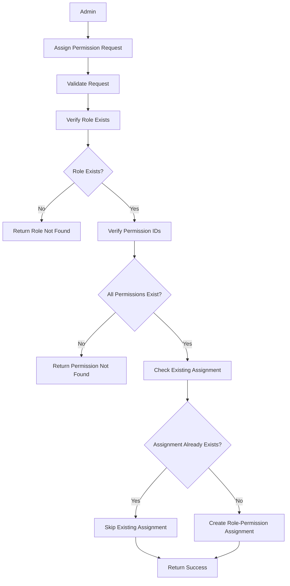
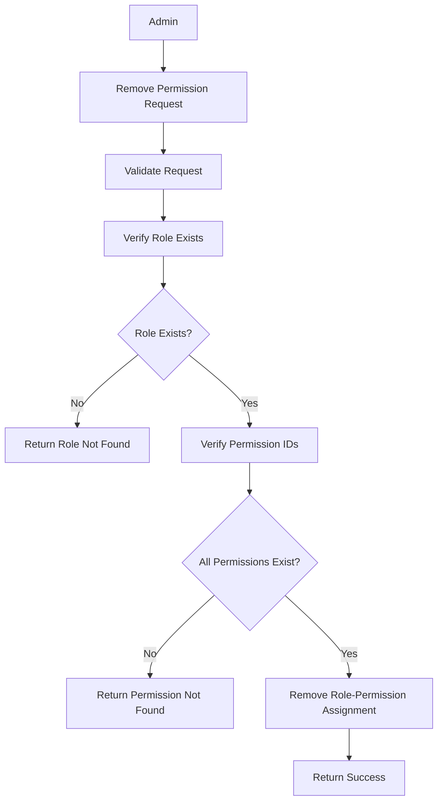
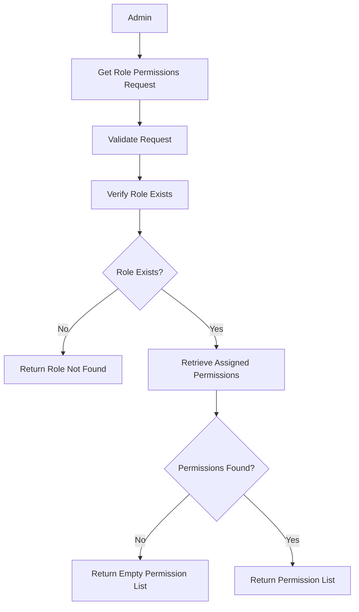

# Introduction

> **Module Type:** Sub Module
> Parent Module: Access Control Sub module  
> **Version:** 1.0  
> **Status:** Draft  
> **Priority:** Critical  
> **Owner:** Backend Team

---

# 1. Module Overview

## Purpose

The RolePermissions module is responsible for assigning permissions to roles.

---

# 2. Actors

| Admin Users | Maintain Role Permissions |
| ----------- | ------------------------- |

---

# 3. Business Goals

- Allow admin to assign specific permissions to a role
- Allow admin to remove specific permissions from a role

---

# 4. Functional Requirements

## FR-201 Assign Permission to Role

### Description

Allows a admin to assign permissions to a role.

### Inputs

| Field          | Required | Descriptions            |
| -------------- | -------- | ----------------------- |
| role_id        | Yes      | Role id                 |
| permission_ids | Yes      | array of permission ids |

### Process

1. Validate request data.
2. Verify role exist
3. Create a record if the combination is not exist.

### Success Response

- Permission assigned.

### Failure Cases

- role id not exist
- permission id didn't found!

---

## FR-202 Remove Permission from Role

### Description

Allows a admin to remove assigned permissions from role.

### Inputs

| Field          | Required | Descriptions                      |
| -------------- | -------- | --------------------------------- |
| role_id        | Yes      | role id                           |
| permission_ids | Yes      | array of permission ids to remove |

### Process

1. Validate request data.
2. Verify role exist
3. remove the record.

### Success Response

- Permission removed.

---

## FR-203 Get Permissions from Role

### Description

Allows a admin to get all the assigned permissions to role.

### Inputs

| Field   | Required | descriptions |
| ------- | -------- | ------------ |
| role_id | Yes      | role id      |

### Process

1. Validate request data.
2. get all the permissions.

### Success Response

- Assigned permissions data

---

# 5. Business Rules

| ID     | Rule                           |
| ------ | ------------------------------ |
| BR-006 | PermissionRoles must be unique |

---

# 6. Validation Rules

## RolePermissions

| Field         | Validation |
| ------------- | ---------- |
| role_id       | Required   |
| permission_id | Required   |

> role_id and permission_id is combined primary key

---

# 7. Authorization Matrix

Only admin user can access these routes.

---

# 8. Workflow

## Assign Permission to Role



---

## Remove Permission from Role



---

## Get Permissions for Role



---

# 9. Sequence Diagram

---

# 10. Database Design

## RolesPermissions

| Field         | Type | Constraints |
| ------------- | ---- | ----------- |
| role_id       | UUID | Foreign Key |
| permission_id | UUID | Foreign Key |

> **note:** `role_id` & `permission_id` are composite primary key.

---

# 11. API Endpoints

| Method | Endpoint                                   | Description               |
| ------ | ------------------------------------------ | ------------------------- |
| POST   | /access-control/roles/permissions/assign   | Assign permission to role |
| POST   | /access-control/roles/permissions/remove   | Remove permission to role |
| GET    | /access-control/roles/permissions/:role_id | Get role's permissions    |

---

# 12. API Examples

## Assign Permission to Role

```json
POST /access-control/roles/permissions/assign
{
  "role_id": "07c0060e-8e8c-44c1-942c-3004f5a6c5b6",
  "permission_ids": ["18d1071f-9f9d-55d2-a53d-4115g6b7d6c7"]
}
```

### Success Response

```json
{
  "message": "Permission assigned."
}
```

---

## Revoke Permission to Role

```json
POST /access-control/roles/permissions/remove
{
  "role_id": "07c0060e-8e8c-44c1-942c-3004f5a6c5b6",
  "permission_ids": ["18d1071f-9f9d-55d2-a53d-4115g6b7d6c7"]
}
```

### Success Response

```json
{
  "message": "Permission assigned."
}
```

---

# 13. Error Codes

| Code     | Description                      |
| -------- | -------------------------------- |
| AUTH_201 | Role Not Found                   |
| AUTH_202 | Permission Not Found             |
| AUTH_203 | Role Permission record Not Found |

---

# 14. Security Requirements

- Validate role and permission assignments to prevent circular or conflicting privileges.

---

# 15. Non-Functional Requirements

| Requirement              | Target  |
| ------------------------ | ------- |
| Role Assignment Response | <200 ms |

---

# 16. Acceptance Criteria

- Permissions can be assigned to and removed from roles.

---

# 17. Dependencies

- Database

---

# 18. Assumptions

- The system uses a centralized database for access control policies.

---

# 19. Future Enhancements

- Hierarchical roles.

---

# 20. Appendix

## Related Documents

- Database Design

---

**Document Version:** 1.0  
**Last Updated:** 2026-08-04
**Author:** Monirul Islam
