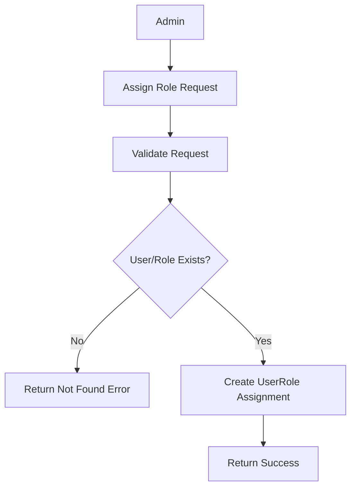

# Introduction

> **Module Type:** Sub Module
> **Parent Module:** Access Control Sub module  
> **Version:** 1.0  
> **Status:** Draft  
> **Priority:** Critical  
> **Owner:** Backend Team

---

# 1. Module Overview

## Purpose

The UserRoles module is responsible for assigning and removing roles to/from users.

---

# 2. Actors

| Admin Users | Maintain User Roles |
| ----------- | ------------------- |

---

# 3. Business Goals

- Allow admin to assign roles to users
- Allow admin to remove roles from users

---

# 4. Functional Requirements

## FR-201 Assign Roles to User

### Description

Allows a admin to assign roles to user.

### Inputs

| Field   | Required | Descriptions      |
| ------- | -------- | ----------------- |
| user_id | Yes      |                   |
| roles   | Yes      | array of role ids |

### Process

1. Validate request data.
2. Verify user exist
3. Verify role exist from each role
4. verify if any combination is not exist (ignore them)
5. Create a record if the combination is not exist.

### Success Response

- Role assigned.

### Failure Cases

- invalid user id

---

## FR-202 Remove Roles to User

### Description

Allows a admin to remove assigned roles to user.

### Inputs

| Field   | Required |
| ------- | -------- |
| user_id | Yes      |
| role_id | Yes      |

### Process

1. Validate request data.
2. verify the any combination is exist
3. remove the record.

### Success Response

- Assigned roles removed.

### Failure Cases

- Role don't exist

---

## FR-203 Get Roles for User

### Description

Allows a admin to get all the assigned roles for a user.

### Inputs

| Field   | Required |
| ------- | -------- |
| user_id | Yes      |

### Process

1. Validate request data.
2. get all available data.

### Success Response

- Assigned roles data

### Failure Cases

- Invalid user id

---

# 5. Business Rules

| ID     | Rule                     |
| ------ | ------------------------ |
| BR-004 | UserRoles must be unique |

---

# 6. Validation Rules

## UserRoles

| Field   | Validation |
| ------- | ---------- |
| user_id | Required   |
| role_id | Required   |

---

# 7. Authorization Matrix

Only admin user can access these routes.

---

# 8. Workflow

## Assign Role to User



---

# 9. Sequence Diagram

---

# 10. Database Design

## UserRoles

| Field   | Type | Constraints |
| ------- | ---- | ----------- |
| user_id | UUID | Foreign Key |
| role_id | UUID | Foreign Key |

---

# 11. API Endpoints

| Method | Endpoint                    | Description            |
| ------ | --------------------------- | ---------------------- |
| POST   | /access-control/role/assign | Assign roles to user   |
| POST   | /access-control/role/remove | Remove roles from user |

---

# 12. API Examples

## Assign Roles to User

```json
POST /access-control/role/assign
{
  "user_id": "99f8071e-8e8c-44c1-942c-3004f5a6c5b6",
  "role_ids": ["07c0060e-8e8c-44c1-942c-3004f5a6c5b6"]
}
```

### Success Response

```json
{
  "message": "Roles assigned successfully."
}
```

---

# 13. Error Codes

| Code       | Description           |
| ---------- | --------------------- |
| ACCESS_301 | User Not Found        |
| ACCESS_302 | Role Already Assigned |
| ACCESS_303 | Role Not Found        |
| ACCESS_304 | Invalid Request       |

---

# 14. Security Requirements

- Validate role and permission assignments to prevent circular or conflicting privileges.

---

# 15. Non-Functional Requirements

| Requirement              | Target  |
| ------------------------ | ------- |
| Role Assignment Response | <200 ms |

---

# 16. Acceptance Criteria

- Roles can be assigned to and removed from users.

---

# 17. Dependencies

- Database

---

# 18. Assumptions

- The User Module guarantees the existence of users before roles are assigned to them.

---

# 19. Future Enhancements

- Temporary/time-bound role assignments.

---

# 20. Appendix

## Related Documents

- Database Design

---

**Document Version:** 1.0  
**Last Updated:** 2026-08-04
**Author:** Monirul Islam
