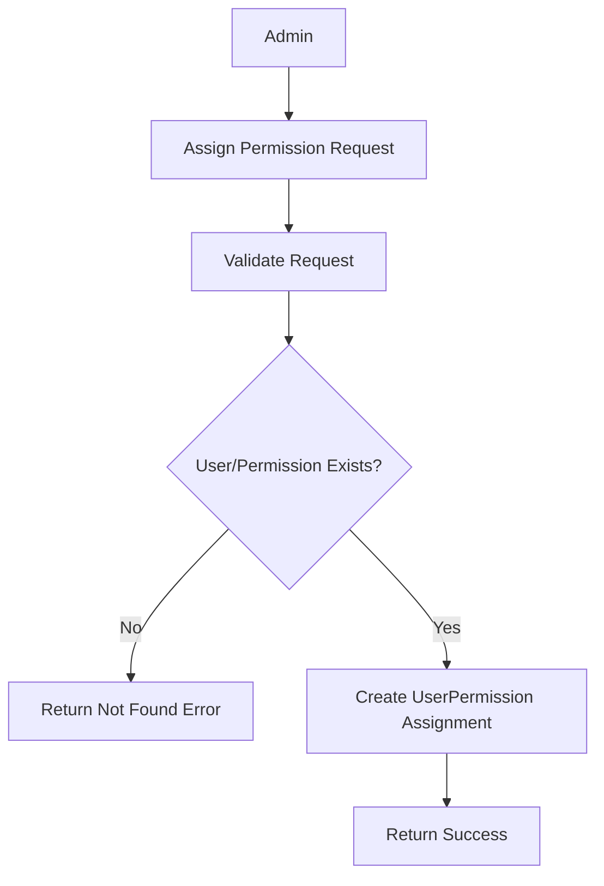

# Introduction

> **Module Type:** Sub Module
> **Parent Module:** Access Control Sub module  
> **Version:** 1.0  
> **Status:** Draft  
> **Priority:** Critical  
> **Owner:** Backend Team

---

# 1. Module Overview

## Purpose

The UserPermissions module is responsible for directly assigning permissions to users.

---

# 2. Actors

| Admin Users | Maintain User Permissions |
| ----------- | ------------------------- |

---

# 3. Business Goals

- Allow admin to assign specific permissions directly to a user
- Allow admin to remove specific permissions from a user

---

# 4. Functional Requirements

## FR-001 Assign Permission to User

### Description

Allows a admin to assign permissions to a user directly.

### Inputs

| Field          | Required | Descriptions            |
| -------------- | -------- | ----------------------- |
| user_id        | Yes      | User id                 |
| permission_ids | Yes      | array of permission ids |

### Process

1. Validate request data.
2. Verify user exist
3. verify if each permission exist
4. ignore the ones which don't exist
5. Create a record if the combination is not exist.

### Success Response

- Permission assigned.

### Failure Cases

- resource id not exist
- permission id didn't found!

---

## FR-002 Remove Permission from User

### Description

Allows a admin to remove assigned permissions from user.

### Inputs

| Field         | Required | Descriptions            |
| ------------- | -------- | ----------------------- |
| user_id       | Yes      | user id                 |
| permission_id | Yes      | permission id to remove |

### Process

1. Validate request data.
2. Verify user exist
3. verify if permission exist
4. remove the record.

### Success Response

- Permission removed.

---

## FR-003 Get Permissions from User

### Description

Allows a admin to get all the assigned permissions to user.

### Inputs

| Field   | Required | Descriptions |
| ------- | -------- | ------------ |
| user_id | Yes      | user id      |

### Process

1. Validate request data.
2. Get all the permissions assigned to user.

### Success Response

- Assigned permissions data

---

# 5. Business Rules

| ID     | Rule                          |
| ------ | ----------------------------- |
| BR-005 | PermissionUser must be unique |

---

# 6. Validation Rules

## UserPermissions

| Field         | Validation |
| ------------- | ---------- |
| user_id       | Required   |
| permission_id | Required   |

---

# 7. Authorization Matrix

Only admin user can access these routes.

---

# 8. Workflow

## Assign Permission to User



---

# 9. Sequence Diagram

---

# 10. Database Design

## UserPermissions

| Field         | Type | Constraints |
| ------------- | ---- | ----------- |
| user_id       | UUID | Foreign Key |
| permission_id | UUID | Foreign Key |

---

# 11. API Endpoints

| Method | Endpoint                                   | Description          |
| ------ | ------------------------------------------ | -------------------- |
| POST   | /access-control/users/permission/assign    | Assign permission    |
| POST   | /access-control/users/permission/remove    | Remove permission    |
| GET    | /access-control/users/permissions/:user_id | Get user permissions |

---

# 12. API Examples

## Assign Permission to User

```json
POST /access-control/users/permission/assign
{
  "user_id": "99f8071e-8e8c-44c1-942c-3004f5a6c5b6",
  "permission_id": "07c0060e-8e8c-44c1-942c-3004f5a6c5b6"
}
```

### Success Response

```json
{
  "message": "Permission assigned."
}
```

---

## Revoke Permission from User

```json
POST /access-control/users/permission/remove
{
  "user_id": "99f8071e-8e8c-44c1-942c-3004f5a6c5b6",
  "permission_id": "07c0060e-8e8c-44c1-942c-3004f5a6c5b6"
}
```

### Success Response

```json
{
  "message": "Permission revoked."
}
```

---

# 13. Error Codes

| Code       | Description                |
| ---------- | -------------------------- |
| ACCESS_401 | User Not Found             |
| ACCESS_402 | Permission Not Found       |
| ACCESS_403 | Permission Assigned Failed |

---

# 14. Security Requirements

- Validate role and permission assignments to prevent circular or conflicting privileges.

---

# 15. Non-Functional Requirements

| Requirement              | Target  |
| ------------------------ | ------- |
| Role Assignment Response | <200 ms |

---

# 16. Acceptance Criteria

- Permissions can be assigned to and removed from users directly.

---

# 17. Dependencies

- Database

---

# 18. Assumptions

- The User Module guarantees the existence of users.

---

# 19. Future Enhancements

- Fine-grained resource-level permissions.

---

# 20. Appendix

## Related Documents

- Database Design

---

**Document Version:** 1.0  
**Last Updated:** 2026-08-04
**Author:** Monirul Islam
