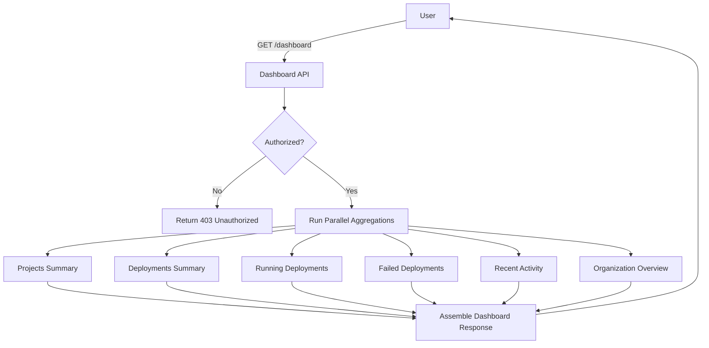
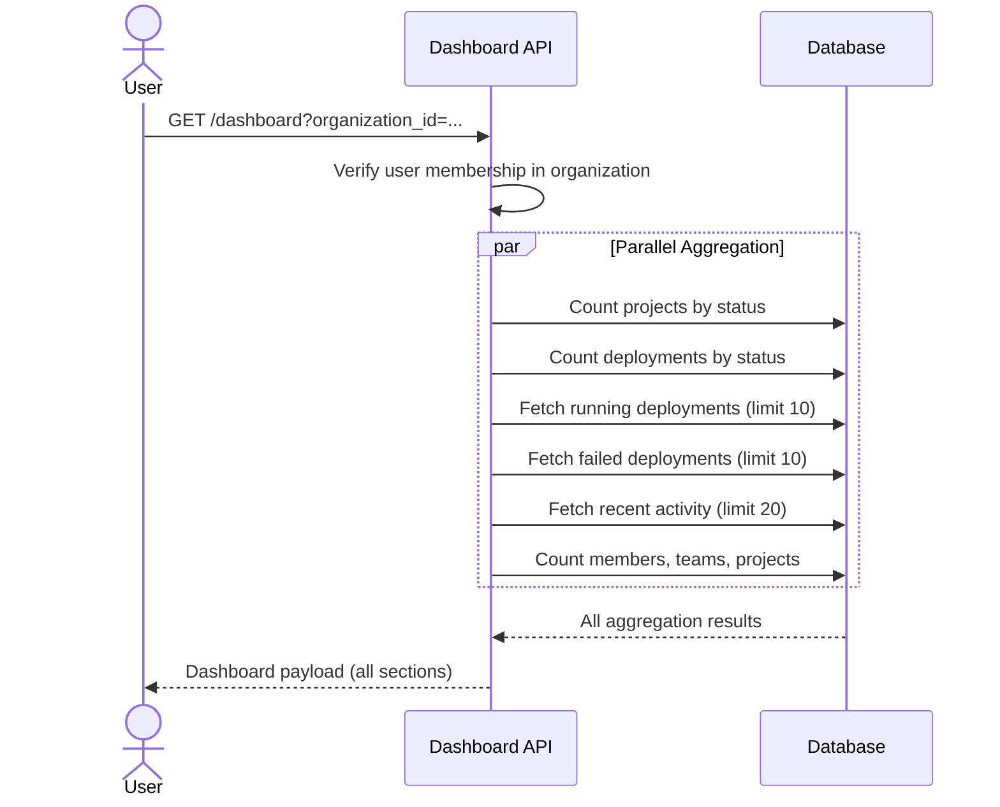

# Introduction

> **Module Type:** Core Module
> **Version:** 1.0
> **Status:** Draft
> **Priority:** High
> **Owner:** Backend Team

---

# 1. Module Overview

## Purpose

The Dashboard module provides a unified overview of the user's organization, projects, and deployment activity. It aggregates data from multiple modules into a single, optimized API response — giving users an immediate, at-a-glance snapshot of their system's current state without making multiple individual requests.

## Scope

### Included

- Projects summary (total count, status breakdown)
- Deployments summary (total, running, failed)
- Recent activity feed (latest deployment events across all projects)
- Running deployments list (currently active deployments)
- Failed deployments list (recent failures requiring attention)
- Organization overview (member count, team count, project count)

### Excluded

- Detailed project management (handled in Projects Module)
- Deployment lifecycle management (handled in Deployment Module)
- Notification management (handled in Notifications Module)
- Real-time log streaming (handled in Live Build Logs Sub-Module)
- Authentication and authorization (handled in Auth Module)

---

# 2. Actors

| Actor  | Description                                                              |
| ------ | ------------------------------------------------------------------------ |
| User   | Authenticated user viewing their own organization's dashboard            |
| Admin  | System administrator with access to all organization dashboards          |

---

# 3. Business Goals

- Provide developers with an instant overview of project and deployment health.
- Surface actionable information (running and failed deployments) at the top level.
- Reduce the need for multiple API calls by aggregating data into a single dashboard endpoint.
- Give organization owners visibility into team and project growth.

---

# 4. Dashboard Widgets

| Widget                  | Description                                                              |
| ----------------------- | ------------------------------------------------------------------------ |
| **Projects Summary**    | Total project count, breakdown by status (`active`, `archived`, `draft`) |
| **Deployments Summary** | Total deployments, count by status (`Running`, `Failed`, `Success`, etc.)|
| **Running Deployments** | List of all deployments currently in `Building`, `Deploying`, or `Running` state |
| **Failed Deployments**  | List of the most recent deployments in `Failed` state                   |
| **Recent Activity**     | Chronological feed of recent deployment events across all projects       |
| **Organization Overview**| Member count, team count, total project count for the organization      |

---

# 5. Functional Requirements

## FR-001 Get Dashboard Summary

### Description

Returns the complete dashboard payload for the authenticated user's organization in a single aggregated response. Each section corresponds to a dashboard widget.

### Inputs

| Field           | Required | Descriptions                                                     |
| --------------- | -------- | ---------------------------------------------------------------- |
| organization_id | Yes      | UUID of the target organization (from route or user context)     |

### Process

1. Verify the authenticated user has access to the specified organization.
2. In parallel, aggregate the following:
   - **Projects Summary:** Count projects by status for `organization_id`.
   - **Deployments Summary:** Count all deployments across organization projects, grouped by status.
   - **Running Deployments:** Fetch deployments with status in `[Building, Deploying, Running]`, ordered by `created_at` DESC, limit 10.
   - **Failed Deployments:** Fetch deployments with `status = Failed`, ordered by `created_at` DESC, limit 10.
   - **Recent Activity:** Fetch the latest 20 deployment records across all projects, ordered by `created_at` DESC.
   - **Organization Overview:** Count organization members, teams, and projects.
3. Return all sections in a single structured response.

### Success Response

- Dashboard data returned.

### Failure Cases

- Organization not found (`DASH_001`).
- Unauthorized access to organization (`DASH_002`).

---

## FR-002 Get Projects Summary

### Description

Returns a focused summary of projects within the organization, including status breakdown.

### Inputs

| Field           | Required | Descriptions                        |
| --------------- | -------- | ----------------------------------- |
| organization_id | Yes      | UUID of the target organization     |

### Process

1. Count all `projects` for `organization_id`.
2. Group count by `status` (`active`, `archived`, `draft`).
3. Return total and per-status counts.

### Success Response

- Projects summary returned.

### Failure Cases

- Organization not found (`DASH_001`).

---

## FR-003 Get Deployments Summary

### Description

Returns aggregated deployment statistics across all projects in the organization.

### Inputs

| Field           | Required | Descriptions                    |
| --------------- | -------- | ------------------------------- |
| organization_id | Yes      | UUID of the target organization |

### Process

1. Find all `project_id`s belonging to `organization_id`.
2. Count `deployments` across those projects, grouped by `status`.
3. Return total count and per-status breakdown.

### Success Response

- Deployments summary returned.

### Failure Cases

- Organization not found (`DASH_001`).

---

## FR-004 Get Running Deployments

### Description

Returns a list of deployments currently in an active/in-progress state across all organization projects.

### Inputs

| Field           | Required | Descriptions                          |
| --------------- | -------- | ------------------------------------- |
| organization_id | Yes      | UUID of the target organization       |
| limit           | No       | Max records to return (default: 10)   |

### Process

1. Query `deployments` where `status IN (Building, Deploying, Running)` and `project_id` belongs to organization.
2. Join with `projects` to include project name.
3. Join with `users` to include `triggered_by` author name.
4. Return ordered by `created_at` DESC.

### Success Response

- Running deployments list returned.

### Failure Cases

- Organization not found (`DASH_001`).

---

## FR-005 Get Failed Deployments

### Description

Returns a list of the most recent failed deployments across all organization projects.

### Inputs

| Field           | Required | Descriptions                            |
| --------------- | -------- | --------------------------------------- |
| organization_id | Yes      | UUID of the target organization         |
| limit           | No       | Max records to return (default: 10)     |

### Process

1. Query `deployments` where `status = Failed` and `project_id` belongs to organization.
2. Join with `projects` to include project name.
3. Join with `users` to include `triggered_by` author name.
4. Return ordered by `created_at` DESC.

### Success Response

- Failed deployments list returned.

### Failure Cases

- Organization not found (`DASH_001`).

---

## FR-006 Get Recent Activity

### Description

Returns a chronological feed of the most recent deployment events across all organization projects, providing a timeline view of system activity.

### Inputs

| Field           | Required | Descriptions                          |
| --------------- | -------- | ------------------------------------- |
| organization_id | Yes      | UUID of the target organization       |
| limit           | No       | Max records to return (default: 20)   |

### Process

1. Query the most recent `deployments` across all organization projects.
2. Join with `projects` for project name.
3. Join with `users` for author name and email.
4. Return ordered by `created_at` DESC with key metadata fields.

### Success Response

- Recent activity feed returned.

### Failure Cases

- Organization not found (`DASH_001`).

---

## FR-007 Get Organization Overview

### Description

Returns a high-level summary of the organization's scale: total members, teams, and projects.

### Inputs

| Field           | Required | Descriptions                        |
| --------------- | -------- | ----------------------------------- |
| organization_id | Yes      | UUID of the target organization     |

### Process

1. Count total members in the organization.
2. Count total teams in the organization.
3. Count total projects in the organization.
4. Return counts as a structured summary.

### Success Response

- Organization overview returned.

### Failure Cases

- Organization not found (`DASH_001`).

---

# 6. Business Rules

| ID     | Rule                                                                                               |
| ------ | -------------------------------------------------------------------------------------------------- |
| BR-001 | The dashboard endpoint aggregates data in parallel — individual section failures must not block the full response; return partial data with error flags per section. |
| BR-002 | Users can only view dashboards for organizations they are a member of.                             |
| BR-003 | Running and failed deployment lists are capped at 10 records by default to optimize response size. |
| BR-004 | Recent activity is capped at 20 records by default.                                                |
| BR-005 | Dashboard data is read-only — no mutations are performed via dashboard endpoints.                  |
| BR-006 | Aggregation queries must use indexed fields to maintain response time targets.                     |

---

# 7. Validation Rules

## Dashboard Request

| Field           | Validation                     |
| --------------- | ------------------------------ |
| organization_id | Required, valid UUID           |
| limit           | Optional integer; 1–100        |

---

# 8. Authorization Matrix

| Route                                             | Action                    | Guest | User | Admin |
| ------------------------------------------------- | ------------------------- | :---: | :--: | :---: |
| GET /dashboard                                    | Get Full Dashboard        | ❌    | ✅   | ✅    |
| GET /dashboard/projects-summary                   | Get Projects Summary      | ❌    | ✅   | ✅    |
| GET /dashboard/deployments-summary                | Get Deployments Summary   | ❌    | ✅   | ✅    |
| GET /dashboard/running-deployments                | Get Running Deployments   | ❌    | ✅   | ✅    |
| GET /dashboard/failed-deployments                 | Get Failed Deployments    | ❌    | ✅   | ✅    |
| GET /dashboard/recent-activity                    | Get Recent Activity       | ❌    | ✅   | ✅    |
| GET /dashboard/organization-overview              | Get Organization Overview | ❌    | ✅   | ✅    |

---

# 9. Workflow

## Dashboard Data Aggregation



---

# 10. Sequence Diagram



---

# 11. Database Design

> The Dashboard module does **not own any tables**. It reads from tables owned by other modules:

| Data Source          | Owning Module       | Fields Read                                               |
| -------------------- | ------------------- | --------------------------------------------------------- |
| `projects`           | Projects Module     | `id`, `name`, `status`, `organization_id`, `created_at`   |
| `deployments`        | Deployment Module   | `id`, `project_id`, `status`, `branch`, `commit_hash`, `build_duration`, `triggered_by`, `created_at` |
| `users`              | Users Module        | `id`, `name`, `email`                                     |
| `organization_members`| Organizations Module| `organization_id`, `user_id`                             |
| `teams`              | Teams Module        | `id`, `organization_id`                                   |

### Recommended Indexes (cross-module)

| Table        | Index                                        | Purpose                                |
| ------------ | -------------------------------------------- | -------------------------------------- |
| `deployments`| `idx_deployments_status_project_id`          | Fast status-filter queries per project |
| `deployments`| `idx_deployments_created_at`                 | Ordered recent activity queries        |
| `projects`   | `idx_projects_organization_id_status`        | Fast project summary per org           |

---

# 12. API Endpoints

| Method | Endpoint                               | Description                                  |
| ------ | -------------------------------------- | -------------------------------------------- |
| GET    | /dashboard                             | Get full dashboard (all sections)            |
| GET    | /dashboard/projects-summary            | Get projects summary only                    |
| GET    | /dashboard/deployments-summary         | Get deployments summary only                 |
| GET    | /dashboard/running-deployments         | Get running deployments only                 |
| GET    | /dashboard/failed-deployments          | Get failed deployments only                  |
| GET    | /dashboard/recent-activity             | Get recent activity feed only                |
| GET    | /dashboard/organization-overview       | Get organization overview only               |

> All routes accept `?organization_id=<uuid>` as a query parameter.

---

# 13. API Examples

## Get Full Dashboard

```http
GET /dashboard?organization_id=123e4567-e89b-12d3-a456-426614174000
```

### Success Response

```json
{
  "organization_id": "123e4567-e89b-12d3-a456-426614174000",
  "projects_summary": {
    "total": 12,
    "active": 9,
    "archived": 2,
    "draft": 1
  },
  "deployments_summary": {
    "total": 347,
    "queued": 0,
    "building": 1,
    "deploying": 0,
    "running": 3,
    "success": 330,
    "failed": 13
  },
  "running_deployments": [
    {
      "id": "deploy-abc123-8e8c-44c1-942c-3004f5a6c5b6",
      "project_id": "07c0060e-8e8c-44c1-942c-3004f5a6c5b6",
      "project_name": "Forge Backend",
      "branch": "main",
      "commit_short": "a1b2c3d",
      "status": "Running",
      "author_name": "John Doe",
      "created_at": "2026-08-12T17:00:00Z"
    }
  ],
  "failed_deployments": [
    {
      "id": "deploy-xyz999-8e8c-44c1-942c-3004f5a6c5b6",
      "project_id": "07c0060e-8e8c-44c1-942c-3004f5a6c5b6",
      "project_name": "Forge Backend",
      "branch": "feature/new-api",
      "commit_short": "f9e8d7c",
      "status": "Failed",
      "author_name": "Jane Smith",
      "created_at": "2026-08-12T16:30:00Z"
    }
  ],
  "recent_activity": [
    {
      "id": "deploy-abc123-8e8c-44c1-942c-3004f5a6c5b6",
      "project_name": "Forge Backend",
      "branch": "main",
      "commit_short": "a1b2c3d",
      "status": "Running",
      "author_name": "John Doe",
      "created_at": "2026-08-12T17:00:00Z"
    },
    {
      "id": "deploy-xyz999-8e8c-44c1-942c-3004f5a6c5b6",
      "project_name": "Forge Backend",
      "branch": "feature/new-api",
      "commit_short": "f9e8d7c",
      "status": "Failed",
      "author_name": "Jane Smith",
      "created_at": "2026-08-12T16:30:00Z"
    }
  ],
  "organization_overview": {
    "member_count": 24,
    "team_count": 5,
    "project_count": 12
  }
}
```

---

## Get Projects Summary

```http
GET /dashboard/projects-summary?organization_id=123e4567-e89b-12d3-a456-426614174000
```

### Success Response

```json
{
  "total": 12,
  "active": 9,
  "archived": 2,
  "draft": 1
}
```

---

## Get Running Deployments

```http
GET /dashboard/running-deployments?organization_id=123e4567-e89b-12d3-a456-426614174000
```

### Success Response

```json
{
  "data": [
    {
      "id": "deploy-abc123-8e8c-44c1-942c-3004f5a6c5b6",
      "project_id": "07c0060e-8e8c-44c1-942c-3004f5a6c5b6",
      "project_name": "Forge Backend",
      "branch": "main",
      "commit_short": "a1b2c3d",
      "status": "Running",
      "author_name": "John Doe",
      "created_at": "2026-08-12T17:00:00Z"
    }
  ],
  "total": 1
}
```

---

## Get Organization Overview

```http
GET /dashboard/organization-overview?organization_id=123e4567-e89b-12d3-a456-426614174000
```

### Success Response

```json
{
  "organization_id": "123e4567-e89b-12d3-a456-426614174000",
  "member_count": 24,
  "team_count": 5,
  "project_count": 12
}
```

---

# 14. Error Codes

| Code    | Description                                            |
| ------- | ------------------------------------------------------ |
| DASH_001 | Organization Not Found                                |
| DASH_002 | Unauthorized — User Not a Member of This Organization |
| DASH_003 | Aggregation Timeout — Partial Data Returned           |

---

# 15. Security Requirements

- Users may only access dashboard data for organizations they are a member of.
- All dashboard endpoints require a valid authenticated user session (JWT).
- Dashboard responses must not expose sensitive fields (e.g., password hashes, plaintext env vars, internal tokens).
- Individual section failures must return a sanitized error flag — raw database errors must never surface to the client.

---

# 16. Non-Functional Requirements

| Requirement                       | Target    |
| --------------------------------- | --------- |
| Full Dashboard Response Time      | < 300ms   |
| Individual Section Response Time  | < 100ms   |
| Parallel Aggregation Timeout      | 5s max    |
| Availability                      | 99.9%     |
| Cache TTL (optional)              | 30s       |

---

# 17. Acceptance Criteria

- The full dashboard endpoint returns all six sections in a single response.
- Projects summary correctly reflects total count and per-status breakdown.
- Deployments summary correctly reflects total count and per-status breakdown.
- Running deployments list shows only `Building`, `Deploying`, or `Running` state deployments.
- Failed deployments list shows only `Failed` state deployments, most recent first.
- Recent activity shows the latest deployment events across all organization projects.
- Organization overview correctly counts members, teams, and projects.
- Users cannot access dashboard data for organizations they do not belong to.
- A partial aggregation failure returns available data with an error flag on the failed section — the entire response does not fail.

---

# 18. Dependencies

- Projects Module (projects data)
- Deployment Module (deployment data)
- Users Module (author / member data)
- Organizations Module (member and team counts)
- Teams Module (team count)
- Database

---

# 19. Assumptions

- Aggregation queries are optimized with appropriate indexes on `organization_id`, `status`, and `created_at`.
- Optional response caching (30s TTL) may be implemented at the API gateway layer to reduce DB load during high-traffic periods.
- The dashboard does not maintain its own state — all data is read live from source modules.

---

# 20. Future Enhancements

- **Caching Layer:** Redis-based dashboard cache with configurable TTL per organization.
- **Real-Time Updates:** SSE stream for live dashboard widget updates without page refresh.
- **Custom Date Range:** Filter recent activity and deployment summaries by a custom date range.
- **Per-Project Dashboard:** Scoped dashboard view for a single project.
- **Usage Analytics:** Build time trends, deployment frequency charts, success rate over time.
- **Alerts Widget:** Surface active threshold alerts (e.g. "3 projects have not deployed in 30 days").

---

# 21. Appendix

## Dashboard Widget Reference

| Widget                  | Data Source                             | Default Limit |
| ----------------------- | --------------------------------------- | ------------- |
| Projects Summary        | `projects` table                        | All (count)   |
| Deployments Summary     | `deployments` table                     | All (count)   |
| Running Deployments     | `deployments` WHERE status IN (...)     | 10            |
| Failed Deployments      | `deployments` WHERE status = Failed     | 10            |
| Recent Activity         | `deployments` ordered by `created_at`   | 20            |
| Organization Overview   | `organization_members`, `teams`, `projects` | All (count)|

## Related Documents

- Projects Module
- Deployment Module
- Users Module
- Organizations Module
- Teams Module
- Notifications Module
- System Architecture
- API Documentation

---

**Document Version:** 1.0
**Last Updated:** 2026-08-12
**Author:** Monirul Islam
