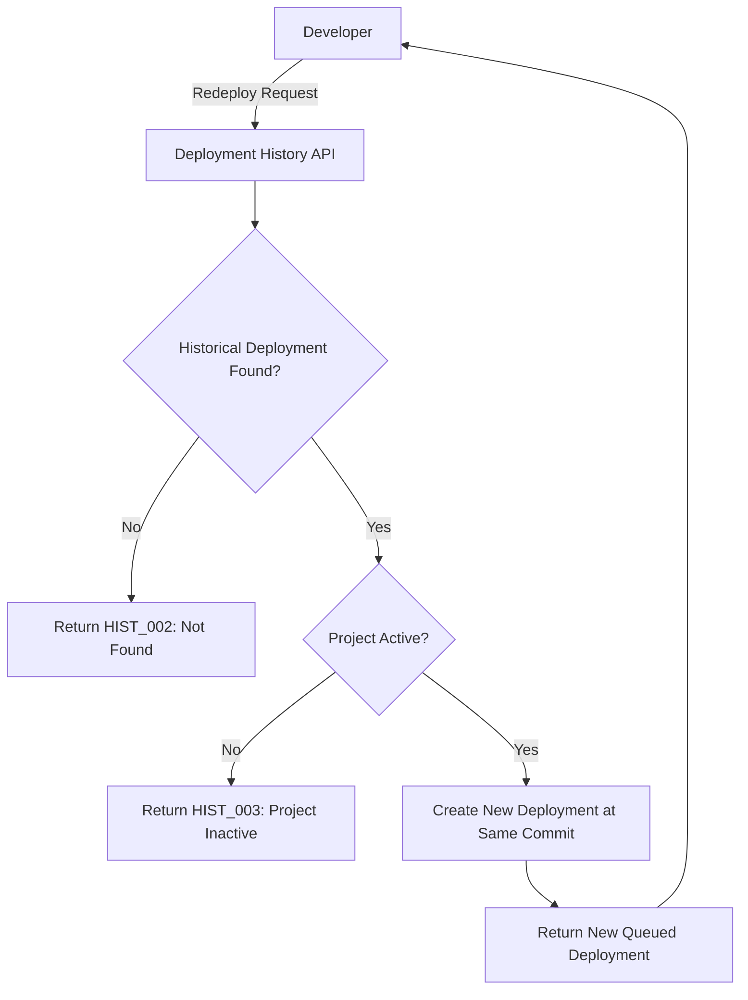
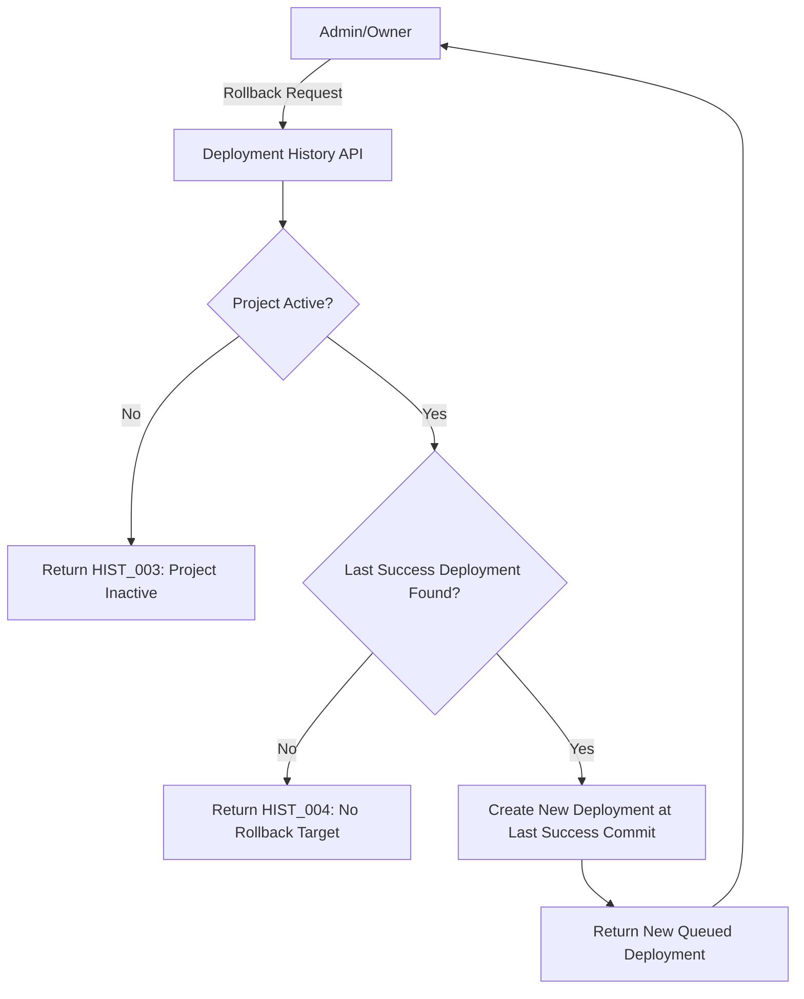
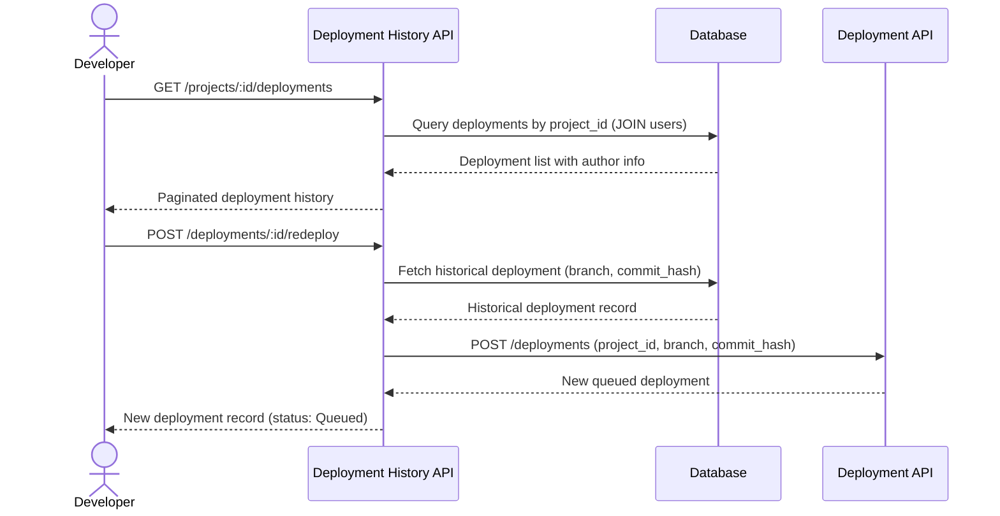

# Introduction

> **Module Type:** Sub-Module (Deployments)
> **Version:** 1.0
> **Status:** Draft
> **Priority:** High
> **Owner:** Backend Team

---

# 1. Module Overview

## Purpose

The Deployment History sub-module provides users with a complete record of all past deployments for a project. Users can view deployment details (commit, branch, author, build duration, status) and perform operational actions: **Redeploy** (re-run a previous deployment) and **Rollback** (revert to the last `Success` deployment).

## Scope

### Included

- Viewing paginated deployment history per project
- Viewing individual deployment detail (commit hash, branch, author, build duration, status)
- Redeploy operation: re-trigger a specific historical deployment at the same commit
- Rollback operation: trigger a deployment targeting the last successful commit

### Excluded

- Real-time log streaming (handled in [Live Build Logs Sub-Module](./live-build-logs-module.md))
- Deployment triggering and lifecycle management (handled in [Deployment Module](./deployment-module.md))
- Build execution (handled in [Build Worker Sub-Module](./build-worker-module.md))

---

# 2. Actors

| Actor     | Description                                           |
| --------- | ----------------------------------------------------- |
| Developer | Authenticated user viewing history or triggering redeploy / rollback |
| Admin     | System admin with full access to all project history  |
| Owner     | Project owner with full access including rollback     |

---

# 3. Business Goals

- Give developers full visibility into past deployment outcomes.
- Allow quick recovery via rollback to the last known-good deployment.
- Enable redeployment of specific commits without re-specifying all parameters.

---

# 4. Functional Requirements

## FR-001 List Deployment History

### Description

Returns a paginated list of all deployments for a given project, ordered by creation time descending, with rich metadata for each entry.

### Inputs

| Field      | Required | Descriptions                                                   |
| ---------- | -------- | -------------------------------------------------------------- |
| project_id | Yes      | UUID of the target project                                     |
| status     | No       | Filter by status (`Success`, `Failed`, `Building`, etc.)       |
| branch     | No       | Filter by branch name                                          |
| page       | No       | Page number (default: 1)                                       |
| limit      | No       | Records per page (default: 20, max: 100)                       |

### Process

1. Query `deployments` filtered by `project_id` and optional filters.
2. Join with `users` to resolve `triggered_by` → `author` (name + email).
3. Return paginated list ordered by `created_at` DESC.

### Success Response

- Deployment history list returned.

### Failure Cases

- Project not found (`HIST_001`).

---

## FR-002 Get Deployment Detail

### Description

Returns the complete metadata for a single historical deployment.

### Inputs

| Field         | Required | Descriptions                       |
| ------------- | -------- | ---------------------------------- |
| deployment_id | Yes      | UUID of the target deployment      |

### Process

1. Validate `deployment_id` exists.
2. Join with `users` to resolve `triggered_by` → `author`.
3. Return all deployment fields.

### Success Response

- Deployment detail retrieved.

### Failure Cases

- Deployment not found (`HIST_002`).

---

## FR-003 Redeploy

### Description

Re-triggers a new deployment using the exact same `branch`, `commit_hash`, and configuration as a specific historical deployment. This creates a fresh deployment record (not a mutation of the original).

### Inputs

| Field         | Required | Descriptions                                |
| ------------- | -------- | ------------------------------------------- |
| deployment_id | Yes      | UUID of the historical deployment to re-run |

### Process

1. Validate `deployment_id` exists.
2. Extract `project_id`, `branch`, and `commit_hash` from the historical record.
3. Create a new deployment record via the [Deployment Module](./deployment-module.md) `POST /deployments`.
4. Return the new deployment record.

### Success Response

- New deployment queued at the same commit.

### Failure Cases

- Historical deployment not found (`HIST_002`).
- Project no longer active (`HIST_003`).

---

## FR-004 Rollback

### Description

Triggers a new deployment targeting the `commit_hash` of the most recent `Success` deployment for the same project and branch. This is a recovery action to restore a known-good state.

### Inputs

| Field      | Required | Descriptions                                    |
| ---------- | -------- | ----------------------------------------------- |
| project_id | Yes      | UUID of the project to roll back                |
| branch     | No       | Branch to roll back (defaults to default branch)|

### Process

1. Validate `project_id` exists and is active.
2. Query the most recent deployment with `status = Success` for `project_id` and `branch`.
3. If no successful deployment found → return error (`HIST_004`).
4. Extract `commit_hash` from the last successful deployment.
5. Create a new deployment record via [Deployment Module](./deployment-module.md) at the resolved `commit_hash`.
6. Return the new deployment record.

### Success Response

- Rollback deployment queued at last successful commit.

### Failure Cases

- No successful deployment found for rollback (`HIST_004`).
- Project not active (`HIST_003`).

---

# 5. Business Rules

| ID     | Rule                                                                                                       |
| ------ | ---------------------------------------------------------------------------------------------------------- |
| BR-001 | Redeploy creates a **new** deployment record; it does not modify the original.                             |
| BR-002 | Rollback always targets the **most recent** `Success` deployment on the given branch.                      |
| BR-003 | Rollback and Redeploy are not available if the project is not in `active` status.                          |
| BR-004 | Deployment history is read-only — no modifications to historical records are permitted.                    |
| BR-005 | The `author` field in history is derived from `triggered_by` → User display name + email.                 |

---

# 6. Validation Rules

## History Query

| Field      | Validation                                                               |
| ---------- | ------------------------------------------------------------------------ |
| project_id | Required, valid UUID                                                     |
| status     | Optional; must be a valid deployment status enum value if provided       |
| branch     | Optional string                                                          |
| page       | Optional integer, minimum 1                                              |
| limit      | Optional integer, 1–100                                                  |

---

# 7. Authorization Matrix

| Route                               | Action               | Viewer | Developer | Admin | Owner | System Admin |
| ----------------------------------- | -------------------- | :----: | :-------: | :---: | :---: | :----------: |
| GET /projects/:id/deployments       | List History         | ✅     | ✅        | ✅    | ✅    | ✅           |
| GET /deployments/:id                | Get Detail           | ✅     | ✅        | ✅    | ✅    | ✅           |
| POST /deployments/:id/redeploy      | Redeploy             | ❌     | ✅        | ✅    | ✅    | ✅           |
| POST /projects/:id/rollback         | Rollback             | ❌     | ❌        | ✅    | ✅    | ✅           |

---

# 8. Workflow

## Redeploy Workflow



## Rollback Workflow



---

# 9. Sequence Diagram



---

# 10. Database Design

> Deployment history reads from the existing `deployments` table defined in the [Deployment Module](./deployment-module.md). No additional tables are required.

## History View Fields (derived from deployments + users JOIN)

| Field           | Source                                    | Description                                  |
| --------------- | ----------------------------------------- | -------------------------------------------- |
| id              | `deployments.id`                          | Deployment UUID                              |
| project_id      | `deployments.project_id`                  | Parent project UUID                          |
| branch          | `deployments.branch`                      | Branch deployed                              |
| commit_hash     | `deployments.commit_hash`                 | Commit SHA                                   |
| commit_short    | `deployments.commit_hash` (first 7 chars) | Short commit SHA for display                 |
| author_name     | `users.name` via `triggered_by`           | Display name of user who triggered           |
| author_email    | `users.email` via `triggered_by`          | Email of user who triggered                  |
| status          | `deployments.status`                      | Deployment status                            |
| build_duration  | `deployments.build_duration`              | Build time in milliseconds                   |
| deploy_duration | `deployments.deploy_duration`             | Deploy time in milliseconds                  |
| created_at      | `deployments.created_at`                  | Deployment trigger time                      |

---

# 11. API Endpoints

| Method | Endpoint                          | Description                                |
| ------ | --------------------------------- | ------------------------------------------ |
| GET    | /projects/:id/deployments         | List deployment history (paginated)        |
| GET    | /deployments/:id                  | Get single deployment detail               |
| POST   | /deployments/:id/redeploy         | Redeploy from a historical deployment      |
| POST   | /projects/:id/rollback            | Rollback to last successful deployment     |

---

# 12. API Examples

## List Deployment History

```http
GET /projects/07c0060e-8e8c-44c1-942c-3004f5a6c5b6/deployments?status=Success&limit=10
```

### Success Response

```json
{
  "data": [
    {
      "id": "deploy-abc123-8e8c-44c1-942c-3004f5a6c5b6",
      "project_id": "07c0060e-8e8c-44c1-942c-3004f5a6c5b6",
      "branch": "main",
      "commit_hash": "a1b2c3d4e5f6a1b2c3d4e5f6a1b2c3d4e5f6a1b2",
      "commit_short": "a1b2c3d",
      "author_name": "John Doe",
      "author_email": "john@example.com",
      "status": "Success",
      "build_duration": 45200,
      "deploy_duration": 12800,
      "created_at": "2026-08-12T17:00:00Z"
    }
  ],
  "pagination": {
    "page": 1,
    "limit": 10,
    "total": 42
  }
}
```

---

## Redeploy

```http
POST /deployments/deploy-abc123-8e8c-44c1-942c-3004f5a6c5b6/redeploy
```

### Success Response

```json
{
  "message": "Redeploy queued successfully.",
  "data": {
    "id": "deploy-xyz999-8e8c-44c1-942c-3004f5a6c5b6",
    "project_id": "07c0060e-8e8c-44c1-942c-3004f5a6c5b6",
    "branch": "main",
    "commit_hash": "a1b2c3d4e5f6a1b2c3d4e5f6a1b2c3d4e5f6a1b2",
    "status": "Queued",
    "created_at": "2026-08-12T18:00:00Z"
  }
}
```

---

## Rollback

```http
POST /projects/07c0060e-8e8c-44c1-942c-3004f5a6c5b6/rollback
```

### Success Response

```json
{
  "message": "Rollback deployment queued. Targeting last successful commit.",
  "data": {
    "id": "deploy-roll01-8e8c-44c1-942c-3004f5a6c5b6",
    "project_id": "07c0060e-8e8c-44c1-942c-3004f5a6c5b6",
    "branch": "main",
    "commit_hash": "a1b2c3d4e5f6a1b2c3d4e5f6a1b2c3d4e5f6a1b2",
    "status": "Queued",
    "rollback_from": "deploy-abc123-8e8c-44c1-942c-3004f5a6c5b6",
    "created_at": "2026-08-12T18:05:00Z"
  }
}
```

### Error Response

```json
{
  "error": "HIST_004",
  "message": "No successful deployment found to roll back to."
}
```

---

# 13. Error Codes

| Code     | Description                                        |
| -------- | -------------------------------------------------- |
| HIST_001 | Project Not Found                                  |
| HIST_002 | Deployment Not Found                               |
| HIST_003 | Project Not Active (Redeploy / Rollback Blocked)   |
| HIST_004 | No Successful Deployment Found for Rollback        |
| HIST_005 | Unauthorized Access to Deployment History          |

---

# 14. Security Requirements

- Users can only view or act on deployments for projects they have permission to access.
- Rollback is restricted to `Admin` and `Owner` roles to prevent accidental reversions.
- All redeploy and rollback actions must be logged with the requesting user's ID.
- Historical records are immutable — no update or delete operations on past deployments.

---

# 15. Non-Functional Requirements

| Requirement                     | Target   |
| ------------------------------- | -------- |
| History List Response Time      | < 100ms  |
| Deployment Detail Response Time | < 50ms   |
| Redeploy Trigger Time           | < 200ms  |
| Rollback Resolution Time        | < 200ms  |
| History Retention               | Unlimited|

---

# 16. Acceptance Criteria

- Users can view a paginated list of past deployments with commit hash, branch, author, build duration, and status.
- Redeploy creates a new deployment record at the same commit and does not mutate the historical record.
- Rollback identifies the most recent `Success` deployment and queues a new deployment at that commit.
- If no successful deployment exists, rollback returns a clear error (`HIST_004`).
- History records are read-only and cannot be modified.

---

# 17. Dependencies

- [Deployment Module](./deployment-module.md)
- [Build Worker Sub-Module](./build-worker-module.md)
- Users Module (for author resolution)
- Database

---

# 18. Assumptions

- `triggered_by` always references a valid user in the `users` table.
- The `deployments` table is the single source of truth for deployment history.
- History pagination defaults are sufficient for typical usage (20 records/page).

---

# 19. Future Enhancements

- Deployment comparison view (diff between two deployment commits).
- Rollback approval workflow for production environments.
- Deployment tagging and annotations (e.g., "released v2.0.0").
- Retention policy configuration per project (e.g., keep last 100 deployments).

---

# 20. Appendix

## Related Documents

- [Deployment Module](./deployment-module.md)
- [Build Worker Sub-Module](./build-worker-module.md)
- [Live Build Logs Sub-Module](./live-build-logs-module.md)
- System Architecture
- API Documentation
- Security Policy

---

**Document Version:** 1.0
**Last Updated:** 2026-08-12
**Author:** Monirul Islam
