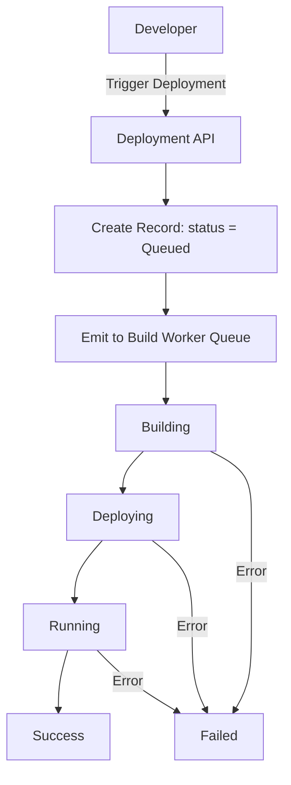
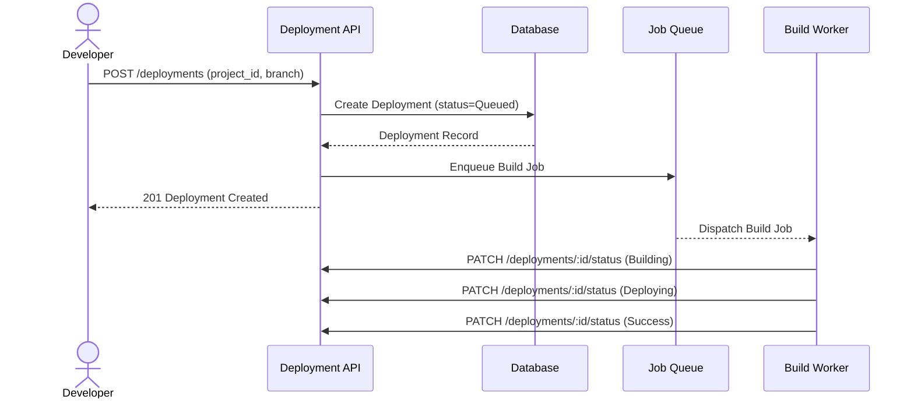

# Introduction

> **Module Type:** Core Module
> **Version:** 1.0
> **Status:** Draft
> **Priority:** Critical
> **Owner:** Backend Team

---

# 1. Module Overview

## Purpose

The Deployment module is responsible for managing the full lifecycle of project deployments. Developers can trigger deployments which are processed asynchronously through a defined lifecycle: `Queued → Building → Deploying → Running → Failed / Success`.

## Scope

### Included

- Triggering deployments for a project
- Managing deployment lifecycle states
- Storing deployment metadata (commit hash, branch, build duration, deployment duration, status, triggered by)
- Listing and retrieving deployment records

### Excluded

- Build execution logic (handled in [Build Worker Sub-Module](./build-worker-module.md))
- Live log streaming (handled in [Live Build Logs Sub-Module](./live-build-logs-module.md))
- Deployment history, redeploy, and rollback operations (handled in [Deployment History Sub-Module](./deployment-history-module.md))
- Project-level configuration (handled in Projects Module)
- User authentication and authorization (handled in Auth Module)

---

# 2. Actors

| Actor             | Description                                                  |
| ----------------- | ------------------------------------------------------------ |
| Developer         | Authenticated user who triggers deployments                  |
| Admin             | System administrator with full deployment access             |
| Build Worker      | Internal async service that processes build and deploy steps |
| System            | Internal platform that transitions deployment state          |

---

# 3. Business Goals

- Allow developers to trigger project deployments with a single action.
- Track the full deployment lifecycle from `Queued` to terminal state (`Success` or `Failed`).
- Store complete deployment metadata for auditing and history.
- Process deployments asynchronously to avoid blocking the API layer.

---

# 4. Functional Requirements

## FR-001 Trigger Deployment

### Description

Allows an authenticated developer or admin to trigger a new deployment for a project. The deployment is placed in the queue immediately.

### Inputs

| Field      | Required | Descriptions                                  |
| ---------- | -------- | --------------------------------------------- |
| project_id | Yes      | UUID of the target project                    |
| branch     | No       | Branch to deploy (defaults to default branch) |
| commit_hash| No       | Specific commit to deploy (defaults to HEAD)  |

### Process

1. Validate `project_id` exists and is active.
2. Resolve `branch` and `commit_hash` (use project defaults if not provided).
3. Create a new deployment record with `status = Queued`.
4. Set `triggered_by` to the authenticated user's ID.
5. Emit deployment job to the async Build Worker queue.
6. Return deployment record immediately.

### Success Response

- Deployment created and queued successfully.

### Failure Cases

- Project not found.
- Project is not in `active` status.
- Missing or invalid `project_id`.

---

## FR-002 Get Deployment by ID

### Description

Retrieves full metadata for a specific deployment record.

### Inputs

| Field         | Required | Descriptions                 |
| ------------- | -------- | ---------------------------- |
| deployment_id | Yes      | UUID of the target deployment|

### Process

1. Validate deployment record exists.
2. Return deployment record with all metadata fields.

### Success Response

- Deployment details retrieved.

### Failure Cases

- Deployment not found (`DEPLOY_001`).

---

## FR-003 List Deployments for a Project

### Description

Retrieves a paginated list of all deployments for a given project, ordered by creation time descending.

### Inputs

| Field      | Required | Descriptions                     |
| ---------- | -------- | -------------------------------- |
| project_id | Yes      | UUID of the target project       |
| status     | No       | Filter by deployment status      |
| page       | No       | Pagination page number           |
| limit      | No       | Records per page (default: 20)   |

### Process

1. Query `deployments` filtered by `project_id` and optional `status`.
2. Return paginated results ordered by `created_at` DESC.

### Success Response

- Deployment list retrieved.

### Failure Cases

- Project not found.

---

## FR-004 Update Deployment Status (Internal)

### Description

Internal endpoint used by the Build Worker to transition the deployment through lifecycle states.

### Inputs

| Field             | Required | Descriptions                                               |
| ----------------- | -------- | ---------------------------------------------------------- |
| deployment_id     | Yes      | UUID of the deployment                                     |
| status            | Yes      | New status: `Building`, `Deploying`, `Running`, `Failed`, `Success` |
| build_duration    | No       | Duration in ms (set when transitioning out of `Building`) |
| deploy_duration   | No       | Duration in ms (set when transitioning out of `Deploying`)|
| error_message     | No       | Error details if transitioning to `Failed`                |

### Process

1. Validate deployment exists.
2. Enforce valid state transitions (see Business Rules).
3. Update `status` and optional duration/error fields.

### Success Response

- Deployment status updated.

### Failure Cases

- Deployment not found.
- Invalid state transition (`DEPLOY_003`).

---

# 5. Business Rules

| ID     | Rule                                                                                                         |
| ------ | ------------------------------------------------------------------------------------------------------------ |
| BR-001 | Valid deployment lifecycle: `Queued → Building → Deploying → Running → Success` or `* → Failed`.             |
| BR-002 | A deployment record is immutable once it reaches `Success` or `Failed` terminal states.                      |
| BR-003 | `triggered_by` must reference a valid authenticated user ID.                                                 |
| BR-004 | Only one `Running` deployment may be active per project at a time. New triggers queue behind it.             |
| BR-005 | `build_duration` and `deploy_duration` are measured in milliseconds and set by the Build Worker on transition.|

---

# 6. Validation Rules

## Deployment

| Field         | Validation                                                              |
| ------------- | ----------------------------------------------------------------------- |
| project_id    | Required, valid UUID                                                    |
| branch        | Optional string; defaults to project's `default_branch`                |
| commit_hash   | Optional string (40-char SHA); defaults to HEAD of branch              |
| status        | Must be one of: `Queued`, `Building`, `Deploying`, `Running`, `Failed`, `Success` |

---

# 7. Authorization Matrix

| Route                          | Action              | Viewer | Developer | Admin | Owner | System Admin | Build Worker  |
| ------------------------------ | ------------------- | :----: | :-------: | :---: | :---: | :----------: | :-----------: |
| POST /deployments              | Trigger Deployment  | ❌     | ✅        | ✅    | ✅    | ✅           | ❌            |
| GET /deployments/:id           | Get Deployment      | ✅     | ✅        | ✅    | ✅    | ✅           | ✅            |
| GET /projects/:id/deployments  | List Deployments    | ✅     | ✅        | ✅    | ✅    | ✅           | ✅            |
| PATCH /deployments/:id/status  | Update Status       | ❌     | ❌        | ❌    | ❌    | ✅           | ✅ (Internal) |

---

# 8. Workflow

## Deployment Lifecycle



---

# 9. Sequence Diagram



---

# 10. Database Design

## deployments

| Field            | Type        | Constraints                                                              |
| ---------------- | ----------- | ------------------------------------------------------------------------ |
| id               | UUID        | Primary                                                                  |
| project_id       | UUID        | Foreign Key → `projects.id`                                              |
| triggered_by     | UUID        | Foreign Key → `users.id`                                                 |
| branch           | VARCHAR     | Branch name deployed                                                     |
| commit_hash      | VARCHAR(40) | Git commit SHA                                                           |
| status           | VARCHAR     | `Queued`, `Building`, `Deploying`, `Running`, `Failed`, `Success`        |
| build_duration   | INTEGER     | Build time in milliseconds (nullable)                                    |
| deploy_duration  | INTEGER     | Deploy time in milliseconds (nullable)                                   |
| error_message    | TEXT        | Error details if `Failed` (nullable)                                     |
| created_at       | TIMESTAMP   |                                                                          |
| updated_at       | TIMESTAMP   |                                                                          |

---

# 11. API Endpoints

| Method | Endpoint                       | Description                         |
| ------ | ------------------------------ | ----------------------------------- |
| POST   | /deployments                   | Trigger a new deployment            |
| GET    | /deployments/:id               | Get deployment by ID                |
| GET    | /projects/:id/deployments      | List deployments for a project      |
| PATCH  | /deployments/:id/status        | Update deployment status (Internal) |

---

# 12. API Examples

## Trigger Deployment

```json
POST /deployments
{
  "project_id": "07c0060e-8e8c-44c1-942c-3004f5a6c5b6",
  "branch": "main",
  "commit_hash": "a1b2c3d4e5f6a1b2c3d4e5f6a1b2c3d4e5f6a1b2"
}
```

### Success Response

```json
{
  "message": "Deployment queued successfully.",
  "data": {
    "id": "deploy-abc123-8e8c-44c1-942c-3004f5a6c5b6",
    "project_id": "07c0060e-8e8c-44c1-942c-3004f5a6c5b6",
    "triggered_by": "user-456e7890-e89b-12d3-a456-426614174000",
    "branch": "main",
    "commit_hash": "a1b2c3d4e5f6a1b2c3d4e5f6a1b2c3d4e5f6a1b2",
    "status": "Queued",
    "build_duration": null,
    "deploy_duration": null,
    "created_at": "2026-08-12T17:00:00Z"
  }
}
```

### Error Response

```json
{
  "error": "DEPLOY_002",
  "message": "Project not found"
}
```

---

## Get Deployment by ID

```json
GET /deployments/deploy-abc123-8e8c-44c1-942c-3004f5a6c5b6
```

### Success Response

```json
{
  "data": {
    "id": "deploy-abc123-8e8c-44c1-942c-3004f5a6c5b6",
    "project_id": "07c0060e-8e8c-44c1-942c-3004f5a6c5b6",
    "triggered_by": "user-456e7890-e89b-12d3-a456-426614174000",
    "branch": "main",
    "commit_hash": "a1b2c3d4e5f6a1b2c3d4e5f6a1b2c3d4e5f6a1b2",
    "status": "Success",
    "build_duration": 45200,
    "deploy_duration": 12800,
    "created_at": "2026-08-12T17:00:00Z",
    "updated_at": "2026-08-12T17:01:02Z"
  }
}
```

---

# 13. Error Codes

| Code       | Description                                |
| ---------- | ------------------------------------------ |
| DEPLOY_001 | Deployment Not Found                       |
| DEPLOY_002 | Project Not Found                          |
| DEPLOY_003 | Invalid State Transition                   |
| DEPLOY_004 | Project Not Active                         |
| DEPLOY_005 | Missing Required Fields                    |

---

# 14. Security Requirements

- Only authenticated users with `Developer`, `Admin`, or `Owner` roles may trigger deployments.
- Internal status update endpoints (`PATCH /deployments/:id/status`) must be restricted to the Build Worker service via an internal service token.
- All deployment triggers must be logged with `triggered_by` user ID for auditability.
- Deployment records must not be modifiable once in a terminal state (`Success` or `Failed`).

---

# 15. Non-Functional Requirements

| Requirement                    | Target   |
| ------------------------------ | -------- |
| Trigger API Response Time      | < 200ms  |
| Deployment Status Polling Time | < 50ms   |
| Build Worker Pickup Latency    | < 5s     |
| Availability                   | 99.9%    |

---

# 16. Acceptance Criteria

- Developers can trigger a deployment and immediately receive a `Queued` record.
- Deployments transition through the defined lifecycle states in order.
- Terminal states (`Success`, `Failed`) are immutable — no further status updates accepted.
- `build_duration` and `deploy_duration` are populated correctly on completion.
- Only one `Running` deployment may be active per project at a time.

---

# 17. Dependencies

- Projects Module
- Users Module
- Job Queue (e.g., Redis / RabbitMQ)
- [Build Worker Sub-Module](./build-worker-module.md)
- [Live Build Logs Sub-Module](./live-build-logs-module.md)
- [Deployment History Sub-Module](./deployment-history-module.md)
- Database

---

# 18. Assumptions

- An async job queue is operational and accessible by the Build Worker.
- Project `default_branch` is always set before a deployment can be triggered.
- Database is highly available.

---

# 19. Future Enhancements

- Auto-deploy on git push via webhook integration.
- Deployment preview URLs for branch-based deployments.
- Deployment approval gates for production environments.
- Concurrent deployment slots per project tier.

---

# 20. Appendix

## Sub-Modules

| Sub-Module                                               | Description                                |
| -------------------------------------------------------- | ------------------------------------------ |
| [Build Worker](./build-worker-module.md)                 | Async worker that builds and deploys code  |
| [Live Build Logs](./live-build-logs-module.md)           | Real-time log streaming for deployments    |
| [Deployment History](./deployment-history-module.md)     | History, redeploy, and rollback operations |

## Related Documents

- Projects Module
- Users Module
- System Architecture
- API Documentation
- Security Policy

---

**Document Version:** 1.0
**Last Updated:** 2026-08-12
**Author:** Monirul Islam
