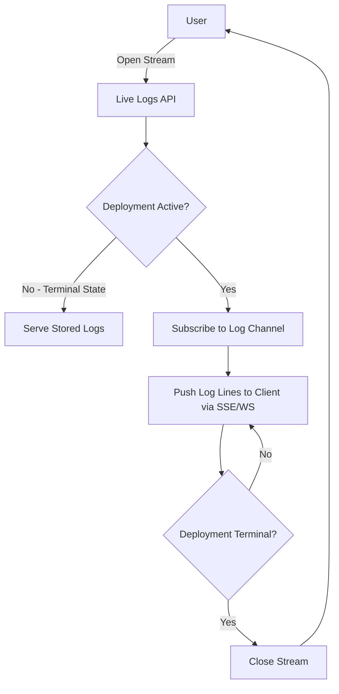
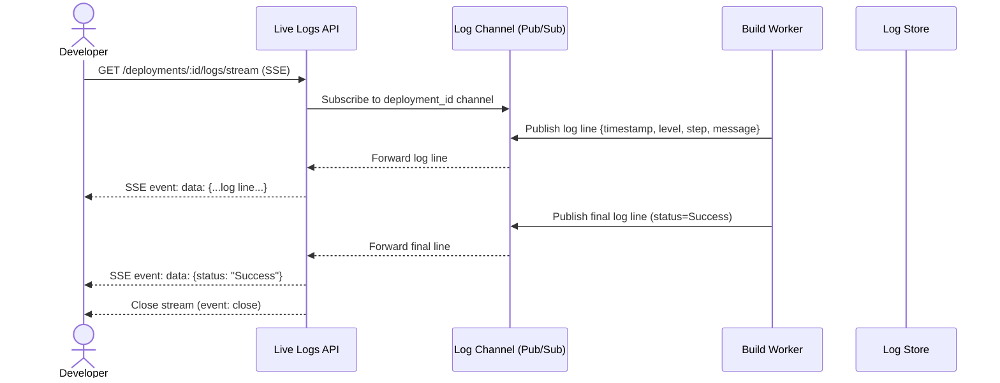

# Introduction

> **Module Type:** Sub-Module (Deployments)
> **Version:** 1.0
> **Status:** Draft
> **Priority:** High
> **Owner:** Backend Team

---

# 1. Module Overview

## Purpose

The Live Build Logs sub-module enables users to watch deployment build logs in real time as they stream from the [Build Worker](./build-worker-module.md). It provides auto-scrolling, timestamped, level-tagged log output with search and download capabilities.

## Scope

### Included

- Real-time log streaming via Server-Sent Events (SSE) or WebSocket
- Auto-scrolling of live log output
- Timestamped log entries
- Log level tagging (`INFO`, `WARN`, `ERROR`, `DEBUG`)
- Log search / filter within a deployment session
- Download complete deployment logs as a file
- Serving stored logs for completed deployments

### Excluded

- Log storage (handled in [Build Worker Sub-Module](./build-worker-module.md))
- Deployment triggering (handled in [Deployment Module](./deployment-module.md))
- Log aggregation across multiple deployments (handled in [Deployment History Sub-Module](./deployment-history-module.md))

---

# 2. Actors

| Actor      | Description                                              |
| ---------- | -------------------------------------------------------- |
| Developer  | Authenticated user watching live deployment logs         |
| Admin      | System admin with access to all project logs             |
| Build Worker | Internal service that publishes log entries to the stream |

---

# 3. Business Goals

- Allow developers to observe deployment progress in real time without polling.
- Provide rich log output with timestamps and severity levels to aid debugging.
- Enable download of complete logs for offline analysis and sharing.
- Support log search to quickly locate errors within long build outputs.

---

# 4. Functional Requirements

## FR-001 Stream Live Logs

### Description

Opens a real-time streaming connection for an active deployment and pushes log lines as they are emitted by the Build Worker.

### Inputs

| Field         | Required | Descriptions                                 |
| ------------- | -------- | -------------------------------------------- |
| deployment_id | Yes      | UUID of the active deployment to stream      |

### Process

1. Verify `deployment_id` exists and belongs to a project the user has access to.
2. Check that the deployment is not in a terminal state — if it is, serve stored logs instead (FR-002).
3. Open an SSE (`text/event-stream`) or WebSocket connection to the client.
4. Subscribe to the real-time log channel for `deployment_id`.
5. Push each new log event `{ timestamp, level, step, message }` to the client as it arrives.
6. Close the stream when the deployment reaches `Success` or `Failed`.

### Success Response

- Live log stream opened; log lines delivered in real time.

### Failure Cases

- Deployment not found (`LOG_001`).
- Unauthorized access (`LOG_002`).
- Stream connection error → client should reconnect with `Last-Event-ID`.

---

## FR-002 Get Stored Logs

### Description

Returns the full stored log history for a completed deployment.

### Inputs

| Field         | Required | Descriptions                          |
| ------------- | -------- | ------------------------------------- |
| deployment_id | Yes      | UUID of the deployment                |
| step          | No       | Filter by step: `clone`, `build`, `deploy`, `health_check` |
| level         | No       | Filter by level: `INFO`, `WARN`, `ERROR`, `DEBUG` |

### Process

1. Verify `deployment_id` exists.
2. Query `build_logs` filtered by optional `step` and `level`.
3. Return log lines ordered by `timestamp` ASC.

### Success Response

- Log lines retrieved.

### Failure Cases

- Deployment not found (`LOG_001`).
- No logs available yet (`LOG_003`).

---

## FR-003 Search Logs

### Description

Allows users to search within the log output of a deployment using a keyword.

### Inputs

| Field         | Required | Descriptions                       |
| ------------- | -------- | ---------------------------------- |
| deployment_id | Yes      | UUID of the deployment             |
| query         | Yes      | Search keyword or phrase           |
| level         | No       | Filter by log level                |
| step          | No       | Filter by pipeline step            |

### Process

1. Query `build_logs` for `deployment_id` where `message ILIKE %query%`.
2. Apply optional `level` and `step` filters.
3. Return matching log lines with surrounding context (3 lines before/after each match).

### Success Response

- Matching log lines returned.

### Failure Cases

- No results found → return empty list.
- Deployment not found (`LOG_001`).

---

## FR-004 Download Logs

### Description

Allows users to download the complete log output of a deployment as a plain-text or `.log` file.

### Inputs

| Field         | Required | Descriptions                       |
| ------------- | -------- | ---------------------------------- |
| deployment_id | Yes      | UUID of the deployment             |

### Process

1. Fetch all `build_logs` for `deployment_id` ordered by `timestamp` ASC.
2. Format each line as `[TIMESTAMP] [LEVEL] [STEP] MESSAGE`.
3. Return as a file download with `Content-Disposition: attachment; filename="deploy-{id}.log"`.

### Success Response

- Log file download initiated.

### Failure Cases

- Deployment not found (`LOG_001`).
- No logs available (`LOG_003`).

---

# 5. Business Rules

| ID     | Rule                                                                                                           |
| ------ | -------------------------------------------------------------------------------------------------------------- |
| BR-001 | Live streaming is only available while the deployment is in a non-terminal state (`Queued`, `Building`, `Deploying`, `Running`). |
| BR-002 | Stored log retrieval is available for all deployments regardless of status.                                    |
| BR-003 | Each log line must carry a `timestamp`, `level`, `step`, and `message` field.                                  |
| BR-004 | Users can only access logs for deployments belonging to projects they have permission to view.                  |
| BR-005 | Auto-scroll must be the default behavior for live streams; the user can pause scrolling manually.              |

---

# 6. Validation Rules

## Log Stream Request

| Field         | Validation                            |
| ------------- | ------------------------------------- |
| deployment_id | Required, valid UUID                  |
| step          | Optional; one of `clone`, `build`, `deploy`, `health_check` |
| level         | Optional; one of `INFO`, `WARN`, `ERROR`, `DEBUG` |
| query         | Optional string; min 1 character for search |

---

# 7. Authorization Matrix

| Route                                | Action             | Viewer | Developer | Admin | Owner | System Admin |
| ------------------------------------ | ------------------ | :----: | :-------: | :---: | :---: | :----------: |
| GET /deployments/:id/logs/stream     | Stream Live Logs   | ✅     | ✅        | ✅    | ✅    | ✅           |
| GET /deployments/:id/logs            | Get Stored Logs    | ✅     | ✅        | ✅    | ✅    | ✅           |
| GET /deployments/:id/logs/search     | Search Logs        | ✅     | ✅        | ✅    | ✅    | ✅           |
| GET /deployments/:id/logs/download   | Download Logs      | ✅     | ✅        | ✅    | ✅    | ✅           |

---

# 8. Workflow

## Live Log Streaming



---

# 9. Sequence Diagram



---

# 10. Database Design

> Log storage schema is defined in [Build Worker Sub-Module — build_logs table](./build-worker-module.md).

## Log Event Schema (SSE / WebSocket Payload)

```json
{
  "deployment_id": "deploy-abc123-...",
  "timestamp": "2026-08-12T17:01:23.456Z",
  "level": "INFO",
  "step": "build",
  "message": "Step 3/8 : RUN cargo build --release"
}
```

---

# 11. API Endpoints

| Method | Endpoint                             | Description                          |
| ------ | ------------------------------------ | ------------------------------------ |
| GET    | /deployments/:id/logs/stream         | Open live SSE log stream             |
| GET    | /deployments/:id/logs                | Get stored logs (with filters)       |
| GET    | /deployments/:id/logs/search         | Search logs by keyword               |
| GET    | /deployments/:id/logs/download       | Download logs as `.log` file         |

---

# 12. API Examples

## Stream Live Logs (SSE)

```http
GET /deployments/deploy-abc123-8e8c-44c1-942c-3004f5a6c5b6/logs/stream
Accept: text/event-stream
```

### SSE Stream Response

```
data: {"timestamp":"2026-08-12T17:00:01Z","level":"INFO","step":"clone","message":"Cloning repository..."}

data: {"timestamp":"2026-08-12T17:00:03Z","level":"INFO","step":"clone","message":"Clone complete."}

data: {"timestamp":"2026-08-12T17:00:04Z","level":"INFO","step":"build","message":"Step 1/8 : FROM rust:1.79-slim"}

data: {"timestamp":"2026-08-12T17:01:22Z","level":"INFO","step":"build","message":"Successfully built image."}

data: {"timestamp":"2026-08-12T17:01:23Z","level":"INFO","step":"health_check","message":"Health check passed. Status: Success."}

event: close
data: {"status":"Success"}
```

---

## Get Stored Logs

```http
GET /deployments/deploy-abc123-8e8c-44c1-942c-3004f5a6c5b6/logs?level=ERROR
```

### Success Response

```json
{
  "data": [
    {
      "id": "log-001",
      "deployment_id": "deploy-abc123-8e8c-44c1-942c-3004f5a6c5b6",
      "timestamp": "2026-08-12T17:00:45Z",
      "level": "ERROR",
      "step": "build",
      "message": "error[E0308]: mismatched types"
    }
  ]
}
```

---

## Download Logs

```http
GET /deployments/deploy-abc123-8e8c-44c1-942c-3004f5a6c5b6/logs/download
```

**Response Headers:**
```
Content-Type: text/plain
Content-Disposition: attachment; filename="deploy-abc123.log"
```

**File Content:**
```
[2026-08-12T17:00:01Z] [INFO]  [clone]        Cloning repository...
[2026-08-12T17:00:03Z] [INFO]  [clone]        Clone complete.
[2026-08-12T17:00:04Z] [INFO]  [build]        Step 1/8 : FROM rust:1.79-slim
[2026-08-12T17:01:22Z] [INFO]  [build]        Successfully built image.
[2026-08-12T17:01:23Z] [INFO]  [health_check] Health check passed. Status: Success.
```

---

# 13. Error Codes

| Code    | Description                             |
| ------- | --------------------------------------- |
| LOG_001 | Deployment Not Found                    |
| LOG_002 | Unauthorized Access to Deployment Logs  |
| LOG_003 | No Logs Available Yet                   |
| LOG_004 | Stream Connection Failed                |

---

# 14. Security Requirements

- Users can only access logs for deployments in projects they are authorized to view.
- Log streaming connections must be authenticated via JWT or session token.
- SSE connections must be closed immediately upon authorization failure.
- Log download files must not expose any plaintext secret environment variable values.

---

# 15. Non-Functional Requirements

| Requirement                  | Target    |
| ---------------------------- | --------- |
| Log Delivery Latency (SSE)   | < 500ms   |
| Search Response Time         | < 200ms   |
| Download Generation Time     | < 1s      |
| Max Concurrent SSE Streams   | 10,000    |
| Log Retention Period         | 90 days   |

---

# 16. Acceptance Criteria

- Users can open a live stream and see log lines appear in real time as the Build Worker emits them.
- Auto-scrolling is enabled by default; the user can pause it.
- Each log line includes a timestamp, level, step, and message.
- Searching within logs returns matching lines with surrounding context.
- Downloading logs produces a correctly formatted `.log` file.
- Streams close automatically when the deployment reaches `Success` or `Failed`.

---

# 17. Dependencies

- [Deployment Module](./deployment-module.md)
- [Build Worker Sub-Module](./build-worker-module.md)
- Pub/Sub system (e.g., Redis Pub/Sub, WebSocket broker)
- Log Store (e.g., object storage or time-series DB)
- Database

---

# 18. Assumptions

- The Pub/Sub channel per `deployment_id` is available and maintained by the Build Worker.
- Log entries are stored by the Build Worker before being published to the stream.
- Client browsers support SSE (Server-Sent Events).

---

# 19. Future Enhancements

- Log export to external services (e.g., Datadog, Grafana Loki).
- Log line highlighting / syntax coloring for build output.
- Log annotations (e.g., marking specific lines as errors or warnings by the user).
- Persistent log bookmarks for long build outputs.

---

# 20. Appendix

## Related Documents

- [Deployment Module](./deployment-module.md)
- [Build Worker Sub-Module](./build-worker-module.md)
- [Deployment History Sub-Module](./deployment-history-module.md)
- System Architecture
- API Documentation
- Security Policy

---

**Document Version:** 1.0
**Last Updated:** 2026-08-12
**Author:** Monirul Islam
