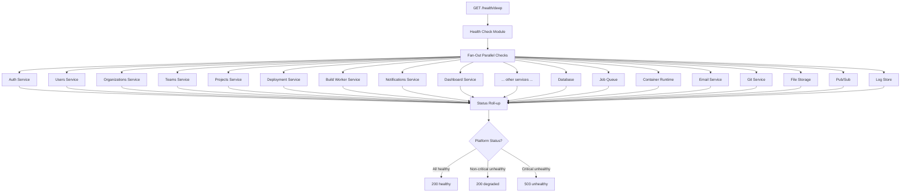
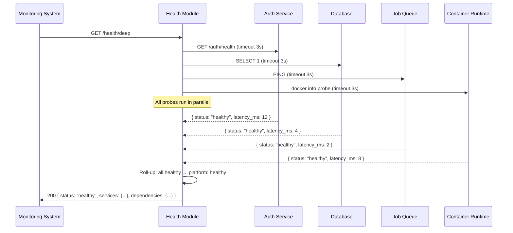

# Introduction

> **Module Type:** Core Module
> **Version:** 1.0
> **Status:** Draft
> **Priority:** Critical
> **Owner:** Platform / DevOps Team

---

# 1. Module Overview

## Purpose

The Health & Observability module provides a centralized system health checking API that aggregates liveness and readiness signals from every internal service module and external dependency in the Forge platform. It enables operators, load balancers, orchestrators (e.g., Kubernetes), and monitoring systems to assess the real-time operational state of the entire platform without owning a database of its own.

All checks are performed by making lightweight inter-service calls or dependency probes at request time.

## Scope

### Included

- Platform-wide health check endpoint (`/health`)
- Per-service liveness probe endpoints (`/health/live`)
- Per-service readiness probe endpoints (`/health/ready`)
- Aggregated deep health check with per-service status (`/health/deep`)
- External dependency health checks (Database, Job Queue, Email Service, Git Service, File Storage, Container Runtime, Pub/Sub, Log Store)
- Health status response schema (standardized)
- Observability metadata (uptime, version, environment)

### Excluded (Future — see Section 20)

- Metrics collection and time-series storage (Prometheus / OpenTelemetry)
- Distributed tracing (Jaeger / Zipkin)
- Alerting and paging (PagerDuty / OpsGenie integration)
- Log aggregation pipeline (Loki / ELK)
- SLO / SLA tracking dashboards (Grafana)
- Profiling (pprof / FlameGraph)

---

# 2. Actors

| Actor              | Description                                                               |
| ------------------ | ------------------------------------------------------------------------- |
| Load Balancer      | Uses `/health/live` to route traffic only to live instances               |
| Orchestrator (K8s) | Uses `/health/live` and `/health/ready` for liveness and readiness probes |
| Monitoring System  | Polls `/health/deep` to detect and alert on service degradation           |
| Platform Operator  | Uses `/health/deep` for manual incident investigation                     |
| Internal Services  | Expose `/health/live` endpoints polled by this module's deep check        |

---

# 3. Business Goals

- Guarantee that the platform's operational state is always observable from a single endpoint.
- Enable zero-downtime deployments by ensuring load balancers and orchestrators can reliably determine service readiness.
- Provide enough signal for operators to identify failing services and external dependencies without log diving.
- Lay the groundwork for a full observability stack (metrics, tracing, alerting) in future releases.

---

# 4. Health Status Schema

All health check responses use a standardized schema:

## Service Health Object

```json
{
  "status": "healthy | degraded | unhealthy",
  "latency_ms": 12,
  "message": "optional human-readable detail"
}
```

## Status Definitions

| Status      | Meaning                                                                  |
| ----------- | ------------------------------------------------------------------------ |
| `healthy`   | Service is responding correctly within acceptable latency thresholds     |
| `degraded`  | Service is responding but with elevated latency or partial functionality |
| `unhealthy` | Service is not responding or returning errors                            |

## Platform-Level Status Roll-up

| Condition                                         | Platform Status |
| ------------------------------------------------- | --------------- |
| All services `healthy`                            | `healthy`       |
| One or more services `degraded`, none `unhealthy` | `degraded`      |
| One or more **critical** services `unhealthy`     | `unhealthy`     |
| One or more **non-critical** services `unhealthy` | `degraded`      |

---

# 5. Service Registry

The following services are checked by this module. Each is classified as **Critical** (platform unusable if down) or **Non-Critical** (degraded experience if down).

## Internal Services

| Service                       | Module                         | Criticality  | Health Check Method                     |
| ----------------------------- | ------------------------------ | :----------: | --------------------------------------- |
| Auth Service                  | Auth Module                    |   Critical   | `GET /auth/health`                      |
| Access Control Service        | Auth / Access Control          |   Critical   | `GET /access-control/health`            |
| Users Service                 | Users Module                   |   Critical   | `GET /users/health`                     |
| User Profile Service          | User Profile Sub-Module        | Non-Critical | `GET /users/profile/health`             |
| Organizations Service         | Organizations Module           |   Critical   | `GET /organizations/health`             |
| Org Members Service           | Org Members Sub-Module         | Non-Critical | `GET /organizations/members/health`     |
| Org Permissions Service       | Org Permissions Sub-Module     | Non-Critical | `GET /organizations/permissions/health` |
| Teams Service                 | Teams Module                   | Non-Critical | `GET /teams/health`                     |
| Projects Service              | Projects Module                |   Critical   | `GET /projects/health`                  |
| Repository Service            | Repository Sub-Module          | Non-Critical | `GET /projects/repository/health`       |
| Environment Variables Service | Env Vars Sub-Module            | Non-Critical | `GET /projects/env-vars/health`         |
| Project Files Service         | Project Files Sub-Module       | Non-Critical | `GET /projects/files/health`            |
| Project Assignments Service   | Project Assignments Sub-Module | Non-Critical | `GET /projects/assignments/health`      |
| Project Permissions Service   | Project Permissions Sub-Module | Non-Critical | `GET /projects/permissions/health`      |
| Deployment Service            | Deployment Module              |   Critical   | `GET /deployments/health`               |
| Build Worker Service          | Build Worker Sub-Module        |   Critical   | `GET /workers/health`                   |
| Live Build Logs Service       | Live Build Logs Sub-Module     | Non-Critical | `GET /logs/health`                      |
| Deployment History Service    | Deployment History Sub-Module  | Non-Critical | `GET /deployments/history/health`       |
| Notifications Service         | Notifications Module           | Non-Critical | `GET /notifications/health`             |
| Dashboard Service             | Dashboard Module               | Non-Critical | `GET /dashboard/health`                 |

## External Dependencies

| Dependency        | Criticality  | Health Check Method                                     |
| ----------------- | :----------: | ------------------------------------------------------- |
| Database          |   Critical   | Connection pool ping (`SELECT 1`)                       |
| Job Queue         |   Critical   | Queue ping / heartbeat (Redis `PING` or AMQP heartbeat) |
| Pub/Sub System    | Non-Critical | Channel ping (`PUBLISH` test event)                     |
| Email Service     | Non-Critical | SMTP connection check or API status endpoint            |
| Git Service       | Non-Critical | HTTP HEAD request to repository host                    |
| File Storage      | Non-Critical | Object storage API ping / bucket list                   |
| Container Runtime |   Critical   | `docker info` / Docker socket ping                      |
| Log Store         | Non-Critical | Log store write probe                                   |

---

# 6. Functional Requirements

## FR-001 Liveness Probe

### Description

A lightweight endpoint that confirms the health service process itself is running. Used by orchestrators (Kubernetes `livenessProbe`) to determine if the instance should be restarted. Does **not** check any downstream services.

### Inputs

_No inputs required._

### Process

1. Confirm the HTTP server is accepting requests.
2. Return `200 OK` with minimal payload.

### Success Response

```json
{
  "status": "healthy",
  "service": "forge-platform",
  "timestamp": "2026-08-12T21:00:00Z"
}
```

### Failure Cases

- If this endpoint fails, the process is dead and cannot respond — orchestrator will restart the instance.

---

## FR-002 Readiness Probe

### Description

Confirms the service is ready to accept traffic. Used by orchestrators (Kubernetes `readinessProbe`) and load balancers. Checks **critical** external dependencies only (Database, Job Queue, Container Runtime) to avoid blocking traffic unnecessarily for non-critical degradations.

### Inputs

_No inputs required._

### Process

1. In parallel, probe critical external dependencies:
   - Database: connection pool ping.
   - Job Queue: ping.
   - Container Runtime: Docker socket ping.
2. If **any** critical dependency is `unhealthy` → return `503 Service Unavailable`.
3. Otherwise → return `200 OK`.

### Success Response (`200 OK`)

```json
{
  "status": "ready",
  "service": "forge-platform",
  "timestamp": "2026-08-12T21:00:00Z",
  "checks": {
    "database": { "status": "healthy", "latency_ms": 4 },
    "job_queue": { "status": "healthy", "latency_ms": 2 },
    "container_runtime": { "status": "healthy", "latency_ms": 8 }
  }
}
```

### Failure Response (`503 Service Unavailable`)

```json
{
  "status": "not_ready",
  "service": "forge-platform",
  "timestamp": "2026-08-12T21:00:00Z",
  "checks": {
    "database": {
      "status": "unhealthy",
      "latency_ms": null,
      "message": "Connection refused"
    },
    "job_queue": { "status": "healthy", "latency_ms": 2 },
    "container_runtime": { "status": "healthy", "latency_ms": 8 }
  }
}
```

---

## FR-003 Deep Health Check

### Description

A comprehensive health check that probes **every internal service** and **every external dependency** in parallel, returning a full structured report. Used by monitoring systems and operators for incident investigation.

### Inputs

_No inputs required. Optionally accepts `?timeout_ms=<value>` to override per-service timeout (default: 3000ms)._

### Process

1. Fan out health check calls to all registered internal services and external dependencies in parallel.
2. Apply a per-service timeout (`default: 3000ms`). Timed-out checks → `unhealthy`.
3. Apply platform-level status roll-up rules (see Status Definitions).
4. Return aggregated report.
5. HTTP response code:
   - `200` if `healthy`
   - `200` if `degraded` (with `degraded` status in body — allows monitoring to read body)
   - `503` if `unhealthy`

### Success Response

- Full health report returned. See API Examples (§12).

### Failure Cases

- No failure from the health module's own perspective — it always returns a response.
- Individual service timeouts are captured as `unhealthy` in the report.

---

## FR-004 Per-Service Health Endpoint

### Description

Each internal module exposes its own `/health` endpoint that this module calls during deep checks. This FR defines the standard contract all internal services must implement.

### Standard Contract

Each service's `/health` endpoint must:

1. Respond within **3 seconds**.
2. Return HTTP `200` with `{ "status": "healthy" | "degraded" | "unhealthy" }`.
3. Not require authentication headers.
4. Not perform expensive or write operations — read-only, lightweight probes only.

### Response Schema

```json
{
  "status": "healthy",
  "service": "<service-name>",
  "version": "1.0.0",
  "uptime_seconds": 86400,
  "timestamp": "2026-08-12T21:00:00Z"
}
```

---

# 7. Business Rules

| ID     | Rule                                                                                                                |
| ------ | ------------------------------------------------------------------------------------------------------------------- |
| BR-001 | `/health/live` must **never** check downstream services — it only confirms the process is alive.                    |
| BR-002 | `/health/ready` checks only **critical** external dependencies; non-critical failures must not block readiness.     |
| BR-003 | `/health/deep` checks are performed in **parallel** with a per-service timeout of 3000ms.                           |
| BR-004 | A timed-out service check is treated as `unhealthy`.                                                                |
| BR-005 | Platform status is `unhealthy` only when a **critical** service is `unhealthy`. Non-critical failures → `degraded`. |
| BR-006 | Health endpoints must not require authentication — they must be accessible by orchestrators and monitoring tools.   |
| BR-007 | Deep health check results must **not** be cached; they must reflect real-time state.                                |
| BR-008 | Each internal service is responsible for implementing and maintaining its own `/health` endpoint contract.          |

---

# 8. Validation Rules

## Deep Check Request

| Parameter  | Validation                                        |
| ---------- | ------------------------------------------------- |
| timeout_ms | Optional integer; 100–10000ms; defaults to 3000ms |

---

# 9. Authorization Matrix

| Route             | Description       | Guest | User | Admin | Load Balancer / Orchestrator |
| ----------------- | ----------------- | :---: | :--: | :---: | :--------------------------: |
| GET /health/live  | Liveness probe    |  ✅   |  ✅  |  ✅   |    ✅ (no auth required)     |
| GET /health/ready | Readiness probe   |  ✅   |  ✅  |  ✅   |    ✅ (no auth required)     |
| GET /health/deep  | Deep health check |  ❌   |  ❌  |  ✅   |  ✅ (internal / monitoring)  |

> `/health/live` and `/health/ready` must be unauthenticated for use by Kubernetes probes and load balancer health checks.
> `/health/deep` should be restricted to admins and internal monitoring systems to avoid exposing service topology to the public.

---

# 10. Workflow

## Deep Health Check Fan-Out



---

# 11. Sequence Diagram



---

# 12. API Endpoints

| Method | Endpoint      | Description                                            | Auth Required |
| ------ | ------------- | ------------------------------------------------------ | :-----------: |
| GET    | /health/live  | Liveness probe — is the process alive?                 |      No       |
| GET    | /health/ready | Readiness probe — are critical dependencies available? |      No       |
| GET    | /health/deep  | Full deep check — all services and dependencies        |  Yes (Admin)  |

---

# 13. API Examples

## Liveness Probe

```http
GET /health/live
```

### Response (`200 OK`)

```json
{
  "status": "healthy",
  "service": "forge-platform",
  "version": "1.0.0",
  "environment": "production",
  "timestamp": "2026-08-12T21:00:00Z"
}
```

---

## Readiness Probe

```http
GET /health/ready
```

### Response (`200 OK` — Ready)

```json
{
  "status": "ready",
  "service": "forge-platform",
  "timestamp": "2026-08-12T21:00:00Z",
  "checks": {
    "database": { "status": "healthy", "latency_ms": 4 },
    "job_queue": { "status": "healthy", "latency_ms": 2 },
    "container_runtime": { "status": "healthy", "latency_ms": 8 }
  }
}
```

### Response (`503 Service Unavailable` — Not Ready)

```json
{
  "status": "not_ready",
  "service": "forge-platform",
  "timestamp": "2026-08-12T21:00:00Z",
  "checks": {
    "database": {
      "status": "unhealthy",
      "latency_ms": null,
      "message": "Connection refused on port 5432"
    },
    "job_queue": { "status": "healthy", "latency_ms": 2 },
    "container_runtime": { "status": "healthy", "latency_ms": 8 }
  }
}
```

---

## Deep Health Check

```http
GET /health/deep?timeout_ms=3000
Authorization: Bearer <admin_token>
```

### Response (`200 OK` — Healthy)

```json
{
  "status": "healthy",
  "service": "forge-platform",
  "version": "1.0.0",
  "environment": "production",
  "uptime_seconds": 864000,
  "timestamp": "2026-08-12T21:00:00Z",
  "services": {
    "auth": { "status": "healthy", "latency_ms": 12 },
    "access_control": { "status": "healthy", "latency_ms": 9 },
    "users": { "status": "healthy", "latency_ms": 11 },
    "user_profile": { "status": "healthy", "latency_ms": 8 },
    "organizations": { "status": "healthy", "latency_ms": 14 },
    "org_members": { "status": "healthy", "latency_ms": 7 },
    "org_permissions": { "status": "healthy", "latency_ms": 6 },
    "teams": { "status": "healthy", "latency_ms": 10 },
    "projects": { "status": "healthy", "latency_ms": 13 },
    "repository": { "status": "healthy", "latency_ms": 9 },
    "environment_variables": { "status": "healthy", "latency_ms": 8 },
    "project_files": { "status": "healthy", "latency_ms": 7 },
    "project_assignments": { "status": "healthy", "latency_ms": 6 },
    "project_permissions": { "status": "healthy", "latency_ms": 5 },
    "deployments": { "status": "healthy", "latency_ms": 15 },
    "build_worker": { "status": "healthy", "latency_ms": 18 },
    "live_build_logs": { "status": "healthy", "latency_ms": 11 },
    "deployment_history": { "status": "healthy", "latency_ms": 9 },
    "notifications": { "status": "healthy", "latency_ms": 10 },
    "dashboard": { "status": "healthy", "latency_ms": 22 }
  },
  "dependencies": {
    "database": { "status": "healthy", "latency_ms": 4 },
    "job_queue": { "status": "healthy", "latency_ms": 2 },
    "pubsub": { "status": "healthy", "latency_ms": 3 },
    "email_service": { "status": "healthy", "latency_ms": 45 },
    "git_service": { "status": "healthy", "latency_ms": 62 },
    "file_storage": { "status": "healthy", "latency_ms": 18 },
    "container_runtime": { "status": "healthy", "latency_ms": 8 },
    "log_store": { "status": "healthy", "latency_ms": 11 }
  }
}
```

---

### Response (`200 OK` — Degraded, Non-Critical Failure)

```json
{
  "status": "degraded",
  "service": "forge-platform",
  "version": "1.0.0",
  "environment": "production",
  "timestamp": "2026-08-12T21:00:00Z",
  "services": {
    "auth": { "status": "healthy", "latency_ms": 12 },
    "notifications": {
      "status": "unhealthy",
      "latency_ms": null,
      "message": "Timeout after 3000ms"
    },
    "dashboard": {
      "status": "degraded",
      "latency_ms": 2800,
      "message": "High latency detected"
    }
  },
  "dependencies": {
    "database": { "status": "healthy", "latency_ms": 4 },
    "email_service": {
      "status": "unhealthy",
      "latency_ms": null,
      "message": "SMTP connection refused"
    },
    "job_queue": { "status": "healthy", "latency_ms": 2 },
    "container_runtime": { "status": "healthy", "latency_ms": 8 }
  }
}
```

---

### Response (`503 Service Unavailable` — Critical Failure)

```json
{
  "status": "unhealthy",
  "service": "forge-platform",
  "version": "1.0.0",
  "environment": "production",
  "timestamp": "2026-08-12T21:00:00Z",
  "services": {
    "deployments": {
      "status": "unhealthy",
      "latency_ms": null,
      "message": "Timeout after 3000ms"
    },
    "build_worker": {
      "status": "unhealthy",
      "latency_ms": null,
      "message": "Timeout after 3000ms"
    }
  },
  "dependencies": {
    "database": { "status": "healthy", "latency_ms": 4 },
    "job_queue": {
      "status": "unhealthy",
      "latency_ms": null,
      "message": "Connection refused on port 6379"
    },
    "container_runtime": { "status": "healthy", "latency_ms": 8 }
  }
}
```

---

# 14. Error Codes

| Code     | Description                                                |
| -------- | ---------------------------------------------------------- |
| HLTH_001 | Service Probe Timeout (individual service check timed out) |
| HLTH_002 | Unauthorized — Deep Check Requires Admin Access            |
| HLTH_003 | Invalid `timeout_ms` Parameter                             |

---

# 15. Security Requirements

- `/health/live` and `/health/ready` must be accessible without authentication tokens (required for K8s probes and load balancers).
- `/health/deep` must be restricted to admin users or internal monitoring systems using an admin JWT or internal service token.
- Deep check responses must **not** expose internal connection strings, secrets, IP addresses, or stack traces in error messages.
- Health endpoints must be rate-limited to prevent abuse as a side-channel for service topology discovery.
- All internal service-to-service health probe calls must use internal network routing, not public URLs.

---

# 16. Non-Functional Requirements

| Requirement                | Target     |
| -------------------------- | ---------- |
| Liveness Response Time     | < 10ms     |
| Readiness Response Time    | < 200ms    |
| Deep Check Response Time   | < 5s       |
| Per-Service Probe Timeout  | 3000ms     |
| Health Module Availability | 99.99%     |
| Deep Check Rate Limit      | 60 req/min |

---

# 17. Acceptance Criteria

- `GET /health/live` returns `200` as long as the HTTP server process is running, regardless of any dependency state.
- `GET /health/ready` returns `503` if the Database, Job Queue, or Container Runtime is unreachable.
- `GET /health/deep` fans out to all 20 internal services and 8 external dependencies in parallel.
- Deep check returns `200` with `degraded` status when only non-critical services fail.
- Deep check returns `503` with `unhealthy` status when any critical service fails.
- Individual probe timeouts result in `unhealthy` for that service — they do not crash the health module.
- `/health/deep` is not accessible to unauthenticated users.
- No sensitive information (connection strings, secrets) appears in health responses.

---

# 18. Dependencies

> This module owns **no database**. It calls the following services at runtime:

## Internal Services (called via HTTP)

| Service                    | Endpoint Called                         |
| -------------------------- | --------------------------------------- |
| Auth Service               | `GET /auth/health`                      |
| Access Control Service     | `GET /access-control/health`            |
| Users Service              | `GET /users/health`                     |
| User Profile Service       | `GET /users/profile/health`             |
| Organizations Service      | `GET /organizations/health`             |
| Org Members Service        | `GET /organizations/members/health`     |
| Org Permissions Service    | `GET /organizations/permissions/health` |
| Teams Service              | `GET /teams/health`                     |
| Projects Service           | `GET /projects/health`                  |
| Repository Service         | `GET /projects/repository/health`       |
| Environment Variables Svc  | `GET /projects/env-vars/health`         |
| Project Files Service      | `GET /projects/files/health`            |
| Project Assignments Svc    | `GET /projects/assignments/health`      |
| Project Permissions Svc    | `GET /projects/permissions/health`      |
| Deployment Service         | `GET /deployments/health`               |
| Build Worker Service       | `GET /workers/health`                   |
| Live Build Logs Service    | `GET /logs/health`                      |
| Deployment History Service | `GET /deployments/history/health`       |
| Notifications Service      | `GET /notifications/health`             |
| Dashboard Service          | `GET /dashboard/health`                 |

## External Dependencies (probed directly)

| Dependency        | Probe Method                          |
| ----------------- | ------------------------------------- |
| Database          | TCP connection + `SELECT 1`           |
| Job Queue (Redis) | `PING` command                        |
| Pub/Sub System    | Test publish to ephemeral channel     |
| Email Service     | SMTP handshake or API status endpoint |
| Git Service       | HTTP `HEAD` to repository host        |
| File Storage      | Object storage API list/ping          |
| Container Runtime | Docker socket `GET /info`             |
| Log Store         | Write probe to ephemeral test entry   |

---

# 19. Assumptions

- Each internal module implements and maintains a `/health` endpoint conforming to the contract defined in FR-004.
- All internal health probe calls are made over a private internal network — not exposed to the public internet.
- The Health module itself is the simplest possible service — stateless, no database, no queue dependency.
- The orchestrator (Kubernetes) is configured to use `/health/live` as `livenessProbe` and `/health/ready` as `readinessProbe`.

---

# 20. Future Enhancements — Observability Stack

The following capabilities are planned for future releases to build a full observability platform on top of the health checking foundation:

| Capability                | Description                                                                        | Priority |
| ------------------------- | ---------------------------------------------------------------------------------- | -------- |
| **Metrics (Prometheus)**  | Expose `/metrics` endpoint with RED metrics (Rate, Errors, Duration) per service   | High     |
| **Dashboards (Grafana)**  | Pre-built dashboards for deployment success rates, API response times, queue depth | High     |
| **Distributed Tracing**   | OpenTelemetry trace propagation across inter-service calls (Jaeger / Tempo)        | High     |
| **Log Aggregation**       | Structured log shipping to Grafana Loki or ELK stack                               | Medium   |
| **Alerting**              | Threshold-based alerts routed to PagerDuty / OpsGenie / Slack                      | High     |
| **SLO Tracking**          | Define and track Service Level Objectives per module (e.g. 99.9% uptime)           | Medium   |
| **Error Rate Dashboards** | Per-endpoint error rate visualization with anomaly detection                       | Medium   |
| **Profiling**             | CPU and memory profiling endpoints (`pprof`) for performance investigation         | Low      |
| **Synthetic Monitoring**  | Scheduled end-to-end probes simulating real user flows                             | Medium   |
| **Capacity Planning**     | Historical trend analysis for DB connections, queue depth, and build times         | Low      |

---

# 21. Appendix

## Kubernetes Probe Configuration Reference

```yaml
livenessProbe:
  httpGet:
    path: /health/live
    port: 8080
  initialDelaySeconds: 5
  periodSeconds: 10
  timeoutSeconds: 3
  failureThreshold: 3

readinessProbe:
  httpGet:
    path: /health/ready
    port: 8080
  initialDelaySeconds: 10
  periodSeconds: 15
  timeoutSeconds: 5
  failureThreshold: 2
```

## Criticality Classification Reference

| Critical Services & Dependencies | Non-Critical Services & Dependencies |
| -------------------------------- | ------------------------------------ |
| Auth Service                     | User Profile Service                 |
| Access Control Service           | Org Members Service                  |
| Users Service                    | Org Permissions Service              |
| Organizations Service            | Teams Service                        |
| Projects Service                 | Repository Service                   |
| Deployment Service               | Environment Variables Service        |
| Build Worker Service             | Project Files Service                |
| Database                         | Project Assignments Service          |
| Job Queue                        | Project Permissions Service          |
| Container Runtime (Docker)       | Live Build Logs Service              |
|                                  | Deployment History Service           |
|                                  | Notifications Service                |
|                                  | Dashboard Service                    |
|                                  | Pub/Sub System                       |
|                                  | Email Service                        |
|                                  | Git Service                          |
|                                  | File Storage                         |
|                                  | Log Store                            |

## Related Documents

- Auth Module
- Users Module
- Organizations Module
- Projects Module
- Deployment Module
- Build Worker Sub-Module
- Notifications Module
- Dashboard Module
- System Architecture
- Infrastructure / DevOps Runbook

---

**Document Version:** 1.0
**Last Updated:** 2026-08-12
**Author:** Monirul Islam
