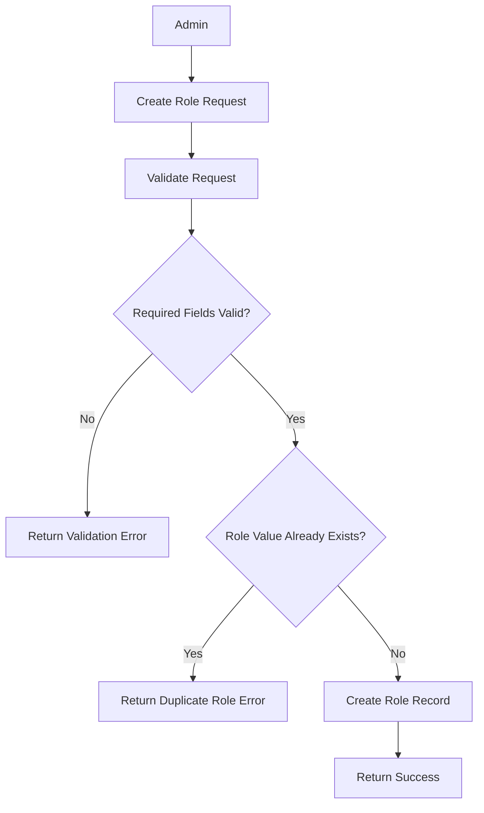
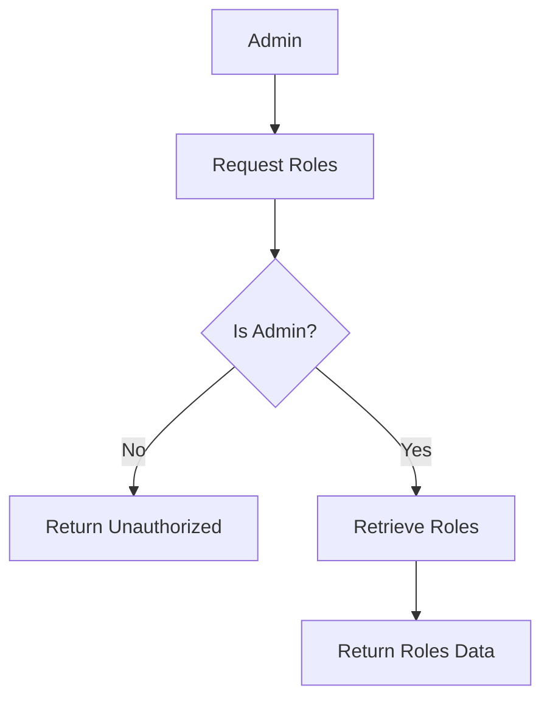
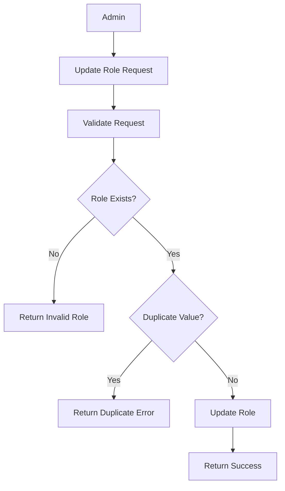
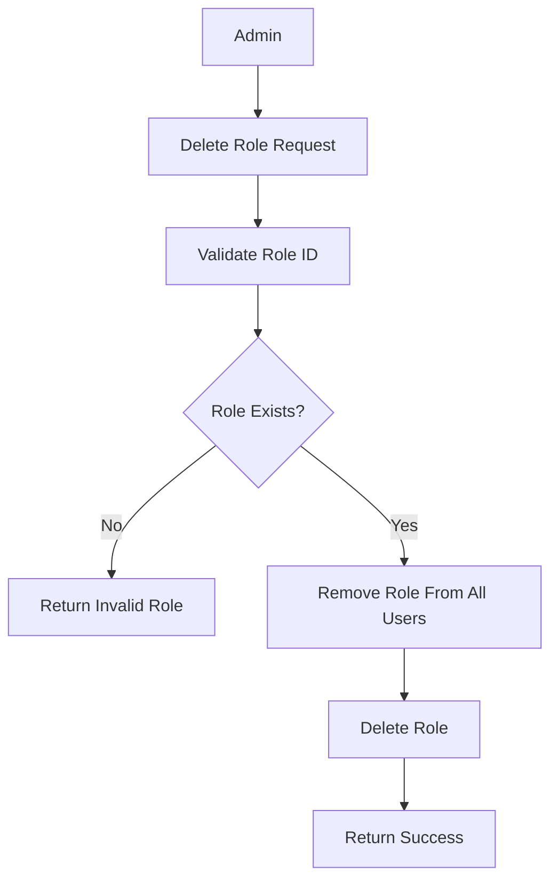

# Introduction

> **Module Type:** Sub Module
> Parent Module: Access Control Sub module  
> **Version:** 1.0  
> **Status:** Draft  
> **Priority:** Critical  
> **Owner:** Backend Team

---

# 1. Module Overview

## Purpose

The Roles module is responsible for managing user roles within the system.

## Scope

### Included

- User Roles

### Excluded

- User Authentication
- User Permissions

---

# 2. Actors

| Admin Users | Maintain Roles |
| ----------- | -------------- |

---

# 3. Business Goals

- Allow admin to maintain user roles
- Allow admin to create, update, delete, and view roles

---

# 4. Functional Requirements

## FR-001 User Roles Create

### Description

Allows a admin to create user's roles

### Inputs

| Field       | Required | Descriptions                                   |
| ----------- | -------- | ---------------------------------------------- |
| Key         | Yes      | this label                                     |
| value       | Yes      | the actual value which will use on the backend |
| description | No       |                                                |

### Process

1. Validate request data.
2. Verify value uniqueness
3. Create role record.

### Success Response

- User role created.

### Failure Cases

- role already exists
- Missing required fields.

---

## FR-002 Get Roles

### Description

Only admin user can get all the roles with details.

### Process

1. Find roles.
2. Return roles data

### Success Response

- Roles data

### Failure Cases

- Unauthorized for non admin user

---

## FR-003 Update roles

### Description

Allows a admin to update roles

### Inputs

| Field       | Required |
| ----------- | -------- |
| Key         | No       |
| value       | No       |
| description | No       |

### Process

1. Validate request data.
2. Verify value uniqueness
3. Update role record.

### Success Response

- User role updated.

### Failure Cases

- Role already exists

---

## FR-004 Delete Roles

### Description

Allows a admin to delete roles

### Inputs

| Field | Required |
| ----- | -------- |
| id    | Yes      |

### Process

1. Validate request data.
2. Remove this roles to every user has this.
3. Remove the field

### Success Response

- Role removed.
- Role remove from all users

### Failure Cases

- Invalid roles

---

# 5. Business Rules

| ID     | Rule                |
| ------ | ------------------- |
| BR-001 | Role must be unique |

---

# 6. Validation Rules

## Roles

| Field       | Validation     |
| ----------- | -------------- |
| Key         | Required       |
| value       | Must be unique |
| Descriptions | Not required   |

---

# 7. Authorization Matrix

Only admin user can access these routes.

---

# 8. Workflow

## Create Role



## Get Roles



## Update Role



## Delete Role



---

# 9. Sequence Diagram

---

# 10. Database Design

## Roles

| Field        | Type      | Constraints |
| ------------ | --------- | ----------- |
| id           | UUID      | Primary     |
| key          | VARCHAR   |
| value        | VARCHAR   | unique      |
| description | VARCHAR   |
| created_at   | TIMESTAMP |
| updated_at   | TIMESTAMP |

---

# 11. API Endpoints

| Method | Endpoint                  | Description   |
| ------ | ------------------------- | ------------- |
| GET    | /access-control/roles     | Get all roles |
| POST   | /access-control/roles     | Create role   |
| PUT    | /access-control/roles/:id | Update role   |
| DELETE | /access-control/roles/:id | Delete role   |

---

# 12. API Examples

## Create Role

```json
POST /access-control/roles
{
  "key": "Administrator",
  "value": "admin",
  "description": "System administrator"
}
```

### Success Response

```json
{
  "message": "Role created."
}
```

## Get Roles

```json
GET /access-control/roles
```

### Success Response

```json
{
  "data": [
    {
      "id": "07c0060e-8e8c-44c1-942c-3004f5a6c5b6",
      "key": "Administrator",
      "value": "admin",
      "description": "System administrator"
    }
  ],
  "message": "Roles retrieved."
}
```

---

## Update Roles

```json
PUT /access-control/roles/07c0060e-8e8c-44c1-942c-3004f5a6c5b6
{
  "key": "Updated Administrator",
  "value": "updated-admin",
  "description": "System administrator updated"
}
```

### Success Response

```json
{
  "message": "Role updated.",
  "data": {
    "id": "07c0060e-8e8c-44c1-942c-3004f5a6c5b6",
    "key": "Updated Administrator",
    "value": "updated-admin",
    "description": "System administrator updated",
    "created_at": "2026-08-05T00:00:00Z",
    "updated_at": "2026-08-05T00:00:00Z"
  }
}
```

### Error Response

```json
{
  "is_error": true,
  "message": "Bad request",
  "errors": {
    "key": ["Role already exists."]
  }
}
```

---

## Delete Roles

```json
DELETE /access-control/role/07c0060e-8e8c-44c1-942c-3004f5a6c5b6
```

### Success Response

```json
{
  "message": "Role deleted."
}
```

### Error Response

```json
{
  "is_error": true,
  "message": "Role not found.",
  "errors": {}
}
```

---

# 13. Error Codes

| Code       | Description            |
| ---------- | ---------------------- |
| ACCESS_001 | Role Already Exists    |
| ACCESS_002 | Role Not Found         |
| ACCESS_003 | Invalid Role ID        |
| ACCESS_004 | Missing Required Field |

---

# 14. Security Requirements

- Role-Based Access Control (RBAC) must be strictly enforced on all protected endpoints.
- Sanitize all user inputs for role creation/updates.

---

# 15. Non-Functional Requirements

| Requirement                | Target |
| -------------------------- | ------ |
| Access Check Response Time | <50 ms |

---

# 16. Acceptance Criteria

- Administrators can successfully create, read, update, and delete roles.

---

# 17. Dependencies

- Database

---

# 18. Assumptions

- System uses centralized database.

---

# 19. Future Enhancements

- Hierarchical roles.

---

# 20. Appendix

## Related Documents

- Database Design

---

**Document Version:** 1.0  
**Last Updated:** 2026-08-04
**Author:** Monirul Islam
