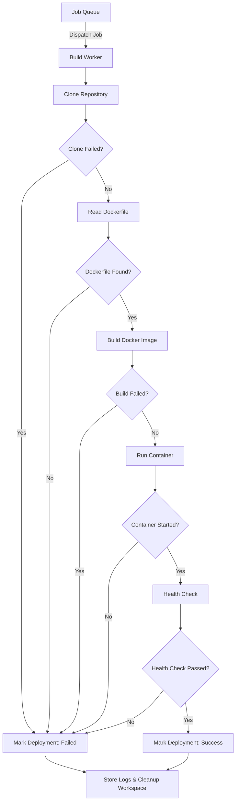
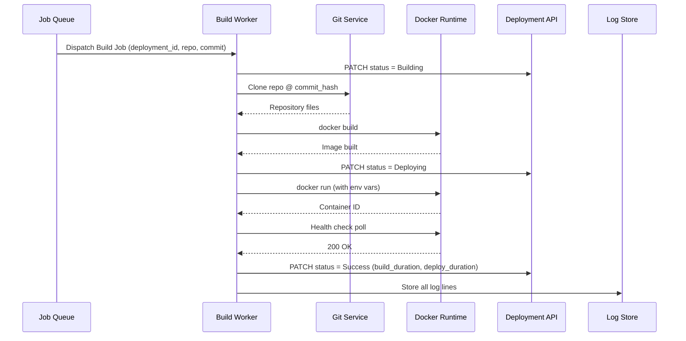

# Introduction

> **Module Type:** Sub-Module (Deployments)
> **Version:** 1.0
> **Status:** Draft
> **Priority:** Critical
> **Owner:** Backend Team

---

# 1. Module Overview

## Purpose

The Build Worker sub-module is responsible for asynchronously executing the build and deployment pipeline for each deployment job. Workers clone the project repository, read the `Dockerfile`, build the Docker image, run the container, perform a health check, store logs, and mark the final deployment status in the [Deployment Module](./deployment-module.md).

## Scope

### Included

- Cloning the project repository at the specified commit
- Reading and validating the project `Dockerfile`
- Building the Docker image
- Running the container
- Performing a health check after container start
- Storing build and deployment logs
- Marking the deployment status (`Success` or `Failed`) via the Deployment API
- Asynchronous, non-blocking worker execution

### Excluded

- Triggering deployments (handled in [Deployment Module](./deployment-module.md))
- Real-time log streaming to clients (handled in [Live Build Logs Sub-Module](./live-build-logs-module.md))
- Deployment history management (handled in [Deployment History Sub-Module](./deployment-history-module.md))
- User-facing API (internal service only)

---

# 2. Actors

| Actor             | Description                                                          |
| ----------------- | -------------------------------------------------------------------- |
| Build Worker      | Internal async service that processes build jobs from the queue      |
| Job Queue         | Message broker that dispatches jobs to available workers             |
| Deployment API    | Internal REST endpoint used by the worker to update deployment state |
| Container Runtime | Docker / OCI runtime on the host for building and running images     |

---

# 3. Business Goals

- Execute builds and deployments asynchronously without blocking the API layer.
- Guarantee reproducible builds via Dockerfile-driven image construction.
- Provide reliable health-check validation before marking a deployment as `Running`.
- Store complete build logs for debugging and audit purposes.
- Ensure clean failure handling with meaningful error messages written to the deployment record.

---

# 4. Functional Requirements

## FR-001 Clone Repository

### Description

The worker clones the project repository at the specific commit hash for the deployment.

### Inputs

| Field       | Required | Descriptions                           |
| ----------- | -------- | -------------------------------------- |
| repo_url    | Yes      | Git repository URL from project config |
| commit_hash | Yes      | Exact commit SHA to checkout           |
| branch      | Yes      | Branch name for context                |

### Process

1. Authenticate with the repository using stored credentials.
2. Clone the repository at `commit_hash` into a temporary workspace directory.
3. Log clone output to deployment log store.

### Success Response

- Repository cloned successfully into workspace.

### Failure Cases

- Repository unreachable or authentication failed → transition deployment to `Failed`.
- Invalid `commit_hash` → transition to `Failed`.

---

## FR-002 Read Dockerfile

### Description

The worker reads and validates the `Dockerfile` from the cloned repository root (or configured path).

### Inputs

| Field           | Required | Descriptions                                             |
| --------------- | -------- | -------------------------------------------------------- |
| workspace_path  | Yes      | Path to the cloned repository on the worker              |
| dockerfile_path | No       | Relative path to Dockerfile (defaults to `./Dockerfile`) |

### Process

1. Locate `Dockerfile` at `dockerfile_path` within the workspace.
2. Validate the file is non-empty and parseable.
3. Log Dockerfile path and initial validation result.

### Success Response

- Dockerfile found and readable.

### Failure Cases

- Dockerfile not found → transition deployment to `Failed` (`WORKER_002`).
- Dockerfile empty or malformed → transition to `Failed`.

---

## FR-003 Build Docker Image

### Description

The worker executes `docker build` to build the image from the Dockerfile.

### Inputs

| Field          | Required | Descriptions                                       |
| -------------- | -------- | -------------------------------------------------- |
| workspace_path | Yes      | Build context directory                            |
| image_tag      | Yes      | Image tag (e.g. `project-{id}:{commit_short_sha}`) |

### Process

1. Update deployment status to `Building`.
2. Execute `docker build -t {image_tag} {workspace_path}`.
3. Stream build output to the log store in real time.
4. Record build start and end timestamps; compute `build_duration`.

### Success Response

- Docker image built successfully.

### Failure Cases

- Docker build fails → stream error logs, transition to `Failed` (`WORKER_003`).

---

## FR-004 Run Container

### Description

The worker starts the built Docker image as a container, injecting project environment variables.

### Inputs

| Field         | Required | Descriptions                                                       |
| ------------- | -------- | ------------------------------------------------------------------ |
| image_tag     | Yes      | Docker image tag to run                                            |
| env_vars      | Yes      | Decrypted project environment variables for the target environment |
| port_mappings | No       | Host-to-container port mappings                                    |

### Process

1. Update deployment status to `Deploying`.
2. Fetch and decrypt project environment variables from the Env Vars module.
3. Execute `docker run` with injected environment variables.
4. Record deploy start and end timestamps; compute `deploy_duration`.

### Success Response

- Container started successfully.

### Failure Cases

- Container fails to start → stream error logs, transition to `Failed` (`WORKER_004`).

---

## FR-005 Health Check

### Description

After the container starts, the worker performs an HTTP health check to confirm the service is live.

### Inputs

| Field             | Required | Descriptions                                        |
| ----------------- | -------- | --------------------------------------------------- |
| health_check_url  | Yes      | URL to poll (e.g. `http://localhost:{port}/health`) |
| timeout_seconds   | No       | Max wait time in seconds (default: 30s)             |
| retry_interval_ms | No       | Polling interval in ms (default: 1000ms)            |

### Process

1. Poll `health_check_url` at `retry_interval_ms` intervals.
2. On HTTP `200` response → proceed to `Success`.
3. On timeout exceeded → transition deployment to `Failed` (`WORKER_005`).

### Success Response

- Health check passed; container is live.

### Failure Cases

- Health check timeout → transition to `Failed`.
- Non-2xx response consistently → transition to `Failed`.

---

## FR-006 Store Logs

### Description

All build and deployment output is captured and stored for later retrieval and real-time streaming.

### Inputs

| Field         | Required | Descriptions                                       |
| ------------- | -------- | -------------------------------------------------- |
| deployment_id | Yes      | UUID of the associated deployment                  |
| log_lines     | Yes      | Structured log entries (timestamp, level, message) |

### Process

1. Push each log line to Grafana Loki (per [ADR-005](../../system/09-adr/ADR-005-use-loki-for-centralized-logging.md)).
2. Emit each log line to the RabbitMQ real-time streaming channel (see [Live Build Logs](./live-build-logs-module.md)).

### Success Response

- Logs stored and streamed.

### Failure Cases

- Log store unavailable → continue build; log to local disk fallback.

---

## FR-007 Mark Deployment Status

### Description

On build/deploy completion (success or failure), the worker calls the Deployment API to finalize the status.

### Inputs

| Field           | Required | Descriptions                      |
| --------------- | -------- | --------------------------------- |
| deployment_id   | Yes      | UUID of the deployment            |
| status          | Yes      | `Success` or `Failed`             |
| build_duration  | No       | Total build time in milliseconds  |
| deploy_duration | No       | Total deploy time in milliseconds |
| error_message   | No       | Error summary if `Failed`         |

### Process

1. Call `PATCH /deployments/:id/status` with final status and durations.
2. Update deployment status to `Running` (if success) or `Failed`.

### Success Response

- Deployment status marked.

### Failure Cases

- Deployment API unreachable → retry with exponential backoff (max 3 retries).

---

# 5. Business Rules

| ID     | Rule                                                                                            |
| ------ | ----------------------------------------------------------------------------------------------- |
| BR-001 | Workers must run asynchronously — no synchronous blocking of the API layer.                     |
| BR-002 | Each build step must update the deployment status and stream a log entry upon start.            |
| BR-003 | Any step failure must immediately transition the deployment to `Failed` and stop further steps. |
| BR-004 | Environment variables must be decrypted only at runtime within the worker's secure context.     |
| BR-005 | Worker temporary workspaces must be cleaned up after each build (success or failure).           |
| BR-006 | Workers must emit log lines with `timestamp`, `level`, and `message` for each output line.      |

---

# 6. Validation Rules

## Build Job

| Field         | Validation                                       |
| ------------- | ------------------------------------------------ |
| deployment_id | Required, valid UUID                             |
| repo_url      | Required, valid Git URL format                   |
| commit_hash   | Required, 40-character hex SHA                   |
| branch        | Required, non-empty string                       |
| environment   | Required: `Development`, `Preview`, `Production` |

---

# 7. Workflow

## Build Worker Pipeline

---

# 8. Sequence Diagram

---

# 9. Database Design

## build*logs *(Deprecated / Offloaded to Grafana Loki)\_

> **Architectural Note (ADR-005):** Raw build and deployment log output is aggregated and stored in **Grafana Loki** (per [ADR-005](../../system/09-adr/ADR-005-use-loki-for-centralized-logging.md)). PostgreSQL retains deployment metadata (`deployments` table). The legacy `build_logs` schema is documented below for historical context:

| Field         | Type      | Constraints                                |
| ------------- | --------- | ------------------------------------------ |
| id            | UUID      | Primary                                    |
| deployment_id | UUID      | Foreign Key → `deployments.id`             |
| timestamp     | TIMESTAMP | Log entry time                             |
| level         | VARCHAR   | `INFO`, `WARN`, `ERROR`, `DEBUG`           |
| message       | TEXT      | Log line content                           |
| step          | VARCHAR   | `clone`, `build`, `deploy`, `health_check` |

---

# 10. API Endpoints

> The Build Worker is an **internal service** and does not expose public API endpoints. It communicates with the Deployment API via internal service calls.

| Method | Endpoint                | Description                              |
| ------ | ----------------------- | ---------------------------------------- |
| PATCH  | /deployments/:id/status | Update deployment status (internal only) |
| POST   | /deployments/:id/logs   | Write log lines (internal only)          |

---

# 11. Error Codes

| Code       | Description                           |
| ---------- | ------------------------------------- |
| WORKER_001 | Repository Clone Failed               |
| WORKER_002 | Dockerfile Not Found                  |
| WORKER_003 | Docker Build Failed                   |
| WORKER_004 | Container Start Failed                |
| WORKER_005 | Health Check Timeout / Failed         |
| WORKER_006 | Environment Variable Decryption Error |
| WORKER_007 | Log Store Unavailable                 |

---

# 12. Security Requirements

- Build workers must run in isolated, sandboxed environments per job.
- Environment variables must be decrypted only within the worker's secure runtime context and never logged in plaintext.
- Worker-to-API communication must use an internal service token (not user JWTs).
- Temporary workspaces must be deleted immediately after each build job completes.
- Docker images must be built with non-root base users where possible.

---

# 13. Non-Functional Requirements

| Requirement           | Target   |
| --------------------- | -------- |
| Worker Pickup Latency | < 5s     |
| Build Execution Time  | < 10 min |
| Health Check Max Wait | 30s      |
| Log Write Latency     | < 100ms  |
| Worker Availability   | 99.9%    |

---

# 14. Acceptance Criteria

- Workers pick up queued deployment jobs within 5 seconds.
- All pipeline steps execute sequentially: Clone → Dockerfile → Build → Run → Health Check → Mark Status.
- Any step failure immediately transitions the deployment to `Failed` and stops further steps.
- Build logs are stored with timestamps, levels, and step labels.
- Environment variables are injected at runtime and never written to logs in plaintext.
- Worker workspaces are cleaned up after every build.

---

# 15. Dependencies

- [Deployment Module](./deployment-module.md)
- [Live Build Logs Sub-Module](./live-build-logs-module.md)
- Environment Variables Module (for decrypting project env vars)
- Job Queue (e.g., Redis / RabbitMQ)
- Docker / OCI Container Runtime
- Git Service
- Log Store (e.g., object storage or time-series DB)

---

# 16. Assumptions

- The job queue is reliable and guarantees at-least-once delivery.
- Each project's repository is accessible by the worker using stored credentials.
- Each project has a valid `Dockerfile` at the repository root or a configured path.
- The container runtime (Docker) is installed and available on the worker host.

---

# 17. Future Enhancements

- Multi-stage build caching to reduce build times.
- Build artifact reuse across branches with matching `package.json` / `Cargo.lock`.
- Worker auto-scaling based on queue depth.
- Support for custom build commands (e.g. Makefile, `nixpacks`).
- Isolated build networks per job for security hardening.

---

# 18. Appendix

## Related Documents

- [Deployment Module](./deployment-module.md)
- [Live Build Logs Sub-Module](./live-build-logs-module.md)
- [Deployment History Sub-Module](./deployment-history-module.md)
- System Architecture
- Security Policy

---

**Document Version:** 1.0
**Last Updated:** 2026-08-12
**Author:** Monirul Islam
