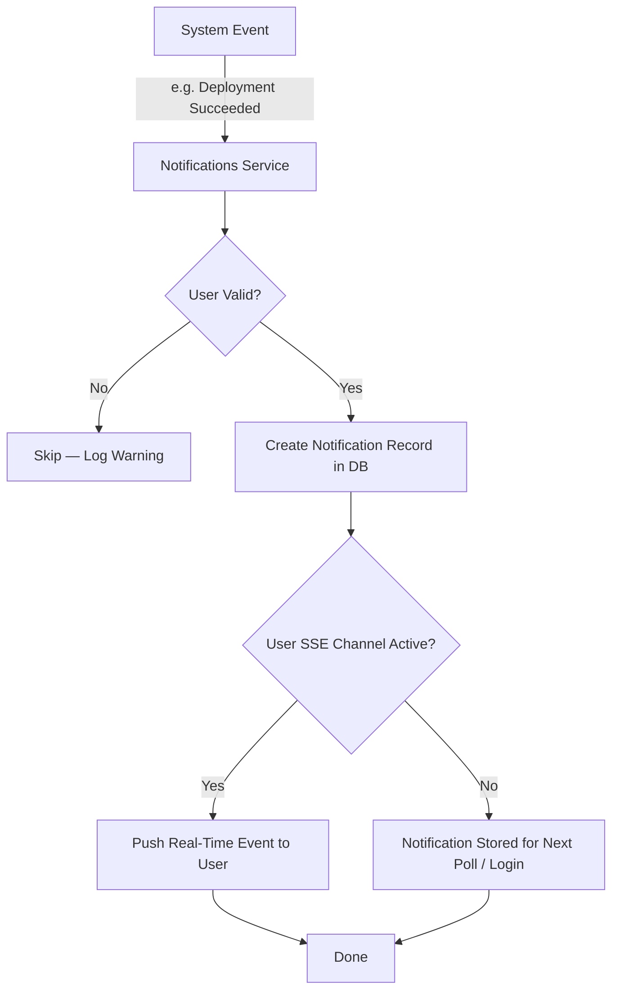
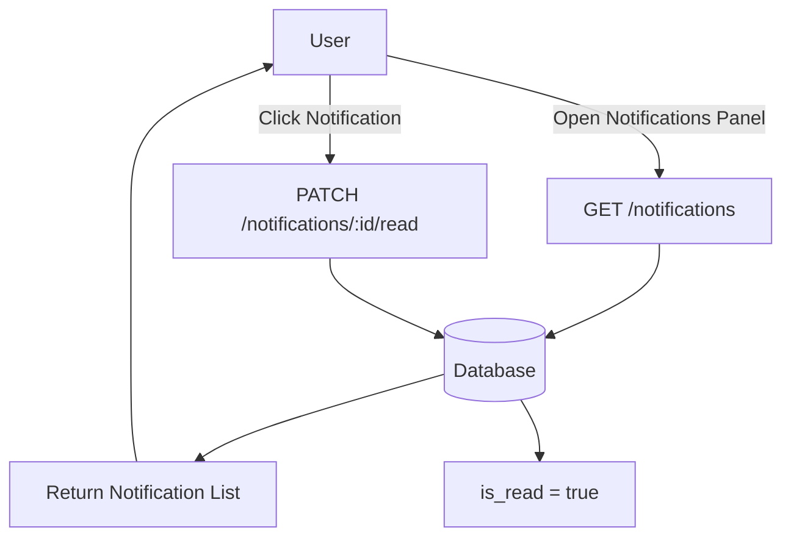
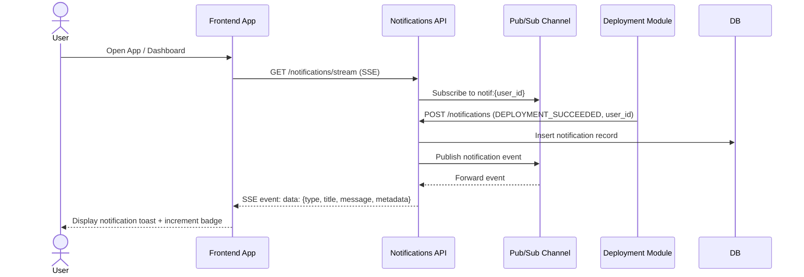

# Introduction

> **Module Type:** Core Module
> **Version:** 1.0
> **Status:** Draft
> **Priority:** High
> **Owner:** Backend Team

---

# 1. Module Overview

## Purpose

The Notifications module is responsible for delivering real-time and asynchronous alerts to users based on system events. It manages in-app notification creation, delivery, read/unread state, and dismissal. Email notifications are planned for a future release.

## Scope

### Included

- In-app notification creation triggered by system events
- Notification types: Deployment Started, Deployment Succeeded, Deployment Failed, Member Invited, Password Changed
- Marking notifications as read / unread
- Dismissing (soft-deleting) notifications
- Listing and paginating user notifications
- Real-time delivery via Server-Sent Events (SSE) or WebSocket push
- Unread notification count badge

### Excluded

- Email notifications (planned — see Future Enhancements)
- Push notifications (mobile — future)
- Notification preferences / mute settings (future)
- SMS notifications (out of scope)

---

# 2. Actors

| Actor  | Description                                              |
| ------ | -------------------------------------------------------- |
| User   | Authenticated user who receives and manages notifications|
| System | Internal platform service that emits notification events |
| Admin  | System administrator with visibility over all notifications |

---

# 3. Business Goals

- Keep users immediately informed of critical system events without manual polling.
- Deliver real-time in-app notifications to improve developer experience.
- Provide a clear unread count so users never miss important alerts.
- Lay the groundwork for multi-channel notification delivery (email, push) in future releases.

---

# 4. Notification Event Types

| Event Type             | Trigger                                               | Target User(s)                         |
| ---------------------- | ----------------------------------------------------- | -------------------------------------- |
| `DEPLOYMENT_STARTED`   | A deployment transitions to `Building`                | User who triggered the deployment      |
| `DEPLOYMENT_SUCCEEDED` | A deployment transitions to `Success`                 | User who triggered the deployment      |
| `DEPLOYMENT_FAILED`    | A deployment transitions to `Failed`                  | User who triggered the deployment      |
| `MEMBER_INVITED`       | A new member is added to a team or organization       | The invited user                       |
| `PASSWORD_CHANGED`     | A user's password is successfully changed             | The user whose password was changed    |

---

# 5. Functional Requirements

## FR-001 Create Notification (Internal)

### Description

An internal system action that creates a notification record for a specific user when a tracked event occurs. This is not a public endpoint — it is called by other modules (Deployment, Users, Teams) via internal service calls.

### Inputs

| Field       | Required | Descriptions                                                          |
| ----------- | -------- | --------------------------------------------------------------------- |
| user_id     | Yes      | UUID of the target user to notify                                     |
| type        | Yes      | Notification type (see Event Types table above)                       |
| title       | Yes      | Short notification title (e.g. "Deployment Succeeded")                |
| message     | Yes      | Full notification message body                                        |
| metadata    | No       | JSON payload with contextual data (e.g. `deployment_id`, `project_id`)|

### Process

1. Validate `user_id` exists.
2. Validate `type` is a recognized notification type.
3. Create a `notifications` record with `is_read = false`, `is_dismissed = false`.
4. Emit a real-time push event to the user's live notification channel (SSE/WebSocket).

### Success Response

- Notification created and pushed to user.

### Failure Cases

- User not found.
- Invalid notification type.
- Real-time push failure → notification is still persisted in DB for polling fallback.

---

## FR-002 List Notifications

### Description

Returns a paginated list of notifications for the authenticated user, ordered by creation time descending.

### Inputs

| Field       | Required | Descriptions                                                |
| ----------- | -------- | ----------------------------------------------------------- |
| is_read     | No       | Filter by read status (`true` / `false`)                    |
| is_dismissed| No       | Filter by dismissed status (default: `false`)               |
| type        | No       | Filter by notification type                                 |
| page        | No       | Page number (default: 1)                                    |
| limit       | No       | Records per page (default: 20, max: 100)                    |

### Process

1. Query `notifications` for the authenticated user's `user_id`.
2. Apply optional filters (`is_read`, `is_dismissed`, `type`).
3. Return paginated results ordered by `created_at` DESC.

### Success Response

- Notification list returned.

### Failure Cases

- Unauthorized request.

---

## FR-003 Get Unread Count

### Description

Returns the total count of unread, non-dismissed notifications for the authenticated user. Used for the notification badge in the UI.

### Inputs

_No body inputs — uses authenticated user context._

### Process

1. Count `notifications` where `user_id = current_user`, `is_read = false`, `is_dismissed = false`.
2. Return count.

### Success Response

- Unread count returned.

### Failure Cases

- Unauthorized request.

---

## FR-004 Mark Notification as Read

### Description

Marks a single notification as read for the authenticated user.

### Inputs

| Field           | Required | Descriptions                          |
| --------------- | -------- | ------------------------------------- |
| notification_id | Yes      | UUID of the notification to mark read |

### Process

1. Validate `notification_id` exists and belongs to the authenticated user.
2. Set `is_read = true` and `read_at = NOW()`.

### Success Response

- Notification marked as read.

### Failure Cases

- Notification not found (`NOTIF_001`).
- Unauthorized access (`NOTIF_002`).

---

## FR-005 Mark All Notifications as Read

### Description

Marks all unread notifications for the authenticated user as read in a single batch operation.

### Inputs

_No body inputs — uses authenticated user context._

### Process

1. Update all `notifications` where `user_id = current_user` and `is_read = false`.
2. Set `is_read = true` and `read_at = NOW()` for all matched records.

### Success Response

- All notifications marked as read.

### Failure Cases

- Unauthorized request.

---

## FR-006 Dismiss Notification

### Description

Soft-deletes a single notification by marking it as dismissed. Dismissed notifications are hidden from the default list view.

### Inputs

| Field           | Required | Descriptions                              |
| --------------- | -------- | ----------------------------------------- |
| notification_id | Yes      | UUID of the notification to dismiss       |

### Process

1. Validate `notification_id` exists and belongs to the authenticated user.
2. Set `is_dismissed = true` and `dismissed_at = NOW()`.

### Success Response

- Notification dismissed.

### Failure Cases

- Notification not found (`NOTIF_001`).
- Unauthorized access (`NOTIF_002`).

---

## FR-007 Real-Time Notification Stream

### Description

Opens a persistent SSE (Server-Sent Events) connection for the authenticated user to receive new notifications in real time without polling.

### Inputs

_No body inputs — uses authenticated user context and SSE connection._

### Process

1. Open an SSE connection authenticated via user session/JWT.
2. Subscribe to the user's notification channel (e.g. `notif:{user_id}`).
3. Push each new notification event as it is created.
4. Connection is kept alive; client reconnects with `Last-Event-ID` on disconnect.

### Success Response

- SSE stream opened; notifications pushed in real time.

### Failure Cases

- Unauthorized → close SSE connection immediately.
- Channel unavailable → client falls back to polling `GET /notifications`.

---

# 6. Business Rules

| ID     | Rule                                                                                                          |
| ------ | ------------------------------------------------------------------------------------------------------------- |
| BR-001 | Notifications are strictly per-user — a user can only view, read, or dismiss their own notifications.        |
| BR-002 | Dismissed notifications are soft-deleted and excluded from default list results.                              |
| BR-003 | Real-time push failures must not block the notification creation; persistence in DB is the guaranteed fallback.|
| BR-004 | `PASSWORD_CHANGED` and `MEMBER_INVITED` notifications must be created even if the user is currently offline. |
| BR-005 | The unread count must reflect only non-dismissed, unread notifications.                                       |
| BR-006 | Notification records are append-only — no modification of `type`, `title`, `message`, or `metadata` after creation. |

---

# 7. Validation Rules

## Notification

| Field       | Validation                                                              |
| ----------- | ----------------------------------------------------------------------- |
| user_id     | Required, valid UUID                                                    |
| type        | Required; must be one of the defined event types                        |
| title       | Required, non-empty string, max 255 characters                          |
| message     | Required, non-empty string, max 1000 characters                         |
| metadata    | Optional JSON object                                                    |

---

# 8. Authorization Matrix

| Route                                    | Action                   | Guest | User | Admin |
| ---------------------------------------- | ------------------------ | :---: | :--: | :---: |
| POST /notifications (internal)           | Create Notification      | ❌    | ❌   | ✅    |
| GET /notifications                       | List Notifications       | ❌    | ✅   | ✅    |
| GET /notifications/unread-count          | Get Unread Count         | ❌    | ✅   | ✅    |
| PATCH /notifications/:id/read            | Mark as Read             | ❌    | ✅   | ✅    |
| PATCH /notifications/read-all            | Mark All as Read         | ❌    | ✅   | ✅    |
| DELETE /notifications/:id                | Dismiss Notification     | ❌    | ✅   | ✅    |
| GET /notifications/stream                | Real-Time SSE Stream     | ❌    | ✅   | ✅    |

---

# 9. Workflow

## Notification Creation Flow (System Event → User)



## User Reads Notifications



---

# 10. Sequence Diagram

## Real-Time Notification via SSE



---

# 11. Database Design

## notifications

| Field        | Type      | Constraints                                              |
| ------------ | --------- | -------------------------------------------------------- |
| id           | UUID      | Primary                                                  |
| user_id      | UUID      | Foreign Key → `users.id`                                 |
| type         | VARCHAR   | `DEPLOYMENT_STARTED`, `DEPLOYMENT_SUCCEEDED`, `DEPLOYMENT_FAILED`, `MEMBER_INVITED`, `PASSWORD_CHANGED` |
| title        | VARCHAR   | Max 255 characters                                       |
| message      | TEXT      | Notification body                                        |
| metadata     | JSONB     | Contextual data (e.g. `deployment_id`, `project_id`)     |
| is_read      | BOOLEAN   | Default `false`                                          |
| read_at      | TIMESTAMP | Nullable; set when `is_read` transitions to `true`       |
| is_dismissed | BOOLEAN   | Default `false`                                          |
| dismissed_at | TIMESTAMP | Nullable; set when dismissed                             |
| created_at   | TIMESTAMP |                                                          |

### Indexes

| Index                              | Purpose                                    |
| ---------------------------------- | ------------------------------------------ |
| `idx_notifications_user_id`        | Fast lookup by user                        |
| `idx_notifications_user_is_read`   | Fast unread count query per user           |
| `idx_notifications_created_at`     | Ordered pagination                         |
| `idx_notifications_type`           | Filter by notification type                |

---

# 12. API Endpoints

| Method | Endpoint                         | Description                              |
| ------ | -------------------------------- | ---------------------------------------- |
| POST   | /notifications                   | Create notification (Internal only)      |
| GET    | /notifications                   | List user notifications                  |
| GET    | /notifications/unread-count      | Get unread notification count            |
| PATCH  | /notifications/:id/read          | Mark single notification as read         |
| PATCH  | /notifications/read-all          | Mark all notifications as read           |
| DELETE | /notifications/:id               | Dismiss (soft-delete) a notification     |
| GET    | /notifications/stream            | Open real-time SSE stream                |

---

# 13. API Examples

## List Notifications

```http
GET /notifications?is_read=false&limit=10
```

### Success Response

```json
{
  "data": [
    {
      "id": "notif-abc123-8e8c-44c1-942c-3004f5a6c5b6",
      "type": "DEPLOYMENT_SUCCEEDED",
      "title": "Deployment Succeeded",
      "message": "Your deployment on project 'Forge Backend' (branch: main) completed successfully.",
      "metadata": {
        "project_id": "07c0060e-8e8c-44c1-942c-3004f5a6c5b6",
        "deployment_id": "deploy-abc123-8e8c-44c1-942c-3004f5a6c5b6",
        "branch": "main",
        "commit_short": "a1b2c3d"
      },
      "is_read": false,
      "read_at": null,
      "is_dismissed": false,
      "created_at": "2026-08-12T17:01:30Z"
    },
    {
      "id": "notif-def456-8e8c-44c1-942c-3004f5a6c5b6",
      "type": "MEMBER_INVITED",
      "title": "You've been invited to a team",
      "message": "John Doe invited you to join the 'Backend Engineering' team.",
      "metadata": {
        "team_id": "team-07c0060e-8e8c-44c1-942c-3004f5a6c5b6",
        "invited_by": "John Doe"
      },
      "is_read": false,
      "read_at": null,
      "is_dismissed": false,
      "created_at": "2026-08-12T16:45:00Z"
    }
  ],
  "pagination": {
    "page": 1,
    "limit": 10,
    "total": 5
  }
}
```

---

## Get Unread Count

```http
GET /notifications/unread-count
```

### Success Response

```json
{
  "unread_count": 5
}
```

---

## Mark as Read

```http
PATCH /notifications/notif-abc123-8e8c-44c1-942c-3004f5a6c5b6/read
```

### Success Response

```json
{
  "message": "Notification marked as read.",
  "data": {
    "id": "notif-abc123-8e8c-44c1-942c-3004f5a6c5b6",
    "is_read": true,
    "read_at": "2026-08-12T18:00:00Z"
  }
}
```

---

## Mark All as Read

```http
PATCH /notifications/read-all
```

### Success Response

```json
{
  "message": "All notifications marked as read.",
  "updated_count": 5
}
```

---

## Dismiss Notification

```http
DELETE /notifications/notif-abc123-8e8c-44c1-942c-3004f5a6c5b6
```

### Success Response

```json
{
  "message": "Notification dismissed."
}
```

---

## Real-Time SSE Stream

```http
GET /notifications/stream
Accept: text/event-stream
```

### SSE Stream Events

```
data: {"id":"notif-abc123","type":"DEPLOYMENT_SUCCEEDED","title":"Deployment Succeeded","message":"Your deployment on 'Forge Backend' succeeded.","metadata":{"deployment_id":"deploy-abc123","project_id":"07c0060e"},"created_at":"2026-08-12T17:01:30Z"}

data: {"id":"notif-def456","type":"DEPLOYMENT_FAILED","title":"Deployment Failed","message":"Your deployment on 'Forge Backend' failed. Check build logs for details.","metadata":{"deployment_id":"deploy-xyz999","project_id":"07c0060e"},"created_at":"2026-08-12T17:05:00Z"}
```

---

## Notification Creation (Internal)

```http
POST /notifications
X-Internal-Service-Token: <service_token>

{
  "user_id": "user-456e7890-e89b-12d3-a456-426614174000",
  "type": "DEPLOYMENT_FAILED",
  "title": "Deployment Failed",
  "message": "Your deployment on project 'Forge Backend' (branch: main, commit: a1b2c3d) failed.",
  "metadata": {
    "project_id": "07c0060e-8e8c-44c1-942c-3004f5a6c5b6",
    "deployment_id": "deploy-xyz999-8e8c-44c1-942c-3004f5a6c5b6",
    "branch": "main",
    "commit_short": "a1b2c3d"
  }
}
```

### Success Response

```json
{
  "message": "Notification created.",
  "data": {
    "id": "notif-xyz999-8e8c-44c1-942c-3004f5a6c5b6",
    "user_id": "user-456e7890-e89b-12d3-a456-426614174000",
    "type": "DEPLOYMENT_FAILED",
    "title": "Deployment Failed",
    "is_read": false,
    "created_at": "2026-08-12T17:05:00Z"
  }
}
```

---

# 14. Error Codes

| Code      | Description                                   |
| --------- | --------------------------------------------- |
| NOTIF_001 | Notification Not Found                        |
| NOTIF_002 | Unauthorized — Notification Belongs to Another User |
| NOTIF_003 | Invalid Notification Type                     |
| NOTIF_004 | Missing Required Fields                       |
| NOTIF_005 | SSE Stream Connection Failed                  |

---

# 15. Security Requirements

- Users can only read, mark, or dismiss their **own** notifications.
- The internal `POST /notifications` endpoint must be protected by an internal service token — not a user JWT.
- SSE connections must be authenticated via user JWT or session; unauthenticated connections must be rejected immediately.
- Notification `metadata` must not contain plaintext secrets or sensitive credentials.
- All notification delivery actions must be logged for audit trail purposes.

---

# 16. Non-Functional Requirements

| Requirement                       | Target      |
| --------------------------------- | ----------- |
| Notification Creation Latency     | < 100ms     |
| SSE Event Delivery Latency        | < 500ms     |
| List Notifications Response Time  | < 100ms     |
| Unread Count Response Time        | < 50ms      |
| Max Concurrent SSE Connections    | 50,000      |
| Notification Retention Period     | 90 days     |
| Availability                      | 99.9%       |

---

# 17. Acceptance Criteria

- Users receive an in-app notification when a deployment starts, succeeds, or fails.
- Users receive an in-app notification when they are invited to a team or organization.
- Users receive an in-app notification when their password is changed.
- Notifications appear in real time via SSE without page refresh.
- Users can mark individual notifications or all notifications as read.
- Users can dismiss (soft-delete) individual notifications.
- Unread badge count correctly reflects non-dismissed, unread notifications.
- Internal notification creation endpoint is not accessible to end users.

---

# 18. Dependencies

- Users Module (user validation and targeting)
- Deployment Module (emits `DEPLOYMENT_STARTED`, `DEPLOYMENT_SUCCEEDED`, `DEPLOYMENT_FAILED`)
- Teams Module (emits `MEMBER_INVITED`)
- Auth Module (emits `PASSWORD_CHANGED`)
- Pub/Sub system (e.g. Redis Pub/Sub) for real-time SSE delivery
- Database

---

# 19. Assumptions

- Each user has at most one active SSE notification stream connection per session.
- The Pub/Sub system is reliable with at-most-once delivery; DB persistence guarantees no permanent loss.
- Notification records older than 90 days are purged automatically by a scheduled cleanup job.
- Email notification channel is not required in the current release.

---

# 20. Future Enhancements

- **Email Notifications:** Send notification emails via SMTP / transactional email service (SendGrid, Resend, SES).
- **Notification Preferences:** Allow users to opt in/out of specific notification types per channel.
- **Push Notifications:** Mobile push via FCM / APNs.
- **Digest Emails:** Daily or weekly summary of deployment activity.
- **Notification Templates:** Admin-configurable notification message templates.
- **Webhook Delivery:** Allow users to define external webhook URLs for notification events.

---

# 21. Appendix

## Notification Type Reference

| Type                   | Title (default)          | Triggered By          |
| ---------------------- | ------------------------ | --------------------- |
| `DEPLOYMENT_STARTED`   | "Deployment Started"     | Deployment Module     |
| `DEPLOYMENT_SUCCEEDED` | "Deployment Succeeded"   | Deployment Module     |
| `DEPLOYMENT_FAILED`    | "Deployment Failed"      | Deployment Module     |
| `MEMBER_INVITED`       | "You've Been Invited"    | Teams Module          |
| `PASSWORD_CHANGED`     | "Password Changed"       | Auth Module           |

## Related Documents

- Deployment Module
- Users Module
- Teams Module
- Auth Module
- System Architecture
- API Documentation
- Security Policy

---

**Document Version:** 1.0
**Last Updated:** 2026-08-12
**Author:** Monirul Islam
