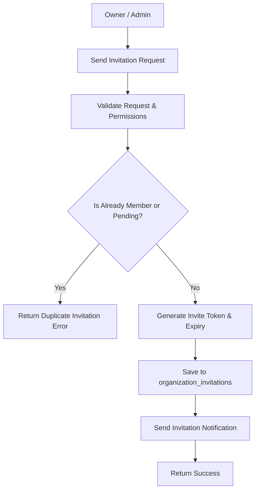
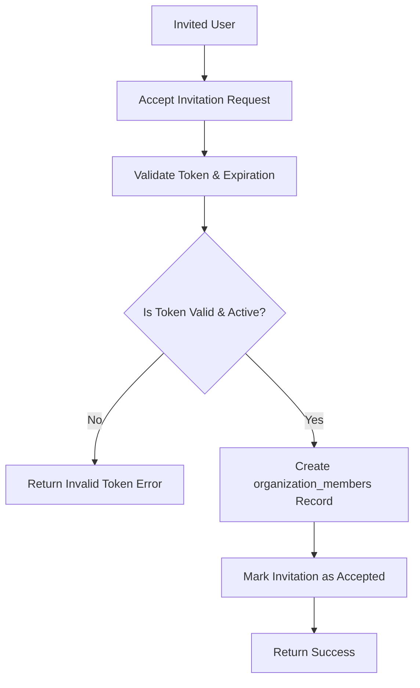

# Introduction

> **Module Type:** Sub-Module
> **Version:** 1.0  
> **Status:** Draft  
> **Priority:** Critical  
> **Owner:** Backend Team

---

# 1. Module Overview

## Purpose

The Organization Members sub-module manages member onboarding (invitations), role/permission assignments, member role updates, and member removals within an organization.

## Scope

### Included

- Inviting new users to an organization with designated roles/permissions
- Accepting or declining organization invitations
- Directly adding members to an organization
- Updating member roles and permissions within an organization
- Removing members from an organization
- Listing organization members and pending invitations

### Excluded

- Managing user registration or credentials (handled in Users/Auth module)
- Managing global roles definition (handled in Access Control / Roles module)
- Organization lifecycle management (handled in Organization module)

---

# 2. Actors

| Actor              | Action                                                                          |
| ------------------ | ------------------------------------------------------------------------------- |
| Organization Owner | Invite, update roles/permissions, remove members, manage invitations            |
| Organization Admin | Invite users, update member roles (except Owner), view member list              |
| Invited User       | Accept or decline invitations to join an organization                           |
| System Admin       | Full control over organization members and invitations across all organizations |

---

# 3. Business Goals

- Enable organization owners and admins to invite users via email or direct user ID assignment with specific roles.
- Allow users to join organizations upon accepting invitations.
- Provide capability to modify member roles/permissions or remove members from an organization.

---

# 4. Functional Requirements

## FR-001 Invite Member to Organization

### Description

Allows an Organization Owner or Admin to send an invitation to a user (via email) with a specific role.

### Inputs

| Field           | Required | Descriptions                                          |
| --------------- | -------- | ----------------------------------------------------- |
| organization_id | Yes      | UUID of the organization                              |
| email           | Yes      | Email address of the user to invite                   |
| role            | Yes      | Role to assign (e.g., `admin`, `developer`, `viewer`) |

### Process

1. Validate request payload and email format.
2. Verify requester has permission (`Owner` or `Admin`).
3. Check if user is already an active member of the organization.
4. Generate a unique invitation token with expiration.
5. Create record in `organization_invitations`.

### Success Response

- Invitation sent successfully.

### Failure Cases

- User is already a member.
- Pending invitation already exists for email.
- Unauthorized requester.

---

## FR-002 Accept Invitation

### Description

Allows an invited user to accept an invitation using an invitation token.

### Inputs

| Field | Required | Descriptions              |
| ----- | -------- | ------------------------- |
| token | Yes      | Invitation token received |

### Process

1. Validate invitation token.
2. Verify token is active and not expired.
3. Match authenticated user's email with invitation email.
4. Create record in `organization_members` with assigned role.
5. Mark invitation status as `accepted`.

### Success Response

- Invitation accepted and member added to organization.

### Failure Cases

- Invalid or expired token.
- Email mismatch with authenticated user.

---

## FR-003 Update Member Role / Permissions

### Description

Allows an Organization Owner or Admin to update a member's role or permissions within the organization.

### Inputs

| Field           | Required | Descriptions                                    |
| --------------- | -------- | ----------------------------------------------- |
| organization_id | Yes      | UUID of the organization                        |
| user_id         | Yes      | UUID of the target member                       |
| role            | Yes      | New role (e.g., `admin`, `developer`, `viewer`) |

### Process

1. Validate request data.
2. Verify requester authorization (Owner or Admin).
3. Ensure requester cannot downgrade/demote the Organization Owner.
4. Update `role` in `organization_members`.

### Success Response

- Member role updated.

### Failure Cases

- Member not found.
- Unauthorized operation (e.g., attempting to change Owner role).

---

## FR-004 Remove Member from Organization

### Description

Allows an Organization Owner or Admin to remove a member from the organization.

### Inputs

| Field           | Required | Descriptions                 |
| --------------- | -------- | ---------------------------- |
| organization_id | Yes      | UUID of the organization     |
| user_id         | Yes      | UUID of the member to remove |

### Process

1. Validate request data.
2. Verify requester authorization.
3. Ensure Organization Owner cannot be removed unless ownership is transferred.
4. Delete record from `organization_members`.

### Success Response

- Member removed from organization.

### Failure Cases

- Target member is the Organization Owner.
- Member not found.
- Unauthorized requester.

---

## FR-005 List Organization Members & Invitations

### Description

Lists all members and pending invitations for an organization.

### Inputs

| Field           | Required | Descriptions             |
| --------------- | -------- | ------------------------ |
| organization_id | Yes      | UUID of the organization |

### Process

1. Verify requester is a member or System Admin.
2. Retrieve records from `organization_members` and pending `organization_invitations`.
3. Return list of members and invitations.

### Success Response

- Organization members and pending invitations retrieved.

### Failure Cases

- Unauthorized requester.

---

# 5. Business Rules

| ID     | Rule                                                                           |
| ------ | ------------------------------------------------------------------------------ |
| BR-001 | Only Organization Owner or Admin can invite users or change member roles.      |
| BR-002 | Organization Owner role cannot be changed or removed via member deletion APIs. |
| BR-003 | An invited user cannot accept an invitation with an expired token.             |
| BR-004 | Duplicate member records (`organization_id`, `user_id`) are prohibited.        |

---

# 6. Validation Rules

## Organization Invitations

| Field           | Validation                                  |
| --------------- | ------------------------------------------- |
| organization_id | Required                                    |
| email           | Required, valid email format                |
| role            | Required, must be a valid organization role |

## Organization Members

| Field           | Validation |
| --------------- | ---------- |
| organization_id | Required   |
| user_id         | Required   |
| role            | Required   |

---

# 7. Authorization Matrix

| Route                                         | Action            | Owner              | Admin | Developer | System Admin |
| --------------------------------------------- | ----------------- | ------------------ | ----- | --------- | ------------ |
| POST /organizations/:id/invitations           | Invite Member     | Yes                | Yes   | No        | Yes          |
| GET /organizations/:id/invitations            | List Invitations  | Yes                | Yes   | No        | Yes          |
| POST /organizations/invitations/:token/accept | Accept Invitation | N/A (Invited User) | N/A   | N/A       | Yes          |
| GET /organizations/:id/members                | List Members      | Yes                | Yes   | Yes       | Yes          |
| PUT /organizations/:id/members/:user_id       | Update Role       | Yes                | Yes\* | No        | Yes          |
| DELETE /organizations/:id/members/:user_id    | Remove Member     | Yes                | Yes\* | No        | Yes          |

_\* Admin cannot update or remove Organization Owner._

---

# 8. Workflow

## Invite Member Workflow



## Accept Invitation Workflow



---

# 9. Sequence Diagram

---

# 10. Database Design

## Organization Members

| Field           | Type      | Constraints           |
| --------------- | --------- | --------------------- |
| id              | UUID      | Primary               |
| organization_id | UUID      | Foreign Key           |
| user_id         | UUID      | Foreign Key           |
| role            | VARCHAR   | e.g. admin, developer |
| status          | VARCHAR   | active, suspended     |
| created_at      | TIMESTAMP |                       |
| updated_at      | TIMESTAMP |                       |

## Organization Invitations

| Field           | Type      | Constraints       |
| --------------- | --------- | ----------------- |
| id              | UUID      | Primary           |
| organization_id | UUID      | Foreign Key       |
| email           | VARCHAR   |                   |
| role            | VARCHAR   |                   |
| token           | VARCHAR   | Unique            |
| status          | VARCHAR   | pending, accepted |
| expires_at      | TIMESTAMP |                   |
| created_at      | TIMESTAMP |                   |
| updated_at      | TIMESTAMP |                   |

---

# 11. API Endpoints

| Method | Endpoint                                 | Description                     |
| ------ | ---------------------------------------- | ------------------------------- |
| POST   | /organizations/:id/invitations           | Invite user to organization     |
| GET    | /organizations/:id/invitations           | List pending invitations        |
| POST   | /organizations/invitations/:token/accept | Accept invitation to join       |
| GET    | /organizations/:id/members               | Get all members of organization |
| PUT    | /organizations/:id/members/:user_id      | Update member role/permissions  |
| DELETE | /organizations/:id/members/:user_id      | Remove member from organization |

---

# 12. API Examples

## Invite Member

```json
POST /organizations/07c0060e-8e8c-44c1-942c-3004f5a6c5b6/invitations
{
  "email": "jane.doe@example.com",
  "role": "admin"
}
```

### Success Response

```json
{
  "message": "Invitation sent successfully.",
  "data": {
    "id": "inv-12345678-8e8c-44c1-942c-3004f5a6c5b6",
    "organization_id": "07c0060e-8e8c-44c1-942c-3004f5a6c5b6",
    "email": "jane.doe@example.com",
    "role": "admin",
    "status": "pending",
    "expires_at": "2026-08-14T00:00:00Z",
    "created_at": "2026-08-07T00:00:00Z"
  }
}
```

## Accept Invitation

```json
POST /organizations/invitations/tok_abc123xyz789/accept
```

### Success Response

```json
{
  "message": "Invitation accepted.",
  "data": {
    "id": "mem-98765432-8e8c-44c1-942c-3004f5a6c5b6",
    "organization_id": "07c0060e-8e8c-44c1-942c-3004f5a6c5b6",
    "user_id": "123e4567-e89b-12d3-a456-426614174000",
    "role": "admin",
    "status": "active",
    "created_at": "2026-08-07T00:00:00Z"
  }
}
```

## Get Organization Members

```json
GET /organizations/07c0060e-8e8c-44c1-942c-3004f5a6c5b6/members
```

### Success Response

```json
{
  "data": [
    {
      "id": "mem-98765432-8e8c-44c1-942c-3004f5a6c5b6",
      "organization_id": "07c0060e-8e8c-44c1-942c-3004f5a6c5b6",
      "user_id": "123e4567-e89b-12d3-a456-426614174000",
      "role": "admin",
      "status": "active",
      "created_at": "2026-08-07T00:00:00Z"
    }
  ],
  "message": "Organization members retrieved."
}
```

## Update Member Role

```json
PUT /organizations/07c0060e-8e8c-44c1-942c-3004f5a6c5b6/members/123e4567-e89b-12d3-a456-426614174000
{
  "role": "developer"
}
```

### Success Response

```json
{
  "message": "Member role updated successfully.",
  "data": {
    "id": "mem-98765432-8e8c-44c1-942c-3004f5a6c5b6",
    "organization_id": "07c0060e-8e8c-44c1-942c-3004f5a6c5b6",
    "user_id": "123e4567-e89b-12d3-a456-426614174000",
    "role": "developer",
    "status": "active",
    "updated_at": "2026-08-07T00:00:00Z"
  }
}
```

## Remove Member

```json
DELETE /organizations/07c0060e-8e8c-44c1-942c-3004f5a6c5b6/members/123e4567-e89b-12d3-a456-426614174000
```

### Success Response

```json
{
  "message": "Member removed from organization."
}
```

---

# 13. Error Codes

| Code    | Description                         |
| ------- | ----------------------------------- |
| ORG_004 | Member Already Exists               |
| ORG_005 | Invalid or Expired Invitation Token |
| ORG_006 | Cannot Modify Organization Owner    |
| ORG_007 | Member Not Found                    |

---

# 14. Security Requirements

- Role-Based Access Control (RBAC) must be strictly enforced.
- Invitation tokens must be cryptographically secure and set to expire after a specified duration (e.g. 7 days).

---

# 15. Non-Functional Requirements

| Requirement       | Target |
| ----------------- | ------ |
| API Response Time | <50 ms |

---

# 16. Acceptance Criteria

- Organization Owners and Admins can invite new users with specific roles.
- Invited users can accept invitations via token to join the organization.
- Owners/Admins can view member lists, update member roles, and remove members.
- Organization Owner cannot be removed or demoted.

---

# 17. Dependencies

- Organization Module
- Users Module

---

# 18. Assumptions

- System uses centralized database.
- Email delivery system is configured for sending invitation tokens.

---

# 19. Future Enhancements

- Custom permission sets per organization role.
- Expiration reminder notifications for pending invitations.

---

# 20. Appendix

## Related Documents

- Organization Module Design
