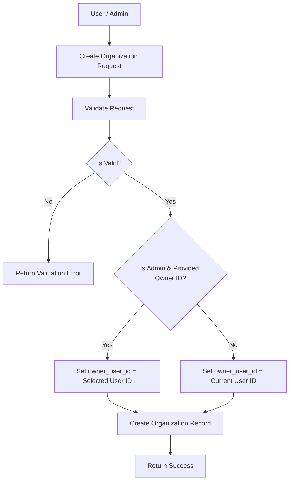
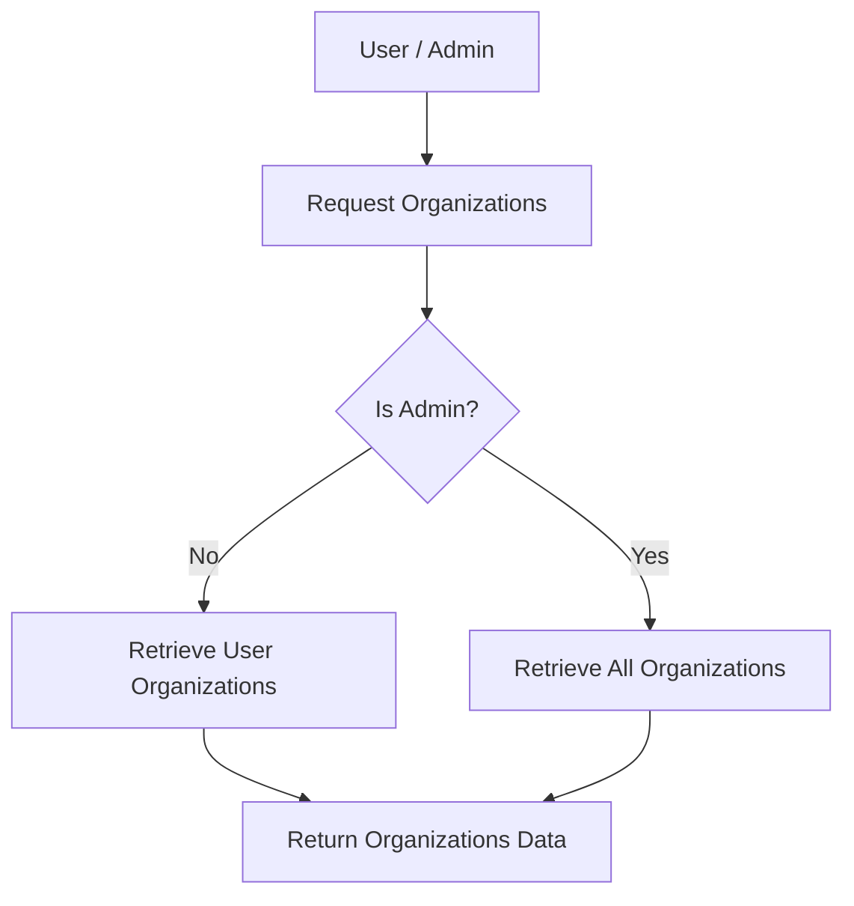
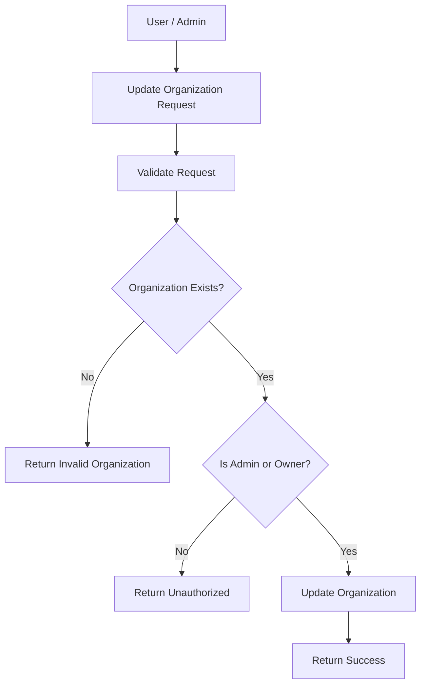
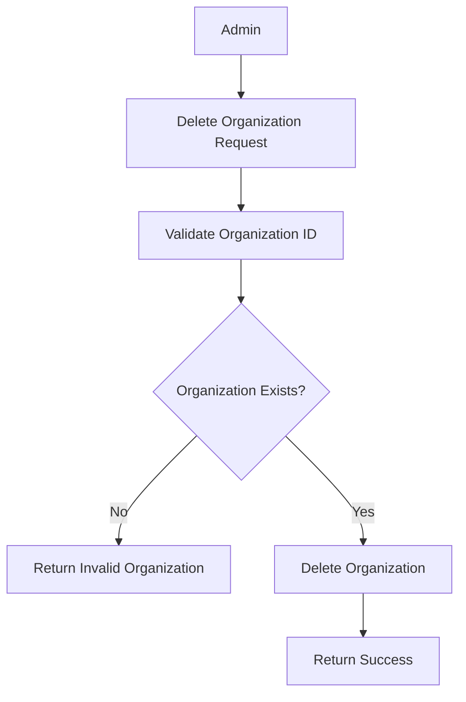
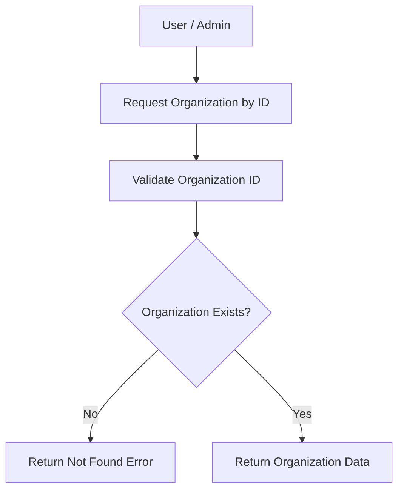

# Introduction

> **Module Type:** Module
> **Version:** 1.0  
> **Status:** Draft  
> **Priority:** Critical  
> **Owner:** Backend Team

---

# 1. Module Overview

## Purpose

The Organization module is responsible for managing organizations within the system.

## Scope

### Included

- Organization

### Excluded

- User's
- Projects
- Teams

---

# 2. Actors

| Actor                 | Action                                      |
| --------------------- | ------------------------------------------- |
| Authenticated User    | Create and manage their own organization    |
| System Administrators | Maintain all organizations and assign owners|

---

# 3. Business Goals

- Allow authenticated users to create their own organization (setting their user ID as the owner).
- Allow admin to create, update, delete, and view organizations (with the ability to select the owner ID during creation).

---

# 4. Functional Requirements

## FR-001 Create Organization

### Description

Allows a user or an admin to create an organization.

### Inputs

| Field         | Required    | Descriptions                                                                                    |
| ------------- | ----------- | ----------------------------------------------------------------------------------------------- |
| name          | Yes         | Name of the organization                                                                        |
| type          | Yes         | Type of organization                                                                            |
| descriptions  | No          | Optional description                                                                            |
| owner_user_id | Conditional | Required for admin if assigning another owner; defaults to current user ID for standard users |

### Process

1. Validate request data.
2. Determine `owner_user_id`:
   - If created by a standard user, automatically set `owner_user_id` to the authenticated user's ID.
   - If created by an admin and `owner_user_id` is provided, assign the specified user ID as owner; otherwise default to admin's ID.
3. Create organization record.

### Success Response

- Organization created.

### Failure Cases

- Missing required fields.
- Invalid `owner_user_id` (if specified by admin).

---

## FR-002 Get Organizations

### Description

Admin users can get all organizations. Authenticated users can retrieve their owned/associated organizations.

### Process

1. Find organizations.
2. Return organizations data.

### Success Response

- Organizations data.

### Failure Cases

- Unauthorized user.

---

## FR-003 Update Organization

### Description

Allows an admin or organization owner to update an organization.

### Inputs

| Field         | Required |
| ------------- | -------- |
| name          | No       |
| type          | No       |
| descriptions  | No       |
| owner_user_id | No       |

### Process

1. Validate request data.
2. Verify update authorization (Admin or Organization Owner).
3. Update organization record.

### Success Response

- Organization updated.

### Failure Cases

- Organization not found.
- Unauthorized user.

---

## FR-004 Delete Organization

### Description

Allows an admin to delete an organization.

### Inputs

| Field | Required |
| ----- | -------- |
| id    | Yes      |

### Process

1. Validate request data.
2. Delete the organization record.

### Success Response

- Organization removed.

### Failure Cases

- Invalid organization ID.

---

## FR-005 Get Organization by ID

### Description

Allows an authorized user or admin to get an organization by ID.

### Inputs

| Field | Required |
| ----- | -------- |
| id    | Yes      |

### Process

1. Validate request data.
2. Return organization data.

### Success Response

- Organization data.

### Failure Cases

- Organization not found.

---

# 5. Business Rules

| ID     | Rule                                                                              |
| ------ | --------------------------------------------------------------------------------- |
| BR-001 | Organization name must be validated.                                              |
| BR-002 | If a user creates an organization, their user ID must be set as owner_user_id.    |
| BR-003 | If an admin creates an organization, they may explicitly select the owner_user_id.|

---

# 6. Validation Rules

## Organizations

| Field         | Validation                                                                          |
| ------------- | ----------------------------------------------------------------------------------- |
| name          | Required                                                                            |
| type          | Required                                                                            |
| descriptions  | Not required                                                                        |
| owner_user_id | Required for Admin creation if assigning explicitly; auto-filled for standard users |

---

# 7. Authorization Matrix

| Route                     | Action | Standard User                 | Admin                          |
| ------------------------- | ------ | ----------------------------- | ------------------------------ |
| POST /organizations       | Create | Yes (Auto-sets owner as self) | Yes (Can select owner_user_id) |
| GET /organizations        | List   | Yes (Own organizations)       | Yes (All organizations)        |
| GET /organizations/:id    | View   | Yes (If owner/member)         | Yes                            |
| PUT /organizations/:id    | Edit   | Yes (If owner)                | Yes                            |
| DELETE /organizations/:id | Delete | No                            | Yes                            |

---

# 8. Workflow

## Create Organization



## Get Organizations



## Update Organization



## Delete Organization



## Get Organization by ID



---

# 9. Sequence Diagram

---

# 10. Database Design

## Organizations

| Field         | Type      | Constraints        |
| ------------- | --------- | ------------------ |
| id            | UUID      | Primary            |
| name          | VARCHAR   |
| type          | VARCHAR   |
| descriptions  | VARCHAR   |
| owner_user_id | UUID      | Organization Owner |
| created_at    | TIMESTAMP |
| updated_at    | TIMESTAMP |

---

# 11. API Endpoints

| Method | Endpoint           | Description            |
| ------ | ------------------ | ---------------------- |
| GET    | /organizations     | Get all organizations  |
| POST   | /organizations     | Create organization    |
| PUT    | /organizations/:id | Update organization    |
| DELETE | /organizations/:id | Delete organization    |
| GET    | /organizations/:id | Get organization by id |

---

# 12. API Examples

## Create Organization (By User)

```json
POST /organizations
{
  "name": "Acme Corp",
  "type": "Enterprise",
  "descriptions": "A large enterprise"
}
```

### Success Response

```json
{
  "message": "Organization created.",
  "data": {
    "id": "07c0060e-8e8c-44c1-942c-3004f5a6c5b6",
    "name": "Acme Corp",
    "type": "Enterprise",
    "descriptions": "A large enterprise",
    "owner_user_id": "123e4567-e89b-12d3-a456-426614174000",
    "created_at": "2026-08-07T00:00:00Z",
    "updated_at": "2026-08-07T00:00:00Z"
  }
}
```

## Create Organization (By Admin with explicit owner_user_id)

```json
POST /organizations
{
  "name": "Beta LLC",
  "type": "Startup",
  "descriptions": "A fast growing startup",
  "owner_user_id": "987f6543-e21b-32d1-b654-987654321000"
}
```

### Success Response

```json
{
  "message": "Organization created.",
  "data": {
    "id": "07c0060e-8e8c-44c1-942c-3004f5a6c5b6",
    "name": "Beta LLC",
    "type": "Startup",
    "descriptions": "A fast growing startup",
    "owner_user_id": "987f6543-e21b-32d1-b654-987654321000",
    "created_at": "2026-08-07T00:00:00Z",
    "updated_at": "2026-08-07T00:00:00Z"
  }
}
```

## Get Organizations

```json
GET /organizations
```

### Success Response

```json
{
  "data": [
    {
      "id": "07c0060e-8e8c-44c1-942c-3004f5a6c5b6",
      "name": "Acme Corp",
      "type": "Enterprise",
      "descriptions": "A large enterprise",
      "owner_user_id": "123e4567-e89b-12d3-a456-426614174000",
      "created_at": "2026-08-05T00:00:00Z",
      "updated_at": "2026-08-05T00:00:00Z"
    }
  ],
  "message": "Organizations retrieved."
}
```

## Get Organization by ID

```json
GET /organizations/07c0060e-8e8c-44c1-942c-3004f5a6c5b6
```

### Success Response

```json
{
  "data": {
    "id": "07c0060e-8e8c-44c1-942c-3004f5a6c5b6",
    "name": "Acme Corp",
    "type": "Enterprise",
    "descriptions": "A large enterprise",
    "owner_user_id": "123e4567-e89b-12d3-a456-426614174000",
    "created_at": "2026-08-05T00:00:00Z",
    "updated_at": "2026-08-05T00:00:00Z"
  },
  "message": "Organization retrieved."
}
```

---

## Update Organization

```json
PUT /organizations/07c0060e-8e8c-44c1-942c-3004f5a6c5b6
{
  "name": "Acme Corporation"
}
```

### Success Response

```json
{
  "message": "Organization updated.",
  "data": {
    "id": "07c0060e-8e8c-44c1-942c-3004f5a6c5b6",
    "name": "Acme Corporation",
    "type": "Enterprise",
    "descriptions": "A large enterprise",
    "owner_user_id": "123e4567-e89b-12d3-a456-426614174000",
    "created_at": "2026-08-05T00:00:00Z",
    "updated_at": "2026-08-05T00:00:00Z"
  }
}
```

### Error Response

```json
{
  "is_error": true,
  "message": "Bad request",
  "errors": {
    "name": ["Invalid name."]
  }
}
```

---

## Delete Organization

```json
DELETE /organizations/07c0060e-8e8c-44c1-942c-3004f5a6c5b6
```

### Success Response

```json
{
  "message": "Organization deleted."
}
```

### Error Response

```json
{
  "is_error": true,
  "message": "Organization not found.",
  "errors": {}
}
```

---

# 13. Error Codes

| Code    | Description                |
| ------- | -------------------------- |
| ORG_001 | Organization Not Found     |
| ORG_002 | Invalid Organization ID    |
| ORG_003 | Missing Required Field     |

---

# 14. Security Requirements

- Role-Based Access Control (RBAC) must be strictly enforced on all protected endpoints.
- Sanitize all user inputs for organization creation/updates.

---

# 15. Non-Functional Requirements

| Requirement                | Target |
| -------------------------- | ------ |
| API Response Time          | <50 ms |

---

# 16. Acceptance Criteria

- Standard users can successfully create an organization, automatically setting themselves as the owner.
- Administrators can successfully create organizations and explicitly set the owner user ID, as well as read, update, delete, and view all organizations.

---

# 17. Dependencies

- Database

---

# 18. Assumptions

- System uses centralized database.

---

# 19. Future Enhancements

- Hierarchical organizations.

---

# 20. Appendix

## Related Documents

- Database Design

---

**Document Version:** 1.0  
**Last Updated:** 2026-08-07
**Author:** Monirul Islam
