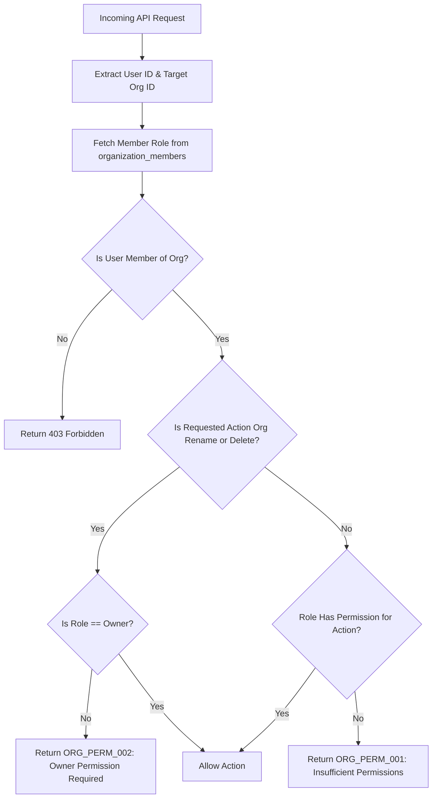

# Introduction

> **Module Type:** Sub-Module
> **Version:** 1.0  
> **Status:** Draft  
> **Priority:** Critical  
> **Owner:** Backend Team

---

# 1. Module Overview

## Purpose

The Organization Permissions sub-module defines and enforces Role-Based Access Control (RBAC) for members within an organization, governing access rights to organization settings and membership.

## Scope

### Included

- Definition of organization roles (`Viewer`, `Developer`, `Admin`, `Owner`)
- Hierarchical permission evaluation for organization operations
- Organization governance protection (restricting organization renaming and deletion to `Owner`)
- Permission enforcement matrix for organization endpoints

### Excluded

- Managing user authentication (handled in Users/Auth module)
- System-wide global administration roles (handled in Access Control / System Admin module)
- Managing membership records (handled in Organization Members module)
- Project-level permissions (handled in Projects Permissions sub-module)

---

# 2. Actors & Roles Hierarchy

| Role          | Level | Description & Base Access                                                                                       |
| ------------- | ----- | --------------------------------------------------------------------------------------------------------------- |
| **Viewer**    | 1     | Read-only access to organization details and member lists. No write/create/delete access.                        |
| **Developer** | 2     | Extends **Viewer**. Standard developer permissions within the organization. Cannot modify org details or members.|
| **Admin**     | 3     | Extends **Developer**. Full member/invitation management. Can update org details except rename or delete.        |
| **Owner**     | 4     | Full control over organization lifecycle, including renaming, deleting, and transferring ownership.             |

---

# 3. Business Goals

- Provide clear RBAC rules for organization settings and member management.
- Protect critical organization operations (renaming and deletion) so that only the Organization Owner can perform them.
- Allow Admins to manage members without risking organization deletion or renaming.

---

# 4. Detailed Permission Matrix

| Resource & Action              | Viewer | Developer | Admin | Owner |
| ------------------------------ | ------ | --------- | ----- | ----- |
| **Organization: View Details** | Yes    | Yes       | Yes   | Yes   |
| **Organization: Update Info**  | No     | No        | Yes*  | Yes   |
| **Organization: Rename**       | No     | No        | No    | Yes   |
| **Organization: Delete**       | No     | No        | No    | Yes   |
| **Members: View List**         | Yes    | Yes       | Yes   | Yes   |
| **Members: Invite / Add**      | No     | No        | Yes   | Yes   |
| **Members: Update Role**       | No     | No        | Yes** | Yes   |
| **Members: Remove**            | No     | No        | Yes** | Yes   |

_\* Admin can update general organization details (e.g. description, type) but cannot rename the organization (`name`)._  
_\*\* Admin cannot change roles for or remove the Organization Owner or other Admins._

---

# 5. Functional Requirements

## FR-001 Evaluate Organization Permission

### Description

Validates whether an authenticated organization member holds the required role level to execute an organization action.

### Inputs

| Field           | Required | Descriptions                                  |
| --------------- | -------- | --------------------------------------------- |
| user_id         | Yes      | UUID of the requesting user                   |
| organization_id | Yes      | UUID of the target organization               |
| action          | Yes      | Requested operation (e.g. `member:invite`)    |

### Process

1. Retrieve member record from `organization_members` matching `organization_id` and `user_id`.
2. Determine active role (`Viewer`, `Developer`, `Admin`, `Owner`).
3. Check role level against required permission level for `action`.
4. Allow request if authorized; otherwise deny.

### Success Response

- Permission granted.

### Failure Cases

- User is not a member of the organization (`FORBIDDEN`).
- Insufficient role level (`ORG_PERM_001`).

---

## FR-002 Enforce Organization Governance Protection

### Description

Prevents non-Owner roles (including Admin) from renaming or deleting an organization.

### Inputs

| Field           | Required | Descriptions                                  |
| --------------- | -------- | --------------------------------------------- |
| user_id         | Yes      | UUID of the requesting user                   |
| organization_id | Yes      | UUID of the organization                      |
| action          | Yes      | `organization:rename` or `organization:delete`|

### Process

1. Retrieve member record from `organization_members`.
2. Check if role is `Owner`.
3. If role is `Owner`, authorize operation.
4. If role is `Admin`, `Developer`, or `Viewer`, reject request.

### Success Response

- Governance operation authorized.

### Failure Cases

- Admin or Developer attempting to rename organization (`ORG_PERM_002`).
- Admin or Developer attempting to delete organization (`ORG_PERM_002`).

---

# 6. Business Rules

| ID     | Rule                                                                                                         |
| ------ | ------------------------------------------------------------------------------------------------------------ |
| BR-001 | `Viewer` role has strictly read-only access to organization details and member lists.                        |
| BR-002 | `Admin` role can manage organization members, but cannot rename or delete the organization.                  |
| BR-003 | Only `Owner` role can rename the organization, delete the organization, or transfer organization ownership.   |
| BR-004 | Role permissions inherit hierarchically: `Owner` > `Admin` > `Developer` > `Viewer`.                         |

---

# 7. Authorization Matrix across API Endpoints

| Route                                          | Method | Minimum Role Required | Special Condition |
| ---------------------------------------------- | ------ | --------------------- | ----------------- |
| `GET /organizations`                           | GET    | Viewer                | Own organizations |
| `GET /organizations/:id`                       | GET    | Viewer                | Member of target organization |
| `PUT /organizations/:id` (General Info)        | PUT    | Admin                 | Cannot change `name` field |
| `PUT /organizations/:id` (Rename `name`)       | PUT    | Owner                 | Owner only |
| `DELETE /organizations/:id`                    | DELETE | Owner                 | Owner only |
| `GET /organizations/:id/members`               | GET    | Viewer                | |
| `POST /organizations/:id/invitations`          | POST   | Admin                 | |
| `GET /organizations/:id/invitations`           | GET    | Admin                 | |
| `PUT /organizations/:id/members/:user_id`      | PUT    | Admin                 | Cannot modify Owner role |
| `DELETE /organizations/:id/members/:user_id`   | DELETE | Admin                 | Cannot remove Owner |

---

# 8. Workflow

## Organization Permission Evaluation Workflow



---

# 9. Database Schema Considerations

No additional tables required. Role definitions utilize the `role` field in the existing `organization_members` table:

## Enum Values for `organization_members.role`

- `'owner'`
- `'admin'`
- `'developer'`
- `'viewer'`

---

# 10. Error Codes

| Code         | Message                                                             | HTTP Status |
| ------------ | ------------------------------------------------------------------- | ----------- |
| ORG_PERM_001 | Insufficient organization role for this operation.                 | 403         |
| ORG_PERM_002 | Only the Organization Owner can rename or delete this organization. | 403         |

---

# 11. API Error Example

## Attempting to Rename Organization (Role: Admin)

```json
PUT /organizations/07c0060e-8e8c-44c1-942c-3004f5a6c5b6
{
  "name": "New Organization Name"
}
```

### Error Response

```json
{
  "is_error": true,
  "code": "ORG_PERM_002",
  "message": "Access denied. Only the Organization Owner can rename or delete an organization."
}
```

---

# 12. Security Requirements

- Role enforcement must occur at middleware/guard level before controller handlers execute.

---

# 13. Non-Functional Requirements

| Requirement                   | Target |
| ----------------------------- | ------ |
| Permission Checking Latency   | <10 ms |

---

# 14. Acceptance Criteria

- **Viewer** users can read organization details and member lists, but receive `403` on any write request.
- **Admin** users can manage members and general organization details, but receive `ORG_PERM_002` if attempting to rename or delete the organization.
- **Owner** users have full authority to rename or delete the organization.

---

# 15. Dependencies

- Organization Module
- Organization Members Sub-Module

---

# 16. Assumptions

- System uses centralized RBAC validation logic.

---

# 17. Appendix

## Related Documents

- Organization Module Design
- Organization Members Sub-Module
