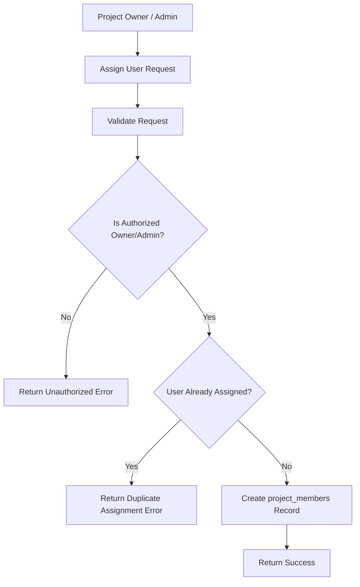
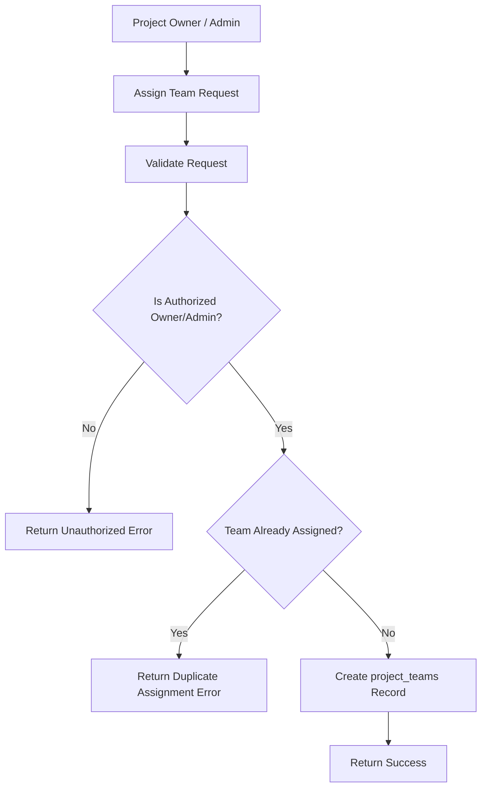

# Introduction

> **Module Type:** Sub-Module
> **Version:** 1.0  
> **Status:** Draft  
> **Priority:** Critical  
> **Owner:** Backend Team

---

# 1. Module Overview

## Purpose

The Project Assignments sub-module manages assigning teams or individual users to a specific project.

## Scope

### Included

- Assigning single users to a project
- Assigning teams to a project
- Removing user or team assignments from a project
- Listing assigned users and teams for a project

### Excluded

- Managing user details (handled in Users module)
- Managing team structures (handled in Teams module)
- Project creation/deletion (handled in Projects module)

---

# 2. Actors

| Actor           | Action                                                        |
| --------------- | ------------------------------------------------------------- |
| Project Owner   | Assign or remove teams and users to/from their project        |
| System Admin    | Full management of project assignments across all projects    |

---

# 3. Business Goals

- Allow project owners to assign single users or entire teams to their project.
- Allow project owners to view and remove assigned users or teams.

---

# 4. Functional Requirements

## FR-001 Assign User to Project

### Description

Allows a Project Owner or Admin to assign a single user to a project.

### Inputs

| Field      | Required | Descriptions         |
| ---------- | -------- | -------------------- |
| project_id | Yes      | UUID of the project  |
| user_id    | Yes      | UUID of the user     |

### Process

1. Validate request data.
2. Verify project existence and check if requester is Project Owner or Admin.
3. Verify user existence.
4. Check for duplicate assignment (`project_id`, `user_id`).
5. Create `project_members` record.

### Success Response

- User assigned to project.

### Failure Cases

- Project or user not found.
- Unauthorized requester (not Project Owner or Admin).
- User already assigned to the project.

---

## FR-002 Assign Team to Project

### Description

Allows a Project Owner or Admin to assign an entire team to a project.

### Inputs

| Field      | Required | Descriptions         |
| ---------- | -------- | -------------------- |
| project_id | Yes      | UUID of the project  |
| team_id    | Yes      | UUID of the team     |

### Process

1. Validate request data.
2. Verify project existence and check if requester is Project Owner or Admin.
3. Verify team existence.
4. Check for duplicate assignment (`project_id`, `team_id`).
5. Create `project_teams` record.

### Success Response

- Team assigned to project.

### Failure Cases

- Project or team not found.
- Unauthorized requester.
- Team already assigned to the project.

---

## FR-003 Remove User from Project

### Description

Allows a Project Owner or Admin to remove a user assignment from a project.

### Inputs

| Field      | Required | Descriptions         |
| ---------- | -------- | -------------------- |
| project_id | Yes      | UUID of the project  |
| user_id    | Yes      | UUID of the user     |

### Process

1. Validate request data.
2. Verify requester authorization.
3. Delete record from `project_members`.

### Success Response

- User removed from project.

### Failure Cases

- Assignment record not found.
- Unauthorized requester.

---

## FR-004 Remove Team from Project

### Description

Allows a Project Owner or Admin to remove a team assignment from a project.

### Inputs

| Field      | Required | Descriptions         |
| ---------- | -------- | -------------------- |
| project_id | Yes      | UUID of the project  |
| team_id    | Yes      | UUID of the team     |

### Process

1. Validate request data.
2. Verify requester authorization.
3. Delete record from `project_teams`.

### Success Response

- Team removed from project.

### Failure Cases

- Assignment record not found.
- Unauthorized requester.

---

## FR-005 List Project Members & Teams

### Description

Allows listing all assigned users and teams for a given project.

### Inputs

| Field      | Required | Descriptions         |
| ---------- | -------- | -------------------- |
| project_id | Yes      | UUID of the project  |

### Process

1. Find all `project_members` and `project_teams` matching `project_id`.
2. Return assignment lists.

### Success Response

- List of assigned users and teams.

### Failure Cases

- Project not found.
- Unauthorized requester.

---

# 5. Business Rules

| ID     | Rule                                                                              |
| ------ | --------------------------------------------------------------------------------- |
| BR-001 | Only Project Owner or System Admin can assign/remove users or teams to a project.  |
| BR-002 | Duplicate user assignments (`project_id`, `user_id`) are not allowed.              |
| BR-003 | Duplicate team assignments (`project_id`, `team_id`) are not allowed.              |

---

# 6. Validation Rules

## Project Members

| Field      | Validation |
| ---------- | ---------- |
| project_id | Required   |
| user_id    | Required   |

## Project Teams

| Field      | Validation |
| ---------- | ---------- |
| project_id | Required   |
| team_id    | Required   |

---

# 7. Authorization Matrix

| Route                              | Action      | Project Owner | Member / Other User | Admin |
| ---------------------------------- | ----------- | ------------- | ------------------- | ----- |
| POST /projects/:id/members         | Assign User | Yes           | No                  | Yes   |
| DELETE /projects/:id/members/:user_id | Remove User| Yes           | No                  | Yes   |
| GET /projects/:id/members          | List Members| Yes           | Yes (If member)     | Yes   |
| POST /projects/:id/teams           | Assign Team | Yes           | No                  | Yes   |
| DELETE /projects/:id/teams/:team_id | Remove Team | Yes           | No                  | Yes   |
| GET /projects/:id/teams            | List Teams  | Yes           | Yes (If member)     | Yes   |

---

# 8. Workflow

## Assign User to Project



## Assign Team to Project



---

# 9. Sequence Diagram

---

# 10. Database Design

## Project Members

| Field      | Type      | Constraints |
| ---------- | --------- | ----------- |
| id         | UUID      | Primary     |
| project_id | UUID      |             |
| user_id    | UUID      |             |
| created_at | TIMESTAMP |             |
| updated_at | TIMESTAMP |             |

## Project Teams

| Field      | Type      | Constraints |
| ---------- | --------- | ----------- |
| id         | UUID      | Primary     |
| project_id | UUID      |             |
| team_id    | UUID      |             |
| created_at | TIMESTAMP |             |
| updated_at | TIMESTAMP |             |

---

# 11. API Endpoints

| Method | Endpoint                        | Description                   |
| ------ | ------------------------------- | ----------------------------- |
| POST   | /projects/:id/members           | Assign a single user to project |
| GET    | /projects/:id/members           | Get assigned users of project |
| DELETE | /projects/:id/members/:user_id  | Remove user from project      |
| POST   | /projects/:id/teams             | Assign a team to project      |
| GET    | /projects/:id/teams             | Get assigned teams of project |
| DELETE | /projects/:id/teams/:team_id    | Remove team from project      |

---

# 12. API Examples

## Assign User to Project

```json
POST /projects/07c0060e-8e8c-44c1-942c-3004f5a6c5b6/members
{
  "user_id": "123e4567-e89b-12d3-a456-426614174000"
}
```

### Success Response

```json
{
  "message": "User assigned to project.",
  "data": {
    "id": "abc12345-8e8c-44c1-942c-3004f5a6c5b6",
    "project_id": "07c0060e-8e8c-44c1-942c-3004f5a6c5b6",
    "user_id": "123e4567-e89b-12d3-a456-426614174000",
    "created_at": "2026-08-07T00:00:00Z",
    "updated_at": "2026-08-07T00:00:00Z"
  }
}
```

## Assign Team to Project

```json
POST /projects/07c0060e-8e8c-44c1-942c-3004f5a6c5b6/teams
{
  "team_id": "987f6543-e21b-32d1-b654-987654321000"
}
```

### Success Response

```json
{
  "message": "Team assigned to project.",
  "data": {
    "id": "def67890-8e8c-44c1-942c-3004f5a6c5b6",
    "project_id": "07c0060e-8e8c-44c1-942c-3004f5a6c5b6",
    "team_id": "987f6543-e21b-32d1-b654-987654321000",
    "created_at": "2026-08-07T00:00:00Z",
    "updated_at": "2026-08-07T00:00:00Z"
  }
}
```

## Get Project Members

```json
GET /projects/07c0060e-8e8c-44c1-942c-3004f5a6c5b6/members
```

### Success Response

```json
{
  "data": [
    {
      "id": "abc12345-8e8c-44c1-942c-3004f5a6c5b6",
      "project_id": "07c0060e-8e8c-44c1-942c-3004f5a6c5b6",
      "user_id": "123e4567-e89b-12d3-a456-426614174000",
      "created_at": "2026-08-07T00:00:00Z",
      "updated_at": "2026-08-07T00:00:00Z"
    }
  ],
  "message": "Project members retrieved."
}
```

## Get Project Teams

```json
GET /projects/07c0060e-8e8c-44c1-942c-3004f5a6c5b6/teams
```

### Success Response

```json
{
  "data": [
    {
      "id": "def67890-8e8c-44c1-942c-3004f5a6c5b6",
      "project_id": "07c0060e-8e8c-44c1-942c-3004f5a6c5b6",
      "team_id": "987f6543-e21b-32d1-b654-987654321000",
      "created_at": "2026-08-07T00:00:00Z",
      "updated_at": "2026-08-07T00:00:00Z"
    }
  ],
  "message": "Project teams retrieved."
}
```

## Remove User from Project

```json
DELETE /projects/07c0060e-8e8c-44c1-942c-3004f5a6c5b6/members/123e4567-e89b-12d3-a456-426614174000
```

### Success Response

```json
{
  "message": "User removed from project."
}
```

## Remove Team from Project

```json
DELETE /projects/07c0060e-8e8c-44c1-942c-3004f5a6c5b6/teams/987f6543-e21b-32d1-b654-987654321000
```

### Success Response

```json
{
  "message": "Team removed from project."
}
```

---

# 13. Error Codes

| Code    | Description                    |
| ------- | ------------------------------ |
| PRJ_004 | Assignment Already Exists      |
| PRJ_005 | Assignment Not Found           |
| PRJ_006 | Unauthorized Project Operation |

---

# 14. Security Requirements

- Role-Based Access Control (RBAC) & Ownership verification must be strictly enforced.
- Only the Project Owner (or System Admin) can assign or remove teams/members.

---

# 15. Non-Functional Requirements

| Requirement       | Target |
| ----------------- | ------ |
| API Response Time | <50 ms |

---

# 16. Acceptance Criteria

- Project owners can assign single users or entire teams to their project.
- Project owners can remove assigned users or teams.
- Duplicate user/team assignments are prevented.

---

# 17. Dependencies

- Projects Module
- Users Module
- Teams Module

---

# 18. Assumptions

- System uses centralized database.

---

# 19. Future Enhancements

- Role-based permissions per assigned member/team within a project (e.g. Viewer, Editor, Admin).

---

# 20. Appendix

## Related Documents

- Projects Module Design
- Teams Module Design
