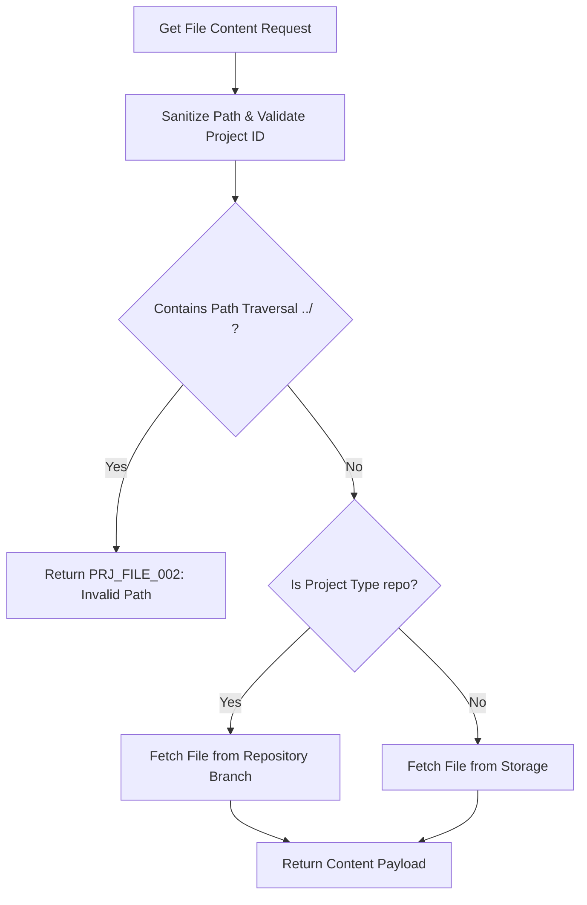

# Introduction

> **Module Type:** Sub-Module
> **Version:** 1.0  
> **Status:** Draft  
> **Priority:** Critical  
> **Owner:** Backend Team

---

# 1. Module Overview

## Purpose

The Project Files sub-module manages project files and directory trees. It provides APIs for browsing directory structures, reading file content, creating/uploading files, editing file content, and deleting files/directories for both `repo` and `files` type projects.

## Scope

### Included

- Listing directory contents and file trees
- Reading file contents (text & binary)
- Creating new files and uploading files
- Updating existing file contents
- Deleting files and directories
- Path traversal prevention and path sanitization
- Support for `repo` (Git branch operations) and `files` (direct project storage) project types

### Excluded

- Project lifecycle management (handled in Projects module)
- Role authorization evaluation (handled in Project Permissions sub-module)
- Project assignment management (handled in Project Assignments sub-module)

---

# 2. Actors

| Actor            | Access & Responsibilities                                                                |
| ---------------- | ---------------------------------------------------------------------------------------- |
| Project Owner    | Full management of project files, directory trees, uploads, and deletions.               |
| Org Admin / Dev  | Create, edit, upload, and delete project files according to project permissions rules.   |
| Project Viewer   | Read-only access to browse directory tree and view file content.                         |
| System Admin     | Full access to project files across all organizations.                                   |

---

# 3. Business Goals

- Provide a unified file management API regardless of whether the project is `repo` type or `files` type.
- Support real-time file tree browsing and file content inspection.
- Guarantee strict file path security (prevent path traversal attacks).

---

# 4. Functional Requirements

## FR-001 List Directory Structure

### Description

Retrieves the directory tree or list of files and subdirectories at a specified path in a project.

### Inputs

| Field      | Required | Descriptions                                                    |
| ---------- | -------- | --------------------------------------------------------------- |
| project_id | Yes      | UUID of the project                                             |
| path       | No       | Relative path within project (defaults to root `/`)             |
| branch     | No       | Target Git branch for `repo` type projects (defaults to `main`) |

### Process

1. Verify project existence and identify project `type` (`repo` vs `files`).
2. Validate and sanitize `path`.
3. If `type == 'repo'`, query repository file tree for `path` on specified `branch`.
4. If `type == 'files'`, query project file storage for children of `path`.
5. Return list of file and directory metadata objects.

### Success Response

- Directory tree metadata retrieved.

### Failure Cases

- Project not found.
- Path does not exist.
- Invalid path format (`PRJ_FILE_002`).

---

## FR-002 Read File Content

### Description

Retrieves raw content or text payload of a specific file in a project.

### Inputs

| Field      | Required | Descriptions                                       |
| ---------- | -------- | -------------------------------------------------- |
| project_id | Yes      | UUID of the project                                |
| path       | Yes      | File path within project (e.g. `/src/main.rs`)     |
| branch     | No       | Target Git branch for `repo` type projects         |

### Process

1. Sanitize file `path`.
2. Locate file record or repository node.
3. Retrieve raw content buffer.
4. Return content payload (UTF-8 string or base64 encoded binary depending on MIME type).

### Success Response

- File content retrieved.

### Failure Cases

- File not found (`PRJ_FILE_001`).
- Path points to a directory instead of a file.

---

## FR-003 Create / Upload File

### Description

Creates a new file or uploads a file to a specified directory path in a project.

### Inputs

| Field          | Required | Descriptions                                                       |
| -------------- | -------- | ------------------------------------------------------------------ |
| project_id     | Yes      | UUID of the project                                                |
| path           | Yes      | Target file path (e.g. `/src/utils.rs`)                            |
| content        | Yes      | File content payload (UTF-8 string or base64 encoded string)       |
| commit_message | No       | Commit message for `repo` type projects (e.g. "Add utils module") |

### Process

1. Sanitize `path` and check parent directory existence.
2. Check if file already exists at `path`.
3. Verify user write permission.
4. If `type == 'repo'`, stage and commit new file to target branch.
5. If `type == 'files'`, write file record to storage.

### Success Response

- File created/uploaded successfully.

### Failure Cases

- File already exists (`PRJ_FILE_003`).
- Invalid path or filename (`PRJ_FILE_002`).
- Unauthorized requester.

---

## FR-004 Update File Content

### Description

Updates the content of an existing file in a project.

### Inputs

| Field          | Required | Descriptions                                           |
| -------------- | -------- | ------------------------------------------------------ |
| project_id     | Yes      | UUID of the project                                    |
| path           | Yes      | Path of the file to update                             |
| content        | Yes      | New file content payload                               |
| commit_message | No       | Commit message for `repo` type projects                |

### Process

1. Sanitize `path` and verify file existence.
2. Verify user write permission.
3. If `type == 'repo'`, update file content in repository branch.
4. If `type == 'files'`, update stored content and metadata (`updated_at`, `size_bytes`).

### Success Response

- File content updated successfully.

### Failure Cases

- File not found (`PRJ_FILE_001`).
- Unauthorized requester.

---

## FR-005 Delete File or Directory

### Description

Deletes a specified file or directory from a project.

### Inputs

| Field          | Required | Descriptions                            |
| -------------- | -------- | --------------------------------------- |
| project_id     | Yes      | UUID of the project                     |
| path           | Yes      | Path of file or directory to delete     |
| commit_message | No       | Commit message for `repo` type projects |

### Process

1. Sanitize `path` and verify file/directory existence.
2. Verify user delete permission.
3. Remove target file or recursively remove target directory.

### Success Response

- File/directory deleted.

### Failure Cases

- Path not found (`PRJ_FILE_001`).
- Unauthorized operation.

---

# 5. Business Rules

| ID     | Rule                                                                                                 |
| ------ | ---------------------------------------------------------------------------------------------------- |
| BR-001 | File paths must be absolute relative to project root (starting with `/`) and sanitized against `../`.|
| BR-002 | `repo` type project file operations interact with the repository branch (`default_branch`).           |
| BR-003 | `files` type project file operations write directly to project file storage.                         |
| BR-004 | Overwriting an existing file requires using the update API (`PUT`), not create API (`POST`).         |

---

# 6. Validation Rules

## File Requests

| Field   | Validation                                                                                         |
| ------- | -------------------------------------------------------------------------------------------------- |
| path    | Required, must start with `/`, cannot contain path traversal patterns (`../` or `..\\`)           |
| content | Required for create and update requests                                                            |
| branch  | Optional, non-empty string                                                                         |

---

# 7. Authorization Matrix

| Route                                  | Action          | Viewer | Developer | Admin | Owner | System Admin |
| -------------------------------------- | --------------- | ------ | --------- | ----- | ----- | ------------ |
| GET /projects/:id/files/tree           | List Directory  | Yes    | Yes       | Yes   | Yes   | Yes          |
| GET /projects/:id/files/content        | Read File       | Yes    | Yes       | Yes   | Yes   | Yes          |
| POST /projects/:id/files               | Create File     | No     | Yes       | Yes   | Yes   | Yes          |
| PUT /projects/:id/files                | Update File     | No     | Yes       | Yes   | Yes   | Yes          |
| DELETE /projects/:id/files             | Delete File     | No     | Yes       | Yes   | Yes   | Yes          |

---

# 8. Workflow

## Read File Content Workflow



---

# 9. Sequence Diagram

---

# 10. Database & Storage Design

For `files` type projects, file metadata is stored in `project_files`:

## Project Files Table

| Field      | Type      | Constraints                          |
| ---------- | --------- | ------------------------------------ |
| id         | UUID      | Primary                              |
| project_id | UUID      | Foreign Key                          |
| path       | VARCHAR   | Relative path (e.g. `/src/main.rs`)  |
| file_type  | VARCHAR   | `file` or `directory`                |
| size_bytes | BIGINT    | Size in bytes                        |
| mime_type  | VARCHAR   | e.g., `text/plain`, `application/json`|
| content    | TEXT      | Stored file content payload          |
| created_at | TIMESTAMP |                                      |
| updated_at | TIMESTAMP |                                      |

---

# 11. API Endpoints

| Method | Endpoint                       | Description                           |
| ------ | ------------------------------ | ------------------------------------- |
| GET    | /projects/:id/files/tree       | List files and subdirectories at path |
| GET    | /projects/:id/files/content    | Read file content                     |
| POST   | /projects/:id/files            | Create or upload new file             |
| PUT    | /projects/:id/files            | Update existing file content          |
| DELETE | /projects/:id/files            | Delete file or directory at path      |

---

# 12. API Examples

## List Directory Structure

```json
GET /projects/07c0060e-8e8c-44c1-942c-3004f5a6c5b6/files/tree?path=/src
```

### Success Response

```json
{
  "message": "Directory list retrieved.",
  "data": [
    {
      "name": "main.rs",
      "path": "/src/main.rs",
      "file_type": "file",
      "size_bytes": 1024,
      "mime_type": "text/plain"
    },
    {
      "name": "models",
      "path": "/src/models",
      "file_type": "directory",
      "size_bytes": 0,
      "mime_type": "inode/directory"
    }
  ]
}
```

## Read File Content

```json
GET /projects/07c0060e-8e8c-44c1-942c-3004f5a6c5b6/files/content?path=/src/main.rs
```

### Success Response

```json
{
  "message": "File content retrieved.",
  "data": {
    "path": "/src/main.rs",
    "size_bytes": 1024,
    "mime_type": "text/plain",
    "content": "fn main() {\n    println!(\"Hello, Forge!\");\n}"
  }
}
```

## Create File

```json
POST /projects/07c0060e-8e8c-44c1-942c-3004f5a6c5b6/files
{
  "path": "/src/config.rs",
  "content": "pub struct Config {\n    pub port: u16,\n}\n",
  "commit_message": "Add config module"
}
```

### Success Response

```json
{
  "message": "File created successfully.",
  "data": {
    "id": "file-12345678-8e8c-44c1-942c-3004f5a6c5b6",
    "project_id": "07c0060e-8e8c-44c1-942c-3004f5a6c5b6",
    "path": "/src/config.rs",
    "file_type": "file",
    "size_bytes": 45,
    "created_at": "2026-08-08T00:00:00Z"
  }
}
```

## Update File

```json
PUT /projects/07c0060e-8e8c-44c1-942c-3004f5a6c5b6/files
{
  "path": "/src/config.rs",
  "content": "pub struct Config {\n    pub port: u16,\n    pub host: String,\n}\n",
  "commit_message": "Update config struct"
}
```

### Success Response

```json
{
  "message": "File updated successfully.",
  "data": {
    "path": "/src/config.rs",
    "size_bytes": 68,
    "updated_at": "2026-08-08T00:00:00Z"
  }
}
```

## Delete File

```json
DELETE /projects/07c0060e-8e8c-44c1-942c-3004f5a6c5b6/files?path=/src/config.rs
```

### Success Response

```json
{
  "message": "File deleted successfully."
}
```

---

# 13. Error Codes

| Code         | Description                                       |
| ------------ | ------------------------------------------------- |
| PRJ_FILE_001 | File or Directory Not Found                       |
| PRJ_FILE_002 | Invalid Path or Path Traversal Attempt            |
| PRJ_FILE_003 | File Already Exists                               |
| PRJ_FILE_004 | File Operation Failed                             |

---

# 14. Security Requirements

- Strict path sanitization to reject path traversal (e.g., `../`, `..\\`).
- Enforce project RBAC permissions before performing file writes or deletions.

---

# 15. Non-Functional Requirements

| Requirement                   | Target  |
| ----------------------------- | ------- |
| Directory List Response Time  | <50 ms  |
| File Read Response Time       | <100 ms |

---

# 16. Acceptance Criteria

- Users can browse project directory trees and view file contents.
- Users can create, update, and delete files with clean API calls.
- Attempts to use path traversal (`../`) are rejected with `PRJ_FILE_002`.

---

# 17. Dependencies

- Projects Module
- Project Permissions Sub-Module

---

# 18. Assumptions

- File paths are normalized to POSIX style (`/`).

---

# 19. Future Enhancements

- Binary file upload stream handling.
- Full-text code search across project files.

---

# 20. Appendix

## Related Documents

- Projects Module Design
- Project Permissions Sub-Module Design
