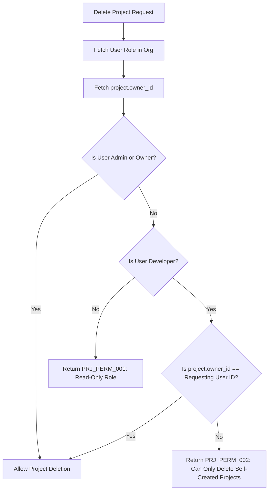

# Introduction

> **Module Type:** Sub-Module
> **Version:** 1.0  
> **Status:** Draft  
> **Priority:** Critical  
> **Owner:** Backend Team

---

# 1. Module Overview

## Purpose

The Project Permissions sub-module defines and enforces access control and ownership rules for project creation, viewing, modification, deletion, and assignment across both **Personal Workspaces** (standalone individual projects) and **Organization Workspaces** (multi-tenant team projects).

## Scope

### Included

- Evaluation of project operations (`create`, `view`, `update`, `delete`) based on:
  - **Personal Context (`organization_id == null`)**: System RBAC / `ProjectsCreatePolicy` and Project Ownership (`owner_id == self.id`).
  - **Organization Context (`organization_id != null`)**: Organization Member Role (`Owner`, `Admin`, `Developer`, `Viewer`) and Project Ownership (`owner_id`).
- Enforcement of project deletion rules (restricting `Developer` role users to deleting only self-created projects).
- Authorization of project team and member assignments within organizations.
- Permission enforcement matrix across project endpoints.

### Excluded

- Organization-level governance permissions (handled in Organization Permissions sub-module)
- User authentication and token verification (handled in Users/Auth module)
- Managing project data records (handled in Projects module)
- Managing project assignment records (handled in Project Assignments sub-module)

---

# 2. Roles & Ownership Permissions Hierarchy

## Context 1: Personal Projects (`organization_id IS NULL`)

| Role / Capability | Access Level | Description & Personal Project Capabilities |
| :--- | :--- | :--- |
| **System Developer / User** (with `projects:create`) | Full Owner | Can create personal projects. Automatically assigned as `owner_id`. Has unrestricted full CRUD and deployment access on self-owned personal projects. |
| **Non-Owner User** | No Access | Cannot view, update, delete, or trigger deployments on another user's personal project. |
| **System Administrator** | Platform Admin | Full override capability across all platform projects. |

## Context 2: Organization Projects (`organization_id IS NOT NULL`)

| Organization Role | Project Access Level | Description & Project Capabilities                                                                               |
| ----------------- | -------------------- | ---------------------------------------------------------------------------------------------------------------- |
| **Viewer**        | Read-Only            | Can view projects and assignment lists. Cannot create, edit, delete, or assign anything.                         |
| **Developer**     | Creator / Limited    | Can create projects (auto-assigned as `owner_id`), update projects, and delete projects **only if `owner_id == self.id`**. |
| **Admin**         | Full Project Admin   | Can create, update, delete **any** project in the organization, and manage all assignments.                     |
| **Owner**         | Unrestricted         | Full control over all projects and assignments in the organization.                                              |

---

# 3. Business Goals

- Enable individual developers to create, deploy, and manage personal projects seamlessly without needing an organization.
- Empower organization Developers to create and manage projects while guarding against unauthorized deletion of projects owned by others.
- Ensure project creators maintain control over their project's settings and assignments.
- Provide Admins and Organization Owners full governance to manage and maintain all projects across the organization.

---

# 4. Detailed Project Permission Matrix

| Operation | Personal Project (Owner) | Personal Project (Other User) | Org: Viewer | Org: Developer (Self-Owned) | Org: Developer (Other User) | Org: Admin | Org: Owner | System Admin |
| :--- | :--- | :--- | :--- | :--- | :--- | :--- | :--- | :--- |
| **View Project** | Yes | No | Yes | Yes | Yes | Yes | Yes | Yes |
| **Create Project** | Yes (`projects:create`) | — | No | Yes | Yes | Yes | Yes | Yes |
| **Update Project** | Yes | No | No | Yes | Yes | Yes | Yes | Yes |
| **Delete Project** | Yes | No | No | Yes | **No (Denied)** | Yes | Yes | Yes |
| **Assign User / Team** | N/A (Org only) | N/A | No | Yes | No* | Yes | Yes | Yes |

_\* In Organization projects, only the Project Owner (`owner_id == self.id`) or an Org Admin/Owner can manage user/team assignments for a project._

---

# 5. Functional Requirements

## FR-001 Evaluate Project Creation & Ownership

### Description

Validates project creation permission based on whether the project is Personal or Organization-scoped, and automatically sets `owner_id` to the requesting user's ID.

### Inputs

| Field           | Required | Descriptions                                                    |
| --------------- | -------- | --------------------------------------------------------------- |
| user_id         | Yes      | UUID of the requesting user                                     |
| organization_id | No       | Optional UUID of parent organization (null for Personal Project) |

### Process

1. **If `organization_id` is null (Personal Project)**:
   - Check if user holds `projects:create` capability from System RBAC / Access Control.
   - If permitted, authorize creation with `organization_id = null` and `owner_id = user_id`.
2. **If `organization_id` is provided (Organization Project)**:
   - Verify user's organization role in `organization_members`.
   - Check if role is `Developer`, `Admin`, or `Owner`.
   - If role is `Viewer`, reject request (`PRJ_PERM_001`).
   - On creation, assign `organization_id = organization_id` and `owner_id = user_id`.

### Success Response

- Project creation authorized.

### Failure Cases

- User lacking `projects:create` capability for personal project (`PRJ_PERM_001`).
- User has `Viewer` role in parent organization (`PRJ_PERM_001`).

---

## FR-002 Evaluate Project Deletion Permission

### Description

Enforces strict deletion authorization based on workspace context and ownership.

### Inputs

| Field           | Required | Descriptions                                                    |
| --------------- | -------- | --------------------------------------------------------------- |
| user_id         | Yes      | UUID of the requesting user                                     |
| organization_id | No       | Optional UUID of the organization (null for Personal Project)   |
| project_id      | Yes      | UUID of the target project                                      |

### Process

1. Fetch target project record and inspect `project.organization_id` and `project.owner_id`.
2. **If Personal Project (`project.organization_id IS NULL`)**:
   - If `project.owner_id == user_id` or user is System Admin, authorize deletion.
   - Otherwise, reject deletion (`PRJ_PERM_002`).
3. **If Organization Project (`project.organization_id IS NOT NULL`)**:
   - Fetch user's role in `organization_members`.
   - If role is `Owner` or `Admin` (or user is System Admin), authorize deletion.
   - If role is `Developer`:
     - If `project.owner_id == user_id`, authorize deletion.
     - If `project.owner_id != user_id`, reject deletion (`PRJ_PERM_002`).
   - If role is `Viewer`, reject deletion (`PRJ_PERM_001`).

### Success Response

- Project deletion authorized.

### Failure Cases

- User attempting to delete another user's personal project (`PRJ_PERM_002`).
- `Developer` user attempting to delete an organization project created by another user (`PRJ_PERM_002`).
- `Viewer` user attempting to delete an organization project (`PRJ_PERM_001`).

---

## FR-003 Evaluate Project Assignment Permission

### Description

Ensures only the Project Owner or Org Admin/Owner can add or remove team/user assignments (applicable only to organization projects).

### Inputs

| Field      | Required | Descriptions                |
| ---------- | -------- | --------------------------- |
| user_id    | Yes      | UUID of the requesting user |
| project_id | Yes      | UUID of the target project  |

### Process

1. Fetch user's role in `organization_members`.
2. Fetch `project.owner_id`.
3. If user is Org `Owner` or `Admin`, authorize assignment change.
4. If user is Org `Developer`:
   - If `project.owner_id == user_id`, authorize assignment change.
   - If `project.owner_id != user_id`, reject with `PRJ_PERM_003`.
5. If user is Org `Viewer`, reject with `PRJ_PERM_001`.

### Success Response

- Assignment change authorized.

### Failure Cases

- Developer attempting to assign/remove teams or members for a project owned by someone else (`PRJ_PERM_003`).

---

# 6. Business Rules

| ID     | Rule                                                                                                        |
| ------ | ----------------------------------------------------------------------------------------------------------- |
| BR-001 | `Viewer` role is restricted to read-only access for all project endpoints.                                  |
| BR-002 | `Developer` role can create projects, update projects, and delete projects **only if `project.owner_id == self.id`**. |
| BR-003 | `Developer` role cannot delete projects created by other users in the organization.                         |
| BR-004 | `Admin` and `Owner` roles can delete any project and manage assignments across the organization.           |
| BR-005 | Only the project creator (`owner_id`) or an Org Admin/Owner can manage user and team assignments for a project. |

---

# 7. Authorization Matrix across API Endpoints

| Route                              | Method | Minimum Role Required | Special Authorization Condition |
| ---------------------------------- | ------ | --------------------- | ------------------------------- |
| `GET /projects`                    | GET    | Viewer                | Projects within member's organization |
| `GET /projects/:id`                | GET    | Viewer                | Project within member's organization |
| `POST /projects`                   | POST   | Developer             | Auto-assigns `project.owner_id = self.id` |
| `PUT /projects/:id`                | PUT    | Developer             | Allowed for org Developers, Admins, Owners |
| `DELETE /projects/:id`             | DELETE | Developer             | Must be `project.owner_id == self.id` unless Admin/Owner |
| `POST /projects/:id/members`       | POST   | Developer             | Must be `project.owner_id == self.id` unless Admin/Owner |
| `GET /projects/:id/members`        | GET    | Viewer                | |
| `DELETE /projects/:id/members/:uid`| DELETE | Developer             | Must be `project.owner_id == self.id` unless Admin/Owner |
| `POST /projects/:id/teams`         | POST   | Developer             | Must be `project.owner_id == self.id` unless Admin/Owner |
| `GET /projects/:id/teams`          | GET    | Viewer                | |
| `DELETE /projects/:id/teams/:tid`  | DELETE | Developer             | Must be `project.owner_id == self.id` unless Admin/Owner |

---

# 8. Workflow

## Project Deletion Permission Workflow



---

# 9. Error Codes

| Code         | Message                                                             | HTTP Status |
| ------------ | ------------------------------------------------------------------- | ----------- |
| PRJ_PERM_001 | Read-only access. Viewers cannot modify project resources.          | 403         |
| PRJ_PERM_002 | Access denied. Developers can only delete projects created by themselves.| 403      |
| PRJ_PERM_003 | Access denied. Only the project owner or Org Admin can manage assignments.| 403   |

---

# 10. API Error Examples

## Attempting to Delete Another Developer's Project (Role: Developer)

```json
DELETE /projects/07c0060e-8e8c-44c1-942c-3004f5a6c5b6
```

### Error Response

```json
{
  "is_error": true,
  "code": "PRJ_PERM_002",
  "message": "Access denied. Developers can only delete projects created by themselves."
}
```

## Viewer Attempting to Create a Project (Role: Viewer)

```json
POST /projects
{
  "organization_id": "123e4567-e89b-12d3-a456-426614174000",
  "name": "New Mobile App",
  "type": "Mobile"
}
```

### Error Response

```json
{
  "is_error": true,
  "code": "PRJ_PERM_001",
  "message": "Access denied. Viewers cannot perform write operations."
}
```

---

# 11. Security Requirements

- Project permission evaluation must perform a DB query/lookup verifying `project.owner_id` against the authenticated user ID during deletion or assignment modifications for `Developer` role users.
- Middleware must sanitize inputs and prevent unauthorized parameter overrides of `owner_id`.

---

# 12. Non-Functional Requirements

| Requirement                   | Target |
| ----------------------------- | ------ |
| Permission Enforcement Latency| <10 ms |

---

# 13. Acceptance Criteria

- `Viewer` role users receive `403` (`PRJ_PERM_001`) on any attempt to create, edit, delete, or assign projects.
- `Developer` role users can successfully create projects and delete projects they personally created.
- `Developer` role users attempting to delete a project owned by someone else receive `403` (`PRJ_PERM_002`).
- `Admin` and `Owner` role users can delete any project in the organization.

---

# 14. Dependencies

- Projects Module
- Project Assignments Sub-Module
- Organization Permissions Sub-Module

---

# 15. Assumptions

- System uses centralized permission guard/interceptor.

---

# 16. Appendix

## Related Documents

- Projects Module Design
- Project Assignments Sub-Module
- Organization Permissions Sub-Module
