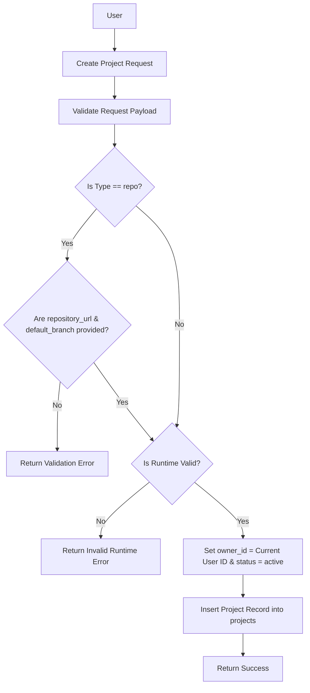

# Introduction

> **Module Type:** Module
> **Version:** 1.1  
> **Status:** Draft  
> **Priority:** Critical  
> **Owner:** Backend Team

---

# 1. Module Overview

## Purpose

The Projects module is responsible for managing projects within the system, including project types (`repo` or `files`), repository connections, runtime environments, framework selection, and project status tracking.

## Scope

### Included

- Project creation with type-specific configurations (`repo` vs `files`)
- Repository URL and default branch management for `repo` type projects
- Runtime configuration (`Node.js`, `Rust`, `Python`, `Go`, `Static Site`)
- Framework and status tracking
- Listing, updating, viewing, and deleting projects

### Excluded

- Users and Authentication (handled in Users/Auth module)
- Organization lifecycle management (handled in Organization module)
- Team assignments (handled in Project Assignments sub-module)
- Project file content operations (handled in Project Files sub-module)
- Project permissions enforcement (handled in Project Permissions sub-module)

---

# 2. Actors

| Actor                 | Action                                      |
| --------------------- | ------------------------------------------- |
| Authenticated User    | Create and manage projects                  |
| System Administrators | Maintain all projects across organizations  |

---

# 3. Business Goals

- Allow users to create, update, delete, and view projects with flexible configuration options.
- Support both repository-backed (`repo`) and direct file-based (`files`) projects.
- Support core runtime environments (`Node.js`, `Rust`, `Python`, `Go`, `Static Site`).

---

# 4. Functional Requirements

## FR-001 Create Project

### Description

Allows an authorized user to create a new project within an organization.

### Inputs

| Field           | Required                          | Descriptions                                                            |
| --------------- | --------------------------------- | ----------------------------------------------------------------------- |
| organization_id | Yes                               | UUID of the parent organization                                         |
| name            | Yes                               | Name of the project                                                     |
| type            | Yes                               | `repo` or `files`                                                       |
| repository_url  | Required if `type` is `repo`      | Git repository URL                                                      |
| default_branch  | Required if `type` is `repo`      | Default branch name (e.g., `main`, `master`)                            |
| runtime         | Yes                               | Runtime: `Node.js`, `Rust`, `Python`, `Go`, `Static Site`               |
| framework       | No                                | Framework name (e.g., `Next.js`, `Actix Web`, `FastAPI`, `Gin`, `Vite`) |
| status          | No                                | Project status (defaults to `active`)                                   |
| descriptions    | No                                | Optional project description                                            |

### Process

1. Validate payload data and conditional field dependencies:
   - If `type == 'repo'`, verify `repository_url` and `default_branch` are provided.
   - Verify `runtime` is one of `Node.js`, `Rust`, `Python`, `Go`, `Static Site`.
2. Verify existence of `organization_id`.
3. Set `owner_id` to current authenticated user's ID.
4. Set default `status = 'active'` if not provided.
5. Create project record in `projects`.

### Success Response

- Project created successfully.

### Failure Cases

- Missing required fields (e.g. missing `repository_url` when `type == 'repo'`).
- Invalid runtime environment specified.
- Invalid `organization_id`.

---

## FR-002 Get Projects

### Description

Lists all projects for an organization.

### Inputs

| Field           | Required | Descriptions                     |
| --------------- | -------- | -------------------------------- |
| organization_id | Yes      | UUID of the organization         |

### Process

1. Find all projects matching `organization_id`.
2. Return project records.

### Success Response

- Projects data retrieved.

### Failure Cases

- Organization not found.

---

## FR-003 Update Project

### Description

Allows a project owner, org developer/admin, or system admin to update project configuration.

### Inputs

| Field           | Required | Descriptions                                              |
| --------------- | -------- | --------------------------------------------------------- |
| name            | No       | Updated project name                                      |
| repository_url  | No       | Updated Git repository URL                                |
| default_branch  | No       | Updated default branch                                    |
| runtime         | No       | Updated runtime environment                               |
| framework       | No       | Updated framework                                         |
| status          | No       | Updated project status (`active`, `archived`, `draft`)    |
| descriptions    | No       | Updated description                                       |

### Process

1. Validate input data and runtime constraints.
2. Verify project existence.
3. Update specified fields in `projects`.

### Success Response

- Project updated.

### Failure Cases

- Project not found.
- Invalid runtime or configuration values.

---

## FR-004 Delete Project

### Description

Allows an authorized user (Project Creator / Org Admin / Org Owner) to delete a project.

### Inputs

| Field | Required | Descriptions            |
| ----- | -------- | ----------------------- |
| id    | Yes      | UUID of the target project|

### Process

1. Validate project existence.
2. Perform permission check (handled in Project Permissions sub-module).
3. Remove project record and clean up associated files / metadata.

### Success Response

- Project removed.

### Failure Cases

- Invalid project ID.
- Unauthorized operation.

---

## FR-005 Get Project by ID

### Description

Retrieves complete project details by project ID.

### Inputs

| Field | Required | Descriptions            |
| ----- | -------- | ----------------------- |
| id    | Yes      | UUID of the target project|

### Process

1. Validate project ID.
2. Return project record.

### Success Response

- Project details retrieved.

### Failure Cases

- Project not found.

---

# 5. Business Rules

| ID     | Rule                                                                                                 |
| ------ | ---------------------------------------------------------------------------------------------------- |
| BR-001 | Project name must be non-empty and unique per organization.                                          |
| BR-002 | Project `type` must be either `repo` or `files`.                                                     |
| BR-003 | If `type == 'repo'`, `repository_url` and `default_branch` are mandatory.                            |
| BR-004 | Project `runtime` must be one of: `Node.js`, `Rust`, `Python`, `Go`, `Static Site`.                  |
| BR-005 | Project must be associated with a valid `organization_id`.                                           |
| BR-006 | The user creating the project is assigned as `owner_id`.                                             |

---

# 6. Validation Rules

## Projects

| Field           | Validation                                                                                         |
| --------------- | -------------------------------------------------------------------------------------------------- |
| organization_id | Required, valid UUID                                                                               |
| name            | Required, non-empty string                                                                         |
| type            | Required, must be `repo` or `files`                                                                |
| repository_url  | Required if `type == 'repo'`, valid URL format                                                     |
| default_branch  | Required if `type == 'repo'`, non-empty string                                                     |
| runtime         | Required, must be one of `Node.js`, `Rust`, `Python`, `Go`, `Static Site`                          |
| framework       | Optional string                                                                                    |
| status          | Optional string, default `active`. Values: `active`, `archived`, `draft`                           |
| descriptions    | Optional string                                                                                    |
| owner_id        | Automatically assigned from authenticated user                                                     |

---

# 7. Authorization Matrix

| Route                | Action | Viewer | Developer | Admin | Owner | System Admin |
| -------------------- | ------ | ------ | --------- | ----- | ----- | ------------ |
| POST /projects       | Create | No     | Yes       | Yes   | Yes   | Yes          |
| GET /projects        | List   | Yes    | Yes       | Yes   | Yes   | Yes          |
| GET /projects/:id    | View   | Yes    | Yes       | Yes   | Yes   | Yes          |
| PUT /projects/:id    | Edit   | No     | Yes       | Yes   | Yes   | Yes          |
| DELETE /projects/:id | Delete | No     | Yes*      | Yes   | Yes   | Yes          |

_\* Developer can delete only self-created projects (`owner_id == self.id`)._

---

# 8. Workflow

## Create Project



---

# 9. Sequence Diagram

---

# 10. Database Design

## Projects

| Field           | Type      | Constraints                                                  |
| --------------- | --------- | ------------------------------------------------------------ |
| id              | UUID      | Primary                                                      |
| organization_id | UUID      | Foreign Key                                                  |
| owner_id        | UUID      | Project Owner                                                |
| name            | VARCHAR   |                                                              |
| type            | VARCHAR   | `repo` or `files`                                            |
| repository_url  | VARCHAR   | Nullable (Required if `type == repo`)                        |
| default_branch  | VARCHAR   | Nullable (Required if `type == repo`)                        |
| runtime         | VARCHAR   | `Node.js`, `Rust`, `Python`, `Go`, `Static Site`             |
| framework       | VARCHAR   | Nullable                                                     |
| status          | VARCHAR   | `active`, `archived`, `draft`                                |
| descriptions    | VARCHAR   | Nullable                                                     |
| created_at      | TIMESTAMP |                                                              |
| updated_at      | TIMESTAMP |                                                              |

---

# 11. API Endpoints

| Method | Endpoint      | Description            |
| ------ | ------------- | ---------------------- |
| GET    | /projects     | Get all projects       |
| POST   | /projects     | Create project         |
| PUT    | /projects/:id | Update project         |
| DELETE | /projects/:id | Delete project         |
| GET    | /projects/:id | Get project by id      |

---

# 12. API Examples

## Create Repo Type Project

```json
POST /projects
{
  "organization_id": "123e4567-e89b-12d3-a456-426614174000",
  "name": "Forge Backend",
  "type": "repo",
  "repository_url": "https://github.com/mislam-dev/forge.git",
  "default_branch": "main",
  "runtime": "Rust",
  "framework": "Actix Web",
  "descriptions": "Main Rust API service"
}
```

### Success Response

```json
{
  "message": "Project created successfully.",
  "data": {
    "id": "07c0060e-8e8c-44c1-942c-3004f5a6c5b6",
    "organization_id": "123e4567-e89b-12d3-a456-426614174000",
    "owner_id": "456e7890-e89b-12d3-a456-426614174000",
    "name": "Forge Backend",
    "type": "repo",
    "repository_url": "https://github.com/mislam-dev/forge.git",
    "default_branch": "main",
    "runtime": "Rust",
    "framework": "Actix Web",
    "status": "active",
    "descriptions": "Main Rust API service",
    "created_at": "2026-08-08T00:00:00Z",
    "updated_at": "2026-08-08T00:00:00Z"
  }
}
```

## Create Files Type Project

```json
POST /projects
{
  "organization_id": "123e4567-e89b-12d3-a456-426614174000",
  "name": "Docs Portal",
  "type": "files",
  "runtime": "Static Site",
  "framework": "Vite",
  "descriptions": "Documentation site project"
}
```

### Success Response

```json
{
  "message": "Project created successfully.",
  "data": {
    "id": "07c0060e-8e8c-44c1-942c-3004f5a6c5b7",
    "organization_id": "123e4567-e89b-12d3-a456-426614174000",
    "owner_id": "456e7890-e89b-12d3-a456-426614174000",
    "name": "Docs Portal",
    "type": "files",
    "repository_url": null,
    "default_branch": null,
    "runtime": "Static Site",
    "framework": "Vite",
    "status": "active",
    "descriptions": "Documentation site project",
    "created_at": "2026-08-08T00:00:00Z",
    "updated_at": "2026-08-08T00:00:00Z"
  }
}
```

---

# 13. Error Codes

| Code    | Description                                             |
| ------- | ------------------------------------------------------- |
| PRJ_001 | Project Not Found                                       |
| PRJ_002 | Invalid Project ID                                      |
| PRJ_003 | Missing Required Field (e.g. repository_url for repo)   |
| PRJ_004 | Invalid Runtime Environment                             |
| PRJ_005 | Invalid Project Type                                    |

---

# 14. Security Requirements

- Role-Based Access Control (RBAC) must be strictly enforced on all protected endpoints.
- Sanitize all user inputs for project creation/updates.

---

# 15. Non-Functional Requirements

| Requirement       | Target |
| ----------------- | ------ |
| API Response Time | <50 ms |

---

# 16. Acceptance Criteria

- Users can create `repo` or `files` projects with runtime specifications.
- `repo` projects mandate `repository_url` and `default_branch`.
- Runtimes are restricted to `Node.js`, `Rust`, `Python`, `Go`, `Static Site`.

---

# 17. Dependencies

- Database
- Organization Module

---

# 18. Assumptions

- System uses centralized database.

---

# 19. Future Enhancements

- Additional runtime support (e.g., Java, Ruby, Elixir).

---

# 20. Appendix

## Related Documents

- Project Files Sub-Module Design
- Project Assignments Sub-Module Design
- Project Permissions Sub-Module Design
