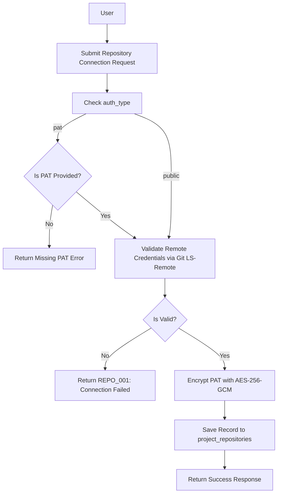

# Introduction

> **Module Type:** Module
> **Version:** 1.0  
> **Status:** Draft  
> **Priority:** Critical  
> **Owner:** Backend Team

---

# 1. Module Overview

## Purpose

The Repository module manages Git repository connections for projects. It supports connecting Public Git Repositories and Private Git Repositories via Personal Access Tokens (PAT), repository validation, cloning, fetching the latest commits, and switching active branches.

## Scope

### Included

- Public Git Repository connection
- Private Git Repository connection using Personal Access Tokens (PAT)
- Repository validation and credential verification
- Asynchronous repository cloning into working build spaces
- Fetching latest commit details (SHA, commit message, author, timestamp)
- Listing remote branches and changing active branch
- Encryption at rest for Personal Access Tokens (AES-256-GCM)

### Excluded

- Project lifecycle management (handled in Projects module)
- File tree editing inside project repository (handled in Project Files sub-module)
- User authentication (handled in Users/Auth module)

---

# 2. Actors & Responsibilities

| Actor / Entity  | Access & Responsibilities                                                                       |
| --------------- | ----------------------------------------------------------------------------------------------- |
| Project Owner   | Connect, validate, update credentials, change branches, and trigger repository cloning/syncing. |
| Org Admin / Dev | Validate connection, switch active branch, trigger repository sync and commit fetch.            |
| Project Viewer  | View connected repository metadata, branch list, and commit history (read-only).                |
| Build Engine    | Asynchronously clone repository and fetch latest commit hashes during build and deployment.     |
| System Admin    | Full management across all project repository connections.                                      |

---

# 3. Business Goals

- Support seamless integration with Public Git Repositories and Private Git Repositories using Personal Access Tokens (PAT).
- Ensure credentials (PATs) are validated before saving and encrypted using AES-256-GCM at rest.
- Provide reliable APIs for cloning repositories, fetching latest commits, and managing branch selection per project.

---

# 4. Functional Requirements

## FR-001 Validate Repository Connection

### Description

Validates repository existence and credential access before connecting or saving.

### Inputs

| Field          | Required                       | Descriptions                                            |
| -------------- | ------------------------------ | ------------------------------------------------------- |
| project_id     | Yes                            | UUID of the project                                     |
| repository_url | Yes                            | Git repository URL (e.g. `https://github.com/org/repo`) |
| auth_type      | Yes                            | `public` or `pat`                                       |
| access_token   | Required if `auth_type == pat` | Personal Access Token string                            |

### Process

1. Validate input URL format.
2. If `auth_type == 'public'`, execute remote ping (`git ls-remote`) without credentials.
3. If `auth_type == 'pat'`, construct authenticated remote request using `access_token`.
4. If remote check succeeds, return validation status `success` with available default branches.

### Success Response

- Repository validated successfully.

### Failure Cases

- Repository not found or inaccessible (`REPO_001`).
- Invalid access token or authentication failed (`REPO_002`).

---

## FR-002 Connect / Save Repository

### Description

Saves or updates repository connection settings for a project.

### Inputs

| Field          | Required                       | Descriptions                             |
| -------------- | ------------------------------ | ---------------------------------------- |
| project_id     | Yes                            | UUID of the target project               |
| repository_url | Yes                            | Git repository URL                       |
| auth_type      | Yes                            | `public` or `pat`                        |
| access_token   | Required if `auth_type == pat` | Personal Access Token string             |
| default_branch | No                             | Default branch name (defaults to `main`) |

### Process

1. Execute validation check (`FR-001`).
2. If `auth_type == 'pat'`, encrypt `access_token` using AES-256-GCM secret key.
3. Create or update record in `project_repositories`.
4. Update connected status on project record.

### Success Response

- Repository connected successfully.

### Failure Cases

- Validation failure (`REPO_001`, `REPO_002`).
- Project not found.

---

## FR-003 Clone Repository

### Description

Asynchronously clones the connected Git repository into an isolated workspace directory.

### Inputs

| Field       | Required | Descriptions                                                    |
| ----------- | -------- | --------------------------------------------------------------- |
| project_id  | Yes      | UUID of the project                                             |
| target_path | No       | Destination path in workspace (defaults to project build space) |
| branch      | No       | Branch to clone (defaults to connected `active_branch`)         |

### Process

1. Fetch repository configuration from `project_repositories`.
2. Decrypt `access_token_encrypted` if `auth_type == 'pat'`.
3. Construct secure clone command injecting credentials safely into memory buffer (prevent leaking token in command line args).
4. Perform git clone operation to `target_path`.
5. Update `status` to `cloned`.

### Success Response

- Repository cloned successfully.

### Failure Cases

- Clone failed due to network error or disk space (`REPO_003`).

---

## FR-004 Fetch Latest Commit

### Description

Fetches latest commit metadata for the active branch of the connected repository.

### Inputs

| Field      | Required | Descriptions                                        |
| ---------- | -------- | --------------------------------------------------- |
| project_id | Yes      | UUID of the project                                 |
| branch     | No       | Target branch (defaults to active `default_branch`) |

### Process

1. Fetch repository connection info.
2. Query remote HEAD reference for specified branch (`git ls-remote` / API).
3. Extract commit SHA, commit message, author, and timestamp.
4. Update `last_commit_sha`, `last_commit_message`, `last_commit_at` in `project_repositories`.

### Success Response

- Latest commit details retrieved.

### Failure Cases

- Branch not found (`REPO_004`).
- Connection failed (`REPO_001`).

---

## FR-005 Change Active Branch

### Description

Changes the active working branch for the project.

### Inputs

| Field      | Required | Descriptions                    |
| ---------- | -------- | ------------------------------- |
| project_id | Yes      | UUID of the project             |
| branch     | Yes      | Target branch name (e.g. `dev`) |

### Process

1. Fetch remote branch list to verify branch existence.
2. Update `active_branch` in `project_repositories`.
3. Trigger latest commit fetch for newly selected branch (`FR-004`).

### Success Response

- Active branch updated.

### Failure Cases

- Specified branch does not exist on remote (`REPO_004`).

---

## FR-006 List Remote Branches

### Description

Lists all remote branches available in the connected Git repository.

### Inputs

| Field      | Required | Descriptions        |
| ---------- | -------- | ------------------- |
| project_id | Yes      | UUID of the project |

### Process

1. Fetch repository credentials.
2. Execute remote branch query (`git ls-remote --heads`).
3. Return list of available branch names.

### Success Response

- Branch list retrieved.

### Failure Cases

- Repository inaccessible (`REPO_001`).

---

# 5. Business Rules

| ID     | Rule                                                                                    |
| ------ | --------------------------------------------------------------------------------------- |
| BR-001 | A project can connect one active Git repository.                                        |
| BR-002 | Private repositories require a valid Personal Access Token (`PAT`).                     |
| BR-003 | Personal Access Tokens MUST be encrypted at rest using AES-256-GCM before DB insertion. |
| BR-004 | Plaintext PAT tokens MUST NEVER be returned in API responses or written to log outputs. |
| BR-005 | Repository connections must pass validation (`FR-001`) before saving to database.       |

---

# 6. Validation Rules

## Repository Connection

| Field          | Validation                                                  |
| -------------- | ----------------------------------------------------------- |
| project_id     | Required, valid UUID                                        |
| repository_url | Required, valid Git URL format (`https://...` or `git@...`) |
| auth_type      | Required, must be `public` or `pat`                         |
| access_token   | Required if `auth_type == 'pat'`, non-empty string          |
| default_branch | Optional, string                                            |

---

# 7. Authorization Matrix

| Route                                  | Action              | Viewer | Developer | Admin | Owner | System Admin |
| -------------------------------------- | ------------------- | ------ | --------- | ----- | ----- | ------------ |
| POST /projects/:id/repository/validate | Validate Connection | Yes    | Yes       | Yes   | Yes   | Yes          |
| POST /projects/:id/repository          | Connect / Save      | No     | Yes       | Yes   | Yes   | Yes          |
| GET /projects/:id/repository           | View Repo Info      | Yes    | Yes       | Yes   | Yes   | Yes          |
| POST /projects/:id/repository/clone    | Trigger Clone       | No     | Yes       | Yes   | Yes   | Yes          |
| GET /projects/:id/repository/commit    | Fetch Latest Commit | Yes    | Yes       | Yes   | Yes   | Yes          |
| PUT /projects/:id/repository/branch    | Change Branch       | No     | Yes       | Yes   | Yes   | Yes          |
| GET /projects/:id/repository/branches  | List Branches       | Yes    | Yes       | Yes   | Yes   | Yes          |

---

# 8. Workflow

## Validate & Connect Repository Workflow



---

# 9. Sequence Diagram

---

# 10. Database Design

## Project Repositories Table (`project_repositories`)

| Field                  | Type      | Constraints                                |
| ---------------------- | --------- | ------------------------------------------ |
| id                     | UUID      | Primary                                    |
| project_id             | UUID      | Foreign Key to `projects`                  |
| repository_url         | VARCHAR   | Git repository URL                         |
| auth_type              | VARCHAR   | `public` or `pat`                          |
| access_token_encrypted | TEXT      | Nullable (AES-256-GCM encrypted PAT token) |
| default_branch         | VARCHAR   | Default branch (e.g. `main`)               |
| active_branch          | VARCHAR   | Active working branch (e.g. `main`, `dev`) |
| last_commit_sha        | VARCHAR   | Nullable (Latest commit SHA hash)          |
| last_commit_message    | TEXT      | Nullable                                   |
| last_commit_at         | TIMESTAMP | Nullable                                   |
| status                 | VARCHAR   | `connected`, `cloned`, `error`             |
| created_at             | TIMESTAMP |                                            |
| updated_at             | TIMESTAMP |                                            |

---

# 11. API Endpoints

| Method | Endpoint                          | Description                                   |
| ------ | --------------------------------- | --------------------------------------------- |
| POST   | /projects/:id/repository/validate | Test/validate repository URL and credentials  |
| POST   | /projects/:id/repository          | Save repository connection for project        |
| GET    | /projects/:id/repository          | Get connected repository configuration        |
| POST   | /projects/:id/repository/clone    | Trigger repository clone operation            |
| GET    | /projects/:id/repository/commit   | Fetch latest commit details for active branch |
| PUT    | /projects/:id/repository/branch   | Change active working branch                  |
| GET    | /projects/:id/repository/branches | List all remote branches                      |

---

# 12. API Examples

## Validate Private Repository (PAT)

```json
POST /projects/07c0060e-8e8c-44c1-942c-3004f5a6c5b6/repository/validate
{
  "repository_url": "https://github.com/mislam-dev/forge-private.git",
  "auth_type": "pat",
  "access_token": "github_pat_11ABCXYZ123456789"
}
```

### Success Response

```json
{
  "message": "Repository validation successful.",
  "data": {
    "is_valid": true,
    "default_branch": "main",
    "branches": ["main", "dev", "feature/auth"]
  }
}
```

## Save Repository Connection

```json
POST /projects/07c0060e-8e8c-44c1-942c-3004f5a6c5b6/repository
{
  "repository_url": "https://github.com/mislam-dev/forge-private.git",
  "auth_type": "pat",
  "access_token": "github_pat_11ABCXYZ123456789",
  "default_branch": "main"
}
```

### Success Response

```json
{
  "message": "Repository connected successfully.",
  "data": {
    "id": "repo-98765432-8e8c-44c1-942c-3004f5a6c5b6",
    "project_id": "07c0060e-8e8c-44c1-942c-3004f5a6c5b6",
    "repository_url": "https://github.com/mislam-dev/forge-private.git",
    "auth_type": "pat",
    "default_branch": "main",
    "active_branch": "main",
    "status": "connected",
    "created_at": "2026-08-08T00:00:00Z"
  }
}
```

## Fetch Latest Commit

```json
GET /projects/07c0060e-8e8c-44c1-942c-3004f5a6c5b6/repository/commit
```

### Success Response

```json
{
  "message": "Latest commit retrieved.",
  "data": {
    "branch": "main",
    "sha": "a1b2c3d4e5f67890123456789abcdef012345678",
    "message": "feat: update repository module design",
    "author": "Monirul Islam <monirul@example.com>",
    "timestamp": "2026-08-08T12:00:00Z"
  }
}
```

## Change Active Branch

```json
PUT /projects/07c0060e-8e8c-44c1-942c-3004f5a6c5b6/repository/branch
{
  "branch": "dev"
}
```

### Success Response

```json
{
  "message": "Active branch updated successfully.",
  "data": {
    "active_branch": "dev",
    "last_commit_sha": "f9e8d7c6b5a43210987654321fedcba098765432"
  }
}
```

---

# 13. Error Codes

| Code     | Description                                           |
| -------- | ----------------------------------------------------- |
| REPO_001 | Repository Inaccessible or Not Found                  |
| REPO_002 | Authentication Failed (Invalid Personal Access Token) |
| REPO_003 | Repository Clone Failed                               |
| REPO_004 | Target Branch Not Found on Remote                     |
| REPO_005 | Encryption Error During Secret Storage                |

---

# 14. Security Requirements

- Personal Access Tokens (PAT) MUST be encrypted using AES-256-GCM prior to storage.
- Never output raw access tokens in log files, CLI executions, or API GET responses.
- Git operations must use temporary credential helpers or memory streams to prevent token exposure.

---

# 15. Non-Functional Requirements

| Requirement                | Target  |
| -------------------------- | ------- |
| Connection Validation Time | <500 ms |
| Commit Metadata Fetch Time | <150 ms |

---

# 16. Acceptance Criteria

- Users can connect public repositories without credentials.
- Users can connect private repositories using valid PAT tokens.
- PAT tokens are encrypted at rest using AES-256-GCM.
- Latest commit metadata can be fetched and active working branches switched.

---

# 17. Dependencies

- Projects Module

---

# 18. Assumptions

- Git binary or native libgit2 library is available in application runtime environment.

---

# 19. Future Enhancements

- OAuth 2.0 Integration for GitHub, GitLab, and Bitbucket.
- Webhook trigger auto-sync on commit pushes.

---

# 20. Appendix

## Related Documents

- Projects Module Design
- Project Files Sub-Module Design
