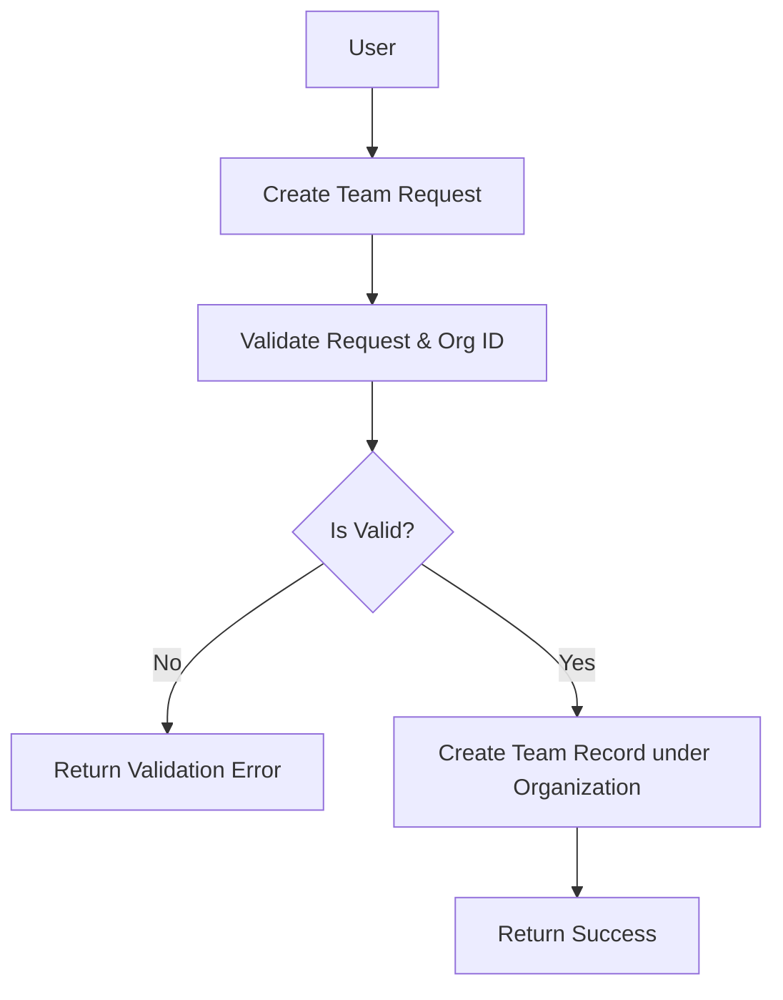
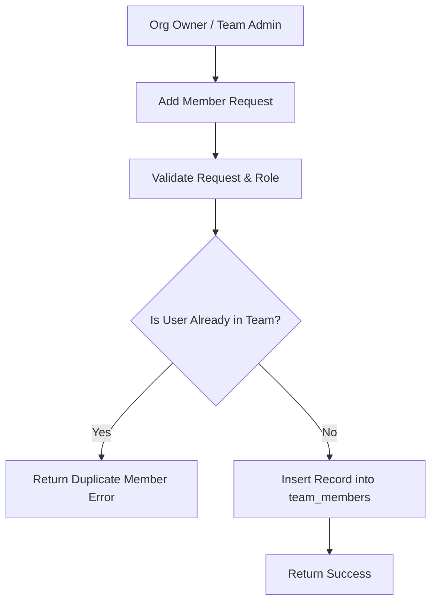

# Introduction

> **Module Type:** Module
> **Version:** 1.0  
> **Status:** Draft  
> **Priority:** Critical  
> **Owner:** Backend Team

---

# 1. Module Overview

## Purpose

The Teams module is responsible for managing teams and their structures within an organization, including team creation, metadata management, and member role assignments (`admin`, `developer`, `viewer`). The Organization Owner implicitly owns all teams created within their organization.

## Scope

### Included

- Team creation within an organization
- Updating team details and metadata
- Deleting teams
- Listing teams by organization
- Managing team members (adding, updating roles, removing)
- Team member role types: `admin`, `developer`, `viewer`

### Excluded

- Project-level permission enforcement (handled in Projects / Project Permissions module)
- Organization lifecycle management (handled in Organization module)
- User authentication and profile management (handled in Users/Auth module)

---

# 2. Actors & Team Roles Hierarchy

| Role / Entity          | Scope                | Access & Responsibilities                                                                           |
| ---------------------- | -------------------- | --------------------------------------------------------------------------------------------------- |
| **Organization Owner** | `organization_id`    | Implicit owner of all teams within the organization. Full control to create, rename, delete teams, and manage members. |
| **Team Admin**         | `team_members` role  | Can update team details and add/remove team members (`developer`, `viewer`).                       |
| **Team Developer**     | `team_members` role  | Standard team member. Can view team details and member lists.                                       |
| **Team Viewer**        | `team_members` role  | Read-only access to team details and team member lists.                                             |

---

# 3. Business Goals

- Allow users to create structured teams inside their organization.
- Ensure the Organization Owner automatically possesses full ownership rights over all organization teams.
- Support defined team member roles: `admin`, `developer`, and `viewer`.
- Provide full team member lifecycle management (add, list, update role, remove).

---

# 4. Functional Requirements

## FR-001 Create Team

### Description

Allows an authenticated user to create a new team within an organization.

### Inputs

| Field           | Required | Descriptions                     |
| --------------- | -------- | -------------------------------- |
| organization_id | Yes      | UUID of the parent organization  |
| name            | Yes      | Name of the team                 |
| descriptions    | No       | Optional team description        |

### Process

1. Validate request data.
2. Verify existence of `organization_id`.
3. Create team record in `teams`.

### Success Response

- Team created successfully under the organization.

### Failure Cases

- Missing required fields.
- Invalid or non-existent `organization_id`.

---

## FR-002 Get Teams

### Description

Lists all teams belonging to an organization.

### Inputs

| Field           | Required | Descriptions                     |
| --------------- | -------- | -------------------------------- |
| organization_id | Yes      | UUID of the organization         |

### Process

1. Find all `teams` matching `organization_id`.
2. Return list of teams.

### Success Response

- Teams retrieved.

### Failure Cases

- Organization not found.

---

## FR-003 Update Team

### Description

Allows an Organization Owner or Team Admin to update team details.

### Inputs

| Field        | Required | Descriptions                     |
| ------------ | -------- | -------------------------------- |
| id           | Yes      | UUID of the team                 |
| name         | No       | New name of the team             |
| descriptions | No       | New description                  |

### Process

1. Validate request data.
2. Verify user is Organization Owner or has `admin` role in `team_members`.
3. Update team record.

### Success Response

- Team details updated.

### Failure Cases

- Team not found.
- Unauthorized requester.

---

## FR-004 Delete Team

### Description

Allows an Organization Owner or System Admin to delete a team.

### Inputs

| Field | Required | Descriptions        |
| ----- | -------- | ------------------- |
| id    | Yes      | UUID of the team    |

### Process

1. Validate request data.
2. Verify user is Organization Owner or System Admin.
3. Delete all associated records from `team_members`.
4. Delete record from `teams`.

### Success Response

- Team deleted.

### Failure Cases

- Team not found.
- Unauthorized requester (non-owner).

---

## FR-005 Add Team Member

### Description

Allows an Organization Owner or Team Admin to add a member to the team with a specific role.

### Inputs

| Field   | Required | Descriptions                                  |
| ------- | -------- | --------------------------------------------- |
| team_id | Yes      | UUID of the team                              |
| user_id | Yes      | UUID of the user to add                       |
| role    | Yes      | Member role (`admin`, `developer`, `viewer`)  |

### Process

1. Validate request data and check role validity (`admin`, `developer`, `viewer`).
2. Verify requester authorization (Organization Owner or Team `admin` in `team_members`).
3. Verify user existence in Users module.
4. Check for duplicate membership (`team_id`, `user_id`).
5. Insert record into `team_members`.

### Success Response

- Member added to team.

### Failure Cases

- User already in team.
- Invalid role specified.
- Unauthorized requester.

---

## FR-006 Update Team Member Role

### Description

Allows an Organization Owner or Team Admin to update a member's role in the team.

### Inputs

| Field   | Required | Descriptions                                  |
| ------- | -------- | --------------------------------------------- |
| team_id | Yes      | UUID of the team                              |
| user_id | Yes      | UUID of the member to update                  |
| role    | Yes      | New role (`admin`, `developer`, `viewer`)     |

### Process

1. Validate request data.
2. Verify requester authorization (Organization Owner or Team `admin`).
3. Update `role` in `team_members`.

### Success Response

- Member role updated.

### Failure Cases

- Member not found in team.
- Unauthorized operation.

---

## FR-007 Remove Team Member

### Description

Allows an Organization Owner or Team Admin to remove a member from the team.

### Inputs

| Field   | Required | Descriptions                 |
| ------- | -------- | ---------------------------- |
| team_id | Yes      | UUID of the team             |
| user_id | Yes      | UUID of the member to remove |

### Process

1. Validate request data.
2. Verify requester authorization (Organization Owner or Team `admin`).
3. Delete record from `team_members`.

### Success Response

- Member removed from team.

### Failure Cases

- Member not found in team.
- Unauthorized requester.

---

## FR-008 List Team Members

### Description

Lists all members of a specific team along with their roles.

### Inputs

| Field   | Required | Descriptions        |
| ------- | -------- | ------------------- |
| team_id | Yes      | UUID of the team    |

### Process

1. Verify team existence.
2. Find all `team_members` for `team_id`.
3. Return members list.

### Success Response

- Team members retrieved.

### Failure Cases

- Team not found.

---

# 5. Business Rules

| ID     | Rule                                                                                                  |
| ------ | ----------------------------------------------------------------------------------------------------- |
| BR-001 | Every team must belong to a valid `organization_id`.                                                  |
| BR-002 | The Organization Owner (`organizations.owner_user_id`) is implicitly the owner of all teams in that org.|
| BR-003 | Team member roles in `team_members` must be one of: `admin`, `developer`, `viewer`.                   |
| BR-004 | Team Admins can add, update, or remove team members (`developer`, `viewer`).                          |

---

# 6. Validation Rules

## Teams

| Field           | Validation   |
| --------------- | ------------ |
| organization_id | Required     |
| name            | Required     |
| descriptions    | Not required |

## Team Members

| Field   | Validation                                                  |
| ------- | ----------------------------------------------------------- |
| team_id | Required                                                    |
| user_id | Required                                                    |
| role    | Required, must be one of `admin`, `developer`, `viewer`     |

---

# 7. Authorization Matrix

| Route                                  | Action             | Organization Owner | Team Admin | Developer | Viewer | System Admin |
| -------------------------------------- | ------------------ | ------------------ | ---------- | --------- | ------ | ------------ |
| POST /teams                            | Create Team        | Yes                | Yes        | Yes       | Yes    | Yes          |
| GET /teams                             | List Teams         | Yes                | Yes        | Yes       | Yes    | Yes          |
| GET /teams/:id                         | View Team Details  | Yes                | Yes        | Yes       | Yes    | Yes          |
| PUT /teams/:id                         | Update Team        | Yes                | Yes        | No        | No     | Yes          |
| DELETE /teams/:id                      | Delete Team        | Yes                | No         | No        | No     | Yes          |
| POST /teams/:id/members                | Add Member         | Yes                | Yes        | No        | No     | Yes          |
| GET /teams/:id/members                 | List Members       | Yes                | Yes        | Yes       | Yes    | Yes          |
| PUT /teams/:id/members/:user_id        | Update Member Role | Yes                | Yes        | No        | No     | Yes          |
| DELETE /teams/:id/members/:user_id     | Remove Member      | Yes                | Yes        | No        | No     | Yes          |

---

# 8. Workflow

## Create Team Workflow



## Add Team Member Workflow



---

# 9. Sequence Diagram

---

# 10. Database Design

## Teams

| Field           | Type      | Constraints |
| --------------- | --------- | ----------- |
| id              | UUID      | Primary     |
| organization_id | UUID      | Foreign Key |
| name            | VARCHAR   |             |
| descriptions    | VARCHAR   |             |
| created_at      | TIMESTAMP |             |
| updated_at      | TIMESTAMP |             |

## Team Members

| Field      | Type      | Constraints                 |
| ---------- | --------- | --------------------------- |
| id         | UUID      | Primary                     |
| team_id    | UUID      | Foreign Key                 |
| user_id    | UUID      | Foreign Key                 |
| role       | VARCHAR   | e.g. admin, developer, viewer |
| created_at | TIMESTAMP |                             |
| updated_at | TIMESTAMP |                             |

---

# 11. API Endpoints

| Method | Endpoint                        | Description                       |
| ------ | ------------------------------- | --------------------------------- |
| POST   | /teams                          | Create a new team                 |
| GET    | /teams                          | List teams (filter by org)        |
| GET    | /teams/:id                      | Get team details                  |
| PUT    | /teams/:id                      | Update team details               |
| DELETE | /teams/:id                      | Delete team                       |
| POST   | /teams/:id/members              | Add member to team                |
| GET    | /teams/:id/members              | List team members                 |
| PUT    | /teams/:id/members/:user_id     | Update team member role           |
| DELETE | /teams/:id/members/:user_id     | Remove member from team           |

---

# 12. API Examples

## Create Team

```json
POST /teams
{
  "organization_id": "123e4567-e89b-12d3-a456-426614174000",
  "name": "Backend Engineering",
  "descriptions": "Core API and services team"
}
```

### Success Response

```json
{
  "message": "Team created successfully.",
  "data": {
    "id": "team-07c0060e-8e8c-44c1-942c-3004f5a6c5b6",
    "organization_id": "123e4567-e89b-12d3-a456-426614174000",
    "name": "Backend Engineering",
    "descriptions": "Core API and services team",
    "created_at": "2026-08-08T00:00:00Z",
    "updated_at": "2026-08-08T00:00:00Z"
  }
}
```

## Add Team Member

```json
POST /teams/team-07c0060e-8e8c-44c1-942c-3004f5a6c5b6/members
{
  "user_id": "987f6543-e21b-32d1-b654-987654321000",
  "role": "developer"
}
```

### Success Response

```json
{
  "message": "Member added to team.",
  "data": {
    "id": "tm-abc12345-8e8c-44c1-942c-3004f5a6c5b6",
    "team_id": "team-07c0060e-8e8c-44c1-942c-3004f5a6c5b6",
    "user_id": "987f6543-e21b-32d1-b654-987654321000",
    "role": "developer",
    "created_at": "2026-08-08T00:00:00Z",
    "updated_at": "2026-08-08T00:00:00Z"
  }
}
```

## Update Team Member Role

```json
PUT /teams/team-07c0060e-8e8c-44c1-942c-3004f5a6c5b6/members/987f6543-e21b-32d1-b654-987654321000
{
  "role": "admin"
}
```

### Success Response

```json
{
  "message": "Team member role updated.",
  "data": {
    "id": "tm-abc12345-8e8c-44c1-942c-3004f5a6c5b6",
    "team_id": "team-07c0060e-8e8c-44c1-942c-3004f5a6c5b6",
    "user_id": "987f6543-e21b-32d1-b654-987654321000",
    "role": "admin",
    "updated_at": "2026-08-08T00:00:00Z"
  }
}
```

## List Team Members

```json
GET /teams/team-07c0060e-8e8c-44c1-942c-3004f5a6c5b6/members
```

### Success Response

```json
{
  "data": [
    {
      "id": "tm-abc12345-8e8c-44c1-942c-3004f5a6c5b6",
      "team_id": "team-07c0060e-8e8c-44c1-942c-3004f5a6c5b6",
      "user_id": "987f6543-e21b-32d1-b654-987654321000",
      "role": "developer",
      "created_at": "2026-08-08T00:00:00Z"
    }
  ],
  "message": "Team members retrieved."
}
```

---

# 13. Error Codes

| Code     | Description                             |
| -------- | --------------------------------------- |
| TEAM_001 | Team Not Found                          |
| TEAM_002 | Member Already Exists in Team           |
| TEAM_003 | Member Not Found in Team                |
| TEAM_005 | Invalid Team Member Role                |

---

# 14. Security Requirements

- Role-Based Access Control must be enforced on team operations.
- Organization Owners implicitly have full control over all teams.
- Team Admins can manage team details and members.

---

# 15. Non-Functional Requirements

| Requirement       | Target |
| ----------------- | ------ |
| API Response Time | <50 ms |

---

# 16. Acceptance Criteria

- Teams belong to an organization without storing an explicit team `owner_id`.
- The Organization Owner automatically holds full owner permissions over all organization teams.
- Team member roles in `team_members` are strictly `admin`, `developer`, or `viewer`.

---

# 17. Dependencies

- Organization Module
- Users Module

---

# 18. Assumptions

- System uses centralized database.

---

# 19. Future Enhancements

- Sub-teams / nested team hierarchies.

---

# 20. Appendix

## Related Documents

- Organization Module Design
- Projects Module Design
