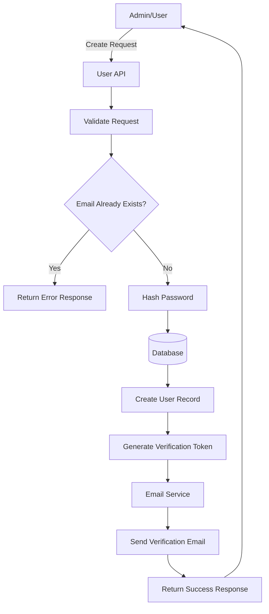
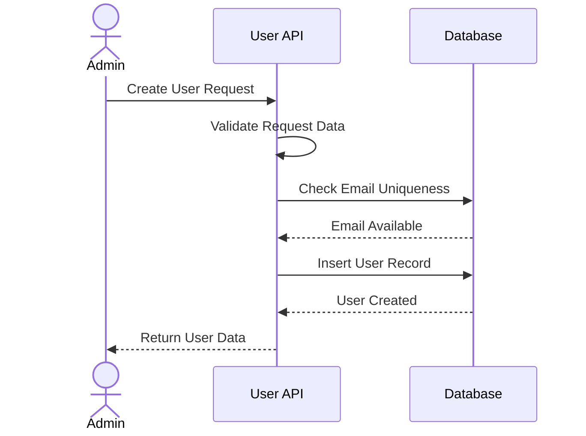

# Introduction

> **Module Type:** Core Module  
> **Version:** 1.0  
> **Status:** Draft  
> **Priority:** Critical  
> **Owner:** Backend Team

---

# 1. Module Overview

## Purpose

The User module is responsible for managing user's information and connect user to auth module

## Scope

### Included

- User (Create, Read, Update, Delete)
- Email Verification

### Excluded

- User Authentication
- Access Control
- User Profile Management (see [User Profile Sub-Module](./user-profile-module.md))

---

# 2. Actors

| Actor | Description               |
| ----- | ------------------------- |
| User  | Authenticated system user |
| Admin | System administrator      |
| Guest | Unauthenticated visitor   |

---

# 3. Business Goals

- Allow admins to create, update, retrieve, and delete user accounts.
- Enforce email uniqueness and email verification flow.
- Manage user status lifecycle (Unverified → Active → Disabled/Suspended).
- Profile management is handled in the [User Profile Sub-Module](./user-profile-module.md).

---

# 4. Functional Requirements

## FR-001 Create User

### Description

Allows a admin to create user information.

### Inputs

| Field            | Required | Descriptions                       |
| ---------------- | -------- | ---------------------------------- |
| Name             | Yes      | Display Name                       |
| Email            | Yes      |                                    |
| Password         | Yes      | Must be strong and minimum 8 chars |
| Confirm Password | Yes      |                                    |

### Process

1. Validate request data.
2. Verify email uniqueness.
3. Hash password.
4. Create user record.
5. Generate email verification token.
6. Send verification email.

### Success Response

- User account created.
- Verification email sent.

### Failure Cases

- Email already exists.
- Invalid email.
- Weak password.
- Missing required fields.

---

## FR-002 Update User

### Description

Allows a admin to update user information.

### Inputs

| Field | Required |
| ----- | -------- |
| Name  | No       |

### Process

1. Validate request data.
2. Update user record.

### Success Response

- User data updated.

### Failure Cases

- Invalid data.

---

## FR-003 Get User

### Description

Allows a admin to get user information.

### Inputs

| Field   | Required | Descriptions      |
| ------- | -------- | ----------------- |
| user_id | Yes      | User id as params |

### Process

1. Verify user_id exists.
2. Get user record.

### Success Response

- User account found.

### Failure Cases

- User account not found.

---

## FR-004 Delete User

### Description

Allows a admin to delete user information.

### Inputs

| Field   | Required | Descriptions      |
| ------- | -------- | ----------------- |
| user_id | Yes      | User id as params |

### Process

1. Verify user_id exists.
2. Get user record.

### Success Response

- User account deleted.

### Failure Cases

- User account not found.

---

> 📄 Profile-related functional requirements (FR-005 through FR-007) have been moved to the [User Profile Sub-Module](./user-profile-module.md).

## FR-005 Verify User Email

### Description

Allows a user to verify their email using a token.

### Inputs

| Field | Required | Descriptions      |
| ----- | -------- | ----------------- |
| token | Yes      | User id as params |

### Process

1. Verify token exists.
2. Verify token is valid.
3. Verify token is not expired.
4. Get user profile record.
5. Mark token as verified.
6. Update user status to Active.

### Success Response

- User profile found.

### Failure Cases

- User profile not found.

---

# 5. Business Rules

| ID     | Rule                                                                                          |
| ------ | --------------------------------------------------------------------------------------------- |
| BR-001 | Email must be unique.                                                                         |
| BR-002 | Profile-specific business rules are defined in the [User Profile Sub-Module](./user-profile-module.md). |

---

# 6. Validation Rules

---

# 7. Authorization Matrix

| Action      | Guest | User | Admin |
| ----------- | :---: | :--: | :---: |
| Create User |  ❌   |  ❌  |  ✅   |
| Update User |  ❌   |  ❌  |  ✅   |
| Get User    |  ❌   |  ✅  |  ✅   |
| Delete User |  ❌   |  ❌  |  ✅   |

> 📄 Profile authorization matrix is defined in the [User Profile Sub-Module](./user-profile-module.md).

---

# 8. Workflow

## User Creation



---

# 9. Sequence Diagram



---

# 10. Database Design

## users

| Field          | Type        |
| -------------- | ----------- |
| id             | UUID        |
| name           | VARCHAR     |
| email          | VARCHAR     |
| password_hash  | TEXT        |
| email_verified | BOOLEAN     |
| created_at     | TIMESTAMP   |
| updated_at     | TIMESTAMP   |
| status         | Status Enum |

### Status Enum

- Active
- Unverified
- Disabled
- Suspended
- Inactive

---

> 📄 The `users-profile` table schema is defined in the [User Profile Sub-Module](./user-profile-module.md).

## user-tokens

| Field       | Type      |
| ----------- | --------- |
| id          | UUID      |
| token       | VARCHAR   |
| created_at  | TIMESTAMP |
| expired_at  | TIMESTAMP |
| user_id     | UUID (FK) |
| is_verified | BOOLEAN   |
| verified_at | TIMESTAMP |

---

---

# 11. API Endpoints

| Method | Endpoint             | Description   |
| ------ | -------------------- | ------------- |
| POST   | /users/              | Create user   |
| GET    | /users/              | Get all users |
| GET    | /users/{id}          | Get user by id|
| PUT    | /users/{id}          | Update user   |
| DELETE | /users/{id}          | Delete user   |
| GET    | /users/verify/:token | Verify email  |

> 📄 Profile-related endpoints (`/users/{id}/profile`) are documented in the [User Profile Sub-Module](./user-profile-module.md).

---

# 12. API Examples

## Create User Request

```json
{
  "name": "John Doe",
  "email": "john@example.com",
  "password": "password123",
  "confirm_password": "password123"
}
```

### Success Response

```json
{
  "id": "123e4567-e89b-12d3-a456-426614174000",
  "name": "John Doe",
  "email": "john@example.com",
  "status": "Unverified",
  "created_at": "2026-08-04T12:00:00Z"
}
```

### Error Response

```json
{
  "error": "USER_002",
  "message": "Email already exists"
}
```

---

# 13. Error Codes

| Code     | Description                |
| -------- | -------------------------- |
| USER_001 | User Not Found             |
| USER_002 | Email Already Exists       |
| USER_003 | Invalid Input Data         |
| USER_004 | Invalid Verification Token |
| USER_005 | Token Expired              |
| USER_006 | Missing Required Fields    |

> 📄 Profile-specific error codes are defined in the [User Profile Sub-Module](./user-profile-module.md).

---

# 14. Security Requirements

- Passwords must be hashed using BCrypt or Argon2 before storage.
- HTTPS is mandatory for all user data transmission.
- Email verification tokens must expire automatically (e.g., after 24 hours).
- Protect against brute-force attacks on verification endpoints.
- Profile-specific security requirements are defined in the [User Profile Sub-Module](./user-profile-module.md).

---

# 15. Non-Functional Requirements

| Requirement                 | Target          |
| --------------------------- | --------------- |
| User Retrieval Time         | < 200ms         |
| User Creation Response Time | < 500ms         |
| Availability                | 99.9%           |
| Scalability                 | 1,000,000 Users |

> 📄 Profile-specific NFRs are defined in the [User Profile Sub-Module](./user-profile-module.md).

---

# 16. Acceptance Criteria

- Users can be created, updated, retrieved, and deleted successfully.
- Duplicate emails are rejected during user creation.
- Requesting an invalid user ID returns a `404 Not Found` error.
- Verification tokens update user status to Active when used.
- Expired or invalid verification tokens are rejected.

> 📄 Profile-specific acceptance criteria are defined in the [User Profile Sub-Module](./user-profile-module.md).

---

# 17. Dependencies

- Database
- Email Service
- Password Hashing Library
- [User Profile Sub-Module](./user-profile-module.md)

---

# 18. Assumptions

- Email service is operational for sending verification emails.
- Database is highly available.
- HTTPS is enabled for all environments.

---

# 19. Future Enhancements

- Soft delete for user accounts.
- Activity logs for user actions (audit trail).
- Role-Based Access Control (RBAC) integration.
- Profile-specific enhancements are tracked in the [User Profile Sub-Module](./user-profile-module.md).

---

# 20. Appendix

## Related Documents

- [User Profile Sub-Module](./user-profile-module.md)
- System Architecture
- API Documentation
- Database Design
- Deployment Guide
- Security Policy

---

**Document Version:** 1.0  
**Last Updated:** 2026-08-05  
**Author:** Monirul Islam
