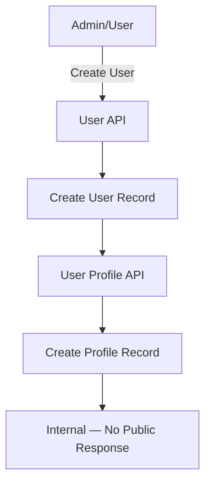
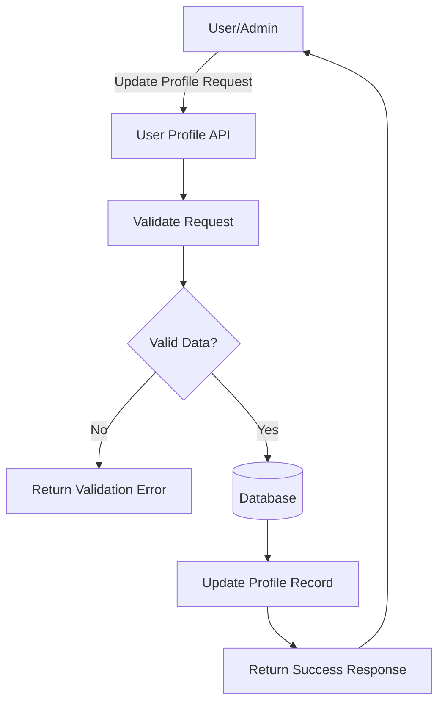
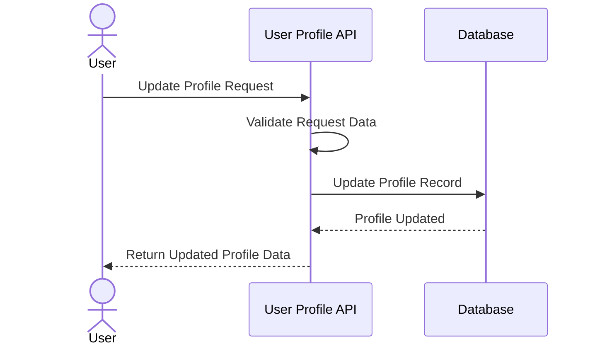

# Introduction

> **Module Type:** Sub-Module (Users)
> **Version:** 1.0
> **Status:** Draft
> **Priority:** Critical
> **Owner:** Backend Team

---

# 1. Module Overview

## Purpose

The User Profile sub-module manages extended profile information attached to a user account, including personal details and avatar images. It is an internal sub-module of the [Users Module](./Users-Module-Documentation.md).

## Scope

### Included

- Create User Profile
- Update User Profile
- Get User Profile
- Delete User Profile

### Excluded

- User Authentication
- Access Control
- User Account Management (handled in [Users Module](./Users-Module-Documentation.md))

---

# 2. Actors

| Actor | Description               |
| ----- | ------------------------- |
| User  | Authenticated system user |
| Admin | System administrator      |
| Guest | Unauthenticated visitor   |

---

# 3. Business Goals

- Automatically create a user profile upon user account creation.
- Allow users to update their own profile details.
- Allow users and admins to retrieve profile information.
- Ensure each user has at most one profile.

---

# 4. Functional Requirements

## FR-005 Create User Profile

### Description

Allows the system to create a user profile automatically when a user account is created. A user can only have one profile.

### Inputs

| Field       | Required |
| ----------- | -------- |
| FirstName   | Yes      |
| LastName    | Yes      |
| Phone       | Yes      |
| DateOfBirth | Yes      |
| Gender      | Yes      |
| Image       | No       |

### Process

1. User Profile will be created automatically after user account creation (internal action).

### Success Response

- Not Required. (Internal action — no public response emitted.)

---

## FR-006 Update User Profile

### Description

Allows a user or admin to update existing user profile information.

### Inputs

| Field       | Required |
| ----------- | -------- |
| FirstName   | No       |
| LastName    | No       |
| Phone       | No       |
| DateOfBirth | No       |
| Gender      | No       |
| Image       | No       |

### Process

1. Validate request data.
2. Update user profile record.

### Success Response

- User profile updated.

### Failure Cases

- Missing required fields.
- Invalid image.

---

## FR-007 Get User Profile

### Description

Allows a user or admin to retrieve user profile information.

### Inputs

| Field   | Required | Descriptions      |
| ------- | -------- | ----------------- |
| user_id | Yes      | User id as params |

### Process

1. Verify `user_id` exists.
2. Get user profile record.

### Success Response

- User profile found.

### Failure Cases

- User profile not found.

---

## FR-008 Delete User Profile

### Description

Allows an admin to delete a user's profile record.

### Inputs

| Field   | Required | Descriptions      |
| ------- | -------- | ----------------- |
| user_id | Yes      | User id as params |

### Process

1. Verify `user_id` exists.
2. Verify profile record exists.
3. Delete user profile record.

### Success Response

- User profile deleted.

### Failure Cases

- User not found.
- Profile not found.

---

# 5. Business Rules

| ID     | Rule                                                    |
| ------ | ------------------------------------------------------- |
| BR-003 | A user can have only one profile.                       |
| BR-004 | A user profile can be created only once (auto-created). |

---

# 6. Validation Rules

## User Profile

| Field       | Validation                                    |
| ----------- | --------------------------------------------- |
| FirstName   | Required on create, optional on update        |
| LastName    | Required on create, optional on update        |
| Phone       | Required on create, optional on update        |
| DateOfBirth | Required on create, optional on update        |
| Gender      | Required on create, optional on update        |
| Image       | Optional; must be valid image format if given |

---

# 7. Authorization Matrix

| Action              | Guest | User | Admin |
| ------------------- | :---: | :--: | :---: |
| Create User Profile |  ❌   |  ✅  |  ✅   |
| Update User Profile |  ❌   |  ✅  |  ✅   |
| Get User Profile    |  ❌   |  ✅  |  ✅   |
| Delete User Profile |  ❌   |  ❌  |  ✅   |

---

# 8. Workflow

## Create User Profile Workflow



## Update User Profile Workflow



---

# 9. Sequence Diagram



---

# 10. Database Design

## users-profile

| Field         | Type        | Constraints             |
| ------------- | ----------- | ----------------------- |
| id            | UUID        | Primary                 |
| first_name    | VARCHAR     |                         |
| last_name     | VARCHAR     |                         |
| phone         | VARCHAR     |                         |
| date_of_birth | DATE        |                         |
| gender        | Gender Enum |                         |
| image         | TEXT        | Optional                |
| user_id       | UUID (FK)   | Foreign Key → users.id  |
| created_at    | TIMESTAMP   |                         |
| updated_at    | TIMESTAMP   |                         |

### Gender Enum

- Male
- Female
- Other
- PreferNotToSay

---

# 11. API Endpoints

| Method | Endpoint            | Description       |
| ------ | ------------------- | ----------------- |
| PUT    | /users/{id}/profile | Update profile    |
| GET    | /users/{id}/profile | Get profile by id |
| DELETE | /users/{id}/profile | Delete profile    |

---

# 12. API Examples

## Update User Profile Request

```json
PUT /users/123e4567-e89b-12d3-a456-426614174000/profile
{
  "first_name": "John",
  "last_name": "Doe",
  "phone": "+1234567890",
  "date_of_birth": "1990-01-15",
  "gender": "Male",
  "image": "https://storage.example.com/avatars/john.png"
}
```

### Success Response

```json
{
  "id": "prof-abc123-...",
  "user_id": "123e4567-e89b-12d3-a456-426614174000",
  "first_name": "John",
  "last_name": "Doe",
  "phone": "+1234567890",
  "date_of_birth": "1990-01-15",
  "gender": "Male",
  "image": "https://storage.example.com/avatars/john.png",
  "updated_at": "2026-08-05T12:00:00Z"
}
```

### Error Response

```json
{
  "error": "PROFILE_002",
  "message": "Invalid image format"
}
```

---

## Get User Profile Request

```json
GET /users/123e4567-e89b-12d3-a456-426614174000/profile
```

### Success Response

```json
{
  "id": "prof-abc123-...",
  "user_id": "123e4567-e89b-12d3-a456-426614174000",
  "first_name": "John",
  "last_name": "Doe",
  "phone": "+1234567890",
  "date_of_birth": "1990-01-15",
  "gender": "Male",
  "image": "https://storage.example.com/avatars/john.png",
  "created_at": "2026-08-04T12:00:00Z",
  "updated_at": "2026-08-05T12:00:00Z"
}
```

### Error Response

```json
{
  "error": "PROFILE_001",
  "message": "Profile not found"
}
```

---

# 13. Error Codes

| Code        | Description             |
| ----------- | ----------------------- |
| PROFILE_001 | Profile Not Found       |
| PROFILE_002 | Invalid Image Format    |
| PROFILE_003 | Missing Required Fields |
| PROFILE_004 | Profile Already Exists  |

---

# 14. Security Requirements

- Sanitize all user profile inputs to prevent XSS.
- Profile images must be validated for size and allowed MIME types before storage.
- Ensure only authorized users (owner or admin) can view or update their own profiles.
- Profile images should be stored in a secure object storage service, not in the database.

---

# 15. Non-Functional Requirements

| Requirement         | Target  |
| ------------------- | ------- |
| Profile Update Time | < 300ms |
| Profile Fetch Time  | < 200ms |
| Availability        | 99.9%   |

---

# 16. Acceptance Criteria

- A profile is automatically created when a user account is created.
- Users can update their own profile details successfully.
- A user cannot have more than one profile.
- Requesting a profile for an invalid user ID returns a `404 Not Found` error.
- Profile images are validated for size and format if provided.
- Only authorized users can view or update a profile.

---

# 17. Dependencies

- [Users Module](./Users-Module-Documentation.md)
- Database
- File Storage (for profile images)

---

# 18. Assumptions

- Database is highly available.
- File storage service is accessible for saving profile images.
- HTTPS is enabled for all environments.

---

# 19. Future Enhancements

- Multiple profile images or avatar generation.
- Role-Based Access Control (RBAC) integration with profiles.
- Integration with external identity providers for profile population.

---

# 20. Appendix

## Related Documents

- [Users Module Documentation](./Users-Module-Documentation.md)
- System Architecture
- API Documentation
- Database Design
- Security Policy

---

**Document Version:** 1.0
**Last Updated:** 2026-08-12
**Author:** Monirul Islam
