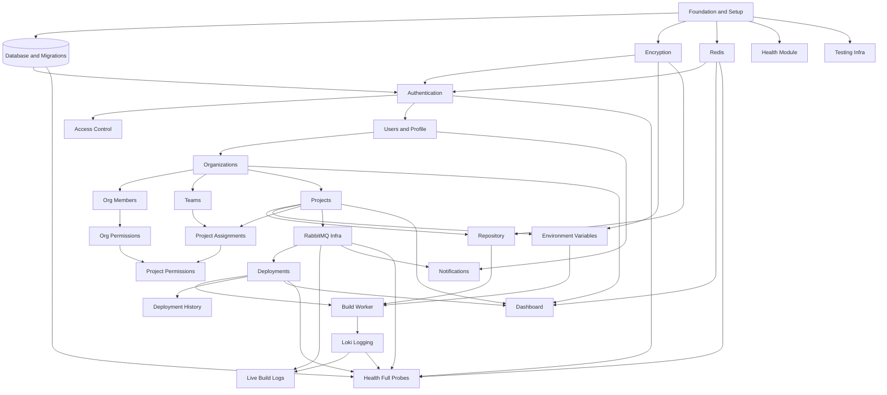

# Forge Platform — Master Development Plan Index

> **Document:** Master Development Plan Index
> **Version:** 1.2
> **Status:** Active
> **Last Updated:** 2026-08-19
> **Scope:** Complete implementation roadmap from current active implementation to production-ready platform

---

## Overview

This directory is the **authoritative implementation roadmap** for the Forge Platform backend. The project currently has:

- **Extensive, high-quality documentation** (SRS, module docs, ERD, OpenAPI, ADRs — rated 9.8/10)
- **Active & modular Rust/Axum codebase** with core modules implemented (Foundation, Authentication, Access Control (RBAC), Users & User Profile)
- **100+ unit and integration tests passing** covering core identity, access control, routing, and user profile management

Every plan in this directory is derived directly from the existing project documentation. No features have been invented. No documentation has been ignored.

---

## Project Architecture

Forge is a **modular monolith** written in Rust/Axum. Its four architectural layers are:

```
┌──────────────────────────────────────────────────┐
│            Client / API Layer                    │
│   REST API (Axum) · SSE · WebSocket              │
├──────────────────────────────────────────────────┤
│            Business Domain Layer                 │
│   Auth · Users · Org · Teams · Projects          │
│   Deployments · Notifications · Dashboard        │
├──────────────────────────────────────────────────┤
│            Async Infrastructure Layer            │
│   RabbitMQ · Build Worker · Redis · Loki         │
├──────────────────────────────────────────────────┤
│            Data Layer                            │
│   PostgreSQL (SeaORM) · AES-256-GCM Encryption  │
└──────────────────────────────────────────────────┘
```

**Technology Stack** (from ADRs and Cargo.toml skeleton):

- **Language:** Rust (2024 edition)
- **Web Framework:** Axum
- **Database:** PostgreSQL 15+ (ADR-001)
- **ORM:** SeaORM with `sea-orm-migration` (ADR-002)
- **Cache / Rate-Limiting / Session:** Redis 7+ (ADR-003)
- **Message Broker:** RabbitMQ AMQP 0-9-1 via `lapin` (ADR-004)
- **Centralized Logging:** Grafana Loki via `tracing` + `tracing-subscriber` (ADR-005)
- **Encryption:** AES-256-GCM (env vars + PAT tokens)
- **Auth:** JWT (HS256) + Argon2id password hashing
- **Async Runtime:** Tokio
- **Build Tooling:** `just` (justfile), `sea-orm-cli`, `cargo-watch`

---

## Module Plans

> All module plans are located in [`modules/`](./modules/).

| # | Module | Plan | Status | Priority | Depends On |
|---|--------|------|--------|----------|------------|
| 01 | Foundation & Project Setup | [Plan](./modules/01-foundation.md) | Completed | P0 | — |
| 02 | Authentication | [Plan](./modules/02-authentication.md) | Completed | P0 | Foundation |
| 03 | Access Control (RBAC) | [Plan](./modules/03-access-control.md) | Completed | P0 | Foundation, Auth |
| 04 | Users & User Profile | [Plan](./modules/04-users.md) | Completed | P0 | Foundation, Auth |
| 05 | Organizations | [Plan](./modules/05-organizations.md) | Not Started | P1 | Users |
| 06 | Organization Members | [Plan](./modules/06-org-members.md) | Not Started | P1 | Organizations |
| 07 | Organization Permissions | [Plan](./modules/07-org-permissions.md) | Not Started | P1 | Org Members |
| 08 | Teams | [Plan](./modules/08-teams.md) | Not Started | P1 | Organizations |
| 09 | Projects | [Plan](./modules/09-projects.md) | Not Started | P1 | Organizations |
| 10 | Repository | [Plan](./modules/10-repository.md) | Not Started | P1 | Projects |
| 11 | Environment Variables | [Plan](./modules/11-environment-variables.md) | Not Started | P1 | Projects |
| 12 | Project Assignments | [Plan](./modules/12-project-assignments.md) | Not Started | P1 | Projects, Teams |
| 13 | Project Permissions | [Plan](./modules/13-project-permissions.md) | Not Started | P1 | Project Assignments, Org Permissions |
| 14 | Deployments | [Plan](./modules/14-deployments.md) | Not Started | P1 | Projects, RabbitMQ |
| 15 | Build Worker | [Plan](./modules/15-build-worker.md) | Not Started | P1 | Deployments, Env Vars |
| 16 | Live Build Logs | [Plan](./modules/16-live-build-logs.md) | Not Started | P2 | Build Worker, RabbitMQ, Loki |
| 17 | Deployment History | [Plan](./modules/17-deployment-history.md) | Not Started | P2 | Deployments |
| 18 | Notifications | [Plan](./modules/18-notifications.md) | Not Started | P2 | Users, RabbitMQ |
| 19 | Dashboard | [Plan](./modules/19-dashboard.md) | Not Started | P2 | Projects, Deployments, Orgs |
| 20 | Health & Observability | [Plan](./modules/20-health.md) | Not Started | P0 | Foundation |

---

## Infrastructure Plans

> All infrastructure plans are located in [`infrastructure/`](./infrastructure/).

| Plan | Status | Priority |
|------|--------|----------|
| [Database & Migrations](./infrastructure/database.md) | In Progress | P0 |
| [Redis](./infrastructure/redis.md) | Not Started | P0 |
| [RabbitMQ](./infrastructure/rabbitmq.md) | Not Started | P1 |
| [Grafana Loki — Logging](./infrastructure/loki.md) | Not Started | P1 |
| [Encryption](./infrastructure/encryption.md) | Not Started | P0 |
| [Testing Infrastructure](./infrastructure/testing.md) | Not Started | P0 |

---

## Recommended Implementation Order

The implementation follows a strict bottom-up dependency order. No module may be started until all its dependencies are functional.

```
Phase 0 — Foundation (Blocker for everything)
  Step 1:  Foundation & Project Setup (Cargo deps, Axum app, config, shared types, error handling)
  Step 2:  Database & Migrations (SeaORM setup, all migrations, connection pool)
  Step 3:  Encryption Infrastructure (AES-256-GCM service)
  Step 4:  Redis Infrastructure (client, cache helpers, rate limiting)
  Step 5:  Health Module (basic /health probe — unblocks CI)
  Step 6:  Testing Infrastructure (test DB, fixtures, helpers)

Phase 1 — Identity & Access (Core Auth)
  Step 7:  Authentication Module (register, login, logout, refresh, JWT middleware)
  Step 8:  Access Control — Roles & Permissions (system RBAC tables and CRUD)
  Step 9:  Users & User Profile (user CRUD, profile sub-module)

Phase 2 — Organization Layer
  Step 10: Organizations (org lifecycle CRUD)
  Step 11: Org Members (membership management)
  Step 12: Org Permissions (org-level RBAC middleware)
  Step 13: Teams (team + team_members CRUD)

Phase 3 — Project Layer
  Step 14: Projects (project lifecycle CRUD, runtime config)
  Step 15: Repository Sub-Module (Git connection, PAT encryption)
  Step 16: Environment Variables Sub-Module (POSIX keys, AES encryption)
  Step 17: Project Assignments (project_members, project_teams)
  Step 18: Project Permissions (ownership-based RBAC guard)

Phase 4 — Deployment Layer
  Step 19: RabbitMQ Infrastructure (exchanges, queues, lapin client)
  Step 20: Deployments (lifecycle state machine, trigger, status update)
  Step 21: Build Worker (async pipeline: clone -> build -> run -> health check)
  Step 22: Loki Logging Infrastructure (tracing -> Loki integration)
  Step 23: Live Build Logs (SSE streaming, stored log retrieval)

Phase 5 — Aggregation & Completion
  Step 24: Deployment History (history, redeploy, rollback)
  Step 25: Notifications (in-app, RabbitMQ delivery)
  Step 26: Dashboard (read-only aggregation, Redis caching)
  Step 27: Health — Full Probes (all service probe integration)
```

---

## Dependency Graph



---

## Parallel Development Opportunities

Once **Foundation, Database, and Encryption** are complete, the following modules can be developed in parallel:

```
After Phase 0:
    ┌──────────────────┐
    │  Authentication  │  <- Engineer A
    └────────┬─────────┘
             │
    ┌────────▼─────────┐    ┌──────────────────┐
    │  Access Control  │    │  Health Module   │  <- Engineer B (independent)
    └────────┬─────────┘    └──────────────────┘
             │
    ┌────────▼─────────┐
    │  Users & Profile │
    └────────┬─────────┘

After Phase 2 is complete:
    ┌──────────────────┐    ┌──────────────────┐
    │  Projects        │    │  Teams           │  <- Parallel after Orgs
    └────────┬─────────┘    └──────────────────┘
             │
    ┌────────┴───────────────────────────────┐
    │  Repository | Env Vars | Assignments   │  <- Parallel after Projects
    └────────────────────────────────────────┘
```

> **Note:** Build Worker, Live Logs, and Loki logging have a strict linear dependency chain and cannot be parallelised.

---

## MVP Critical Path

| Phase | Module | Why Required |
|-------|--------|--------------|
| P0 | Foundation | Application cannot run |
| P0 | Database | No persistence |
| P0 | Encryption | Secrets cannot be stored safely |
| P0 | Authentication | No user identity |
| P0 | Access Control | No RBAC |
| P1 | Users | Core identity resource |
| P1 | Organizations | Multi-tenant container |
| P1 | Org Members | Users cannot join orgs |
| P1 | Org Permissions | RBAC not enforced |
| P1 | Projects | Core deployable unit |
| P1 | Repository | Git source for builds |
| P1 | Environment Variables | Build-time configuration |
| P1 | Project Assignments | Access gating |
| P1 | Project Permissions | Write-path gating |
| P1 | RabbitMQ | Async build dispatch |
| P1 | Deployments | Core deployment trigger |
| P1 | Build Worker | Actual build execution |
| P2 | Loki Logging | Build log persistence |
| P2 | Live Build Logs | User-visible build output |
| P0 | Health | Operational monitoring |

**Post-MVP modules** (P2/P3 — can be delivered after core MVP works):

- Deployment History (redeploy/rollback)
- Notifications
- Dashboard
- Teams (useful but not blocking MVP)
- User Profile sub-module

---

## Overall Progress

See [progress.md](./progress.md) for live tracking.

---

**Document Version:** 1.2
**Last Updated:** 2026-08-19
**Author:** Backend Architecture Team
