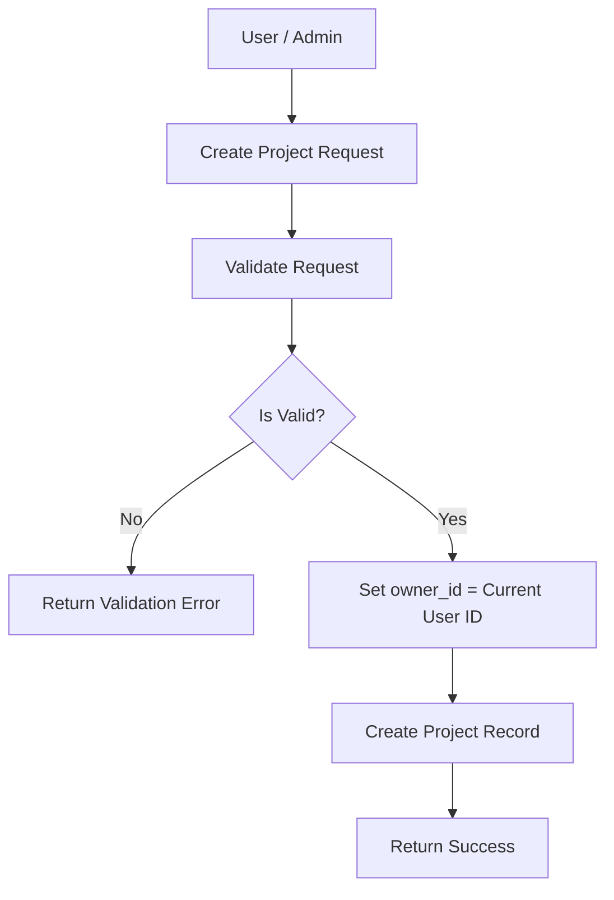
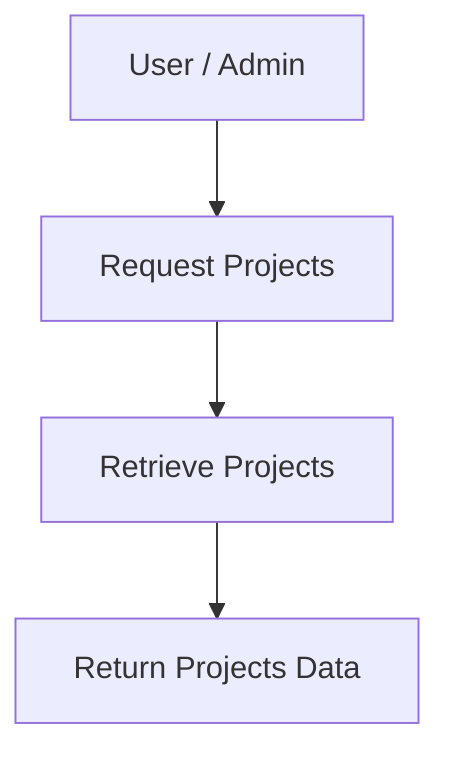
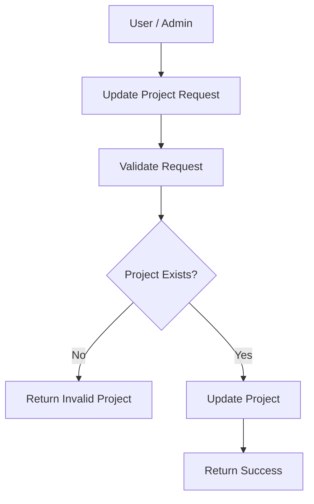
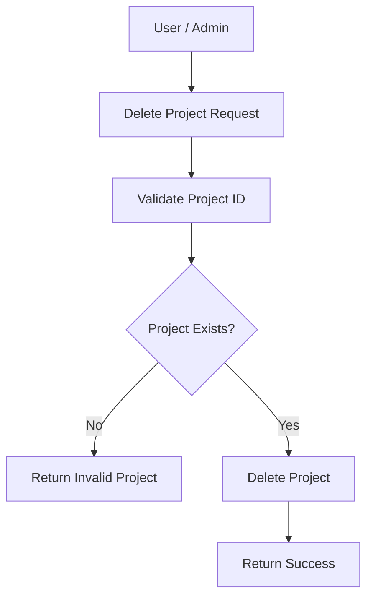
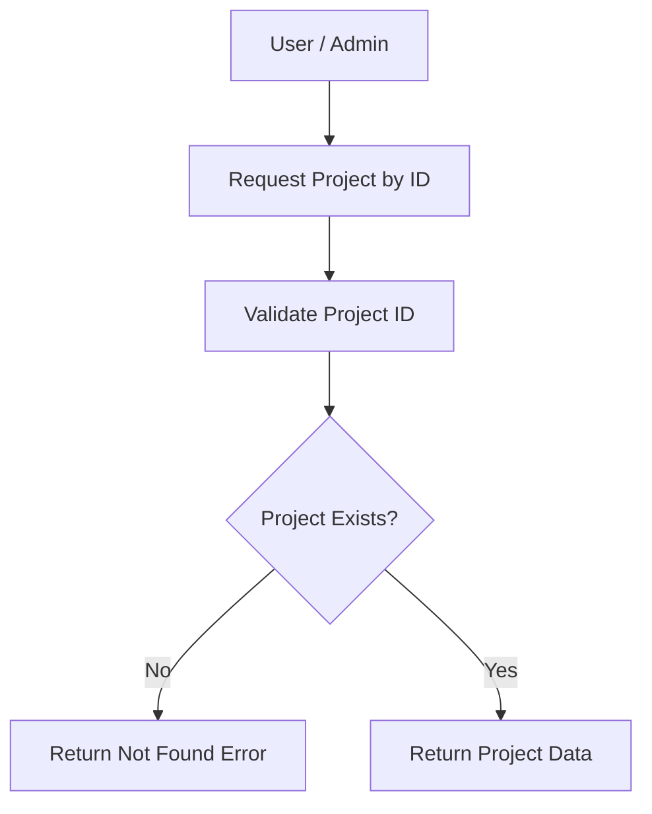

# Introduction

> **Module Type:** Module
> **Version:** 1.0  
> **Status:** Draft  
> **Priority:** Critical  
> **Owner:** Backend Team

---

# 1. Module Overview

## Purpose

The Projects module is responsible for managing projects within the system.

## Scope

### Included

- Projects

### Excluded

- Users
- Organizations
- Teams

---

# 2. Actors

| Actor                 | Action                                      |
| --------------------- | ------------------------------------------- |
| Authenticated User    | Create and manage projects                  |
| System Administrators | Maintain all projects across organizations  |

---

# 3. Business Goals

- Allow users to create, update, delete, and view projects.
- Allow admin to maintain and manage all projects.

---

# 4. Functional Requirements

## FR-001 Create Project

### Description

Allows a user or an admin to create a project within an organization.

### Inputs

| Field           | Required | Descriptions                     |
| --------------- | -------- | -------------------------------- |
| organization_id | Yes      | UUID of the parent organization  |
| name            | Yes      | Name of the project              |
| type            | Yes      | Type of the project              |
| descriptions    | No       | Optional description             |

### Process

1. Validate request data.
2. Verify existence of `organization_id`.
3. Set `owner_id` to the current authenticated user's ID.
4. Create project record.

### Success Response

- Project created.

### Failure Cases

- Missing required fields.
- Invalid or non-existent `organization_id`.

---

## FR-002 Get Projects

### Description

Allows authorized users or admins to list projects.

### Process

1. Find projects.
2. Return projects data.

### Success Response

- Projects data.

### Failure Cases

- Unauthorized user.

---

## FR-003 Update Project

### Description

Allows a user or admin to update a project.

### Inputs

| Field           | Required |
| --------------- | -------- |
| name            | No       |
| type            | No       |
| descriptions    | No       |
| organization_id | No       |
| owner_id        | No       |

### Process

1. Validate request data.
2. Verify project existence and update permissions.
3. Update project record.

### Success Response

- Project updated.

### Failure Cases

- Project not found.
- Unauthorized user.

---

## FR-004 Delete Project

### Description

Allows a user or admin to delete a project.

### Inputs

| Field | Required |
| ----- | -------- |
| id    | Yes      |

### Process

1. Validate request data.
2. Delete the project record.

### Success Response

- Project removed.

### Failure Cases

- Invalid project ID.

---

## FR-005 Get Project by ID

### Description

Allows a user or admin to get a project by ID.

### Inputs

| Field | Required |
| ----- | -------- |
| id    | Yes      |

### Process

1. Validate request data.
2. Return project data.

### Success Response

- Project data.

### Failure Cases

- Project not found.

---

# 5. Business Rules

| ID     | Rule                                                           |
| ------ | -------------------------------------------------------------- |
| BR-001 | Project name must be validated.                                |
| BR-002 | Project must be associated with a valid `organization_id`.     |
| BR-003 | The user who creates the project must be assigned as `owner_id`.|

---

# 6. Validation Rules

## Projects

| Field           | Validation                                    |
| --------------- | --------------------------------------------- |
| organization_id | Required                                      |
| name            | Required                                      |
| type            | Required                                      |
| descriptions    | Not required                                  |
| owner_id        | Automatically assigned from authenticated user|

---

# 7. Authorization Matrix

| Route               | Action | Standard User | Admin |
| ------------------- | ------ | ------------- | ----- |
| POST /projects      | Create | Yes           | Yes   |
| GET /projects       | List   | Yes           | Yes   |
| GET /projects/:id   | View   | Yes           | Yes   |
| PUT /projects/:id   | Edit   | Yes           | Yes   |
| DELETE /projects/:id| Delete | Yes           | Yes   |

---

# 8. Workflow

## Create Project



## Get Projects



## Update Project



## Delete Project



## Get Project by ID



---

# 9. Sequence Diagram

---

# 10. Database Design

## Projects

| Field           | Type      | Constraints   |
| --------------- | --------- | ------------- |
| id              | UUID      | Primary       |
| organization_id | UUID      |               |
| owner_id        | UUID      | Project Owner |
| name            | VARCHAR   |               |
| type            | VARCHAR   |               |
| descriptions    | VARCHAR   |               |
| created_at      | TIMESTAMP |               |
| updated_at      | TIMESTAMP |               |

---

# 11. API Endpoints

| Method | Endpoint      | Description            |
| ------ | ------------- | ---------------------- |
| GET    | /projects     | Get all projects       |
| POST   | /projects     | Create project         |
| PUT    | /projects/:id | Update project         |
| DELETE | /projects/:id | Delete project         |
| GET    | /projects/:id | Get project by id      |

---

# 12. API Examples

## Create Project

```json
POST /projects
{
  "organization_id": "123e4567-e89b-12d3-a456-426614174000",
  "name": "E-Commerce App",
  "type": "Web Application",
  "descriptions": "Main e-commerce platform"
}
```

### Success Response

```json
{
  "message": "Project created.",
  "data": {
    "id": "07c0060e-8e8c-44c1-942c-3004f5a6c5b6",
    "organization_id": "123e4567-e89b-12d3-a456-426614174000",
    "owner_id": "456e7890-e89b-12d3-a456-426614174000",
    "name": "E-Commerce App",
    "type": "Web Application",
    "descriptions": "Main e-commerce platform",
    "created_at": "2026-08-07T00:00:00Z",
    "updated_at": "2026-08-07T00:00:00Z"
  }
}
```

## Get Projects

```json
GET /projects
```

### Success Response

```json
{
  "data": [
    {
      "id": "07c0060e-8e8c-44c1-942c-3004f5a6c5b6",
      "organization_id": "123e4567-e89b-12d3-a456-426614174000",
      "owner_id": "456e7890-e89b-12d3-a456-426614174000",
      "name": "E-Commerce App",
      "type": "Web Application",
      "descriptions": "Main e-commerce platform",
      "created_at": "2026-08-07T00:00:00Z",
      "updated_at": "2026-08-07T00:00:00Z"
    }
  ],
  "message": "Projects retrieved."
}
```

## Get Project by ID

```json
GET /projects/07c0060e-8e8c-44c1-942c-3004f5a6c5b6
```

### Success Response

```json
{
  "data": {
    "id": "07c0060e-8e8c-44c1-942c-3004f5a6c5b6",
    "organization_id": "123e4567-e89b-12d3-a456-426614174000",
    "owner_id": "456e7890-e89b-12d3-a456-426614174000",
    "name": "E-Commerce App",
    "type": "Web Application",
    "descriptions": "Main e-commerce platform",
    "created_at": "2026-08-07T00:00:00Z",
    "updated_at": "2026-08-07T00:00:00Z"
  },
  "message": "Project retrieved."
}
```

---

## Update Project

```json
PUT /projects/07c0060e-8e8c-44c1-942c-3004f5a6c5b6
{
  "name": "Updated E-Commerce App"
}
```

### Success Response

```json
{
  "message": "Project updated.",
  "data": {
    "id": "07c0060e-8e8c-44c1-942c-3004f5a6c5b6",
    "organization_id": "123e4567-e89b-12d3-a456-426614174000",
    "owner_id": "456e7890-e89b-12d3-a456-426614174000",
    "name": "Updated E-Commerce App",
    "type": "Web Application",
    "descriptions": "Main e-commerce platform",
    "created_at": "2026-08-07T00:00:00Z",
    "updated_at": "2026-08-07T00:00:00Z"
  }
}
```

### Error Response

```json
{
  "is_error": true,
  "message": "Bad request",
  "errors": {
    "name": ["Invalid name."]
  }
}
```

---

## Delete Project

```json
DELETE /projects/07c0060e-8e8c-44c1-942c-3004f5a6c5b6
```

### Success Response

```json
{
  "message": "Project deleted."
}
```

### Error Response

```json
{
  "is_error": true,
  "message": "Project not found.",
  "errors": {}
}
```

---

# 13. Error Codes

| Code    | Description          |
| ------- | -------------------- |
| PRJ_001 | Project Not Found    |
| PRJ_002 | Invalid Project ID   |
| PRJ_003 | Missing Required Field|

---

# 14. Security Requirements

- Role-Based Access Control (RBAC) must be strictly enforced on all protected endpoints.
- Sanitize all user inputs for project creation/updates.

---

# 15. Non-Functional Requirements

| Requirement       | Target |
| ----------------- | ------ |
| API Response Time | <50 ms |

---

# 16. Acceptance Criteria

- Users can successfully create, read, update, delete, and view projects.
- Creating user is automatically set as the `owner_id` of the project.

---

# 17. Dependencies

- Database
- Organization Module

---

# 18. Assumptions

- System uses centralized database.

---

# 19. Future Enhancements

- Hierarchical project structures.

---

# 20. Appendix

## Related Documents

- Database Design

---

**Document Version:** 1.0  
**Last Updated:** 2026-08-07
**Author:** Monirul Islam
