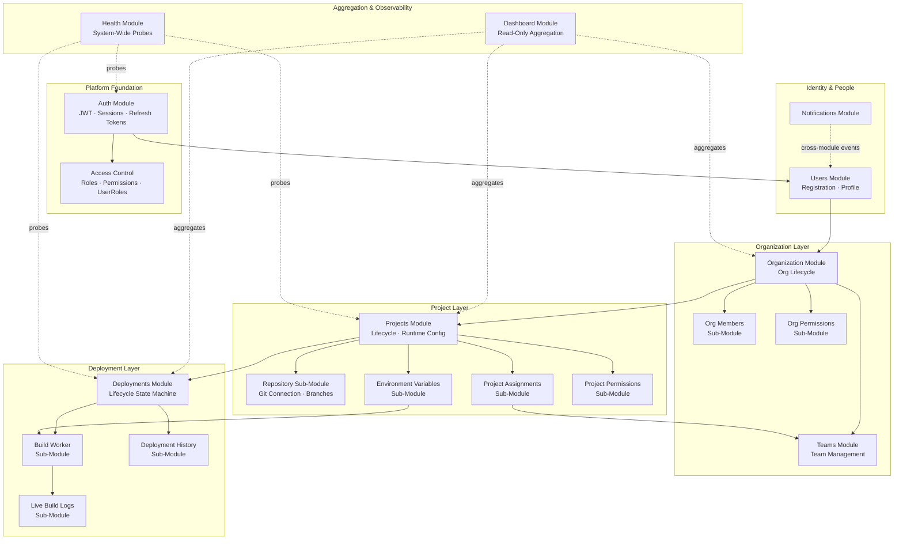

# System Overview — Forge Platform

> **Document:** System Overview  
> **Section:** 01 — Overview  
> **Version:** 1.0  
> **Status:** Draft

---

## 1. Platform Purpose

Forge is a **developer-facing deployment and project management platform**. It provides organizations with a unified environment for managing users, projects, teams, Git repository connections, environment configuration, and automated Docker-based deployments — all gated behind a robust role-based access control (RBAC) system.

Forge enables development teams to:

- Create and manage **projects** backed by Git repositories or direct file uploads.
- Configure **runtime environments** and **environment variables** per deployment target.
- Trigger **automated deployments** that follow a defined lifecycle: `Queued → Building → Deploying → Running → Success / Failed`.
- Monitor **deployment progress** via real-time log streaming.
- Manage **organizational structure** through organizations, teams, and granular member permissions.
- Operate with confidence via system-wide **health observability** and a centralized **dashboard** aggregating cross-domain metrics.

---

## 2. Platform Scope

### In Scope

| Domain | Capability |
|--------|-----------|
| **Identity** | User registration, authentication (JWT + refresh tokens), profile management |
| **Access Control** | System-wide RBAC: roles, permissions, role-permission mapping, user-role assignment |
| **Organizations** | Organization lifecycle, member management, organization-level RBAC |
| **Teams** | Team creation and membership within organizations |
| **Projects** | Project lifecycle (repo/files types), runtime configuration, status tracking |
| **Repository** | Git connection management (public + PAT), branch management, commit fetching |
| **Environment Variables** | Per-project, per-environment env var management with AES-256-GCM encryption |
| **Deployments** | Async deployment lifecycle management via job queue + build workers |
| **Build Workers** | Automated clone → build (Docker) → run → health check pipeline |
| **Live Build Logs** | Real-time SSE/WebSocket log streaming from build workers |
| **Deployment History** | Historical deployment tracking, redeploy, and rollback operations |
| **Notifications** | Cross-module notification system for user events |
| **Dashboard** | Aggregated read-only view across projects, deployments, and organizational state |
| **Health** | System-wide health probe aggregation for all service dependencies |

### Out of Scope

- CI/CD pipeline configuration beyond Dockerfile-based builds
- Multi-cloud/multi-region deployment infrastructure
- Billing and subscription management
- Public-facing project hosting infrastructure (CDN, DNS)

---

## 3. Architectural Philosophy

Forge is designed as a **modular monolith** — a single deployable unit with well-defined module boundaries enforced through documentation contracts rather than network boundaries. Key principles:

| Principle | Application |
|-----------|-------------|
| **Module Ownership** | Each domain (auth, projects, deployments, etc.) owns its tables and exposes controlled interfaces |
| **Separation of Concerns** | Sub-modules handle specific slices (e.g., `env-vars`, `repository`, `build-worker`) without bleeding into one another |
| **Async for Long-Running Work** | Deployment execution is fully asynchronous via a job queue — the API never blocks on build operations |
| **Security by Default** | JWT auth required on all endpoints; RBAC enforced at all write paths; secrets encrypted at rest |
| **Observability First** | All services expose `/health` probes; build pipeline emits structured logs at every step |

---

## 4. System Actor Catalog

All actors interacting with the Forge platform, their scope, and their access boundaries:

| Actor | Type | Description |
|-------|------|-------------|
| **Anonymous User** | External | Can only access public health endpoints; cannot interact with any protected resource |
| **Authenticated User** | Human / Internal | Any user with a valid JWT session; minimum access level for all authenticated endpoints |
| **Viewer** | Org Role | Read-only access to org resources (projects, members, deployment history, logs) |
| **Developer** | Org Role | Create and manage own projects; trigger deployments; read org resources |
| **Admin** | Org Role | Full management of all org projects, members, teams, and deployments |
| **Owner** | Org Role | Unrestricted access within the organization; includes rollback and deletion authority |
| **System Administrator** | Platform Role | Cross-organization management; access to all resources and internal admin APIs |
| **Build Worker** | Internal Service | Async background service; runs build pipelines and updates deployment status via internal service tokens |
| **Deployment Engine (Runner)** | Internal Service | Authorized to decrypt and inject environment variables during build and deployment |

---

## 5. High-Level Module Map

---

## 6. Key Platform Constraints

| Constraint | Detail |
|------------|--------|
| All API endpoints require JWT authentication | Except `/health` and `/auth/login`, `/auth/register` |
| Organization membership is required for project access | A user must be an org member to interact with org resources |
| Deployments are asynchronous | `POST /deployments` returns immediately with `status: Queued`; status updates come via polling or streaming |
| One active deployment per project at a time | Multiple concurrent deployments are queued behind the running one |
| Secret values are always encrypted at rest | PAT tokens (AES-256-GCM in `project_repositories`), env vars (AES-256-GCM in `project_environment_variables`) |
| Terminal deployment states are immutable | Once `Success` or `Failed`, a deployment record cannot be modified |
| Log streaming uses SSE or WebSocket | Live logs are available while deployment is in a non-terminal state |

---

**Document Version:** 1.0  
**Last Updated:** 2026-08-12  
**Author:** Backend Architecture Team
