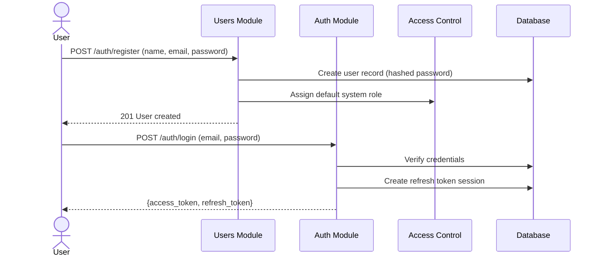
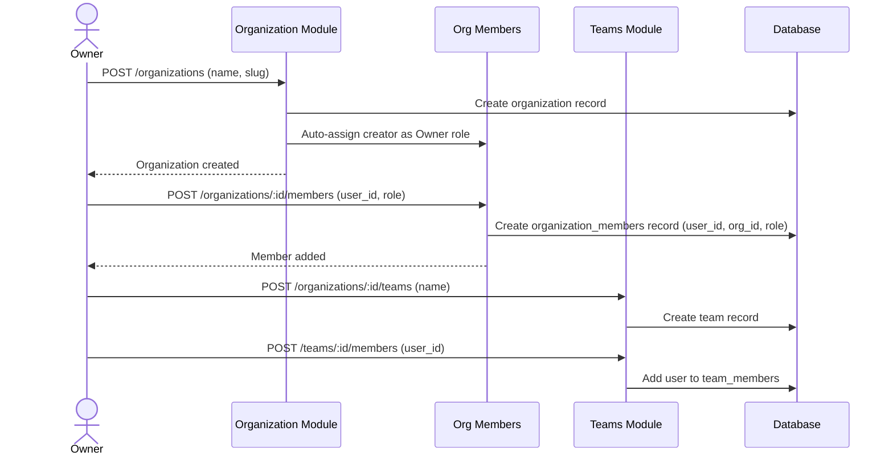
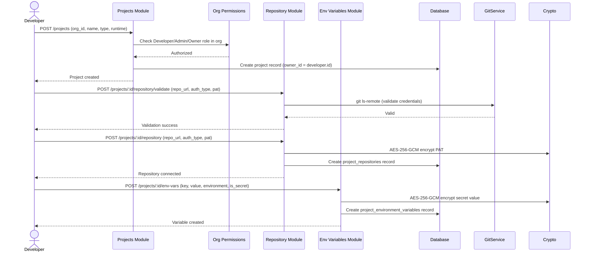
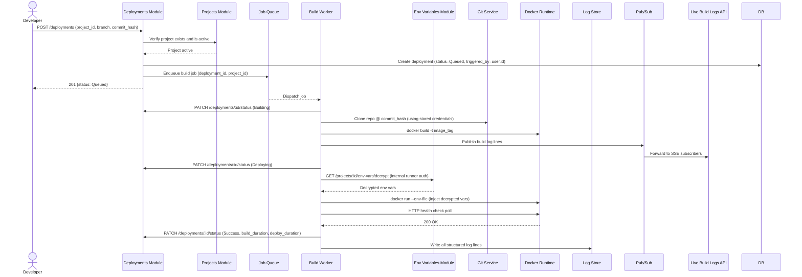
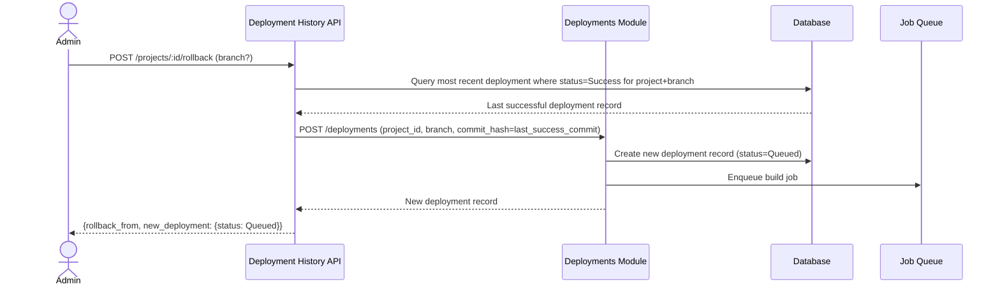
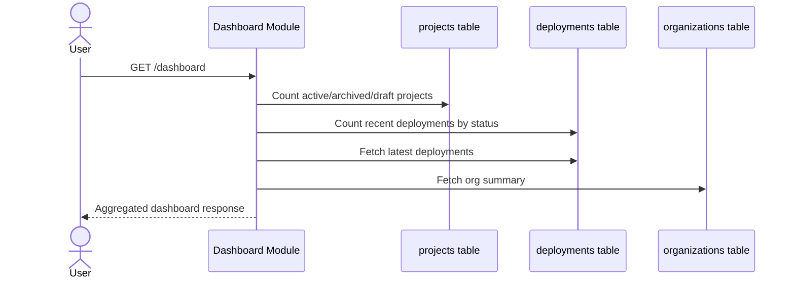
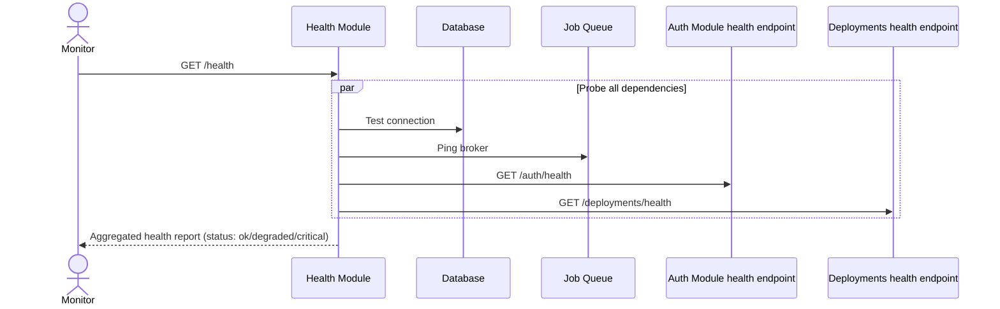

# Cross-Module Data Flow

> **Document:** Cross-Module Data Flow  
> **Section:** 02 — Architecture  
> **Version:** 1.0  
> **Status:** Draft

This document describes how data moves across module boundaries during key platform workflows. It focuses on *integration points* between modules rather than within-module processing.

---

## 1. User Registration & First Login

**Modules involved:** Users → Auth → Access Control

**Key data crossings:**
- `users.id` is referenced by virtually all other modules as a foreign key.
- System roles (from Access Control) are assigned at user creation.
- JWT payload carries `user_id` across all subsequent requests.

---

## 2. Organization Setup & Member Onboarding

**Modules involved:** Organization → Org Members → Org Permissions → Teams

**Key data crossings:**
- `organization_members` table links `users.id` + `organizations.id` + role.
- Every subsequent operation on org resources (projects, deployments) checks `organization_members` for role resolution.
- Teams are scoped to organizations (`teams.organization_id`).

---

## 3. Project Creation & Repository Connection

**Modules involved:** Projects → Organization → Repository → Environment Variables

**Key data crossings:**
- `projects.organization_id` → `organizations.id` (org must exist).
- `projects.owner_id` → `users.id` (project creator).
- `project_repositories.project_id` → `projects.id`.
- `project_environment_variables.project_id` → `projects.id`.
- PAT and secret env vars are encrypted before DB write; plaintext never persists.

---

## 4. Triggering a Deployment

**Modules involved:** Deployments → Projects → Build Worker → Environment Variables → Live Build Logs

**Key data crossings:**
- `deployments.project_id` → `projects.id` (project must be active).
- `deployments.triggered_by` → `users.id` (audit trail).
- Build Worker fetches encrypted credentials from `project_repositories` and decrypts them at runtime.
- Build Worker fetches encrypted env vars from `project_environment_variables` and decrypts them at runtime.
- All status transitions go back through `PATCH /deployments/:id/status` using an internal service token.
- Log lines are published to Pub/Sub (for live streaming) and written to `build_logs` (for storage).

---

## 5. Rollback Operation

**Modules involved:** Deployment History → Deployments → Build Worker

**Key data crossings:**
- Rollback reads `deployments` table to find last `Success` state.
- Creates a new `deployments` record (original record is immutable — BR-004).
- `rollback_from` references the previous deployment UUID for audit purposes.

---

## 6. Dashboard Data Aggregation

**Modules involved:** Dashboard → Projects, Deployments, Organizations, Users (read-only)

**Key facts:**
- Dashboard owns **no tables**. All data is read from other modules' tables.
- Dashboard does not write any state.
- This is a pure read-aggregation pattern.

---

## 7. Health Check Aggregation

**Modules involved:** Health → All service dependencies

**Key facts:**
- Health module classifies dependencies as **critical** or **non-critical**.
- If a **critical** dependency is down, the platform status is `critical`.
- If a **non-critical** dependency is down, status is `degraded`.
- Health probes do not modify any state; all checks are read/ping-only.

---

## 8. Notification Dispatch

**Modules involved:** Notifications → Users (cross-module event consumer)

Notifications are triggered by events in other modules (e.g., deployment status changes, org membership changes). The notification module:

1. Receives event payloads (user_id, event type, message).
2. Persists notification records to the `notifications` table.
3. Delivers to users via in-app notification feed.

**Key data crossings:**
- `notifications.user_id` → `users.id` (recipient must exist).
- Notification events originate from Deployments (status change), Org Members (invitation), Teams (membership), and Projects (ownership changes).

---

**Document Version:** 1.0  
**Last Updated:** 2026-08-12  
**Author:** Backend Architecture Team
