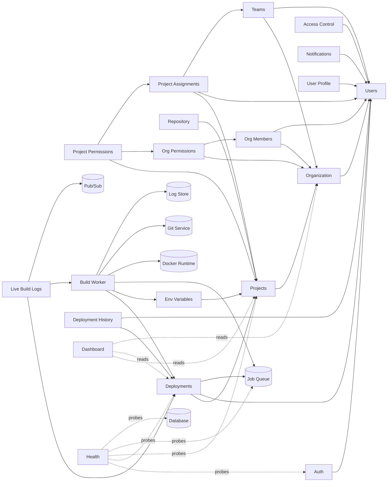

# Module Catalog & Dependency Map

> **Document:** Module Catalog & Dependency Map  
> **Section:** 02 — Architecture  
> **Version:** 1.0  
> **Status:** Draft

---

## 1. Module Registry

The table below catalogs every module and sub-module in the Forge platform, its type, priority, owning documentation file, and a short description.

| Module / Sub-Module | Type | Priority | Doc File | Description |
|---------------------|------|----------|----------|-------------|
| **Auth** | Core Module | Critical | `docs/auth/Authentication Module Documentation.md` | JWT-based authentication, login, logout, token refresh |
| **Access Control — Roles** | Sub-Module (Auth) | Critical | `docs/modules/auth/access-control/00.Roles.md` | System role definitions (key/value pairs) |
| **Access Control — Permissions** | Sub-Module (Auth) | Critical | `docs/modules/auth/access-control/01.Permissions.md` | System permission definitions |
| **Access Control — Role-Permissions** | Sub-Module (Auth) | Critical | `docs/modules/auth/access-control/02.RolePermissions.md` | Mapping roles to their granted permissions |
| **Access Control — User-Roles** | Sub-Module (Auth) | Critical | `docs/modules/auth/access-control/03.UserRoles.md` | Assigning system roles to users |
| **Access Control — User-Permissions** | Sub-Module (Auth) | Critical | `docs/modules/auth/access-control/04.UserPermissions.md` | Assigning permissions directly to users (override path) |
| **Users** | Core Module | Critical | `docs/users/Users Module Documentation.md` | User registration, profile, account management |
| **User Profile** | Sub-Module (Users) | High | `docs/users/user-profile/user-profile-module.md` | User profile data management |
| **Notifications** | Module | High | `docs/notifications/notifications-module.md` | Event-driven user notification system |
| **Organization** | Core Module | Critical | `docs/organization/organization-module.md` | Organization lifecycle management |
| **Org Members** | Sub-Module (Org) | Critical | `docs/organization/members/organization-members-module.md` | Org membership, joining, and member roles |
| **Org Permissions** | Sub-Module (Org) | Critical | `docs/organization/permissions/organization-permissions-module.md` | Org-level role-based access enforcement |
| **Teams** | Module | High | `docs/teams/teams-module.md` | Team creation and membership within organizations |
| **Projects** | Core Module | Critical | `docs/projects/projects-module.md` | Project lifecycle: repo/files types, runtime config |
| **Repository** | Sub-Module (Projects) | Critical | `docs/projects/repository-module.md` | Git repo connection, PAT management, branch/commit ops |
| **Environment Variables** | Sub-Module (Projects) | Critical | `docs/projects/environment-variables-module.md` | Per-project env var management with encryption |
| **Project Assignments** | Sub-Module (Projects) | Critical | `docs/projects/project-assignments-module.md` | Assigning users and teams to projects |
| **Project Permissions** | Sub-Module (Projects) | Critical | `docs/projects/project-permissions-module.md` | Project-level RBAC and ownership-based access control |
| **Deployments** | Core Module | Critical | `docs/deployments/deployment-module.md` | Deployment lifecycle state machine |
| **Build Worker** | Sub-Module (Deployments) | Critical | `docs/deployments/build-worker-module.md` | Async build pipeline: clone, build, run, health check |
| **Live Build Logs** | Sub-Module (Deployments) | High | `docs/deployments/live-build-logs-module.md` | Real-time log streaming via SSE/WebSocket |
| **Deployment History** | Sub-Module (Deployments) | High | `docs/deployments/deployment-history-module.md` | History, redeploy, and rollback operations |
| **Dashboard** | Module | High | `docs/dashboard/dashboard-module.md` | Read-only aggregation view across platform entities |
| **Health** | Module | Critical | `docs/health/health-observability-module.md` | System-wide health probe aggregation |

---

## 2. Cross-Module Dependency Matrix

The following matrix documents which module depends on which other modules. A dependency indicates that the dependent module requires the dependency to function correctly (data, API calls, or shared contracts).

| Dependent Module | Depends On |
|-----------------|------------|
| **Auth** | Users |
| **Access Control (all sub-modules)** | Users, Database |
| **User Profile** | Users |
| **Notifications** | Users |
| **Organization** | Users, Database |
| **Org Members** | Organization, Users |
| **Org Permissions** | Organization, Users, Org Members |
| **Teams** | Organization, Users |
| **Projects** | Organization, Database |
| **Repository** | Projects |
| **Environment Variables** | Projects, Encryption Key Management |
| **Project Assignments** | Projects, Users, Teams |
| **Project Permissions** | Projects, Org Permissions, Project Assignments |
| **Deployments** | Projects, Users, Job Queue, Database |
| **Build Worker** | Deployments, Environment Variables, Job Queue, Docker Runtime, Git Service, Log Store |
| **Live Build Logs** | Deployments, Build Worker, Pub/Sub System, Log Store |
| **Deployment History** | Deployments, Users |
| **Dashboard** | Projects, Deployments, Organizations, Users *(read-only, no table ownership)* |
| **Health** | All services *(probes only, no data ownership)* |

---

## 3. Module Dependency Graph

---

## 4. Module Boundary Rules

The following rules govern how modules interact and where they do NOT:

| Rule | Rationale |
|------|-----------|
| **Dashboard owns no database tables** | It is a pure aggregation layer; all data is read from other modules' tables |
| **Health owns no business logic** | It probes registered services and aggregates status; it does not modify any state |
| **Build Worker communicates only via internal service tokens** | It never uses user JWTs; identity is via a dedicated service credential |
| **Access Control (system RBAC) is separate from Org Permissions and Project Permissions** | System-level roles are managed globally; org and project permissions derive from them |
| **Environment Variables module does not inject variables** | It only stores and encrypts them; injection is done by the Build Worker at runtime |
| **Deployment History reads only; never mutates deployments** | All historical records are immutable; redeploy/rollback create new deployment records |

---

## 5. Module Priority Classification

| Priority | Modules |
|----------|---------|
| **Critical** — system cannot operate without these | Auth, Access Control, Users, Organization, Org Members, Org Permissions, Projects, Repository, Environment Variables, Project Assignments, Project Permissions, Deployments, Build Worker, Health |
| **High** — significant user-facing value; degraded experience if unavailable | Notifications, User Profile, Teams, Live Build Logs, Deployment History, Dashboard |

---

**Document Version:** 1.0  
**Last Updated:** 2026-08-12  
**Author:** Backend Architecture Team
