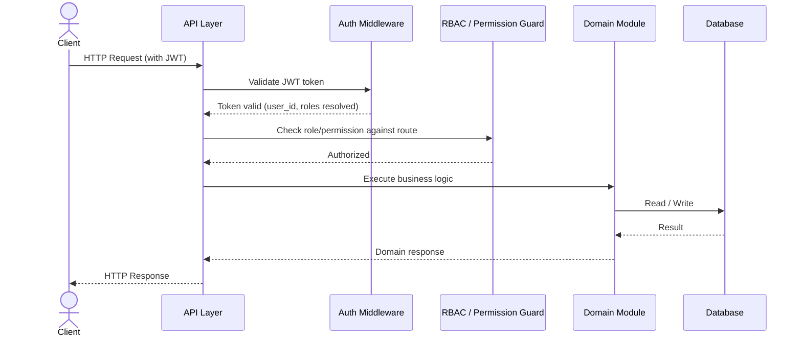
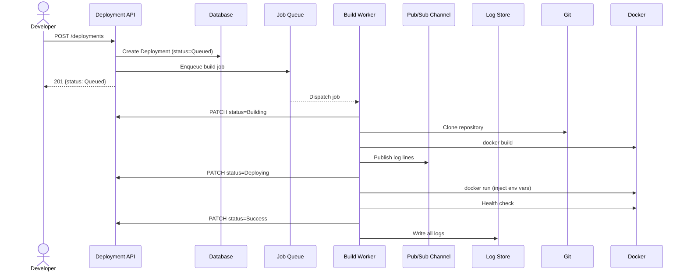
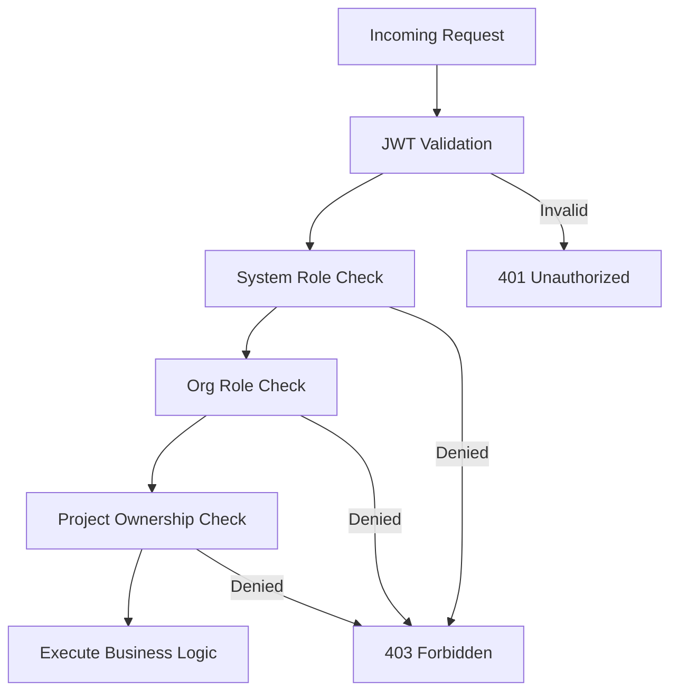
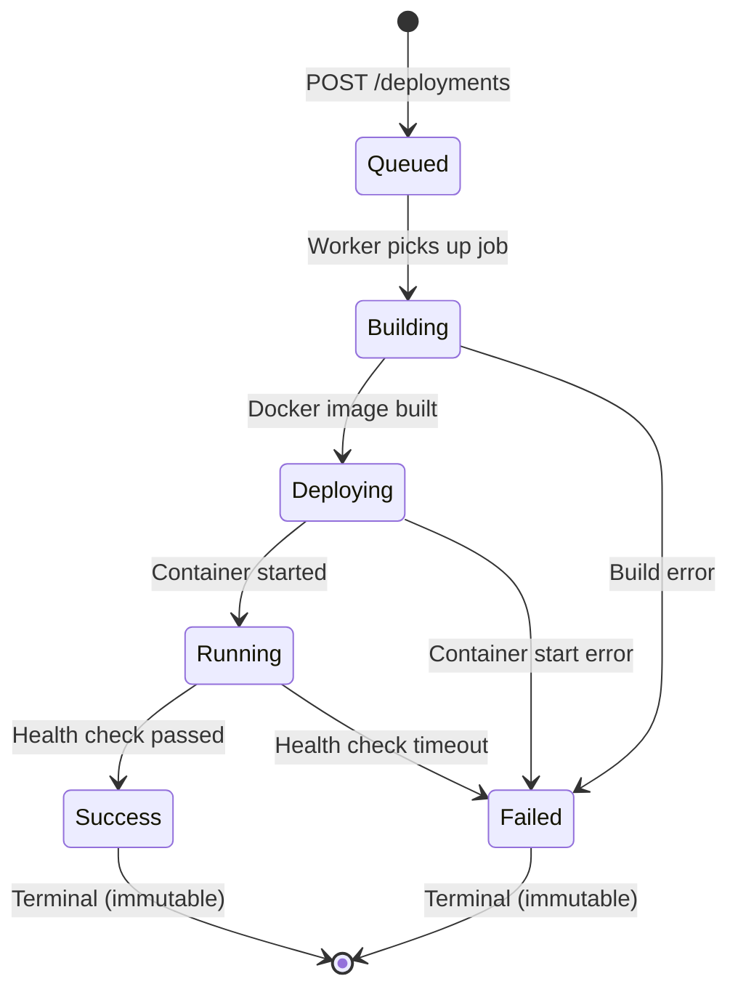
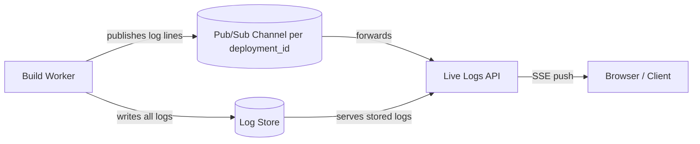

# System Architecture

> **Document:** System Architecture  
> **Section:** 02 — Architecture  
> **Version:** 1.0  
> **Status:** Draft

---

## 1. Architecture Style: Modular Monolith

Forge is implemented as a **modular monolith** — all modules execute within a single deployable process, but are organized into strict domain boundaries with documented interfaces. This approach provides the operational simplicity of a monolith while preserving the clarity of service-oriented thinking.

The monolith boundary is enforced not by network isolation, but by:
- Module documentation contracts (each module explicitly declares what it owns and excludes)
- Database table ownership (each module owns its tables and is the sole writer)
- Explicit dependency declarations in each module's design

---

## 2. Layered Architecture

Forge is organized into four logical layers, each building on the layer below:

```
┌─────────────────────────────────────────────────────┐
│                  Client / API Layer                  │
│   (REST API, SSE streaming, WebSocket connections)   │
├─────────────────────────────────────────────────────┤
│                  Business Domain Layer               │
│  Auth · Users · Org · Teams · Projects · Deploy     │
│  Notifications · Dashboard · Health                 │
├─────────────────────────────────────────────────────┤
│              Async Infrastructure Layer              │
│  Job Queue · Build Worker · Pub/Sub · Log Store     │
├─────────────────────────────────────────────────────┤
│                  Data Layer                          │
│  PostgreSQL Database · AES-256-GCM Encrypted Fields │
└─────────────────────────────────────────────────────┘
```

### Layer Descriptions

| Layer | Contents | Responsibilities |
|-------|----------|-----------------|
| **Client / API Layer** | REST endpoints, SSE streams, WebSocket connections | Accept and validate requests; enforce authentication middleware; route to domain modules |
| **Business Domain Layer** | All functional modules (Auth, Users, Org, Projects, Deploy, etc.) | Core business logic, validation, RBAC enforcement, data persistence |
| **Async Infrastructure Layer** | Job Queue, Build Worker, Pub/Sub broker, Log Store | Handle long-running operations (deployments) without blocking the API; deliver real-time events |
| **Data Layer** | Primary database, encrypted columns | Durable storage; encrypted-at-rest for secrets |

---

## 3. Request Processing Architecture

### Synchronous (REST) Path



### Asynchronous (Deployment) Path



---

## 4. Authentication & Authorization Architecture

Authentication and authorization are applied at two levels:

### 4.1 Authentication (Auth Module)

All requests to protected endpoints pass through a JWT validation middleware. The middleware:

1. Extracts the Bearer token from the `Authorization` header.
2. Validates the JWT signature and expiry.
3. Resolves the `user_id` and injects it into the request context.
4. Refresh tokens are stored in the database; access tokens are stateless JWTs.

### 4.2 Authorization (Multi-Layer RBAC)

Forge operates a **three-tier RBAC hierarchy**:

| Tier | Module | Scope |
|------|--------|-------|
| **System Level** | Access Control (Roles, Permissions) | Platform-wide roles assigned by System Admins |
| **Organization Level** | Org Permissions, Org Members | Member roles within an organization (Viewer, Developer, Admin, Owner) |
| **Project Level** | Project Permissions | Per-project ownership rules (owner_id-based) |

These tiers compose at runtime: a request is evaluated against all applicable permission layers.



---

## 5. Async Deployment Architecture

The deployment pipeline is fully asynchronous. The architectural components involved:

| Component | Role | Communication |
|-----------|------|---------------|
| **Deployment API** | Accepts trigger requests; creates deployment records | REST (external) |
| **Job Queue** (Redis / RabbitMQ) | Buffers deployment jobs; guarantees at-least-once delivery | Internal message queue |
| **Build Worker** | Consumes jobs; executes the 5-step build pipeline | Internal; communicates back via REST service tokens |
| **Docker Runtime** | Executes `docker build` and `docker run` | Local process call on worker host |
| **Git Service** | Provides repository source (clone + branch info) | Network call using stored credentials |
| **Pub/Sub Channel** | Delivers log lines to Live Logs subscribers in real time | Internal pub/sub (Redis Pub/Sub or equivalent) |
| **Log Store** | Persists all structured log lines for retrieval | Database or object storage |

### Deployment State Machine



> **BR-004 (Deployments):** Only one `Running` deployment may be active per project at a time. New triggers are queued behind it.

---

## 6. Real-Time Log Streaming Architecture



- Live streaming uses **Server-Sent Events (SSE)** (or WebSocket) over `GET /deployments/:id/logs/stream`.
- If the deployment has already reached a terminal state when the client connects, stored logs are served instead.
- The stream closes automatically when the deployment reaches `Success` or `Failed`.

---

## 7. Data Architecture Overview

### Primary Storage

- **Database:** PostgreSQL (relational, centralized)
- All modules write to the same database instance; table ownership enforces module boundaries.
- Foreign key relationships exist across module table boundaries (e.g., `deployments.project_id → projects.id`).

### Encrypted Storage

| What | Where | Algorithm |
|------|-------|-----------|
| Git Personal Access Tokens (PAT) | `project_repositories.access_token_encrypted` | AES-256-GCM |
| Environment variable secret values | `project_environment_variables.value_encrypted` | AES-256-GCM |
| Refresh tokens | `sessions` or `refresh_tokens` table | Hashed (not plaintext) |

### Log Storage

- Raw build and deployment log streams are aggregated and stored in **Grafana Loki** (per [ADR-005](../09-adr/ADR-005-use-loki-for-centralized-logging.md)).
- Deployment business metadata (status, duration, error summary) is stored in PostgreSQL (`deployments` table).
- Log retention: 90 days managed via Loki retention policies.
- Log entries carry structured metadata: `deployment_id`, `timestamp`, `level`, `step`, `message`.

---

## 8. Service Communication Patterns

| Pattern | Used For | Mechanism |
|---------|----------|-----------|
| **Synchronous REST** | All user-facing API calls | HTTP/HTTPS with JWT auth |
| **Async Job Queue** | Deployment job dispatch | Redis / RabbitMQ (at-least-once delivery) |
| **Internal Service Token** | Build Worker → Deployment API | Service credential (not user JWT) |
| **Pub/Sub** | Real-time log line delivery | Redis Pub/Sub or WebSocket broker |
| **SSE (Server-Sent Events)** | Live log streaming to browser | HTTP long-lived connection |
| **Database reads** | Dashboard aggregation, Health probes | Direct DB queries (read-only for aggregators) |

---

## 9. Non-Functional Performance Targets

| Concern | Module | Target |
|---------|--------|--------|
| REST API response time (standard endpoints) | All modules | < 50–200ms |
| Deployment trigger response | Deployments | < 200ms |
| Build worker job pickup | Build Worker | < 5s |
| Live log SSE delivery latency | Live Build Logs | < 500ms |
| Permission enforcement latency | Project Permissions | < 10ms |
| Env var read | Environment Variables | < 50ms |
| Health probe response | Health Module | < 100ms |
| Log stream concurrent connections | Live Build Logs | 10,000 concurrent SSE streams |

---

**Document Version:** 1.0  
**Last Updated:** 2026-08-12  
**Author:** Backend Architecture Team
