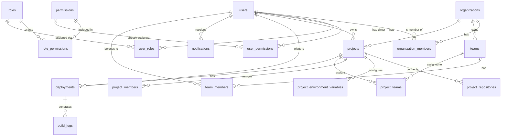

# Database Schema Overview

> **Document:** Database Schema Overview  
> **Section:** 03 — Data  
> **Version:** 1.0  
> **Status:** Draft

This document provides a consolidated reference for all database tables owned by each Forge module, their columns, types, constraints, and foreign key relationships. This is a system-level view; individual table documentation is authoritative in each module's design doc.

---

## 1. Schema Ownership Map

| Table                           | Owning Module                     |
| ------------------------------- | --------------------------------- |
| `users`                         | Users Module                      |
| `sessions` / `refresh_tokens`   | Auth Module                       |
| `roles`                         | Access Control — Roles            |
| `permissions`                   | Access Control — Permissions      |
| `role_permissions`              | Access Control — Role-Permissions |
| `user_roles`                    | Access Control — User-Roles       |
| `user_permissions`              | Access Control — User-Permissions |
| `organizations`                 | Organization Module               |
| `organization_members`          | Org Members Sub-Module            |
| `teams`                         | Teams Module                      |
| `team_members`                  | Teams Module                      |
| `projects`                      | Projects Module                   |
| `project_repositories`          | Repository Sub-Module             |
| `project_environment_variables` | Environment Variables Sub-Module  |
| `project_members`               | Project Assignments Sub-Module    |
| `project_teams`                 | Project Assignments Sub-Module    |
| `deployments`                   | Deployments Module                |
| `build_logs`                    | Build Worker Sub-Module           |
| `notifications`                 | Notifications Module              |

> **Dashboard** and **Health** modules own no tables.  
> **Deployment History** reads `deployments` and `users` — it owns no additional tables.

---

## 2. Core Identity Tables

### `users`

| Column          | Type      | Constraints      |
| --------------- | --------- | ---------------- |
| `id`            | UUID      | Primary Key      |
| `name`          | VARCHAR   | Not Null         |
| `email`         | VARCHAR   | Unique, Not Null |
| `password_hash` | VARCHAR   | Not Null         |
| `created_at`    | TIMESTAMP |                  |
| `updated_at`    | TIMESTAMP |                  |

### `roles`

| Column         | Type      | Constraints                  |
| -------------- | --------- | ---------------------------- |
| `id`           | UUID      | Primary Key                  |
| `key`          | VARCHAR   | Label (display name)         |
| `value`        | VARCHAR   | Unique — used in system code |
| `descriptions` | VARCHAR   | Nullable                     |
| `created_at`   | TIMESTAMP |                              |
| `updated_at`   | TIMESTAMP |                              |

### `permissions`

| Column         | Type      | Constraints |
| -------------- | --------- | ----------- |
| `id`           | UUID      | Primary Key |
| `key`          | VARCHAR   | Label       |
| `value`        | VARCHAR   | Unique      |
| `descriptions` | VARCHAR   | Nullable    |
| `created_at`   | TIMESTAMP |             |
| `updated_at`   | TIMESTAMP |             |

### `role_permissions` _(junction)_

| Column          | Type | Constraints                         |
| --------------- | ---- | ----------------------------------- |
| `role_id`       | UUID | FK → `roles.id`, composite PK       |
| `permission_id` | UUID | FK → `permissions.id`, composite PK |

### `user_roles` _(junction)_

| Column    | Type | Constraints     |
| --------- | ---- | --------------- |
| `user_id` | UUID | FK → `users.id` |
| `role_id` | UUID | FK → `roles.id` |

### `user_permissions` _(junction — direct override)_

| Column          | Type | Constraints           |
| --------------- | ---- | --------------------- |
| `user_id`       | UUID | FK → `users.id`       |
| `permission_id` | UUID | FK → `permissions.id` |

---

## 3. Organization & Team Tables

### `organizations`

| Column       | Type      | Constraints |
| ------------ | --------- | ----------- |
| `id`         | UUID      | Primary Key |
| `name`       | VARCHAR   | Not Null    |
| `slug`       | VARCHAR   | Unique      |
| `created_at` | TIMESTAMP |             |
| `updated_at` | TIMESTAMP |             |

### `organization_members`

| Column            | Type      | Constraints                             |
| ----------------- | --------- | --------------------------------------- |
| `id`              | UUID      | Primary Key                             |
| `organization_id` | UUID      | FK → `organizations.id`                 |
| `user_id`         | UUID      | FK → `users.id`                         |
| `role`            | VARCHAR   | `Viewer`, `Developer`, `Admin`, `Owner` |
| `created_at`      | TIMESTAMP |                                         |
| `updated_at`      | TIMESTAMP |                                         |

> Composite unique constraint: (`organization_id`, `user_id`).

### `teams`

| Column            | Type      | Constraints             |
| ----------------- | --------- | ----------------------- |
| `id`              | UUID      | Primary Key             |
| `organization_id` | UUID      | FK → `organizations.id` |
| `name`            | VARCHAR   | Not Null                |
| `created_at`      | TIMESTAMP |                         |
| `updated_at`      | TIMESTAMP |                         |

### `team_members`

| Column       | Type      | Constraints     |
| ------------ | --------- | --------------- |
| `id`         | UUID      | Primary Key     |
| `team_id`    | UUID      | FK → `teams.id` |
| `user_id`    | UUID      | FK → `users.id` |
| `created_at` | TIMESTAMP |                 |

---

## 4. Project Tables

### `projects`

| Column            | Type      | Constraints                                      |
| ----------------- | --------- | ------------------------------------------------ |
| `id`              | UUID      | Primary Key                                      |
| `organization_id` | UUID      | FK → `organizations.id`                          |
| `owner_id`        | UUID      | FK → `users.id`                                  |
| `name`            | VARCHAR   | Unique per org                                   |
| `type`            | VARCHAR   | `repo` or `files`                                |
| `repository_url`  | VARCHAR   | Nullable (required if `type = repo`)             |
| `default_branch`  | VARCHAR   | Nullable (required if `type = repo`)             |
| `runtime`         | VARCHAR   | `Node.js`, `Rust`, `Python`, `Go`, `Static Site` |
| `framework`       | VARCHAR   | Nullable                                         |
| `status`          | VARCHAR   | `active`, `archived`, `draft`                    |
| `descriptions`    | VARCHAR   | Nullable                                         |
| `created_at`      | TIMESTAMP |                                                  |
| `updated_at`      | TIMESTAMP |                                                  |

### `project_repositories`

| Column                   | Type      | Constraints                       |
| ------------------------ | --------- | --------------------------------- |
| `id`                     | UUID      | Primary Key                       |
| `project_id`             | UUID      | FK → `projects.id`                |
| `repository_url`         | VARCHAR   | Git URL                           |
| `auth_type`              | VARCHAR   | `public` or `pat`                 |
| `access_token_encrypted` | TEXT      | Nullable; AES-256-GCM ciphertext  |
| `default_branch`         | VARCHAR   | e.g. `main`                       |
| `active_branch`          | VARCHAR   | Currently selected working branch |
| `last_commit_sha`        | VARCHAR   | Nullable                          |
| `last_commit_message`    | TEXT      | Nullable                          |
| `last_commit_at`         | TIMESTAMP | Nullable                          |
| `status`                 | VARCHAR   | `connected`, `cloned`, `error`    |
| `created_at`             | TIMESTAMP |                                   |
| `updated_at`             | TIMESTAMP |                                   |

### `project_environment_variables`

| Column            | Type      | Constraints                            |
| ----------------- | --------- | -------------------------------------- |
| `id`              | UUID      | Primary Key                            |
| `project_id`      | UUID      | FK → `projects.id`                     |
| `key`             | VARCHAR   | POSIX format (`^[A-Z_][A-Z0-9_]*$`)    |
| `value_encrypted` | TEXT      | AES-256-GCM ciphertext                 |
| `environment`     | VARCHAR   | `Development`, `Preview`, `Production` |
| `is_secret`       | BOOLEAN   | Default: `true`                        |
| `created_at`      | TIMESTAMP |                                        |
| `updated_at`      | TIMESTAMP |                                        |

> Unique constraint: (`project_id`, `environment`, `key`).

### `project_members` _(Project Assignments)_

| Column       | Type      | Constraints        |
| ------------ | --------- | ------------------ |
| `id`         | UUID      | Primary Key        |
| `project_id` | UUID      | FK → `projects.id` |
| `user_id`    | UUID      | FK → `users.id`    |
| `created_at` | TIMESTAMP |                    |
| `updated_at` | TIMESTAMP |                    |

### `project_teams` _(Project Assignments)_

| Column       | Type      | Constraints        |
| ------------ | --------- | ------------------ |
| `id`         | UUID      | Primary Key        |
| `project_id` | UUID      | FK → `projects.id` |
| `team_id`    | UUID      | FK → `teams.id`    |
| `created_at` | TIMESTAMP |                    |
| `updated_at` | TIMESTAMP |                    |

---

## 5. Deployment Tables

### `deployments`

| Column            | Type        | Constraints                                                       |
| ----------------- | ----------- | ----------------------------------------------------------------- |
| `id`              | UUID        | Primary Key                                                       |
| `project_id`      | UUID        | FK → `projects.id`                                                |
| `triggered_by`    | UUID        | FK → `users.id`                                                   |
| `branch`          | VARCHAR     | Branch deployed                                                   |
| `commit_hash`     | VARCHAR(40) | Git commit SHA                                                    |
| `status`          | VARCHAR     | `Queued`, `Building`, `Deploying`, `Running`, `Failed`, `Success` |
| `build_duration`  | INTEGER     | Build time in ms (nullable)                                       |
| `deploy_duration` | INTEGER     | Deploy time in ms (nullable)                                      |
| `error_message`   | TEXT        | Error detail if `Failed` (nullable)                               |
| `created_at`      | TIMESTAMP   |                                                                   |
| `updated_at`      | TIMESTAMP   |                                                                   |

> Valid state machine: `Queued → Building → Deploying → Running → Success`. Any state → `Failed`.  
> Records are **immutable** once in `Success` or `Failed`.

### `build_logs` *(Deprecated / Legacy)*

> **Architectural Note (ADR-005):** Raw build and deployment log streams are aggregated and stored in **Grafana Loki** (per [ADR-005](../09-adr/ADR-005-use-loki-for-centralized-logging.md)). PostgreSQL does not store raw log output. The `build_logs` database table is marked as legacy and is candidates for deprecation once all log endpoints query Loki directly.

| Column          | Type      | Constraints                                |
| --------------- | --------- | ------------------------------------------ |
| `id`            | UUID      | Primary Key                                |
| `deployment_id` | UUID      | FK → `deployments.id`                      |
| `timestamp`     | TIMESTAMP | Log entry time                             |
| `level`         | VARCHAR   | `INFO`, `WARN`, `ERROR`, `DEBUG`           |
| `message`       | TEXT      | Log line content                           |
| `step`          | VARCHAR   | `clone`, `build`, `deploy`, `health_check` |

---

## 6. Notifications Table

### `notifications`

| Column       | Type      | Constraints             |
| ------------ | --------- | ----------------------- |
| `id`         | UUID      | Primary Key             |
| `user_id`    | UUID      | FK → `users.id`         |
| `type`       | VARCHAR   | Notification event type |
| `message`    | TEXT      | Notification content    |
| `is_read`    | BOOLEAN   | Default: `false`        |
| `created_at` | TIMESTAMP |                         |

---

## 7. Cross-Table Foreign Key Reference Graph

---

## 8. Encrypted Columns Summary

| Table                           | Column                   | Algorithm   | Secret Type                                          |
| ------------------------------- | ------------------------ | ----------- | ---------------------------------------------------- |
| `project_repositories`          | `access_token_encrypted` | AES-256-GCM | Git Personal Access Token                            |
| `project_environment_variables` | `value_encrypted`        | AES-256-GCM | Environment variable value (when `is_secret = true`) |

> These columns must **never** be returned in plaintext via any public API endpoint.  
> Decryption is only permitted for authorized internal runners (Build Worker).

---

**Document Version:** 1.0  
**Last Updated:** 2026-08-12  
**Author:** Backend Architecture Team
