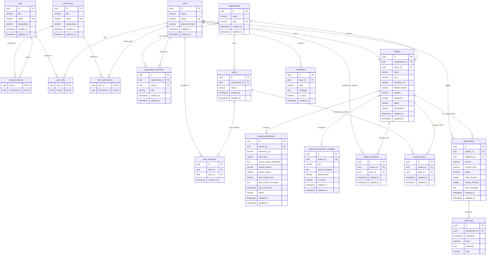

# Database Entity-Relationship Documentation (ERD)

> **Document:** Database Entity-Relationship Documentation  
> **Target File:** `docs/04-database/erd.md`  
> **Version:** 1.0  
> **Status:** Final  
> **Scope:** Complete Database Schema & Relationship Specifications

---

# 1. System ERD Diagram



---

# 2. Table-by-Table Database Documentation

## Table: users

### Description

Stores system user core authentication accounts and profile identity. Owned by Users Module.

### Columns

| Column        | Type         | Nullable | Default            | Key  | Description                           |
| ------------- | ------------ | -------- | ------------------ | ---- | ------------------------------------- |
| id            | UUID         | No       | uuid_generate_v4() | PK   | System unique user identifier         |
| name          | VARCHAR(255) | No       | None               | None | User full display name                |
| email         | VARCHAR(255) | No       | None               | UK   | User email address for authentication |
| password_hash | VARCHAR(255) | No       | None               | None | Argon2id / bcrypt password hash       |
| created_at    | TIMESTAMP    | No       | CURRENT_TIMESTAMP  | None | Record creation timestamp             |
| updated_at    | TIMESTAMP    | No       | CURRENT_TIMESTAMP  | None | Record last update timestamp          |

### Constraints

#### Primary Key

| Constraint Name | Column(s) | Type        |
| --------------- | --------- | ----------- |
| pk_users        | id        | PRIMARY KEY |

#### Foreign Keys

_None_

### Indexes

| Index Name     | Column(s) | Type  | Unique |
| -------------- | --------- | ----- | ------ |
| uk_users_email | email     | BTREE | Yes    |

### Relationships

| Relationship  | Related Table        | Cardinality |
| ------------- | -------------------- | ----------- |
| has many      | organization_members | 1:N         |
| has many      | user_roles           | 1:N         |
| has many      | user_permissions     | 1:N         |
| owns many     | projects             | 1:N         |
| triggers many | deployments          | 1:N         |
| receives many | notifications        | 1:N         |

---

## Table: roles

### Description

Defines system-wide authorization roles. Owned by Access Control Module.

### Columns

| Column       | Type         | Nullable | Default            | Key  | Description                                  |
| ------------ | ------------ | -------- | ------------------ | ---- | -------------------------------------------- |
| id           | UUID         | No       | uuid_generate_v4() | PK   | Role unique identifier                       |
| key          | VARCHAR(100) | No       | None               | None | Human readable role label                    |
| value        | VARCHAR(100) | No       | None               | UK   | System role identifier string (e.g. `admin`) |
| descriptions | VARCHAR(255) | Yes      | NULL               | None | Optional role description                    |
| created_at   | TIMESTAMP    | No       | CURRENT_TIMESTAMP  | None | Record creation timestamp                    |
| updated_at   | TIMESTAMP    | No       | CURRENT_TIMESTAMP  | None | Record last update timestamp                 |

### Constraints

#### Primary Key

| Constraint Name | Column(s) | Type        |
| --------------- | --------- | ----------- |
| pk_roles        | id        | PRIMARY KEY |

#### Foreign Keys

_None_

### Indexes

| Index Name     | Column(s) | Type  | Unique |
| -------------- | --------- | ----- | ------ |
| uk_roles_value | value     | BTREE | Yes    |

### Relationships

| Relationship | Related Table    | Cardinality |
| ------------ | ---------------- | ----------- |
| granted in   | role_permissions | 1:N         |
| assigned in  | user_roles       | 1:N         |

---

## Table: permissions

### Description

Defines atomic system permissions. Owned by Access Control Module.

### Columns

| Column       | Type         | Nullable | Default            | Key  | Description                         |
| ------------ | ------------ | -------- | ------------------ | ---- | ----------------------------------- |
| id           | UUID         | No       | uuid_generate_v4() | PK   | Permission unique identifier        |
| key          | VARCHAR(100) | No       | None               | None | Human readable permission label     |
| value        | VARCHAR(100) | No       | None               | UK   | System permission identifier string |
| descriptions | VARCHAR(255) | Yes      | NULL               | None | Optional description                |
| created_at   | TIMESTAMP    | No       | CURRENT_TIMESTAMP  | None | Record creation timestamp           |
| updated_at   | TIMESTAMP    | No       | CURRENT_TIMESTAMP  | None | Record last update timestamp        |

### Constraints

#### Primary Key

| Constraint Name | Column(s) | Type        |
| --------------- | --------- | ----------- |
| pk_permissions  | id        | PRIMARY KEY |

#### Foreign Keys

_None_

### Indexes

| Index Name           | Column(s) | Type  | Unique |
| -------------------- | --------- | ----- | ------ |
| uk_permissions_value | value     | BTREE | Yes    |

### Relationships

| Relationship         | Related Table    | Cardinality |
| -------------------- | ---------------- | ----------- |
| assigned in          | role_permissions | 1:N         |
| directly assigned in | user_permissions | 1:N         |

---

## Table: role_permissions

### Description

Junction table mapping system permissions to roles. Owned by Access Control Module.

### Columns

| Column        | Type | Nullable | Default | Key    | Description                      |
| ------------- | ---- | -------- | ------- | ------ | -------------------------------- |
| role_id       | UUID | No       | None    | PK, FK | Foreign key to roles table       |
| permission_id | UUID | No       | None    | PK, FK | Foreign key to permissions table |

### Constraints

#### Primary Key

| Constraint Name     | Column(s)              | Type                    |
| ------------------- | ---------------------- | ----------------------- |
| pk_role_permissions | role_id, permission_id | PRIMARY KEY (Composite) |

#### Foreign Keys

| Constraint Name                | Column(s)     | References      | On Delete | On Update |
| ------------------------------ | ------------- | --------------- | --------- | --------- |
| fk_role_permissions_role       | role_id       | roles(id)       | CASCADE   | CASCADE   |
| fk_role_permissions_permission | permission_id | permissions(id) | CASCADE   | CASCADE   |

### Indexes

| Index Name                | Column(s)     | Type  | Unique |
| ------------------------- | ------------- | ----- | ------ |
| idx_role_permissions_perm | permission_id | BTREE | No     |

### Relationships

| Relationship | Related Table | Cardinality |
| ------------ | ------------- | ----------- |
| belongs to   | roles         | N:1         |
| belongs to   | permissions   | N:1         |

---

## Table: user_roles

### Description

Junction table assigning system roles to users. Owned by Access Control Module.

### Columns

| Column  | Type | Nullable | Default | Key    | Description                |
| ------- | ---- | -------- | ------- | ------ | -------------------------- |
| user_id | UUID | No       | None    | PK, FK | Foreign key to users table |
| role_id | UUID | No       | None    | PK, FK | Foreign key to roles table |

### Constraints

#### Primary Key

| Constraint Name | Column(s)        | Type                    |
| --------------- | ---------------- | ----------------------- |
| pk_user_roles   | user_id, role_id | PRIMARY KEY (Composite) |

#### Foreign Keys

| Constraint Name    | Column(s) | References | On Delete | On Update |
| ------------------ | --------- | ---------- | --------- | --------- |
| fk_user_roles_user | user_id   | users(id)  | CASCADE   | CASCADE   |
| fk_user_roles_role | role_id   | roles(id)  | CASCADE   | CASCADE   |

### Indexes

| Index Name          | Column(s) | Type  | Unique |
| ------------------- | --------- | ----- | ------ |
| idx_user_roles_role | role_id   | BTREE | No     |

### Relationships

| Relationship | Related Table | Cardinality |
| ------------ | ------------- | ----------- |
| belongs to   | users         | N:1         |
| belongs to   | roles         | N:1         |

---

## Table: user_permissions

### Description

Junction table for direct permission overrides assigned to users. Owned by Access Control Module.

### Columns

| Column        | Type | Nullable | Default | Key    | Description                      |
| ------------- | ---- | -------- | ------- | ------ | -------------------------------- |
| user_id       | UUID | No       | None    | PK, FK | Foreign key to users table       |
| permission_id | UUID | No       | None    | PK, FK | Foreign key to permissions table |

### Constraints

#### Primary Key

| Constraint Name     | Column(s)              | Type                    |
| ------------------- | ---------------------- | ----------------------- |
| pk_user_permissions | user_id, permission_id | PRIMARY KEY (Composite) |

#### Foreign Keys

| Constraint Name                | Column(s)     | References      | On Delete | On Update |
| ------------------------------ | ------------- | --------------- | --------- | --------- |
| fk_user_permissions_user       | user_id       | users(id)       | CASCADE   | CASCADE   |
| fk_user_permissions_permission | permission_id | permissions(id) | CASCADE   | CASCADE   |

### Indexes

| Index Name                | Column(s)     | Type  | Unique |
| ------------------------- | ------------- | ----- | ------ |
| idx_user_permissions_perm | permission_id | BTREE | No     |

### Relationships

| Relationship | Related Table | Cardinality |
| ------------ | ------------- | ----------- |
| belongs to   | users         | N:1         |
| belongs to   | permissions   | N:1         |

---

## Table: organizations

### Description

Represents top-level organization tenant accounts. Owned by Organization Module.

### Columns

| Column     | Type         | Nullable | Default            | Key  | Description                           |
| ---------- | ------------ | -------- | ------------------ | ---- | ------------------------------------- |
| id         | UUID         | No       | uuid_generate_v4() | PK   | Organization unique identifier        |
| name       | VARCHAR(255) | No       | None               | None | Organization display name             |
| slug       | VARCHAR(100) | No       | None               | UK   | URL-friendly unique organization slug |
| created_at | TIMESTAMP    | No       | CURRENT_TIMESTAMP  | None | Record creation timestamp             |
| updated_at | TIMESTAMP    | No       | CURRENT_TIMESTAMP  | None | Record last update timestamp          |

### Constraints

#### Primary Key

| Constraint Name  | Column(s) | Type        |
| ---------------- | --------- | ----------- |
| pk_organizations | id        | PRIMARY KEY |

#### Foreign Keys

_None_

### Indexes

| Index Name            | Column(s) | Type  | Unique |
| --------------------- | --------- | ----- | ------ |
| uk_organizations_slug | slug      | BTREE | Yes    |

### Relationships

| Relationship  | Related Table        | Cardinality |
| ------------- | -------------------- | ----------- |
| has many      | organization_members | 1:N         |
| owns many     | teams                | 1:N         |
| contains many | projects             | 1:N         |

---

## Table: organization_members

### Description

Maps users to organizations with assigned organizational roles (`Viewer`, `Developer`, `Admin`, `Owner`). Owned by Org Members Sub-Module.

### Columns

| Column          | Type        | Nullable | Default            | Key  | Description                                       |
| --------------- | ----------- | -------- | ------------------ | ---- | ------------------------------------------------- |
| id              | UUID        | No       | uuid_generate_v4() | PK   | Membership record ID                              |
| organization_id | UUID        | No       | None               | FK   | Foreign key to organizations                      |
| user_id         | UUID        | No       | None               | FK   | Foreign key to users                              |
| role            | VARCHAR(50) | No       | 'Viewer'           | None | Org role: `Viewer`, `Developer`, `Admin`, `Owner` |
| created_at      | TIMESTAMP   | No       | CURRENT_TIMESTAMP  | None | Record creation timestamp                         |
| updated_at      | TIMESTAMP   | No       | CURRENT_TIMESTAMP  | None | Record last update timestamp                      |

### Constraints

#### Primary Key

| Constraint Name         | Column(s) | Type        |
| ----------------------- | --------- | ----------- |
| pk_organization_members | id        | PRIMARY KEY |

#### Foreign Keys

| Constraint Name     | Column(s)       | References        | On Delete | On Update |
| ------------------- | --------------- | ----------------- | --------- | --------- |
| fk_org_members_org  | organization_id | organizations(id) | CASCADE   | CASCADE   |
| fk_org_members_user | user_id         | users(id)         | CASCADE   | CASCADE   |

### Indexes

| Index Name              | Column(s)                | Type  | Unique |
| ----------------------- | ------------------------ | ----- | ------ |
| uk_org_members_org_user | organization_id, user_id | BTREE | Yes    |

### Relationships

| Relationship | Related Table | Cardinality |
| ------------ | ------------- | ----------- |
| belongs to   | organizations | N:1         |
| belongs to   | users         | N:1         |

---

## Table: teams

### Description

Represents functional teams within an organization. Owned by Teams Module.

### Columns

| Column          | Type         | Nullable | Default            | Key  | Description                  |
| --------------- | ------------ | -------- | ------------------ | ---- | ---------------------------- |
| id              | UUID         | No       | uuid_generate_v4() | PK   | Team unique identifier       |
| organization_id | UUID         | No       | None               | FK   | Parent organization ID       |
| name            | VARCHAR(255) | No       | None               | None | Team name                    |
| created_at      | TIMESTAMP    | No       | CURRENT_TIMESTAMP  | None | Record creation timestamp    |
| updated_at      | TIMESTAMP    | No       | CURRENT_TIMESTAMP  | None | Record last update timestamp |

### Constraints

#### Primary Key

| Constraint Name | Column(s) | Type        |
| --------------- | --------- | ----------- |
| pk_teams        | id        | PRIMARY KEY |

#### Foreign Keys

| Constraint Name       | Column(s)       | References        | On Delete | On Update |
| --------------------- | --------------- | ----------------- | --------- | --------- |
| fk_teams_organization | organization_id | organizations(id) | CASCADE   | CASCADE   |

### Indexes

| Index Name             | Column(s)       | Type  | Unique |
| ---------------------- | --------------- | ----- | ------ |
| idx_teams_organization | organization_id | BTREE | No     |

### Relationships

| Relationship | Related Table | Cardinality |
| ------------ | ------------- | ----------- |
| belongs to   | organizations | N:1         |
| has many     | team_members  | 1:N         |
| assigned to  | project_teams | 1:N         |

---

## Table: team_members

### Description

Junction table mapping users to teams. Owned by Teams Module.

### Columns

| Column     | Type      | Nullable | Default            | Key  | Description               |
| ---------- | --------- | -------- | ------------------ | ---- | ------------------------- |
| id         | UUID      | No       | uuid_generate_v4() | PK   | Record ID                 |
| team_id    | UUID      | No       | None               | FK   | Foreign key to teams      |
| user_id    | UUID      | No       | None               | FK   | Foreign key to users      |
| created_at | TIMESTAMP | No       | CURRENT_TIMESTAMP  | None | Record creation timestamp |

### Constraints

#### Primary Key

| Constraint Name | Column(s) | Type        |
| --------------- | --------- | ----------- |
| pk_team_members | id        | PRIMARY KEY |

#### Foreign Keys

| Constraint Name      | Column(s) | References | On Delete | On Update |
| -------------------- | --------- | ---------- | --------- | --------- |
| fk_team_members_team | team_id   | teams(id)  | CASCADE   | CASCADE   |
| fk_team_members_user | user_id   | users(id)  | CASCADE   | CASCADE   |

### Indexes

| Index Name                | Column(s)        | Type  | Unique |
| ------------------------- | ---------------- | ----- | ------ |
| uk_team_members_team_user | team_id, user_id | BTREE | Yes    |

### Relationships

| Relationship | Related Table | Cardinality |
| ------------ | ------------- | ----------- |
| belongs to   | teams         | N:1         |
| belongs to   | users         | N:1         |

---

## Table: projects

### Description

Stores project configuration and runtime metadata. Owned by Projects Module.

### Columns

| Column          | Type         | Nullable | Default            | Key  | Description                                                |
| --------------- | ------------ | -------- | ------------------ | ---- | ---------------------------------------------------------- |
| id              | UUID         | No       | uuid_generate_v4() | PK   | Project unique identifier                                  |
| organization_id | UUID         | No       | None               | FK   | Parent organization ID                                     |
| owner_id        | UUID         | No       | None               | FK   | Project owner user ID                                      |
| name            | VARCHAR(255) | No       | None               | None | Project name (unique per org)                              |
| type            | VARCHAR(50)  | No       | None               | None | Project type (`repo` or `files`)                           |
| repository_url  | VARCHAR(500) | Yes      | NULL               | None | Git URL (required if `type=repo`)                          |
| default_branch  | VARCHAR(100) | Yes      | NULL               | None | Branch name (required if `type=repo`)                      |
| runtime         | VARCHAR(50)  | No       | None               | None | Runtime (`Node.js`, `Rust`, `Python`, `Go`, `Static Site`) |
| framework       | VARCHAR(100) | Yes      | NULL               | None | Framework name (e.g. `Actix Web`, `FastAPI`)               |
| status          | VARCHAR(50)  | No       | 'active'           | None | Status (`active`, `archived`, `draft`)                     |
| descriptions    | TEXT         | Yes      | NULL               | None | Optional description                                       |
| created_at      | TIMESTAMP    | No       | CURRENT_TIMESTAMP  | None | Record creation timestamp                                  |
| updated_at      | TIMESTAMP    | No       | CURRENT_TIMESTAMP  | None | Record last update timestamp                               |

### Constraints

#### Primary Key

| Constraint Name | Column(s) | Type        |
| --------------- | --------- | ----------- |
| pk_projects     | id        | PRIMARY KEY |

#### Foreign Keys

| Constraint Name   | Column(s)       | References        | On Delete | On Update |
| ----------------- | --------------- | ----------------- | --------- | --------- |
| fk_projects_org   | organization_id | organizations(id) | CASCADE   | CASCADE   |
| fk_projects_owner | owner_id        | users(id)         | RESTRICT  | CASCADE   |

### Indexes

| Index Name           | Column(s)             | Type  | Unique |
| -------------------- | --------------------- | ----- | ------ |
| uk_projects_org_name | organization_id, name | BTREE | Yes    |

### Relationships

| Relationship | Related Table                 | Cardinality |
| ------------ | ----------------------------- | ----------- |
| belongs to   | organizations                 | N:1         |
| belongs to   | users (owner)                 | N:1         |
| has one      | project_repositories          | 1:1         |
| has many     | project_environment_variables | 1:N         |
| has many     | project_members               | 1:N         |
| has many     | project_teams                 | 1:N         |
| has many     | deployments                   | 1:N         |

---

## Table: project_repositories

### Description

Stores connected Git repository credentials and active working branch state. Owned by Repository Sub-Module.

### Columns

| Column                 | Type         | Nullable | Default            | Key    | Description                             |
| ---------------------- | ------------ | -------- | ------------------ | ------ | --------------------------------------- |
| id                     | UUID         | No       | uuid_generate_v4() | PK     | Repository connection ID                |
| project_id             | UUID         | No       | None               | FK, UK | Connected project ID                    |
| repository_url         | VARCHAR(500) | No       | None               | None   | Git repository remote URL               |
| auth_type              | VARCHAR(50)  | No       | 'public'           | None   | Authentication type (`public` or `pat`) |
| access_token_encrypted | TEXT         | Yes      | NULL               | None   | AES-256-GCM encrypted PAT token         |
| default_branch         | VARCHAR(100) | No       | 'main'             | None   | Default repository branch               |
| active_branch          | VARCHAR(100) | No       | 'main'             | None   | Currently selected working branch       |
| last_commit_sha        | VARCHAR(40)  | Yes      | NULL               | None   | SHA-1 hash of latest commit             |
| last_commit_message    | TEXT         | Yes      | NULL               | None   | Commit message                          |
| last_commit_at         | TIMESTAMP    | Yes      | NULL               | None   | Commit timestamp                        |
| status                 | VARCHAR(50)  | No       | 'connected'        | None   | Status (`connected`, `cloned`, `error`) |
| created_at             | TIMESTAMP    | No       | CURRENT_TIMESTAMP  | None   | Record creation timestamp               |
| updated_at             | TIMESTAMP    | No       | CURRENT_TIMESTAMP  | None   | Record last update timestamp            |

### Constraints

#### Primary Key

| Constraint Name         | Column(s) | Type        |
| ----------------------- | --------- | ----------- |
| pk_project_repositories | id        | PRIMARY KEY |

#### Foreign Keys

| Constraint Name          | Column(s)  | References   | On Delete | On Update |
| ------------------------ | ---------- | ------------ | --------- | --------- |
| fk_project_repos_project | project_id | projects(id) | CASCADE   | CASCADE   |

### Indexes

| Index Name               | Column(s)  | Type  | Unique |
| ------------------------ | ---------- | ----- | ------ |
| uk_project_repos_project | project_id | BTREE | Yes    |

### Relationships

| Relationship | Related Table | Cardinality |
| ------------ | ------------- | ----------- |
| belongs to   | projects      | 1:1         |

---

## Table: project_environment_variables

### Description

Manages project environment variables per environment target with AES-256-GCM secret encryption. Owned by Environment Variables Sub-Module.

### Columns

| Column          | Type         | Nullable | Default            | Key  | Description                                                 |
| --------------- | ------------ | -------- | ------------------ | ---- | ----------------------------------------------------------- |
| id              | UUID         | No       | uuid_generate_v4() | PK   | Variable ID                                                 |
| project_id      | UUID         | No       | None               | FK   | Parent project ID                                           |
| key             | VARCHAR(255) | No       | None               | None | Variable key (POSIX uppercase format)                       |
| value_encrypted | TEXT         | No       | None               | None | AES-256-GCM encrypted value                                 |
| environment     | VARCHAR(50)  | No       | None               | None | Target environment (`Development`, `Preview`, `Production`) |
| is_secret       | BOOLEAN      | No       | true               | None | Flag indicating secret status                               |
| created_at      | TIMESTAMP    | No       | CURRENT_TIMESTAMP  | None | Record creation timestamp                                   |
| updated_at      | TIMESTAMP    | No       | CURRENT_TIMESTAMP  | None | Record last update timestamp                                |

### Constraints

#### Primary Key

| Constraint Name     | Column(s) | Type        |
| ------------------- | --------- | ----------- |
| pk_project_env_vars | id        | PRIMARY KEY |

#### Foreign Keys

| Constraint Name             | Column(s)  | References   | On Delete | On Update |
| --------------------------- | ---------- | ------------ | --------- | --------- |
| fk_project_env_vars_project | project_id | projects(id) | CASCADE   | CASCADE   |

### Indexes

| Index Name               | Column(s)                    | Type  | Unique |
| ------------------------ | ---------------------------- | ----- | ------ |
| uk_project_env_key_scope | project_id, environment, key | BTREE | Yes    |

### Relationships

| Relationship | Related Table | Cardinality |
| ------------ | ------------- | ----------- |
| belongs to   | projects      | N:1         |

---

## Table: project_members

### Description

Stores individual user assignments to projects. Owned by Project Assignments Sub-Module.

### Columns

| Column     | Type      | Nullable | Default            | Key  | Description                  |
| ---------- | --------- | -------- | ------------------ | ---- | ---------------------------- |
| id         | UUID      | No       | uuid_generate_v4() | PK   | Assignment ID                |
| project_id | UUID      | No       | None               | FK   | Foreign key to projects      |
| user_id    | UUID      | No       | None               | FK   | Foreign key to users         |
| created_at | TIMESTAMP | No       | CURRENT_TIMESTAMP  | None | Record creation timestamp    |
| updated_at | TIMESTAMP | No       | CURRENT_TIMESTAMP  | None | Record last update timestamp |

### Constraints

#### Primary Key

| Constraint Name    | Column(s) | Type        |
| ------------------ | --------- | ----------- |
| pk_project_members | id        | PRIMARY KEY |

#### Foreign Keys

| Constraint Name            | Column(s)  | References   | On Delete | On Update |
| -------------------------- | ---------- | ------------ | --------- | --------- |
| fk_project_members_project | project_id | projects(id) | CASCADE   | CASCADE   |
| fk_project_members_user    | user_id    | users(id)    | CASCADE   | CASCADE   |

### Indexes

| Index Name                   | Column(s)           | Type  | Unique |
| ---------------------------- | ------------------- | ----- | ------ |
| uk_project_members_proj_user | project_id, user_id | BTREE | Yes    |

### Relationships

| Relationship | Related Table | Cardinality |
| ------------ | ------------- | ----------- |
| belongs to   | projects      | N:1         |
| belongs to   | users         | N:1         |

---

## Table: project_teams

### Description

Stores team assignments to projects. Owned by Project Assignments Sub-Module.

### Columns

| Column     | Type      | Nullable | Default            | Key  | Description                  |
| ---------- | --------- | -------- | ------------------ | ---- | ---------------------------- |
| id         | UUID      | No       | uuid_generate_v4() | PK   | Assignment ID                |
| project_id | UUID      | No       | None               | FK   | Foreign key to projects      |
| team_id    | UUID      | No       | None               | FK   | Foreign key to teams         |
| created_at | TIMESTAMP | No       | CURRENT_TIMESTAMP  | None | Record creation timestamp    |
| updated_at | TIMESTAMP | No       | CURRENT_TIMESTAMP  | None | Record last update timestamp |

### Constraints

#### Primary Key

| Constraint Name  | Column(s) | Type        |
| ---------------- | --------- | ----------- |
| pk_project_teams | id        | PRIMARY KEY |

#### Foreign Keys

| Constraint Name          | Column(s)  | References   | On Delete | On Update |
| ------------------------ | ---------- | ------------ | --------- | --------- |
| fk_project_teams_project | project_id | projects(id) | CASCADE   | CASCADE   |
| fk_project_teams_team    | team_id    | teams(id)    | CASCADE   | CASCADE   |

### Indexes

| Index Name                 | Column(s)           | Type  | Unique |
| -------------------------- | ------------------- | ----- | ------ |
| uk_project_teams_proj_team | project_id, team_id | BTREE | Yes    |

### Relationships

| Relationship | Related Table | Cardinality |
| ------------ | ------------- | ----------- |
| belongs to   | projects      | N:1         |
| belongs to   | teams         | N:1         |

---

## Table: deployments

### Description

Tracks async deployment lifecycle state machine per project. Owned by Deployments Module.

### Columns

| Column          | Type         | Nullable | Default            | Key  | Description                                                                  |
| --------------- | ------------ | -------- | ------------------ | ---- | ---------------------------------------------------------------------------- |
| id              | UUID         | No       | uuid_generate_v4() | PK   | Deployment unique ID                                                         |
| project_id      | UUID         | No       | None               | FK   | Target project ID                                                            |
| triggered_by    | UUID         | No       | None               | FK   | User ID who triggered deployment                                             |
| branch          | VARCHAR(100) | No       | None               | None | Branch deployed                                                              |
| commit_hash     | VARCHAR(40)  | No       | None               | None | Git commit SHA-1 hash                                                        |
| status          | VARCHAR(50)  | No       | 'Queued'           | None | Lifecycle: `Queued`, `Building`, `Deploying`, `Running`, `Failed`, `Success` |
| build_duration  | INTEGER      | Yes      | NULL               | None | Build duration in milliseconds                                               |
| deploy_duration | INTEGER      | Yes      | NULL               | None | Deploy duration in milliseconds                                              |
| error_message   | TEXT         | Yes      | NULL               | None | Error details if status is `Failed`                                          |
| created_at      | TIMESTAMP    | No       | CURRENT_TIMESTAMP  | None | Record creation timestamp                                                    |
| updated_at      | TIMESTAMP    | No       | CURRENT_TIMESTAMP  | None | Record last update timestamp                                                 |

### Constraints

#### Primary Key

| Constraint Name | Column(s) | Type        |
| --------------- | --------- | ----------- |
| pk_deployments  | id        | PRIMARY KEY |

#### Foreign Keys

| Constraint Name        | Column(s)    | References   | On Delete | On Update |
| ---------------------- | ------------ | ------------ | --------- | --------- |
| fk_deployments_project | project_id   | projects(id) | CASCADE   | CASCADE   |
| fk_deployments_user    | triggered_by | users(id)    | RESTRICT  | CASCADE   |

### Indexes

| Index Name                      | Column(s)                   | Type  | Unique |
| ------------------------------- | --------------------------- | ----- | ------ |
| idx_deployments_project_created | project_id, created_at DESC | BTREE | No     |

### Relationships

| Relationship | Related Table | Cardinality |
| ------------ | ------------- | ----------- |
| belongs to   | projects      | N:1         |
| triggered by | users         | N:1         |
| generates    | build_logs    | 1:N         |

---

## Table: build_logs

### Description

Stores line-by-line build and execution output from Build Workers. Owned by Build Worker Sub-Module.

### Columns

| Column        | Type        | Nullable | Default            | Key  | Description                                                |
| ------------- | ----------- | -------- | ------------------ | ---- | ---------------------------------------------------------- |
| id            | UUID        | No       | uuid_generate_v4() | PK   | Log entry ID                                               |
| deployment_id | UUID        | No       | None               | FK   | Associated deployment ID                                   |
| timestamp     | TIMESTAMP   | No       | CURRENT_TIMESTAMP  | None | Timestamp of log event                                     |
| level         | VARCHAR(20) | No       | 'INFO'             | None | Log level (`INFO`, `WARN`, `ERROR`, `DEBUG`)               |
| message       | TEXT        | No       | None               | None | Raw log line content                                       |
| step          | VARCHAR(50) | No       | None               | None | Pipeline step (`clone`, `build`, `deploy`, `health_check`) |

### Constraints

#### Primary Key

| Constraint Name | Column(s) | Type        |
| --------------- | --------- | ----------- |
| pk_build_logs   | id        | PRIMARY KEY |

#### Foreign Keys

| Constraint Name          | Column(s)     | References      | On Delete | On Update |
| ------------------------ | ------------- | --------------- | --------- | --------- |
| fk_build_logs_deployment | deployment_id | deployments(id) | CASCADE   | CASCADE   |

### Indexes

| Index Name                 | Column(s)                    | Type  | Unique |
| -------------------------- | ---------------------------- | ----- | ------ |
| idx_build_logs_deploy_time | deployment_id, timestamp ASC | BTREE | No     |

### Relationships

| Relationship | Related Table | Cardinality |
| ------------ | ------------- | ----------- |
| belongs to   | deployments   | N:1         |

---

## Table: notifications

### Description

Stores in-app event notifications for users. Owned by Notifications Module.

### Columns

| Column     | Type        | Nullable | Default            | Key  | Description               |
| ---------- | ----------- | -------- | ------------------ | ---- | ------------------------- |
| id         | UUID        | No       | uuid_generate_v4() | PK   | Notification ID           |
| user_id    | UUID        | No       | None               | FK   | Target user ID            |
| type       | VARCHAR(50) | No       | None               | None | Notification event type   |
| message    | TEXT        | No       | None               | None | Notification message text |
| is_read    | BOOLEAN     | No       | false              | None | Read status flag          |
| created_at | TIMESTAMP   | No       | CURRENT_TIMESTAMP  | None | Creation timestamp        |

### Constraints

#### Primary Key

| Constraint Name  | Column(s) | Type        |
| ---------------- | --------- | ----------- |
| pk_notifications | id        | PRIMARY KEY |

#### Foreign Keys

| Constraint Name       | Column(s) | References | On Delete | On Update |
| --------------------- | --------- | ---------- | --------- | --------- |
| fk_notifications_user | user_id   | users(id)  | CASCADE   | CASCADE   |

### Indexes

| Index Name                  | Column(s)        | Type  | Unique |
| --------------------------- | ---------------- | ----- | ------ |
| idx_notifications_user_read | user_id, is_read | BTREE | No     |

### Relationships

| Relationship | Related Table | Cardinality |
| ------------ | ------------- | ----------- |
| belongs to   | users         | N:1         |

---

# Primary Key Constraints

| Table                         | Constraint Name         | Column(s)              | Constraint Type         |
| ----------------------------- | ----------------------- | ---------------------- | ----------------------- |
| users                         | pk_users                | id                     | PRIMARY KEY             |
| roles                         | pk_roles                | id                     | PRIMARY KEY             |
| permissions                   | pk_permissions          | id                     | PRIMARY KEY             |
| role_permissions              | pk_role_permissions     | role_id, permission_id | PRIMARY KEY (Composite) |
| user_roles                    | pk_user_roles           | user_id, role_id       | PRIMARY KEY (Composite) |
| user_permissions              | pk_user_permissions     | user_id, permission_id | PRIMARY KEY (Composite) |
| organizations                 | pk_organizations        | id                     | PRIMARY KEY             |
| organization_members          | pk_organization_members | id                     | PRIMARY KEY             |
| teams                         | pk_teams                | id                     | PRIMARY KEY             |
| team_members                  | pk_team_members         | id                     | PRIMARY KEY             |
| projects                      | pk_projects             | id                     | PRIMARY KEY             |
| project_repositories          | pk_project_repositories | id                     | PRIMARY KEY             |
| project_environment_variables | pk_project_env_vars     | id                     | PRIMARY KEY             |
| project_members               | pk_project_members      | id                     | PRIMARY KEY             |
| project_teams                 | pk_project_teams        | id                     | PRIMARY KEY             |
| deployments                   | pk_deployments          | id                     | PRIMARY KEY             |
| build_logs                    | pk_build_logs           | id                     | PRIMARY KEY             |
| notifications                 | pk_notifications        | id                     | PRIMARY KEY             |

---

# Foreign Key Constraints

## role_permissions

| Constraint Name                | Column        | Referenced Table | Referenced Column | On Delete | On Update |
| ------------------------------ | ------------- | ---------------- | ----------------- | --------- | --------- |
| fk_role_permissions_role       | role_id       | roles            | id                | CASCADE   | CASCADE   |
| fk_role_permissions_permission | permission_id | permissions      | id                | CASCADE   | CASCADE   |

## user_roles

| Constraint Name    | Column  | Referenced Table | Referenced Column | On Delete | On Update |
| ------------------ | ------- | ---------------- | ----------------- | --------- | --------- |
| fk_user_roles_user | user_id | users            | id                | CASCADE   | CASCADE   |
| fk_user_roles_role | role_id | roles            | id                | CASCADE   | CASCADE   |

## user_permissions

| Constraint Name                | Column        | Referenced Table | Referenced Column | On Delete | On Update |
| ------------------------------ | ------------- | ---------------- | ----------------- | --------- | --------- |
| fk_user_permissions_user       | user_id       | users            | id                | CASCADE   | CASCADE   |
| fk_user_permissions_permission | permission_id | permissions      | id                | CASCADE   | CASCADE   |

## organization_members

| Constraint Name     | Column          | Referenced Table | Referenced Column | On Delete | On Update |
| ------------------- | --------------- | ---------------- | ----------------- | --------- | --------- |
| fk_org_members_org  | organization_id | organizations    | id                | CASCADE   | CASCADE   |
| fk_org_members_user | user_id         | users            | id                | CASCADE   | CASCADE   |

## teams

| Constraint Name       | Column          | Referenced Table | Referenced Column | On Delete | On Update |
| --------------------- | --------------- | ---------------- | ----------------- | --------- | --------- |
| fk_teams_organization | organization_id | organizations    | id                | CASCADE   | CASCADE   |

## team_members

| Constraint Name      | Column  | Referenced Table | Referenced Column | On Delete | On Update |
| -------------------- | ------- | ---------------- | ----------------- | --------- | --------- |
| fk_team_members_team | team_id | teams            | id                | CASCADE   | CASCADE   |
| fk_team_members_user | user_id | users            | id                | CASCADE   | CASCADE   |

## projects

| Constraint Name   | Column          | Referenced Table | Referenced Column | On Delete | On Update |
| ----------------- | --------------- | ---------------- | ----------------- | --------- | --------- |
| fk_projects_org   | organization_id | organizations    | id                | CASCADE   | CASCADE   |
| fk_projects_owner | owner_id        | users            | id                | RESTRICT  | CASCADE   |

## project_repositories

| Constraint Name          | Column     | Referenced Table | Referenced Column | On Delete | On Update |
| ------------------------ | ---------- | ---------------- | ----------------- | --------- | --------- |
| fk_project_repos_project | project_id | projects         | id                | CASCADE   | CASCADE   |

## project_environment_variables

| Constraint Name             | Column     | Referenced Table | Referenced Column | On Delete | On Update |
| --------------------------- | ---------- | ---------------- | ----------------- | --------- | --------- |
| fk_project_env_vars_project | project_id | projects         | id                | CASCADE   | CASCADE   |

## project_members

| Constraint Name            | Column     | Referenced Table | Referenced Column | On Delete | On Update |
| -------------------------- | ---------- | ---------------- | ----------------- | --------- | --------- |
| fk_project_members_project | project_id | projects         | id                | CASCADE   | CASCADE   |
| fk_project_members_user    | user_id    | users            | id                | CASCADE   | CASCADE   |

## project_teams

| Constraint Name          | Column     | Referenced Table | Referenced Column | On Delete | On Update |
| ------------------------ | ---------- | ---------------- | ----------------- | --------- | --------- |
| fk_project_teams_project | project_id | projects         | id                | CASCADE   | CASCADE   |
| fk_project_teams_team    | team_id    | teams            | id                | CASCADE   | CASCADE   |

## deployments

| Constraint Name        | Column       | Referenced Table | Referenced Column | On Delete | On Update |
| ---------------------- | ------------ | ---------------- | ----------------- | --------- | --------- |
| fk_deployments_project | project_id   | projects         | id                | CASCADE   | CASCADE   |
| fk_deployments_user    | triggered_by | users            | id                | RESTRICT  | CASCADE   |

## build_logs

| Constraint Name          | Column        | Referenced Table | Referenced Column | On Delete | On Update |
| ------------------------ | ------------- | ---------------- | ----------------- | --------- | --------- |
| fk_build_logs_deployment | deployment_id | deployments      | id                | CASCADE   | CASCADE   |

## notifications

| Constraint Name       | Column  | Referenced Table | Referenced Column | On Delete | On Update |
| --------------------- | ------- | ---------------- | ----------------- | --------- | --------- |
| fk_notifications_user | user_id | users            | id                | CASCADE   | CASCADE   |

---

# 5. Relationship Explanation

```text
users → organization_members → organizations
A user can belong to multiple organizations with distinct organizational roles (Viewer, Developer, Admin, Owner).
An organization contains many members.

users ↔ roles (via user_roles)
Users and system roles have a many-to-many relationship.

roles ↔ permissions (via role_permissions)
System roles grant sets of atomic system permissions.

users ↔ permissions (via user_permissions)
Users can be assigned direct permission overrides bypassing role groups.

organizations → teams → team_members ← users
An organization can create teams. Users are assigned to teams via team_members.

organizations → projects
Projects are scoped to a parent organization.

users → projects (owner_id)
A project is owned by a creating user (owner_id). Project deletion and assignment authority defaults to the owner.

projects ↔ users (via project_members)
Individual users can be explicitly assigned to projects.

projects ↔ teams (via project_teams)
Entire teams can be assigned to projects.

projects → project_repositories (1:1)
A project connects to exactly one Git repository configuration.

projects → project_environment_variables (1:N)
A project configures environment variables isolated across Development, Preview, and Production targets.

projects → deployments (1:N)
A project can trigger multiple deployments over time.

users → deployments (triggered_by)
Every deployment records the user ID who triggered it for auditability.

deployments → build_logs (1:N)
A deployment produces line-by-line build logs streamed and stored during worker execution.

users → notifications (1:N)
System events generate notification records directed to specific user accounts.
```

---

# 6. ERD Validation Report

### Verification Traceability

```text
ERD
 ↕
Database Specification
 ↕
Module Documentation
 ↕
Source Code Implementation (src/main.rs)
```

### Findings & Audit Notes

1. **Source Code Implementation Absence:**
   - _Status:_ Discrepancy.
   - _Detail:_ No `.sql` migration files or ORM models exist in `src/`. The ERD is reverse-engineered from module documentation and system-level architecture contracts.
2. **Dashboard & Health Table Ownership:**
   - _Status:_ Verified.
   - _Detail:_ Neither Dashboard nor Health modules own database tables. Dashboard is a read-only aggregator over `projects`, `deployments`, and `organizations`. Health probes service endpoints and database ping.
3. **Immutability of Terminal Deployments:**
   - _Status:_ Verified.
   - _Detail:_ Foreign key `deployments.triggered_by` uses `ON DELETE RESTRICT` to preserve audit records of historical triggers.
4. **Encrypt-at-Rest Columns:**
   - _Status:_ Verified.
   - _Detail:_ `project_repositories.access_token_encrypted` and `project_environment_variables.value_encrypted` carry AES-256-GCM ciphertexts.
