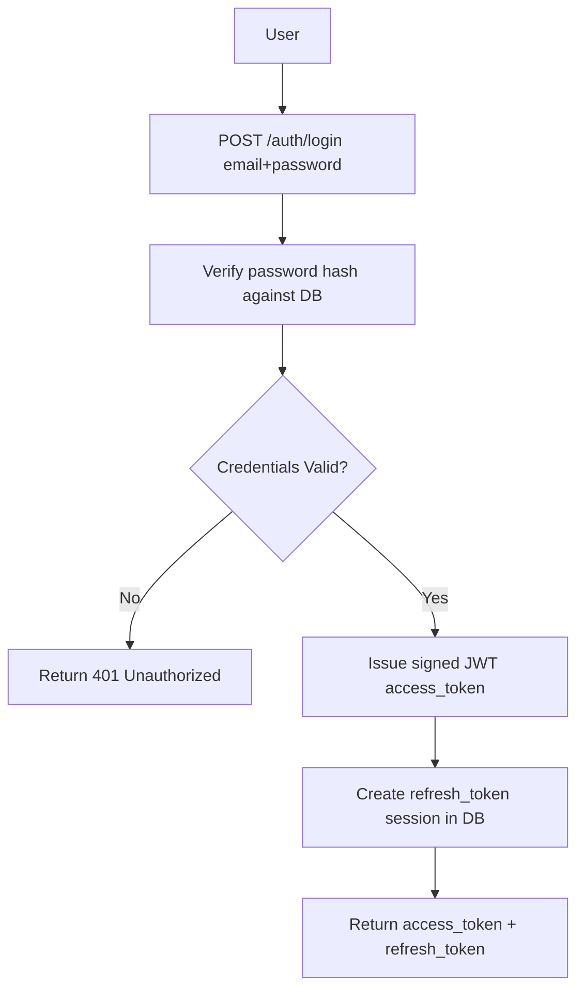
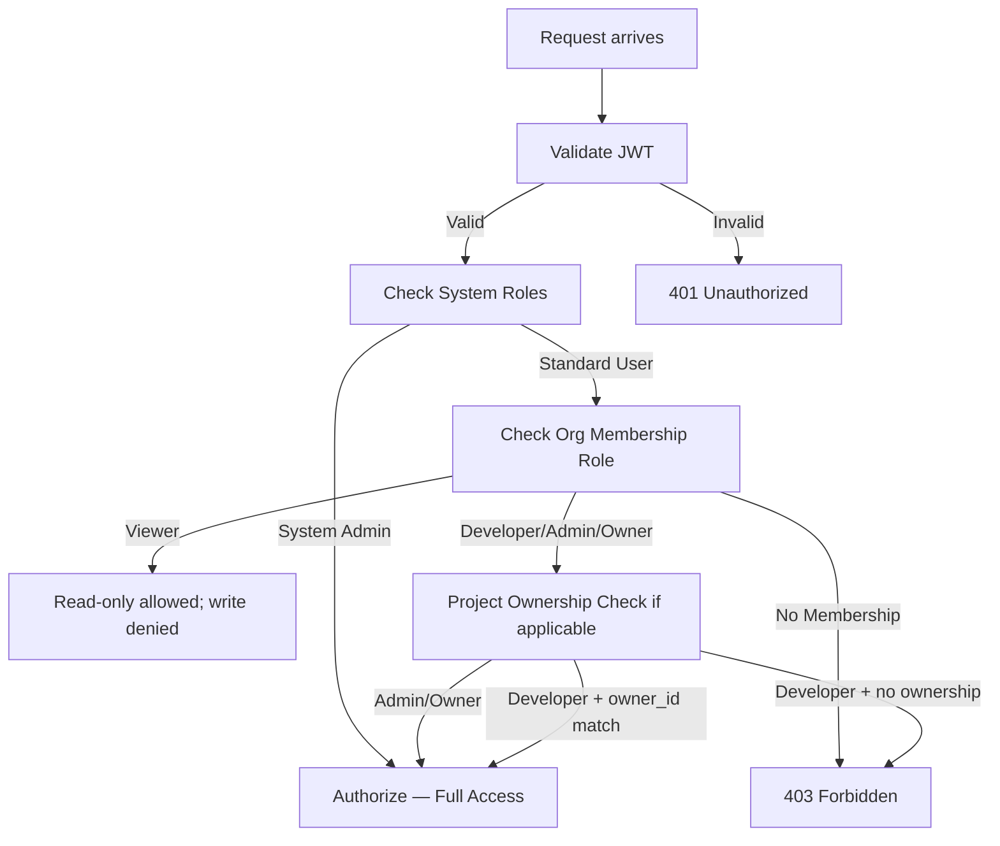
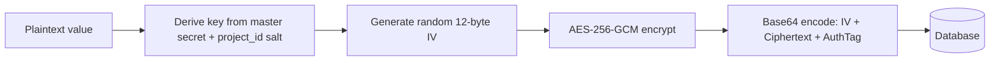
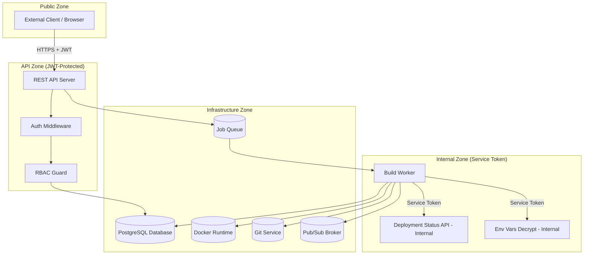

# Security Architecture

> **Document:** Security Architecture  
> **Section:** 04 — Security  
> **Version:** 1.0  
> **Status:** Draft

---

## 1. Security Principles

The Forge platform is built with the following security principles:

| Principle | Implementation |
|-----------|---------------|
| **Authentication Required** | All endpoints except public health check and `/auth/*` require a valid JWT |
| **Principle of Least Privilege** | Every role is granted the minimum permissions needed; access escalates through well-defined role hierarchy |
| **Defense in Depth** | Multiple permission layers: system RBAC → org-level RBAC → project ownership check |
| **Secrets Never in Plaintext** | PAT tokens and secret env vars are encrypted with AES-256-GCM before storage; never returned in plaintext responses |
| **Immutable Audit Trail** | Deployment records carry `triggered_by` user ID; historical records cannot be modified |
| **Internal Service Isolation** | Build Worker uses service tokens, not user JWTs; internal endpoints are not exposed to external clients |

---

## 2. Authentication

### 2.1 JWT Access Tokens

- **Standard:** JSON Web Token (JWT), signed (HS256 or RS256).
- **Payload:** `user_id`, expiry (`exp`), issued-at (`iat`).
- **Lifetime:** Short-lived (e.g., 15 minutes).
- **Usage:** Passed as `Authorization: Bearer <token>` header on every protected request.
- **Validation:** Auth middleware validates signature and expiry on every request.

### 2.2 Refresh Tokens

- **Storage:** Persisted in the database (hashed or securely stored).
- **Purpose:** Exchange for a new access token without re-authenticating.
- **Invalidation:** Logout operation removes the refresh token session from the database.
- **Rotation:** Optionally rotate refresh token on every use (single-use refresh tokens).

### 2.3 Internal Service Token (Build Worker)

- Build Worker communicates with the Deployment API via a dedicated **service credential** — not a user JWT.
- This credential authorizes only:
  - `PATCH /deployments/:id/status` (status transitions)
  - `POST /deployments/:id/logs` (log writes)
  - `GET /projects/:id/env-vars/decrypt` (env var decryption for injection)
- External clients cannot use or obtain this service credential.

### 2.4 Login Flow

---

## 3. Authorization — Three-Tier RBAC

### Tier 1: System Access Control (Global Roles & Permissions)

- Managed by System Administrators via `/access-control/*` endpoints.
- Defines global `roles` (e.g., `admin`, `developer`, `viewer`) and `permissions` (e.g., `create-user`).
- Roles are assigned to users via `user_roles`.
- Permissions are assigned to roles via `role_permissions`, or directly to users via `user_permissions`.
- This tier is **admin-only**; not exposed to regular users.

### Tier 2: Organization-Level RBAC

- Managed by Organization Owners and Admins.
- Each organization member has a role: `Viewer`, `Developer`, `Admin`, `Owner`.
- Enforced by the **Org Permissions** sub-module on all org resource operations.

| Org Role | Capabilities |
|----------|-------------|
| **Viewer** | Read-only access to all org resources |
| **Developer** | Create projects (auto-assigned as owner), trigger deployments, manage own projects |
| **Admin** | Full CRUD on all org projects, members, and deployments |
| **Owner** | Unrestricted; includes rollback, member management, and org lifecycle |

### Tier 3: Project-Level Ownership

- Enforced by the **Project Permissions** sub-module.
- `Developer` role users can only delete or manage assignments for projects they personally created (`project.owner_id == self.id`).
- `Admin` and `Owner` roles bypass project ownership constraints.

---

## 4. Encryption

### 4.1 At-Rest Encryption

Two categories of sensitive data are encrypted before database storage:

| Data | Table | Column | Algorithm | Key Management |
|------|-------|--------|-----------|---------------|
| Git Personal Access Tokens (PAT) | `project_repositories` | `access_token_encrypted` | AES-256-GCM | Master secret key + project-scoped salt |
| Secret environment variable values | `project_environment_variables` | `value_encrypted` | AES-256-GCM | Master secret key + project ID salt |

**AES-256-GCM encryption process (for env vars):**

### 4.2 Decryption Authorization

| Actor | Can Decrypt? | Mechanism |
|-------|-------------|-----------|
| Public API user | ❌ Never | Masked as `••••••••` in responses |
| Project Owner (via API) | ✅ For their project | `GET /projects/:id/env-vars/decrypt` — restricted to Owner/System Admin |
| Build Worker | ✅ At runtime only | Internal service token; decryption happens in-memory, never logged |

### 4.3 PAT Handling Rules

> From Repository Module BR-003 and BR-004:
- PAT **must** be encrypted with AES-256-GCM before DB insertion.
- PAT **must never** be returned in API responses or written to log outputs.
- Git clone operations use temporary credential helpers or memory streams to prevent token exposure in CLI arguments.

---

## 5. API Security Controls

### 5.1 Endpoint Protection Matrix

| Endpoint Category | Auth Required | Role Minimum | Notes |
|-------------------|--------------|-------------|-------|
| `GET /health` | ❌ | None | Public health probe |
| `POST /auth/register` | ❌ | None | Public |
| `POST /auth/login` | ❌ | None | Public |
| `POST /auth/refresh` | ✅ (refresh token) | Any | Requires valid refresh token |
| `/access-control/*` | ✅ | System Admin | Admin-only |
| `/organizations/*` | ✅ | Authenticated | Org role checked per action |
| `/teams/*` | ✅ | Authenticated | Org role checked per action |
| `/projects/*` | ✅ | Authenticated | Org role + project ownership checked |
| `/deployments/*` (trigger) | ✅ | Developer | Project membership required |
| `PATCH /deployments/:id/status` | ✅ | Internal Service | Build Worker service token only |
| `/deployments/:id/logs/*` | ✅ | Viewer | Must have project access |
| `GET /dashboard` | ✅ | Authenticated | Scoped to user's orgs |
| `/users/*` | ✅ | Authenticated | Self or admin |

### 5.2 Input Sanitization

All write endpoints sanitize inputs to prevent injection attacks:
- POSIX key format validation for environment variables: `^[A-Z_][A-Z0-9_]*$`
- UUID validation on all ID path parameters
- URL format validation for repository URLs
- Runtime value enum validation (projects: `Node.js`, `Rust`, `Python`, `Go`, `Static Site`)

### 5.3 Internal-Only Endpoints

The following endpoints are **not** accessible via the public API surface; they require internal service credentials:

- `PATCH /deployments/:id/status` — Build Worker status updates
- `POST /deployments/:id/logs` — Build Worker log writes
- `GET /projects/:id/env-vars/decrypt` — Deployment runner secret injection

---

## 6. Security Boundaries

---

## 7. Deployment Security

| Security Control | Requirement |
|-----------------|-------------|
| Build worker sandbox | Workers must run in isolated, sandboxed environments per build job |
| Env var decryption | Decryption only in worker's secure runtime context; never logged in plaintext |
| Workspace cleanup | Temporary build workspaces are deleted after every job (success or failure) |
| Non-root containers | Docker images should use non-root base users where possible |
| Log redaction | Log files must not contain plaintext secret env var values |
| Audit trail | All deployments carry `triggered_by` user ID; rollback/redeploy actions are logged |

---

## 8. Secret Redaction in Logs

The Build Worker (BR-004) enforces:
- Environment variables are decrypted only within the worker's secure runtime context.
- Decrypted values are passed to `docker run` via in-memory environment injection, **not** via command-line arguments (prevents exposure in process listings).
- Log storage (Grafana Loki / build logs per [ADR-005](../09-adr/ADR-005-use-loki-for-centralized-logging.md)) must never contain plaintext secret values.

---

**Document Version:** 1.0  
**Last Updated:** 2026-08-12  
**Author:** Backend Architecture Team
