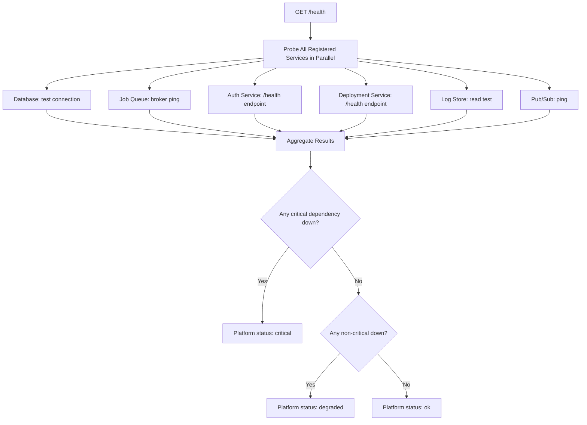
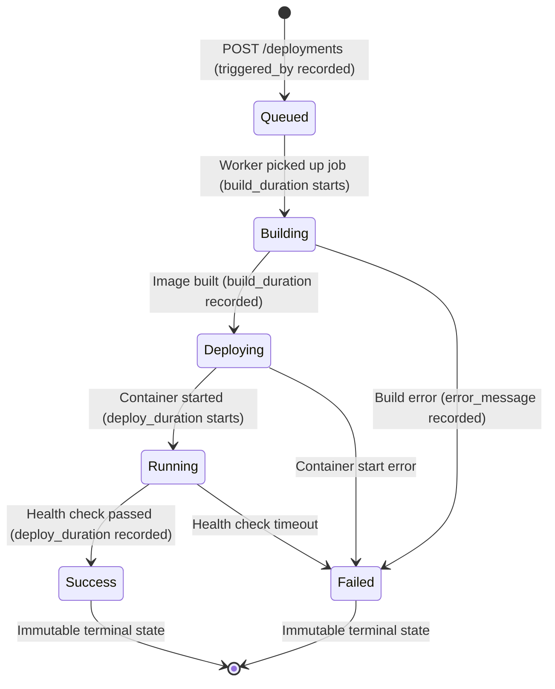
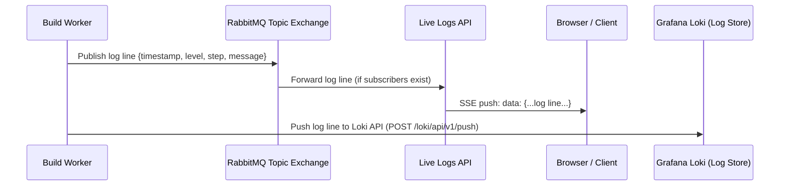

# Observability & Health

> **Document:** Observability & Health  
> **Section:** 07 — Operations  
> **Version:** 1.0  
> **Status:** Draft

---

## 1. Overview

Forge implements a **multi-layer observability strategy** to ensure platform reliability, facilitate debugging, and provide real-time operational visibility. The three pillars are:

| Pillar | Mechanism |
|--------|-----------|
| **Health Probes** | System-wide `GET /health` aggregation over all service dependencies |
| **Build Logs** | Structured, per-deployment log lines stored and streamed in real time |
| **Deployment State** | Auditable deployment status lifecycle (`Queued → ... → Success/Failed`) |

---

## 2. Health Module Architecture

### 2.1 Purpose

The Health module is the **operational nerve center** of the Forge platform. It:
- Aggregates the health status of all registered service dependencies.
- Classifies each dependency as **critical** or **non-critical**.
- Computes a platform-wide health status (`ok`, `degraded`, `critical`).
- Exposes a public endpoint for infrastructure monitoring tools (load balancers, uptime monitors).

### 2.2 Health Probe Behavior



### 2.3 Service Registry & Classification

| Service | Classification | Impact if Down |
|---------|---------------|----------------|
| PostgreSQL Database | **Critical** | All platform functionality unavailable |
| Job Queue (Redis / RabbitMQ) | **Critical** | Deployments cannot be queued or processed |
| Auth Module | **Critical** | No users can authenticate |
| Build Worker availability | **Critical** | Queued deployments will not be processed |
| Log Store | **Non-Critical** | Build logs unavailable; deployments still work |
| Pub/Sub broker | **Non-Critical** | Live log streaming unavailable; stored logs still accessible |

### 2.4 Health Response Format

```json
{
  "status": "ok | degraded | critical",
  "timestamp": "2026-08-12T17:00:00Z",
  "services": {
    "database": { "status": "ok", "latency_ms": 3 },
    "job_queue": { "status": "ok", "latency_ms": 1 },
    "auth": { "status": "ok", "latency_ms": 5 },
    "log_store": { "status": "degraded", "error": "connection timeout" },
    "pubsub": { "status": "ok", "latency_ms": 2 }
  }
}
```

### 2.5 Endpoints

| Endpoint | Auth | Description |
|----------|------|-------------|
| `GET /health` | 🌐 Public | Aggregated platform health (suitable for load balancer probes) |
| `GET /health/details` | 🔒 System Admin | Per-service health details with latency |

---

## 3. Deployment Observability

### 3.1 Deployment Status Audit Trail

Every deployment record carries a complete lifecycle state with timestamps:

| Field | Type | Purpose |
|-------|------|---------|
| `status` | VARCHAR | Current lifecycle state |
| `triggered_by` | UUID | User who triggered the deployment |
| `branch` | VARCHAR | Git branch deployed |
| `commit_hash` | VARCHAR(40) | Exact commit deployed |
| `build_duration` | INTEGER (ms) | Time for Docker image build |
| `deploy_duration` | INTEGER (ms) | Time for container start + health check |
| `error_message` | TEXT | Error detail if `Failed` |
| `created_at` | TIMESTAMP | Deployment trigger time |
| `updated_at` | TIMESTAMP | Last status transition time |

### 3.2 Deployment State Machine



### 3.3 Deployment Performance Targets

| Metric | Target |
|--------|--------|
| Trigger API response time | < 200ms |
| Worker pickup latency | < 5s |
| Build execution time (max) | < 10 minutes |
| Health check max wait | 30s |
| Status poll response | < 50ms |

---

## 4. Build Log Observability

### 4.1 Structured Log Format

Every log line emitted by the Build Worker carries:

| Field | Values | Description |
|-------|--------|-------------|
| `deployment_id` | UUID | Links log to specific deployment |
| `timestamp` | ISO 8601 | When the event occurred |
| `level` | `INFO`, `WARN`, `ERROR`, `DEBUG` | Log severity |
| `step` | `clone`, `build`, `deploy`, `health_check` | Pipeline stage |
| `message` | Text | The log line content |

### 4.2 Live vs. Stored Logs

| Mode | Availability | Mechanism |
|------|-------------|-----------|
| **Live streaming** | While deployment is in non-terminal state | SSE or WebSocket via RabbitMQ topic exchange |
| **Stored retrieval** | Any time (including after terminal state) | LogQL query on Grafana Loki ([ADR-005](../09-adr/ADR-005-use-loki-for-centralized-logging.md)) |
| **Log search** | Any time | LogQL pattern matching query on Grafana Loki |
| **Log download** | Any time | Full log stream fetch as `.log` file |

### 4.3 Log Lifecycle



### 4.4 Log Retention

| Policy | Value |
|--------|-------|
| Retention period | 90 days |
| Max concurrent SSE streams | 10,000 |
| Log search response time | < 200ms |
| Log download generation time | < 1s |

---

## 5. Platform-Level Observability Recommendations

The following observability practices are recommended for production operations:

### 5.1 Metrics to Collect

| Metric | Source | Recommended Alert |
|--------|--------|------------------|
| Deployment success rate (per time period) | `deployments` table | Alert if < 90% success rate over 1h |
| Deployment failure count | `deployments` table | Alert on spike |
| Active `Running` deployments per project | `deployments` table | Alert if project has no Running deployment (for SLA-bound services) |
| Worker queue depth | Job Queue | Alert if depth > threshold |
| Worker pickup latency | Build Worker | Alert if > 30s |
| Database connection pool utilization | Database | Alert if > 80% |
| Log store disk usage | Log Store | Alert if > 80% |
| Health probe failures | Health Module | Alert on any critical service failure |

### 5.2 Tracing

For distributed tracing, inject a `correlation_id` / `X-Request-ID` header at the API layer and propagate it through:
- Job queue job payloads
- Build Worker API calls (status updates, log writes)
- All structured log entries

### 5.3 Alerting Integration Points

| Event | Source | Suggested Alert Channel |
|-------|--------|------------------------|
| Platform health status changes to `critical` | Health Module | PagerDuty / Slack |
| Deployment stuck in `Building` > 10 min | Deployments table | Engineering Slack |
| Worker pickup latency > 30s | Job Queue depth | On-call |
| Database connection failure | Health Module | PagerDuty |
| Log store write failure | Build Worker error logs | Engineering Slack |

---

## 6. Runbook: Responding to Common Health States

### `status: critical` — Database Down

1. Verify database server is reachable (`ping`, `psql` connection test).
2. Check database logs for OOM, crash, or lock issues.
3. Scale up or restart the database instance.
4. Restart the API server after database is healthy to re-establish connection pools.

### `status: critical` — Job Queue Down

1. Verify Redis / RabbitMQ is running and reachable.
2. Check queue depth for pending deployments.
3. Restart queue broker.
4. Pending deployment jobs should re-queue automatically (at-least-once delivery).

### `status: degraded` — Log Store Unavailable

1. Build logs will not persist, but deployments will continue running.
2. Build Worker has a fallback: log to local disk if the log store is unavailable.
3. Restore log store and verify Loki push ingestion resumes.

### Deployment Stuck in `Queued`

1. Check if Build Worker is running and consuming from the queue.
2. Check queue depth — high depth may indicate worker starvation.
3. Scale up workers or investigate worker crash logs.
4. If worker is unrecoverable, manually transition deployment to `Failed` via admin tooling.

### Deployment Stuck in `Building`

1. Check Docker build logs via `GET /deployments/:id/logs` for the stuck build.
2. Check worker host disk space and Docker daemon health.
3. If build is taking > 10 minutes (NFR max), kill the job and re-trigger.

---

**Document Version:** 1.0  
**Last Updated:** 2026-08-12  
**Author:** Backend Architecture Team
