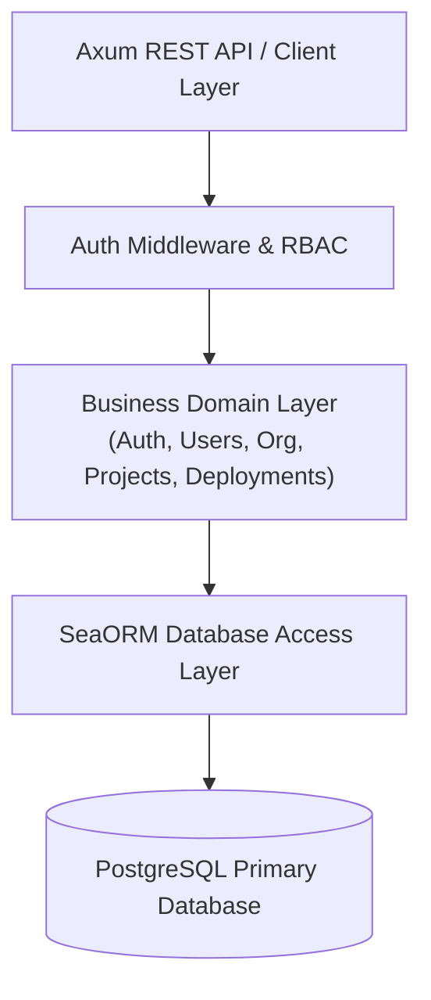

# ADR-001: PostgreSQL as Primary Database

**Status:** Accepted  
**Date:** 2026-08-13  
**Decision Type:** Architecture / Data Persistence  
**Scope:** Forge Platform Core Data Storage  

---

## 1. Context

The Forge Platform is a multi-tenant developer deployment platform built as a modular monolith in Rust. It enables users to register, organize into multi-tier teams/organizations, connect Git repositories, set encrypted environment variables, trigger asynchronous Docker container builds, inspect live deployment build logs, and view deployment history.

The platform requires a centralized, robust, and highly reliable data store that can strictly enforce multi-tenant domain boundaries, preserve complex relational integrity, support multi-table transactional workflows, and serve as the single authoritative source of truth for all business-critical entities.

---

## 2. Problem

Forge manages rich, deeply interconnected relational domain models across 9 core modules. Business rules dictate strict constraints such as:
- Unique user email addresses and organization slugs platform-wide.
- Composite unique key constraints for project names per organization and environment variables per project/environment.
- Cascading referential integrity between organizations, projects, deployments, build logs, and environment variables.
- Multi-table atomic transactional guarantees for user registration, organization provisioning, and deployment queuing.
- Structured column-level field requirements alongside field-level encryption for sensitive PAT tokens and secret environment variables.

The architecture requires a primary database system capable of:
1. Guaranteeing ACID compliance for all write operations.
2. Supporting high concurrent throughput (10,000+ API requests target per NFR-001).
3. Enforcing declarative database-level constraints (foreign keys, composite unique constraints, check constraints).
4. Providing native mechanisms for schema versioning, automated migrations, and enterprise-grade backup/recovery strategies.

---

## 3. Decision

We decide to adopt **PostgreSQL** (version 15+) as the primary, authoritative relational database for the Forge Platform.

PostgreSQL will serve as the sole single source of truth for all persistent platform domain data. All persistent state across all modules will be stored in PostgreSQL tables owned strictly by their respective modules. No secondary datastore (such as Redis or temporary storage) is permitted to act as an authoritative record for persistent business entities.

---

## 4. Scope

This decision applies to all functional modules within the Forge Platform backend architecture, including:
- **Identity & Access Control:** `users`, `roles`, `permissions`, `role_permissions`, `user_roles`, `user_permissions`, `sessions`
- **Organization & Team Management:** `organizations`, `organization_members`, `teams`, `team_members`
- **Projects & Configuration:** `projects`, `project_repositories`, `project_environment_variables`, `project_members`, `project_teams`
- **Deployments & History:** `deployments` (deployment metadata and status tracking; raw build/deployment log stream is offloaded to Grafana Loki per [ADR-005](./ADR-005-use-loki-for-centralized-logging.md))
- **Notifications:** `notifications`

Aggregator modules (such as **Dashboard** and **Health**) do not own dedicated tables but query PostgreSQL tables owned by business domain modules.

---

## 5. Architectural Integration

PostgreSQL operates at **Layer 4 (Data Layer)** of the Forge system architecture. It interacts directly with the Application / Domain Layer via **SeaORM** (the database access layer).

### Layer Interaction Rules
1. **Module Table Ownership:** Each module owns its database tables. Direct cross-module SQL table writes are forbidden; modules mutate state only through their domain services.
2. **Read Access:** Modules execute joins across foreign key boundaries (e.g. `deployments.project_id → projects.id`) via SeaORM ORM models for query performance and data consistency.
3. **Encrypted Storage:** Sensitive fields (e.g., `project_repositories.access_token_encrypted`, `project_environment_variables.value_encrypted`) are encrypted using AES-256-GCM prior to insertion into PostgreSQL.

---

## 6. Responsibilities & Relational Data Requirements

PostgreSQL is responsible for:

1. **Durability & Persistence:** Preserving state across application restarts, build worker crashes, and platform updates.
2. **Referential Integrity:** Guaranteeing that orphaned records cannot exist when parent entities are removed or altered.
3. **Relational Structure:** Storing entities and relationships defined in the Forge ERD:
   - `users (1)` ── `(N) organization_members`
   - `organizations (1)` ── `(N) projects`
   - `projects (1)` ── `(N) deployments`
   - `projects (1)` ── `(N) project_environment_variables`
   - `roles (N)` ── `(N) permissions` (via `role_permissions`)
   - *(Note: Raw build log streams are stored in Grafana Loki per [ADR-005](./ADR-005-use-loki-for-centralized-logging.md)).*

---

## 7. Data Model Integrity & Constraints

PostgreSQL strictly enforces domain constraints at the database level:

### 7.1 Primary Keys
All core entities use **UUID v4** primary keys (`id UUID PRIMARY KEY`), guaranteeing globally unique identifiers suitable for distributed generation, secure public API exposure (preventing sequential ID enumeration attacks), and future microservice database partitioning.

### 7.2 Foreign Keys & Cascades
Foreign key constraints maintain referential integrity across platform tables:
- `organization_members.organization_id → organizations.id` (`ON DELETE CASCADE`)
- `organization_members.user_id → users.id` (`ON DELETE CASCADE`)
- `projects.organization_id → organizations.id` (`ON DELETE RESTRICT`)
- `projects.owner_id → users.id` (`ON DELETE RESTRICT`)
- `project_repositories.project_id → projects.id` (`ON DELETE CASCADE`)
- `project_environment_variables.project_id → projects.id` (`ON DELETE CASCADE`)
- `deployments.project_id → projects.id` (`ON DELETE CASCADE`)
- `deployments.triggered_by → users.id` (`ON DELETE SET NULL`)
- `notifications.user_id → users.id` (`ON DELETE CASCADE`)
- `build_logs.deployment_id → deployments.id` (`ON DELETE CASCADE` — *legacy schema*)

### 7.3 Unique Constraints
PostgreSQL enforces uniqueness to guarantee business invariants:
- **Global Uniqueness:** `users.email`, `organizations.slug`, `roles.value`, `permissions.value`
- **Scoped Composite Uniqueness:**
  - `projects(organization_id, name)`: Project names must be unique within an organization.
  - `organization_members(organization_id, user_id)`: A user can belong to an organization at most once.
  - `project_environment_variables(project_id, environment, key)`: Environment variable keys must be unique per project and environment (`Development`, `Preview`, `Production`).
  - `team_members(team_id, user_id)`: A user can join a team at most once.

### 7.4 Check Constraints
Where appropriate, PostgreSQL enforces validation constraints:
- **Environment Variable Keys:** `CHECK (key ~ '^[A-Z_][A-Z0-9_]*$')` (POSIX compliance).
- **Deployment Status Enum:** `CHECK (status IN ('Queued', 'Building', 'Deploying', 'Running', 'Failed', 'Success'))`.
- **Project Runtime Enum:** `CHECK (runtime IN ('Node.js', 'Rust', 'Python', 'Go', 'Static Site'))`.
- **Org Member Role Enum:** `CHECK (role IN ('Viewer', 'Developer', 'Admin', 'Owner'))`.

---

## 8. Transactions & Concurrency

### 8.1 Multi-Table Transactions
PostgreSQL provides ACID guarantees for critical multi-step workflows:
- **User Registration:** Inserts into `users` and assigns default role in `user_roles` inside a single `BEGIN...COMMIT` block.
- **Organization Provisioning:** Atomically creates `organizations` record and inserts creator into `organization_members` as `Owner`.
- **Deployment Triggering:** Validates the single `Running` deployment constraint per project (Business Rule BR-004) and creates a new `deployments` record with status `Queued` in a single transaction before enqueuing the background job.
- **Project Repository Setup:** Atomically provisions `projects` and `project_repositories` records.

### 8.2 Concurrency & Isolation
- **Default Isolation Level:** `READ COMMITTED` ensures queries view only committed data, preventing dirty reads.
- **Pessimistic Row Locking (`FOR UPDATE`):** Used during deployment state transitions (`Queued → Building → Deploying → Running → Success/Failed`) to prevent race conditions when multiple build workers process job status updates concurrently.
- **Connection Pool Concurrency:** Integrates with SeaORM/SQLx connection pool to handle 10,000+ concurrent API requests without connection starvation.

---

## 9. Migration & Operations Strategy

### 9.1 Migration Strategy
- Managed using version-controlled migration scripts via `sea-orm-migration` (or native SQL migration files stored in `migrations/`).
- Schema changes are declarative, sequential, and transactional (`seaquery_migrations` table tracks applied versions).
- Continuous Integration (CI) validates migration rollback scripts (`down`) against test databases.

### 9.2 Backup & Recovery Strategy
- **Point-In-Time Recovery (PITR):** PostgreSQL Write-Ahead Logging (WAL) archiving enables restoring database state to any specific microsecond in the event of failure.
- **Automated Backups:** Daily logical backups (`pg_dump`) combined with continuous WAL archiving to cloud storage (S3/GCS).
- **Disaster Recovery:** Target Recovery Point Objective (RPO) < 5 minutes; Target Recovery Time Objective (RTO) < 15 minutes.

---

## 10. Security Considerations

1. **At-Rest Field Encryption:** Sensitive columns (`project_repositories.access_token_encrypted` and `project_environment_variables.value_encrypted`) store AES-256-GCM ciphertext. Plaintext secrets are never stored in PostgreSQL.
2. **Transport Encryption:** Mandatory TLS 1.3 encryption for all database connections in non-development environments (`sslmode=require`).
3. **Least Privilege Principles:** Application connects via a dedicated PostgreSQL role (`forge_app`) restricted to DML operations (`SELECT`, `INSERT`, `UPDATE`, `DELETE`) on application tables. DDL operations are restricted to migration execution roles.
4. **Credential Injection:** Database host, port, username, and password are provided via environment variables (`DATABASE_URL`) and never hardcoded in repository files.

---

## 11. Performance & Scalability Considerations

### 11.1 Indexing Strategy
To meet sub-50ms query requirements across core endpoints:
- **B-tree Indexes on Foreign Keys:** Automatically created on all FK columns (`organization_id`, `project_id`, `user_id`, `deployment_id`) to optimize join performance.
- **Composite Indexes:**
  - `deployments(project_id, created_at DESC)` for deployment history pagination.
  - `notifications(user_id, is_read, created_at DESC)` for user notification feeds.
- **Partial Indexes:** `CREATE UNIQUE INDEX idx_single_running_deployment ON deployments (project_id) WHERE status = 'Running';` enforcing BR-004 at the database index level.

> **Note on Build Logs:** Raw build and deployment log streams are stored and indexed natively in Grafana Loki per [ADR-005](./ADR-005-use-loki-for-centralized-logging.md), preserving PostgreSQL performance for relational queries.

### 11.2 Scalability & Future Extraction
- **Modular Isolation:** Tables are strictly grouped by domain module ownership.
- **Microservices Readiness:** Foreign key constraints cross module boundaries in the monolith, but modular schema design allows future extraction of high-volume modules (e.g. `deployments`) into dedicated database instances while raw logs are managed independently in Grafana Loki ([ADR-005](./ADR-005-use-loki-for-centralized-logging.md)).

---

## 12. Consequences

### Advantages
- **Single Source of Truth:** Unifies identity, RBAC, projects, deployments, logs, and settings into one predictable relational system.
- **Strict Data Integrity:** Database-level foreign keys, unique constraints, and check constraints prevent corrupt state.
- **ACID Transactional Guarantees:** Ensures complex workflows (e.g., registration, org creation, deployment queuing) execute safely.
- **Rich Ecosystem & Rust Compatibility:** Superior compatibility with SQLx and SeaORM in the Rust ecosystem.

### Disadvantages
- **Operational Complexity:** Requires proactive vacuuming, WAL management, and connection pool tuning.
- **Schema Rigidness:** Schema changes require explicit migration scripts compared to schemaless document stores.

---

## 13. Alternatives Considered

1. **MySQL / MariaDB:**
   - *Evaluated:* Popular relational database.
   - *Rejected:* Weaker transactional DDL support, inferior JSON support compared to PostgreSQL, and less seamless integration with SeaORM/SQLx in Rust.
2. **MongoDB / Document DB:**
   - *Evaluated:* Schemaless document store.
   - *Rejected:* Lacks native multi-table foreign key constraints and ACID transactional enforcement across complex relational entities (User/Org/Project/Deployment hierarchy).
3. **SQLite:**
   - *Evaluated:* Embedded zero-config database.
   - *Rejected:* Unsuitable for high concurrency (10,000+ req/sec) and lacks multi-instance production deployment support.

---

## 14. Final Decision

**PostgreSQL is accepted as the official primary database for the Forge Platform.** All persistent domain data will be modeled, stored, and queried through PostgreSQL using SeaORM as the database access layer.
