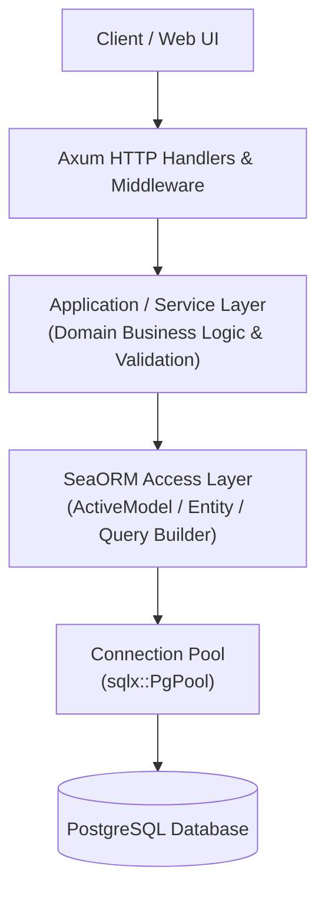

# ADR-002: SeaORM as Database Access Layer

**Status:** Accepted  
**Date:** 2026-08-13  
**Decision Type:** Architecture / Data Access  
**Scope:** Backend Persistence & Query Layer  

---

## 1. Context

The Forge Platform backend is implemented in Rust using the Axum web framework and PostgreSQL as its primary database. The system models a multi-tenant developer platform with 19 distinct database tables spanning identity, RBAC, organizations, projects, deployments, build logs, and environment variables.

To interact with PostgreSQL safely, efficiently, and maintainably, the backend requires a data access layer that supports asynchronous execution (compatible with Tokio and Axum), strong compile-time type safety, declarative schema migrations, relational query execution, and transactional safety.

---

## 2. Problem

Building a complex modular monolith in Rust presents several database interaction challenges:
1. **Raw SQL Complexity & Security:** Hand-crafted SQL strings incur maintenance overhead, risk runtime SQL syntax errors, and increase potential SQL injection vulnerabilities if parameters are incorrectly bound.
2. **Async Integration:** Rust's async runtime (Tokio) requires a database framework that natively supports non-blocking I/O across connection pools.
3. **Type Safety & Mapping:** Manually mapping PostgreSQL rows to Rust structs across 19 tables creates redundant boilerplate code and fragile deserialization logic.
4. **Complex Domain Workflows:** Operations like user registration, organization creation, and deployment triggering require multi-table atomic transactions and relational joins (e.g. `deployments → projects → organizations`).
5. **Over-Engineering Risk:** Introducing complex object-oriented abstraction layers (such as heavy Clean Architecture repository interfaces with generic traits per entity) adds unnecessary boilerplate in Rust without providing practical benefits for a modular monolith.

---

## 3. Decision

We decide to adopt **SeaORM** (an async, dynamic ORM for Rust built on top of `SQLx`) as the official database access layer for the Forge Platform.

SeaORM will manage all entity mappings, relational queries, database transactions, schema migrations, and connection pooling between Axum domain services and the PostgreSQL database.

---

## 4. Scope

This decision governs all database read and write operations across all modules in the Forge backend. 

Direct raw SQL execution is restricted to specialized aggregation queries (such as complex Dashboard metrics) and must be executed through SeaORM's raw SQL execution features rather than bypassing the database connection pool.

---

## 5. Architectural Integration

The intended persistence flow adheres strictly to the existing Forge modular monolith architecture:



### Flow Responsibilities
1. **Axum HTTP Handlers:** Accept HTTP requests, extract parameters/JWT, enforce auth/RBAC middleware, and invoke Service functions.
2. **Application / Service Layer:** Executes business rules, input validations, and domain logic. Invokes SeaORM Entity/ActiveModel operations directly.
3. **SeaORM Layer:** Constructs type-safe SQL statements, manages `DatabaseTransaction` blocks, maps PostgreSQL rows to Rust domain models, and manages connection acquisition from the pool.
4. **PostgreSQL Database:** Executes compiled SQL and returns row datasets.

---

## 6. Responsibilities of SeaORM

SeaORM is responsible for:
1. **Entity Definition & Code Generation:** Defining Rust representations of PostgreSQL tables (`users`, `organizations`, `projects`, `deployments`, etc.).
2. **CRUD & Query Building:** Providing type-safe methods (`find`, `insert`, `update`, `delete`, `filter`) without manual SQL string construction.
3. **Relation Handling:** Executing joins and eager/lazy loading across foreign key relationships (`HasOne`, `HasMany`, `BelongsTo`).
4. **Transaction Management:** Executing multi-table operations atomically via `db.transaction(...)`.
5. **Schema Migration:** Running version-controlled schema migrations via `sea-orm-migration`.
6. **Connection Pool Wrapping:** Managing pool state, max connections, timeouts, and health checks over `sqlx::PgPool`.

---

## 7. Entity & Model Mapping

SeaORM represents database tables using Rust derive macros. Each entity consists of:
- **`Model`:** Immutable struct representing a database row fetched from PostgreSQL.
- **`ActiveModel`:** Mutable struct used for insertions and updates, tracking changed fields (`Set(value)` vs `NotSet`).
- **`Entity`:** Module marker implementing table metadata and query entry points.
- **`Column`:** Enum representing table columns for type-safe filtering and sorting.
- **`PrimaryKey`:** Enum identifying primary key column(s).
- **`Relation`:** Enum declaring foreign key relationships to other entities.

### Code Example: Project Entity Mapping
```rust
use sea_orm::entity::prelude::*;

#[derive(Clone, Debug, PartialEq, DeriveEntity, SimpleObject)]
#[sea_orm(table_name = "projects")]
pub struct Model {
    pub id: Uuid,
    pub organization_id: Uuid,
    pub owner_id: Uuid,
    pub name: String,
    pub r#type: String,
    pub repository_url: Option<String>,
    pub default_branch: Option<String>,
    pub runtime: String,
    pub framework: Option<String>,
    pub status: String,
    pub descriptions: Option<String>,
    pub created_at: DateTimeWithTimeZone,
    pub updated_at: DateTimeWithTimeZone,
}

#[derive(Copy, Clone, Debug, EnumIter, DeriveRelation)]
pub enum Relation {
    #[sea_orm(
        belongs_to = "super::organizations::Entity",
        from = "Column::OrganizationId",
        to = "super::organizations::Column::Id"
    )]
    Organization,
    #[sea_orm(has_many = "super::deployments::Entity")]
    Deployments,
    #[sea_orm(has_many = "super::project_environment_variables::Entity")]
    EnvironmentVariables,
}
```

---

## 8. Persistence Pattern & Abstraction Guidance

### No Artificial Repository Boilerplate
We explicitly **reject** creating generic repository trait interfaces (e.g. `pub trait UserRepository`, `pub trait ProjectRepository`) for simple CRUD operations.

In Rust with SeaORM, `Entity` and `ActiveModel` already provide an asynchronous, mockable, and type-safe abstraction. Adding wrapper traits per entity introduces redundant boilerplate code without adding architectural value.

### Application Service Pattern
Domain services interact directly with SeaORM types:
```rust
pub struct ProjectService;

impl ProjectService {
    pub async fn create_project(
        db: &DatabaseConnection,
        new_project: CreateProjectDto,
    ) -> Result<projects::Model, AppError> {
        let active_model = projects::ActiveModel {
            id: Set(Uuid::new_v4()),
            organization_id: Set(new_project.organization_id),
            owner_id: Set(new_project.owner_id),
            name: Set(new_project.name),
            runtime: Set(new_project.runtime),
            status: Set("active".to_string()),
            ..Default::default()
        };

        active_model.insert(db).await.map_err(Into::into)
    }
}
```

---

## 9. Query Handling & Pagination

### 9.1 Filter & Join Queries
SeaORM provides type-safe query composition using Rust expressions:
```rust
// Fetch active projects for an organization with runtime Node.js
let projects = projects::Entity::find()
    .filter(projects::Column::OrganizationId.eq(org_id))
    .filter(projects::Column::Status.eq("active"))
    .filter(projects::Column::Runtime.eq("Node.js"))
    .order_by_desc(projects::Column::CreatedAt)
    .all(db)
    .await?;
```

### 9.2 Pagination
List endpoints (e.g. `GET /deployments`, `GET /notifications`) use SeaORM's native `Paginator`:
```rust
let paginator = deployments::Entity::find()
    .filter(deployments::Column::ProjectId.eq(project_id))
    .order_by_desc(deployments::Column::CreatedAt)
    .paginate(db, page_size);

let total_pages = paginator.num_pages().await?;
let current_page_items = paginator.fetch_page(page_number).await?;
```

---

## 10. Relationships & Joins

SeaORM models table relationships declared in `Relation` enums:
- **`BelongsTo`:** `deployments` belongs to `projects`, `projects` belongs to `organizations`.
- **`HasMany`:** `organizations` has many `projects`, `projects` has many `deployments`. *(Note: Raw build log streams are stored in Grafana Loki per [ADR-005](./ADR-005-use-loki-for-centralized-logging.md)).*
- **`HasOne`:** `projects` has one `project_repositories`.

### Eager Loading (`find_also_related`)
```rust
// Fetch deployment along with its parent project in a single query
let deployment_with_project: Option<(deployments::Model, Option<projects::Model>)> = 
    deployments::Entity::find_by_id(deployment_id)
        .find_also_related(projects::Entity)
        .one(db)
        .await?;
```

---

## 11. Transactions

Multi-table atomic operations execute using SeaORM's transactional closure API `db.transaction(...)`:

```rust
db.transaction::<_, (), AppError>(|txn| {
    Box::pin(async move {
        // 1. Create Organization
        let org = organizations::ActiveModel {
            id: Set(Uuid::new_v4()),
            name: Set(payload.name),
            slug: Set(payload.slug),
            ..Default::default()
        }.insert(txn).await?;

        // 2. Add Creator as Owner in organization_members
        organization_members::ActiveModel {
            id: Set(Uuid::new_v4()),
            organization_id: Set(org.id),
            user_id: Set(user_id),
            role: Set("Owner".to_string()),
            ..Default::default()
        }.insert(txn).await?;

        Ok(())
    })
}).await?;
```
If any inner async operation returns an `Err`, SeaORM automatically issues a SQL `ROLLBACK`.

---

## 12. Migrations

Schema migrations are managed via the `sea-orm-migration` crate, located in `migration/`.
- Migrations are version-controlled Rust files implementing `MigrationTrait` or raw SQL files.
- Migrations run automatically during platform startup or via the CLI command `sea-orm-cli migrate up`.
- Execution history is persisted in the `seaquery_migrations` table.

---

## 13. Connection Management & Pooling

SeaORM wraps `SQLx`'s PostgreSQL connection pool (`PgPool`):

```rust
let mut opt = ConnectOptions::new(database_url);
opt.max_connections(100)
   .min_connections(5)
   .connect_timeout(Duration::from_secs(8))
   .idle_timeout(Duration::from_secs(800))
   .max_lifetime(Duration::from_secs(8000))
   .sqlx_logging(true);

let db: DatabaseConnection = Database::connect(opt).await?;
```

The resulting `DatabaseConnection` is wrapped in an `Arc` or injected into Axum application state (`Extension(db)` or `State(AppState)`), allowing handlers to clone references efficiently across Tokio worker threads.

---

## 14. Error Handling & Axum Integration

SeaORM errors (`sea_orm::DbErr`) map cleanly into the platform's standard `AppError` type:

```rust
impl From<DbErr> for AppError {
    fn from(err: DbErr) -> Self {
        match err {
            DbErr::RecordNotFound(msg) => AppError::NotFound(msg),
            DbErr::Query(RuntimeErr::SqlxError(sqlx::Error::Database(db_err))) => {
                if db_err.is_unique_violation() {
                    AppError::Conflict("Duplicate record constraint violation".into())
                } else {
                    AppError::InternalServerError(db_err.message().into())
                }
            }
            _ => AppError::InternalServerError(err.to_string()),
        }
    }
}
```

---

## 15. Testing Considerations

1. **Unit Testing with `MockDatabase`:** SeaORM includes a built-in `MockDatabase` feature allowing unit tests to simulate database responses without launching PostgreSQL:
   ```rust
   let db = MockDatabase::new(DatabaseBackend::Postgres)
       .append_query_results(vec![vec![projects::Model { ... }]])
       .into_connection();
   ```
2. **Integration Testing with Test Containers:** Integration tests spin up ephemeral PostgreSQL containers via `testcontainers-rs`, execute migrations via `sea-orm-migration`, and validate real database queries.

---

## 16. Raw SQL Usage

For specialized performance reporting or complex multi-table aggregations (e.g. Dashboard metrics), SeaORM provides a safe raw SQL escape hatch:

```rust
let custom_stats = DashboardStat::find_by_statement(Statement::from_sql_2008(
    DbBackend::Postgres,
    r#"
    SELECT 
        COUNT(p.id) as total_projects,
        COUNT(d.id) as total_deployments,
        COUNT(CASE WHEN d.status = 'Success' THEN 1 END) as successful_deployments
    FROM organizations o
    LEFT JOIN projects p ON p.organization_id = o.id
    LEFT JOIN deployments d ON d.project_id = p.id
    WHERE o.id = $1
    "#,
    vec![org_id.into()]
)).one(db).await?;
```

---

## 17. Consequences

### Advantages
- **Async Native:** Designed specifically for Rust's async/await ecosystem (Tokio + Axum).
- **Type-Safe Queries:** Eliminates runtime SQL syntax errors and SQL injection vulnerabilities.
- **Relational Capabilities:** Excellent support for eager loading, filtering, joins, and transactions.
- **Zero Heavy Abstraction Overheads:** Avoids artificial repository trait interfaces while providing testable abstractions.

### Disadvantages
- **Compilation Overhead:** Deriving entities across 19 tables increases Rust compile times compared to bare SQL strings.
- **Learning Curve:** Developers must understand SeaORM's `ActiveModel` state machine (`Set` vs `NotSet`) for update operations.

---

## 18. Alternatives Considered

1. **SQLx Raw Queries:**
   - *Evaluated:* Async database driver using `sqlx::query!` macros.
   - *Rejected:* Requires live database connection during compilation for query checking; lacks built-in ORM relationship loading and migration execution utilities.
2. **Diesel:**
   - *Evaluated:* Established synchronous ORM for Rust.
   - *Rejected:* Historically synchronous blocking architecture requiring thread-pool wrapping (`tokio::task::spawn_blocking`), creating friction with Axum's async design.
3. **Heavy Clean Architecture Repository Layer:**
   - *Evaluated:* Wrapping SeaORM in generic trait interfaces (`Repository<T>`).
   - *Rejected:* Introduces hundreds of lines of boilerplate code without practical benefit in a Rust modular monolith.

---

## 19. Final Decision

**SeaORM is accepted as the official database access layer for the Forge Platform.** All backend modules will use SeaORM entities, models, active models, and transaction builders to interact with PostgreSQL.
