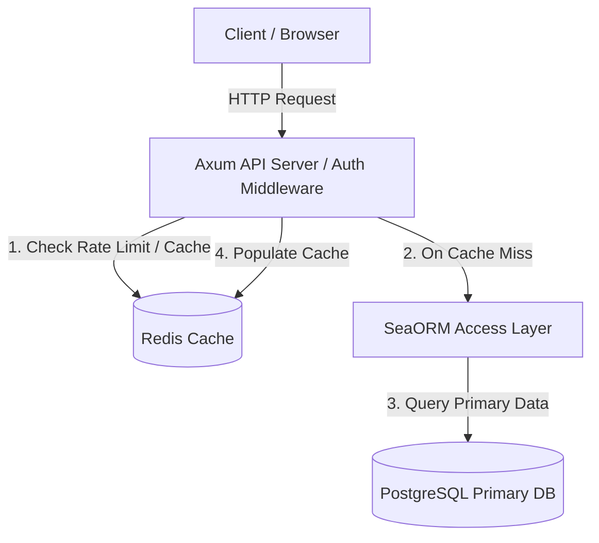
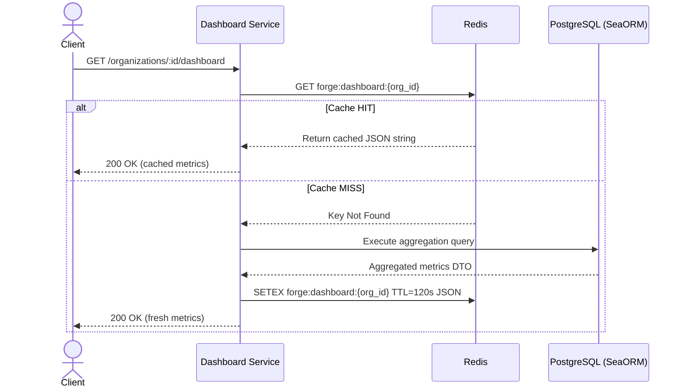

# ADR-003: Redis as Caching Layer

**Status:** Accepted  
**Date:** 2026-08-13  
**Decision Type:** Architecture / Caching  
**Scope:** In-Memory Caching, Rate Limiting, & Revocation Lookup  

---

## 1. Context

The Forge Platform is a multi-tenant developer platform designed to support high concurrent API volume (10,000+ requests target per NFR-001) and low-latency API response times. Frequent read requests for aggregated metrics (such as organization dashboard statistics), rate-limiting checks, and session/token revocation validations introduce significant read pressure on the primary database if executed synchronously against PostgreSQL on every HTTP request.

---

## 2. Problem

Relying solely on PostgreSQL for all read, transient, and rate-limiting operations creates architectural bottlenecks:

1. **Dashboard Query Overhead:** The Dashboard module aggregates multi-table queries (`projects`, `deployments`, `organization_members`). Computing these metrics on every user page load burdens PostgreSQL.
2. **Rate-Limiting Bottlenecks:** Security requirements (SRS 5.1 & 7) dictate strict rate limiting on authentication and API endpoints. Storing high-frequency rate-limit counters in PostgreSQL causes database lock contention and write bloat.
3. **Session & Token Revocation Checks:** Token authentication middleware requires ultra-fast lookup to verify token revocation lists or active session state without incurring database query latency.

---

## 3. Decision

We decide to adopt **Redis** (version 7+) **exclusively as the dedicated in-memory caching layer** for the Forge Platform.

Redis will handle **only** read caching, rate-limiting counters, and session/token revocation lookups. All background job queueing, build workflow dispatch, and asynchronous message broker responsibilities are strictly separated and assigned to **RabbitMQ** (see [ADR-004](./ADR-004-rabbitmq-message-broker.md)).

### Authoritative Data Rule

> **CRITICAL INVARIANT:** Redis is **NEVER** the source of truth for persistent business entities. PostgreSQL remains the sole authoritative data store for all persistent platform data (`users`, `organizations`, `projects`, `deployments`, `environment_variables`, etc.), while raw build/deployment log streams are stored in Grafana Loki per [ADR-005](./ADR-005-use-loki-for-centralized-logging.md).
>
> Loss or flush of the Redis cache will **NEVER** result in permanent business data loss. The system is designed to degrade gracefully if Redis is unavailable.

---

## 4. Scope

Redis is used **strictly and exclusively** for the following three caching use cases:

1. **Read Caching:** Caching pre-aggregated Dashboard module metrics (`forge:dashboard:{org_id}`).
2. **Rate Limiting:** Enforcing IP-based and user-based API rate limits (`forge:ratelimit:{ip/user_id}`).
3. **Session / Revocation Lookup:** Ultra-low latency cache for revoked JWT tokens and active session metadata (`forge:session:{session_id}`).

Redis is **NOT** used for background build job queues, task scheduling, live build log streaming, or persistent storage.

---

## 5. Architectural Integration

Redis operates as an in-memory cache alongside Axum API services and PostgreSQL within the layered architecture:

---

## 6. Cache Architecture & Strategies

### 6.1 Cache-Aside Strategy (Lazy Loading)

For Dashboard metrics, the backend employs the **Cache-Aside** pattern:

### 6.2 Cache Invalidation Strategy

To preserve data consistency without stale state:

- **Time-To-Live (TTL):** Every cached entry must have an explicit TTL. Permanent cache keys without TTL are forbidden.
- **Event-Driven Invalidation:** When a state-changing event occurs (e.g. a deployment transitions to `Success` or `Failed`), the Deployment service explicitly deletes the associated organization dashboard cache key (`DEL forge:dashboard:{org_id}`).

### 6.3 Standardized Cache Key Naming

All Redis keys must follow a strict namespaced hierarchy:

| Pattern                      | Module    | Purpose                           | TTL                |
| ---------------------------- | --------- | --------------------------------- | ------------------ |
| `forge:dashboard:{org_id}`   | Dashboard | Cached org metrics                | 60–300s            |
| `forge:ratelimit:{ip}`       | Security  | Fixed/sliding window rate counter | 60s                |
| `forge:session:{session_id}` | Auth      | Session revocation status         | Matches JWT expiry |

---

## 7. Operational Requirements & Attributes

### 7.1 Failure Handling & Graceful Degradation (Fail-Open)

Redis is classified strictly as a **non-critical performance dependency** for caching.

- **Cache Failure Behavior (Fail-Open):** If a Redis command fails during a read cache lookup (e.g. timeout or connection drop), the application logs a warning and automatically falls back to querying PostgreSQL directly. Users experience zero service interruptions or 500 errors.
- **Health Probe Rule:** A Redis outage marks Cache health probe as `Degraded`, but overall platform status remains operational since PostgreSQL handles primary reads and RabbitMQ handles background job processing.

### 7.2 Cache Stampede Prevention

To prevent "thundering herd" problems where hundreds of concurrent requests attempt to recompute an expired dashboard cache key simultaneously:

- **Mutex Lock / Early Expiration:** The service acquires a short-lived Redis lock (`SET forge:lock:dashboard:{org_id} NX EX 5`) before computing expensive database aggregations. If locked, concurrent requests wait briefly or receive stale cache gracefully.

### 7.3 Rate Limiting Implementation

Using Redis atomic increment commands (`INCR`) with expiration (`EXPIRE`):

- **Window:** Fixed 1-minute window per client IP address or user ID.
- **Threshold:** Enforces configured rate limits (e.g. 100 requests/min for general API endpoints, 5 requests/min for auth login endpoints).
- **Header Injection:** Axum rate-limiting middleware injects `X-RateLimit-Limit`, `X-RateLimit-Remaining`, and `X-RateLimit-Reset` HTTP headers.

---

## 8. Serialization & Memory Management

### 8.1 Serialization Format

Cached data objects (such as Dashboard DTOs) are serialized to JSON strings using `serde_json` before storage in Redis.

### 8.2 Memory Eviction Policy

Redis configuration must set an explicit memory limit and eviction policy in `redis.conf`:

- **`maxmemory`:** 256MB–1GB (environment dependent).
- **`maxmemory-policy allkeys-lru`:** Evicts the least recently used keys when memory limit is reached, ensuring cache allocations do not exhaust system memory.

---

## 9. Security Considerations

1. **No Unencrypted Secrets:** Plaintext secrets (such as unencrypted PAT tokens or plaintext passwords) must **NEVER** be stored in Redis cache keys or values.
2. **Network Isolation:** Redis listens exclusively on internal private networks / Docker networks (`127.0.0.1` or internal overlay network) and is never exposed to the public internet.
3. **Authentication:** Password authentication (`REQUIREPASS`) is mandatory in staging and production environments.
4. **Transport Encryption:** TLS encryption is required for all Redis connections in production (`rediss://`).

---

## 10. Performance & Scalability Considerations

- **Sub-Millisecond Latency:** Redis read/write operations execute in < 1ms, eliminating database I/O for cached endpoints.
- **Offloading PostgreSQL:** Caching dashboard metrics reduces PostgreSQL query execution load by up to 80% on high-traffic organizations.
- **Horizontal API Scaling:** Axum API instances scale horizontally behind a load balancer, sharing state via the centralized Redis cache without requiring local sticky sessions.

---

## 11. Consequences

### Advantages

- **Strict Separation of Concerns:** Redis handles purely in-memory caching without competing for memory/CPU resources with background queue processing.
- **Sub-Millisecond Read Speed:** Delivers ultra-low latency response times for cached dashboard data and rate limiting.
- **Graceful Fail-Open:** Redis outage degraded mode has zero impact on core database write/read functionality or background job workflows.

### Disadvantages

- **Cache Invalidation Overhead:** Requires explicit cache invalidation logic on domain write operations.
- **Dedicated Memory Allocation:** Requires RAM allocation monitoring for cache keys.

---

## 12. Alternatives Considered

1. **Redis for both Caching & Job Queueing:**
   - _Evaluated:_ Using Redis Lists/Streams for background job queues.
   - _Rejected:_ Redis queues lack enterprise AMQP messaging guarantees (dead-letter exchanges, manual ack/nack prefetch management, consumer clustering reliability) needed for mission-critical Docker build workflows. Replaced by RabbitMQ ([ADR-004](./ADR-004-rabbitmq-message-broker.md)).
2. **In-Memory Rust Caching (`moka` / `dashmap`):**
   - _Evaluated:_ Process-local memory caching inside the Axum application process.
   - _Rejected:_ Does not synchronize across horizontally scaled multi-instance deployments.
3. **Memcached:**
   - _Evaluated:_ Key-value caching system.
   - _Rejected:_ Lacks atomic rate-limiting primitives and scriptable locking features compared to Redis.

---

## 13. Final Decision

**Redis is accepted exclusively as the official in-memory caching and rate-limiting layer for the Forge Platform.** All background job queueing and messaging workflows are strictly managed by RabbitMQ.
