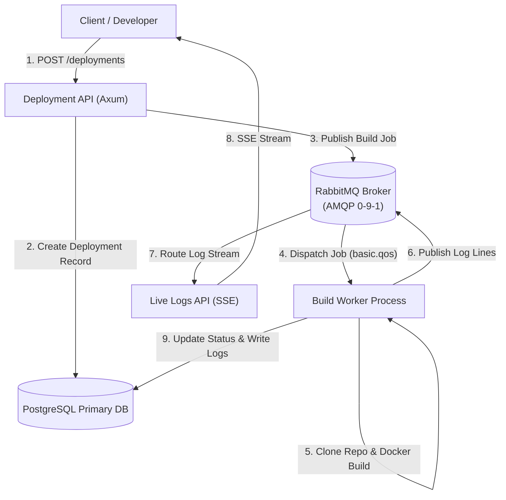

# ADR-004: RabbitMQ as Message Broker for Background Workflows

**Status:** Accepted  
**Date:** 2026-08-13  
**Decision Type:** Architecture / Messaging & Infrastructure  
**Scope:** Asynchronous Job Execution, Task Dispatch, & Real-Time Event Streaming  

---

## 1. Context

The Forge Platform is a self-hosted developer deployment platform. When developers trigger deployments (via REST API or Git push events), the platform executes long-running, resource-intensive background workflows including Git repository cloning, Docker image compilation (`docker build`), container instantiation (`docker run`), HTTP health check probing, and real-time log collection.

These deployment tasks cannot be executed synchronously within HTTP request-response cycles because Docker builds can take anywhere from 10 seconds to 10+ minutes. The system requires an enterprise-grade message broker to decouple HTTP API handlers from background worker nodes, guarantee reliable job delivery, manage worker prefetch limits, and deliver real-time build logs.

---

## 2. Problem

Using simple in-memory stores or database polling for asynchronous background processing presents severe operational risks:

1. **Lack of Delivery Guarantees:** Simple queues without consumer acknowledgments risk losing jobs if a Build Worker process crashes during a Docker build step.
2. **Resource Exhaustion & Worker Overload:** Docker builds consume heavy CPU, RAM, and disk I/O. Without strict consumer prefetch rate limiting (`basic.qos`), worker nodes can be overwhelmed if multiple jobs arrive simultaneously.
3. **Dead-Letter & Retry Complexity:** Failed build jobs require structured dead-letter handling (DLX) to inspect poisoned messages without blocking healthy queues.
4. **Real-Time Event Routing:** Streaming live build logs from workers to multiple connected web clients requires dynamic pub/sub topic routing.

---

## 3. Decision

We decide to adopt **RabbitMQ** (AMQP 0-9-1) as the official **message broker for all background build workflows, task queues, and real-time event streaming** across the Forge Platform.

RabbitMQ will serve as the dedicated message queue and event broker for:
- Dispatching deployment build jobs from the Deployment API to Build Workers.
- Routing real-time build log events from Build Workers to Live Logs SSE API streams.
- Processing background notification deliveries.
- Managing failed job retries and dead-letter queues.

---

## 4. Scope

This decision governs all asynchronous message queues, task dispatches, and event channels within the Forge platform, including:
- **Deployment Module:** Dispatching deployment jobs (`forge.deployments.jobs`).
- **Build Worker Sub-Module:** Consuming build tasks, reporting status updates, and publishing log events.
- **Live Build Logs Sub-Module:** Subscribing to log channels (`forge.logs` topic exchange) for Server-Sent Events (SSE) streaming.
- **Notifications Module:** Asynchronous delivery of in-app and future email notifications (`forge.notifications.jobs`).

---

## 5. Architectural Integration

RabbitMQ operates at the **Async Infrastructure Layer (Layer 3)** of the Forge architecture:



---

## 6. Queue Topology & Routing Architecture

RabbitMQ exchange and queue topologies are declaratively declared during application startup:

### 6.1 Exchanges

| Exchange Name | Type | Purpose |
|---|---|---|
| `forge.deployments` | Direct | Routes build jobs to deployment queues based on routing keys |
| `forge.deployments.dlx` | Direct | Dead-Letter Exchange for unrecoverable or failed jobs |
| `forge.logs` | Topic | High-throughput topic exchange for real-time build log streaming |

### 6.2 Queues

| Queue Name | Type | Durable | DLX Target | Routing Key |
|---|---|---|---|---|
| `forge.deployments.jobs` | Quorum Queue | Yes | `forge.deployments.dlx` | `job.build` |
| `forge.deployments.dead-letter` | Classic Queue | Yes | None | `job.dead-letter` |
| `forge.notifications.jobs` | Quorum Queue | Yes | None | `job.notification` |

### 6.3 Dynamic SSE Log Queues
When a client connects to `GET /deployments/:id/logs/stream`, the Live Logs API creates an ephemeral, auto-delete queue (`forge.logs.client.<uuid>`) bound to `forge.logs` exchange with routing key `deployment.<deployment_id>`. When the client disconnects, RabbitMQ automatically deletes the queue.

---

## 7. Reliability & Guarantees

### 7.1 At-Least-Once Delivery
RabbitMQ guarantees at-least-once message delivery. Build Workers must be **idempotent**: if a job is redelivered (e.g. after a worker node crash), the worker checks the deployment status in PostgreSQL before re-executing steps.

### 7.2 Publisher Confirms
The Deployment API enables **Publisher Confirms** on RabbitMQ channels. When a deployment is triggered, the API handler waits for RabbitMQ to acknowledge receipt of the published message before returning `201 Created` to the client.

### 7.3 Consumer Acknowledgments & Prefetch Limits
- **Manual Acknowledgment (`basic.ack`):** Build Workers send `basic.ack` only after a build step completes or when the deployment reaches a terminal state.
- **Negative Acknowledgment (`basic.nack`):** If an unrecoverable worker error occurs, the worker sends `basic.nack(requeue = false)`, sending the job directly to the Dead-Letter Queue (`forge.deployments.dead-letter`).
- **Prefetch Limit (`basic.qos(prefetch_count = 2)`):** Each worker process sets a prefetch count of 2. RabbitMQ will not dispatch more than 2 concurrent Docker build jobs to a single worker process, preventing CPU/RAM exhaustion on worker nodes.

---

## 8. Real-Time Log Streaming Topology

Build Workers publish log lines to `forge.logs` using the routing key format:
```
deployment.<deployment_id>
```

**Log Event Payload:**
```json
{
  "deployment_id": "UUID",
  "timestamp": "2026-08-13T15:00:00Z",
  "level": "INFO",
  "step": "build",
  "message": "Step 3/8 : RUN cargo build --release"
}
```

Axum Live Logs API instances subscribe to this topic via transient AMQP queues and stream events directly to browser clients using Server-Sent Events (SSE).

---

## 9. Resilience, Clustering & High Availability

1. **Quorum Queues (Raft Consensus):** Production queues (`forge.deployments.jobs`) use RabbitMQ Quorum Queues built on the Raft consensus algorithm, ensuring data replication across 3+ RabbitMQ cluster nodes.
2. **Rust Client Library (`lapin`):** The Rust backend uses the `lapin` crate (async AMQP client for Tokio) with connection pooling, automated connection recovery, and channel re-establishment.
3. **Health Probes:** The Health module checks RabbitMQ connectivity via AMQP heartbeat / queue depth inspection. An outage marks Job Queue status as `Critical` in health probes.

---

## 10. Security Considerations

1. **Authentication:** SASL username/password authentication is mandatory (`forge_app` user).
2. **Virtual Host Isolation:** All platform queues reside in a dedicated virtual host (`/forge`).
3. **TLS Encryption:** TLS 1.3 encryption is enforced for all AMQP connections in staging/production (`amqps://`).
4. **Least Privilege Permissions:** Build Workers have `read` permissions on task queues and `write` permissions on log exchanges, while API handlers have `write` permissions on task exchanges.

---

## 11. Consequences

### Advantages
- **Enterprise Reliability:** Explicit AMQP consumer acknowledgments (`ack`/`nack`) guarantee no lost build jobs during worker crashes.
- **Resource Protection:** Consumer prefetch limits (`basic.qos`) prevent Docker build overload on worker hosts.
- **Dead-Letter Management:** Poisoned messages are routed to DLX without blocking healthy deployment queues.
- **Flexible Event Routing:** Topic exchanges enable seamless real-time log streaming to multiple web clients.

### Disadvantages
- **Operational Complexity:** Requires running and monitoring a dedicated RabbitMQ cluster (or container) alongside PostgreSQL and Redis.
- **AMQP Learning Curve:** Developers must understand AMQP exchanges, queues, bindings, and prefetch semantics.

---

## 12. Alternatives Considered

1. **Redis Lists / Streams:**
   - *Evaluated:* Using Redis `BRPOP` or Redis Streams for job queueing.
   - *Rejected:* Redis is restricted exclusively to in-memory caching ([ADR-003](./ADR-003-redis-caching-layer.md)). Redis lacks native AMQP dead-letter exchanges, manual prefetch rate-limiting controls, and quorum-replicated queue clustering needed for heavy Docker builds.
2. **Apache Kafka:**
   - *Evaluated:* Distributed event streaming platform.
   - *Rejected:* Heavy operational overhead (ZooKeeper/KRaft requirement) and log-stream architecture suited for event replay rather than task queueing with per-message worker acknowledgments.
3. **Database-Backed Polling Queue:**
   - *Evaluated:* Polling PostgreSQL for `Queued` deployments (`SELECT ... FOR UPDATE SKIP LOCKED`).
   - *Rejected:* Causes database lock contention and worker polling latency, violating sub-5s job pickup targets.

---

## 13. Final Decision

**RabbitMQ is accepted as the official message broker for all background build workflows, task queues, and real-time event streaming for the Forge Platform.**
