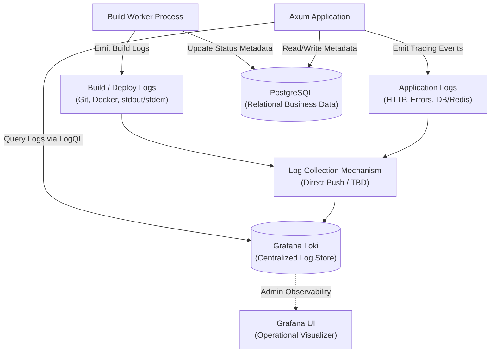

# ADR-005: Use Grafana Loki for Centralized Application and Build Logging

**Status:** Accepted  
**Date:** 2026-08-13  
**Decision Type:** Infrastructure / Observability / Logging  
**Scope:** Axum Application, Application Services, Build Worker, Background Workers, and Platform Observability  

---

## 1. Context

The Forge Platform is a self-hosted developer deployment platform built as a modular monolith in Rust using Axum, PostgreSQL, SeaORM, Redis, and RabbitMQ. Operating this platform produces two distinct streams of log data:
1. **Application-Level Logs:** Operational events emitted by the Axum HTTP web server, middleware, domain services, database drivers, Redis cache handlers, RabbitMQ consumers, and background tasks.
2. **Build and Deployment Logs:** Raw output emitted during asynchronous container build operations (repository cloning, dependency compilation, `docker build`, container instantiation, health check polling, stdout/stderr).

Both application logs and build/deployment logs represent append-only, high-frequency, time-series operational text streams. Conversely, business entities (Users, Organizations, Projects, Deployments, Roles, Permissions) consist of structured, relational data requiring strict ACID guarantees.

To establish enterprise observability and prevent database bloat, the platform requires a single, unified centralized logging system for all operational logs across all services.

---

## 2. Problem

Relying on PostgreSQL or uncoordinated local file stores for application and build logs introduces severe architectural issues:

1. **Database Table & Index Bloat:** Storing high-frequency application HTTP access logs, database query errors, and raw build output lines in PostgreSQL tables causes massive table bloat. B-tree indexes on log timestamps and metadata columns suffer from extreme write amplification during load spikes.
2. **Autovacuum & I/O Contention:** Deleting or expiring millions of operational log lines from PostgreSQL triggers aggressive `autovacuum` sweeps, competing for CPU and disk I/O with business-critical database transactions.
3. **Fragmented Observability:** Storing application logs in stdout/local files while storing build logs in a separate system prevents platform operators from correlating API requests with build worker background tasks during incident diagnosis.
4. **Query Pattern Mismatch:** Operational log analysis requires full-text pattern matching, regex searches, and time-range filtering (LogQL), whereas PostgreSQL is optimized for transactional relational lookups.

---

## 3. Decision

We decide to adopt **Grafana Loki** as the official **Centralized Logging Platform for the Forge Platform**.

Grafana Loki will serve as the single, authoritative log aggregation and persistent storage engine for **both**:
1. **Application-level operational logs** emitted by Axum handlers, middleware, services, and background workers.
2. **Build and deployment logs** emitted by the Build Worker during Docker container build pipelines.

### Authoritative Boundary Rule
- **PostgreSQL** will **NOT** store raw log strings for either application operations or build pipelines.
- **Grafana Loki** is the centralized log store for all raw operational text streams across all components.
- **PostgreSQL** remains the sole single source of truth for persistent relational business data and deployment metadata (`deployments` table).
- **Redis** remains strictly reserved for in-memory read caching, rate limiting, and session revocation.

---

## 4. Scope

This decision governs centralized logging across the entire Forge Platform backend:
- **Axum Web Application:** HTTP request/response access logs, router events, auth middleware events.
- **Application Services:** Domain logic events, authorization check failures, validation warnings.
- **Data & Infrastructure Clients:** SeaORM / SQLx query errors, Redis cache misses/failures, RabbitMQ AMQP connection events.
- **Build Worker:** Git clone output, Docker build logs, container runtime stdout/stderr, health check probe logs.
- **Background Workers & Tasks:** Notification worker events, cleanup job logs.

---

## 5. Log Categories & Domain Boundaries

The architecture clearly separates operational log categories from relational business data:

```
                                  Forge Platform
                                        │
           ┌────────────────────────────┴────────────────────────────┐
           │                                                         │
     Axum Application                                          Build Worker
           │                                                         │
           ▼                                                         ▼
    Application Logs                                        Build / Deploy Logs
(HTTP, App Errors, DB/Redis Events)                      (Git, Docker, stdout, stderr)
           │                                                         │
           └────────────────────────────┬────────────────────────────┘
                                        │
                                        ▼
                             Log Collection Mechanism
                                  (Direct / TBD)
                                        │
                                        ▼
                                  Grafana Loki
                          (Centralized Log Platform)
                                        │
                                        ▼
                                   Grafana UI
                             (Operational Dashboard)
```

### Data Categorization Matrix

| Category | Storage Engine | Examples / Fields |
|---|---|---|
| **A. Application Logs** | **Grafana Loki** | HTTP request logs, 4xx/5xx API errors, SeaORM/SQLx DB errors, Redis connection drops, RabbitMQ queue event errors, worker lifecycle events. |
| **B. Build/Deploy Logs** | **Grafana Loki** | Git clone output, `docker build` stdout/stderr, dependency installation output, container start logs, health check poll lines. |
| **C. Business Data** | **PostgreSQL** | Users, Organizations, Teams, Projects, Repositories, Environment Variables, Roles, Permissions, Deployment Metadata (`deployments` table). |

---

## 6. Architectural Integration



---

## 7. Application Logging Implementation (Rust / Axum)

### Current Architecture State
- **Current Decision:** Grafana Loki is the central destination for all application and build logs.
- **Recommended Implementation (Rust Ecosystem):** The backend will use the standard Rust [`tracing`](https://crates.io/crates/tracing) and [`tracing-subscriber`](https://crates.io/crates/tracing-subscriber) ecosystem for application-level structured logging.
- **Log Collection Mechanism:** TBD (Direct HTTP push to Loki via `tracing-loki` layer, or stdout capture via a local agent such as Promtail/Grafana Alloy).

### Conceptual Application Tracing Flow
```
Axum Request / Service Event
    ↓
tracing::info! / tracing::error!
    ↓
tracing-subscriber (JSON formatter)
    ↓
Log Collection (Direct / Promtail agent)
    ↓
Grafana Loki HTTP Push API (/loki/api/v1/push)
```

---

## 8. Structured Logging & Labeling Strategy

To prevent Loki index bloat, Loki labels must maintain **low cardinality**. High-cardinality parameters must be stored as **structured log fields (JSON metadata)**.

### 8.1 Low-Cardinality Loki Labels (Indexed)
Loki indexes only labels. Only low-cardinality fields are used as stream labels:

| Label Name | Sample Values | Description |
|---|---|---|
| `environment` | `Development`, `Preview`, `Production` | Deployment environment |
| `service` | `forge-api`, `build-worker`, `notification-worker` | Emitting component |
| `log_type` | `application`, `build`, `deployment` | Log event category |
| `level` | `INFO`, `WARN`, `ERROR`, `DEBUG`, `TRACE` | Severity level |

### 8.2 Structured Log Fields / Metadata (Unindexed Line Content)
High-cardinality values reside inside structured JSON log payloads:
- `request_id` (UUID)
- `trace_id` (OpenTelemetry W3C trace string)
- `user_id` (UUID)
- `organization_id` (UUID)
- `project_id` (UUID)
- `deployment_id` (UUID)
- `http_method` (`GET`, `POST`, `PUT`, `DELETE`)
- `http_status` (`200`, `401`, `403`, `500`)
- `duration_ms` (Execution time in milliseconds)
- `message` (Log message string)

### 8.3 LogQL Query Examples
```logql
# Query 5xx application errors in Production
{service="forge-api", environment="Production", level="ERROR"} | json | http_status >= 500

# Query deployment build output
{service="build-worker", log_type="build"} | json | deployment_id="a1b2c3d4-e5f6-7890-abcd-1234567890ab"
```

---

## 9. Security & Secret Redaction

### 9.1 Required Sensitive Data Controls
Operational logs **MUST NEVER** contain unencrypted secrets, authentication credentials, or sensitive PII. The following items must be strictly excluded or redacted before log emission:
- Plaintext passwords and password hashes
- JWT access tokens and refresh tokens
- Git Personal Access Tokens (PAT)
- Decrypted environment variable values
- Database connection strings / credentials
- `Authorization` and `Cookie` HTTP headers
- Sensitive request bodies (e.g. `POST /auth/login`)

### 9.2 Log Redaction (Required Implementation Recommendation)
Log redaction filters (e.g. regex masking of Bearer tokens and PAT strings) are required at both the Axum `tracing` middleware layer and the Build Worker log emitter layer before pushing events to Loki.

---

## 10. Log Access Control & RBAC Integration

Access to logs stored in Loki must respect the platform's multi-tenant RBAC boundaries:

1. **Build & Deployment Logs:** Access is scoped by project/organization permissions. Users with `Viewer`, `Developer`, `Admin`, or `Owner` roles in an organization can query Loki for deployment logs belonging to their projects.
2. **Application Operational Logs:** Access to application-level system logs (HTTP access logs, DB error logs, worker health logs) is restricted strictly to System Administrators (`Admin` role).
3. **API Proxy Enforcer:** Axum API endpoints (`GET /deployments/:id/logs`) validate JWT signatures and org/project ownership in PostgreSQL before executing LogQL queries against Loki on behalf of users.

---

## 11. Log Retention Policy

- Log retention is an operational policy configured natively in Loki (`loki.yaml` retention manager / compactor).
- Application logs and build logs can have distinct retention rules if specified by operational policy (e.g., 30 days for application access logs, 90 days for build logs).
- Retention duration is defined as an operational policy in Loki configuration rather than hardcoded in application code.

---

## 12. Resilience & Failure Handling

- **Fail-Open Application Behavior:** A temporary Loki outage or network disruption will **NEVER** block Axum HTTP request handling or cause PostgreSQL database transaction rollbacks.
- **Worker Fallback:** If Loki ingestion fails, background workers log to local stdout/disk buffer and continue processing deployment builds.
- **Health Probes:** A Loki connection failure marks the `log_store` health probe as `Degraded`, while primary database and application endpoints remain `Healthy`.

---

## 13. API & Log Streaming Integration

- **`GET /deployments/:id/logs`:** Axum handler verifies project permissions, constructs a LogQL query (`{service="build-worker"} | json | deployment_id="<uuid>"`), fetches stored log chunks from Loki's REST API (`/loki/api/v1/query_range`), and returns formatted log lines.
- **`GET /deployments/:id/logs/stream`:** Axum handler streams real-time log events via SSE using RabbitMQ topic exchange (`forge.logs`) while Build Workers simultaneously push logs to Loki for durable persistence.

---

## 14. Consequences

### Advantages
- **Single Centralized Logging System:** Unifies application operational logs and build worker pipeline output in a single observability platform.
- **Optimal Database Health:** Prevents PostgreSQL table bloat, autovacuum contention, and write lock spikes.
- **Fast & Flexible Querying:** Enables LogQL pattern matching, time-series aggregation, and cross-service error correlation.
- **Storage Efficiency:** Snappy/Gzip compressed log chunk storage reduces disk footprint by 80–90%.

### Disadvantages
- **Infrastructure Dependency:** Requires operating Grafana Loki alongside PostgreSQL, Redis, and RabbitMQ.
- **Dual-Store Architecture:** Relational business data resides in PostgreSQL while operational logs reside in Loki.

---

## 15. Alternatives Considered

1. **PostgreSQL for Application & Build Logs:**
   - *Evaluated:* Storing logs in `build_logs` and `app_logs` database tables.
   - *Rejected:* Causes table bloat, autovacuum pressure, and storage inefficiency under high traffic. PostgreSQL is retained exclusively for business entities and deployment metadata.
2. **Elasticsearch / OpenSearch:**
   - *Evaluated:* Full-text search cluster.
   - *Rejected:* Excessive RAM and CPU overhead for small to medium self-hosted deployments.
3. **Process Stdout Only (No Centralized Logging):**
   - *Evaluated:* Printing logs to container stdout without aggregation.
   - *Rejected:* Impairs multi-instance troubleshooting and prevents users from viewing historical build logs via the web UI.

---

## 16. Final Decision

**Grafana Loki is accepted as the official Centralized Logging Platform for the Forge Platform.** It will store all application-level operational logs and build/deployment logs. PostgreSQL remains the sole authoritative single source of truth for persistent relational business data.
